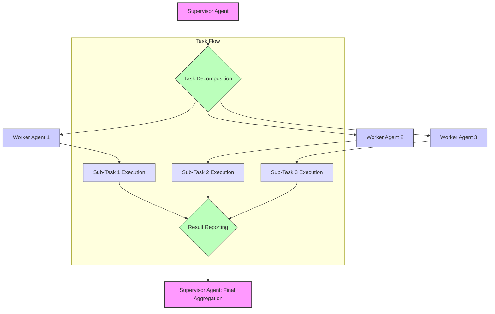

복잡한 인공지능 문제 해결과 시스템 안정성 증대를 위해 다중 에이전트 시스템(Multi-Agent Systems, MAS) 설계는 핵심적인 기술로 부상하고 있습니다. 특히, 각 에이전트의 명확한 역할 정의(Role Assignment)와 효율적인 협업 메커니즘(Collaboration Patterns)은 시스템의 성공을 좌우하는 필수 요소입니다. 이 엔트리에서는 MAS의 역할 부여 및 협업 패턴 디자인에 대한 효과적인 접근 방식과 최신 트렌드를 다룹니다.

## 역할 부여(Role Assignment) 원칙

다중 에이전트 시스템에서 에이전트에게 역할을 부여하는 방식은 시스템의 성능과 유연성에 직접적인 영향을 미칩니다. 역할 부여는 크게 정적(Static) 방식과 동적(Dynamic) 방식으로 나눌 수 있습니다.

### 정적 역할 부여(Static Role Assignment)

정적 역할 부여는 시스템 설계 단계에서 각 에이전트의 역할이 고정되는 방식입니다. 이는 예측 가능한 환경과 반복적인 작업에 유리하며, 구현이 비교적 간단합니다. 예를 들어, 웹 스크래핑 시스템에서 '데이터 수집 에이전트', '데이터 파싱 에이전트', '데이터 저장 에이전트'와 같이 명확히 분리된 역할이 이에 해당합니다.

### 동적 역할 부여(Dynamic Role Assignment)

동적 역할 부여는 시스템 운영 중에 에이전트의 역할이 변경되거나 새로운 역할이 할당될 수 있는 방식입니다. 복잡하고 변화무쌍한 환경에서 높은 적응성과 복원력(resilience)을 제공하지만, 설계와 구현의 복잡도가 증가합니다. 예를 들어, 긴급 상황 발생 시 '모니터링 에이전트'가 '응급 대응 에이전트'로 역할을 전환하거나, 작업 부하에 따라 '작업자 에이전트'의 수가 유연하게 조절되는 시나리오가 있습니다. 2026년에는 대규모 언어 모델(LLM)의 발전과 함께 에이전트가 스스로 환경을 분석하고 최적의 역할을 자율적으로 선택하는 자기 조직화(self-organizing) 역할 부여 방식이 더욱 중요해지고 있습니다.

### 역할 정의 시 고려사항

*   **책임(Responsibility)과 권한(Authority)의 명확성**: 각 에이전트가 수행해야 할 작업과 결정할 수 있는 범위가 명확해야 합니다.
*   **역량(Capability) 기반 할당**: 에이전트의 기술적 역량과 지식 기반에 맞춰 역할을 할당해야 합니다.
*   **중복 최소화**: 역할 간의 중복을 최소화하여 비효율성을 줄이고 충돌 가능성을 낮춥니다.
*   **유연성**: 동적인 환경 변화에 대응할 수 있도록 역할 간의 전환 또는 재할당 가능성을 고려합니다.

## 협업 패턴 디자인(Collaboration Patterns Design)

에이전트들이 각자의 역할을 수행하면서 공동의 목표를 달성하기 위해서는 효과적인 협업 패턴이 필수적입니다. 주요 협업 패턴은 다음과 같습니다.

### 1. 위계적 협업(Hierarchical Collaboration)

하나의 상위 에이전트(Supervisor Agent)가 하위 에이전트(Worker Agents)들에게 작업을 분배하고 결과를 취합하는 중앙 집중형 모델입니다. 복잡한 문제를 계층적으로 분해하여 해결하는 데 효과적입니다. 상위 에이전트는 전체 시스템의 조율과 관리에 집중하고, 하위 에이전트는 특정 하위 태스크(sub-task)를 전문적으로 처리합니다.

### 2. 동등 계층적 협업(Peer-to-Peer Collaboration)

모든 에이전트가 동등한 위치에서 서로 직접 소통하며 정보를 교환하고 협력하는 방식입니다. 중앙 집중형 실패 지점(single point of failure)이 없어 견고하며, 시스템 확장이 용이합니다. 하지만 복잡한 문제에서는 조율의 어려움이 발생할 수 있습니다.

### 3. 중재 기반 협업(Mediated Collaboration)

중앙의 중재자 에이전트(Mediator Agent)가 에이전트 간의 상호작용을 관리하고 조정합니다. 에이전트들은 중재자를 통해서만 소통하며, 중재자는 자원 할당, 충돌 해결, 정보 라우팅 등의 역할을 수행합니다. 이는 시스템의 복잡도를 낮추고 에이전트 간의 직접적인 의존성을 줄일 수 있습니다.

### 4. 공유 메모리/블랙보드 협업(Shared Memory/Blackboard Collaboration)

모든 에이전트가 접근할 수 있는 공유 메모리 공간(Blackboard)을 통해 정보를 교환하고 상호작용합니다. 각 에이전트는 블랙보드의 상태 변화를 감지하고, 자신의 역할에 맞는 작업을 수행하며 결과를 다시 블랙보드에 게시합니다. 유연하고 확장성이 높지만, 동시성 제어와 정보 일관성 유지에 대한 관리가 필요합니다.



위 Mermaid 다이어그램은 위계적 협업 패턴의 한 예시를 보여줍니다. `Supervisor Agent`는 전체 태스크를 여러 `Worker Agent`에 분해하여 할당하고, 각 워커 에이전트는 할당된 서브 태스크를 실행한 후 결과를 다시 슈퍼바이저 에이전트에 보고하여 최종 결과를 취합합니다.

### 코드 예제: 간단한 에이전트 협업 시뮬레이션 (Python)

이 예제는 간단한 `Supervisor`와 `Worker` 에이전트 간의 위계적 협업을 시뮬레이션합니다.

```python
import time
import random
from collections import deque

class WorkerAgent:
    def __init__(self, agent_id, skills):
        self.agent_id = agent_id
        self.skills = skills
        self.current_task = None

    def assign_task(self, task):
        if task['skill_required'] in self.skills:
            self.current_task = task
            print(f"Worker {self.agent_id} assigned task: {task['description']}")
            return True
        print(f"Worker {self.agent_id} cannot handle task: {task['description']} (missing skill {task['skill_required']})")
        return False

    def execute_task(self):
        if self.current_task:
            print(f"Worker {self.agent_id} executing '{self.current_task['description']}'...")
            time.sleep(random.uniform(0.5, 2.0)) # Simulate work
            result = f"Task '{self.current_task['description']}' completed by {self.agent_id}"
            self.current_task = None
            return result
        return "No task to execute."

class SupervisorAgent:
    def __init__(self, worker_agents):
        self.workers = worker_agents
        self.task_queue = deque()
        self.completed_results = []

    def add_task(self, task):
        self.task_queue.append(task)
        print(f"Supervisor received new task: {task['description']}")

    def orchestrate_tasks(self):
        print("\nSupervisor starting orchestration...")
        while self.task_queue or any(w.current_task for w in self.workers):
            # Assign tasks to available workers
            for worker in self.workers:
                if not worker.current_task and self.task_queue:
                    task = self.task_queue.popleft()
                    if not worker.assign_task(task):
                        # If worker can't handle, put it back or re-assign
                        print(f"Supervisor re-queuing task '{task['description']}' or finding alternative.")
                        self.task_queue.appendleft(task) # Simple re-queue
                        
            # Let workers execute and report results
            for worker in self.workers:
                if worker.current_task:
                    result = worker.execute_task()
                    if result and "completed" in result:
                        self.completed_results.append(result)
                        print(f"Supervisor received result: {result}")
            time.sleep(0.1) # Small delay to simulate async operations
        
        print("\nOrchestration complete. All tasks processed.")
        return self.completed_results

# --- 시스템 초기화 및 실행 ---
worker1 = WorkerAgent("W1", ["data_processing", "analysis"])
worker2 = WorkerAgent("W2", ["data_fetching", "validation"])
worker3 = WorkerAgent("W3", ["data_processing"])

supervisor = SupervisorAgent([worker1, worker2, worker3])

supervisor.add_task({"id": 1, "description": "Fetch user data", "skill_required": "data_fetching"})
supervisor.add_task({"id": 2, "description": "Process raw data", "skill_required": "data_processing"})
supervisor.add_task({"id": 3, "description": "Analyze sales trends", "skill_required": "analysis"})
supervisor.add_task({"id": 4, "description": "Validate dataset integrity", "skill_required": "validation"})
supervisor.add_task({"id": 5, "description": "Perform complex computation", "skill_required": "advanced_math"})

final_results = supervisor.orchestrate_tasks()
print("\nFinal System Results:")
for res in final_results:
    print(res)
```

이 예제에서 `SupervisorAgent`는 `WorkerAgent`들에게 작업을 분배하고 완료된 결과를 수집합니다. `WorkerAgent`는 자신의 `skills`에 따라 작업을 수락하고 처리합니다. 이는 위계적 역할 부여 및 위임(delegation) 협업 패턴의 기초적인 형태를 보여줍니다.

## 2026년 다중 에이전트 시스템 트렌드

*   **LLM 기반 동적 역할 적응**: 대규모 언어 모델이 에이전트의 상황 인식을 높이고, 실시간으로 역할과 전략을 동적으로 조정하게 하여 시스템의 적응성과 자율성을 극대화합니다.
*   **자기 조직화 및 emergent behavior**: 명시적인 중앙 제어 없이도 에이전트 간의 로컬 상호작용을 통해 복잡한 전역 목표(global goals)가 달성되는 시스템 설계가 주목받고 있습니다.
*   **하이브리드 협업 모델**: 위계적, 동등 계층적, 중재 기반 등 다양한 협업 패턴을 조합하여 특정 문제의 요구사항에 최적화된 유연한 아키텍처를 구성합니다.
*   **Robust Communication Protocols**: 에이전트 간의 비동기(asynchronous) 및 내결함성(fault-tolerant) 통신 프로토콜 설계가 시스템의 안정성과 확장성을 보장하는 데 중요합니다.

## 트레이드오프

이러한 역할 부여 및 협업 패턴 디자인에는 필연적으로 트레이드오프가 존재합니다.

1.  **정적 vs. 동적 역할 할당**: 
    *   **언제 좋고**: 정적 할당은 시스템의 복잡도가 낮고 예측 가능한 작업 부하에서 높은 성능과 간결성을 제공합니다. 시스템 초기 개발 및 테스트 단계에서 유용합니다. 
    *   **언제 나쁜지**: 동적인 환경 변화나 예측 불가능한 태스크 요구사항에 대한 적응성이 떨어지며, 확장성 및 유연성이 제한됩니다.
    *   **언제 좋고**: 동적 할당은 변화무쌍한 환경에서 높은 적응성과 복원력을 제공하며, 에이전트의 활용률을 최적화할 수 있습니다. 복잡한 AI 문제나 실시간 의사결정 시스템에 적합합니다.
    *   **언제 나쁜지**: 설계 및 구현 복잡도가 높고, 역할 변경에 따른 오버헤드(overhead)가 발생할 수 있습니다. 시스템의 안정성을 보장하기 위한 추가적인 메커니즘이 필요합니다.

2.  **중앙 집중형 vs. 분산형 협업**: 
    *   **언제 좋고**: 중앙 집중형(위계적, 중재 기반)은 시스템 제어가 용이하고, 조율 로직이 단순하며, 전체 시스템 상태를 쉽게 파악할 수 있습니다. 소규모 시스템이나 엄격한 제어가 필요한 환경에 적합합니다.
    *   **언제 나쁜지**: 단일 실패 지점(Single Point of Failure, SPOF)이 될 수 있고, 중앙 에이전트에 부하가 집중되어 확장성 병목 현상(scalability bottleneck)이 발생할 수 있습니다. 높은 가용성(high availability)이 요구되는 시스템에는 취약합니다.
    *   **언제 좋고**: 분산형(동등 계층적, 공유 메모리)은 SPOF가 없고, 높은 확장성과 내결함성(fault tolerance)을 제공하여 대규모 시스템이나 분산 환경에 적합합니다. 
    *   **언제 나쁜지**: 에이전트 간의 조율이 복잡하고, 상태 일관성 유지(state consistency)가 어려울 수 있으며, 디버깅 및 전체 시스템 상태 파악이 어렵습니다.

3.  **명시적 vs. 암시적 통신**: 
    *   **언제 좋고**: 명시적 통신(메시지 패싱, API 호출)은 에이전트 간의 상호작용이 명확하고 예측 가능하며, 디버깅이 용이합니다. 프로토콜 기반의 엄격한 상호작용이 필요한 경우에 적합합니다.
    *   **언제 나쁜지**: 통신 오버헤드가 크고, 시스템의 복잡도가 증가할수록 통신 경로 관리가 어려워질 수 있습니다. 유연성과 확장성에 제약이 있을 수 있습니다.
    *   **언제 좋고**: 암시적 통신(공유 메모리, 환경 변화 감지)은 통신 오버헤드를 줄이고, 에이전트 간의 느슨한 결합(loose coupling)을 가능하게 하여 시스템의 유연성과 확장성을 높입니다. Emergent behavior 유도에 유리합니다.
    *   **언제 나쁜지**: 에이전트의 행위와 시스템 상태 변화의 인과 관계를 파악하기 어렵고, 디버깅이 복잡해질 수 있습니다. 예상치 못한 부작용(side effects)이나 오해를 불러일으킬 가능성이 있습니다.

## 실전 체크리스트

다중 에이전트 시스템에 역할 부여 및 협업 패턴을 적용할 때 다음 항목들을 검증해야 합니다.

*   [ ] 각 에이전트의 핵심 책임(responsibilities)과 권한(authorities)이 시스템의 목표와 일관되게 명확히 정의되었는가?
*   [ ] 에이전트 간 통신 프로토콜(communication protocols)이 시스템의 실시간성, 신뢰성 요구사항을 충족하며 오버헤드를 최소화하는가?
*   [ ] 협업 과정에서 발생할 수 있는 충돌(conflict) 또는 불일치(disagreement)를 감지하고 해결하기 위한 메커니즘이 설계되었는가?
*   [ ] 특정 에이전트의 실패 시에도 시스템 전체의 안정성과 복원력(resilience)을 유지하고 목표를 달성할 수 있도록 설계되었는가?
*   [ ] 시스템 부하 증가 또는 환경 변화에 따라 에이전트 역할 할당 및 협업 패턴이 동적으로 확장(scaling) 또는 축소(contraction)될 수 있는 유연성을 갖추고 있는가?
*   [ ] 에이전트의 의사결정 과정과 협업 흐름을 추적(traceability)하고 디버깅(debuggability)할 수 있는 가시성(observability)을 제공하는가?
*   [ ] 에이전트 간의 상호작용이 예상치 못한 부작용(side effects), 무한 루프(infinite loops), 또는 자원 고갈(resource starvation)을 유발하지 않는가?