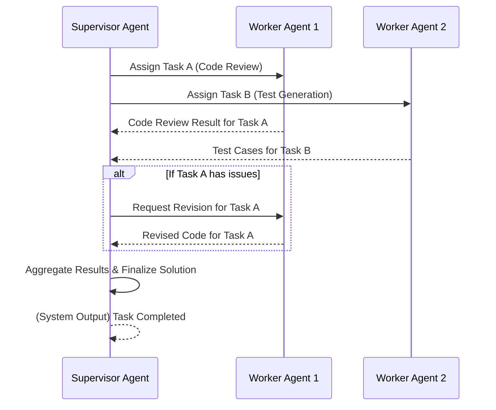

복잡한 문제 해결을 위해 단일 에이전트로는 감당하기 어려운 태스크가 증가함에 따라, 다중 에이전트 시스템 (Multi-Agent Systems, MAS) 의 중요성이 강조되고 있습니다. 이러한 시스템에서 효율적인 상호작용과 시너지를 극대화하는 핵심은 바로 역할 분담 (Role Assignment) 과 협업 패턴 (Collaboration Patterns) 디자인에 있습니다. 각 에이전트가 명확한 목적과 책임을 가지고 상호작용할 때, 시스템 전체의 성능과 견고성이 비약적으로 향상될 수 있습니다.

## 역할 분담의 중요성 (The Significance of Role Assignment)

에이전트에게 역할을 할당하는 것은 인간 조직에서 직무를 부여하는 것과 유사합니다. 이는 다음과 같은 이점을 제공합니다:

*   **전문화 (Specialization)**: 각 에이전트가 특정 도메인 지식이나 도구 사용에 전문화되어 복잡한 서브태스크를 효과적으로 처리할 수 있도록 합니다.
*   **인지 부하 감소 (Reduced Cognitive Load)**: 에이전트가 전체 문제의 일부에만 집중하게 하여 의사결정 공간을 줄이고 오류 가능성을 낮춥니다.
*   **병렬 처리 (Parallel Processing)**: 독립적인 역할이 병렬로 실행될 수 있어 전체 태스크 처리 시간을 단축합니다.
*   **유지보수성 및 확장성 (Maintainability & Scalability)**: 역할별로 모듈화된 에이전트는 시스템의 유지보수를 용이하게 하고, 새로운 요구사항에 따른 확장 또는 수정이 쉽습니다.

## 협업 패턴 디자인 (Designing Collaboration Patterns)

역할 분담이 에이전트의 '무엇을 할 것인가'를 정의한다면, 협업 패턴은 '어떻게 함께 일할 것인가'를 규정합니다. 2026년 현재, LLM (Large Language Model) 기반 자율 에이전트의 발전과 함께 더욱 정교하고 유연한 협업 패턴이 요구되고 있습니다. 주요 협업 패턴은 다음과 같습니다:

### 1. 계층적 협업 (Hierarchical Collaboration)

감독 에이전트 (Supervisor Agent) 가 전체 태스크를 분해하고 하위 에이전트 (Worker Agents) 에 할당하며, 진행 상황을 모니터링하고 결과를 통합하는 모델입니다. 명령 및 제어 (Command and Control) 구조가 명확하며, 복잡한 문제의 체계적인 분할 정복에 효과적입니다.

### 2. 블랙보드 협업 (Blackboard Collaboration)

모든 에이전트가 접근할 수 있는 공유된 작업 공간 (Blackboard) 에 문제 해결을 위한 부분적인 솔루션이나 데이터를 게시하고, 다른 에이전트들이 이를 참조하여 자신의 역할을 수행하는 비동기식 패턴입니다. 각 에이전트가 독립적으로 기여하므로 유연성이 높고, 지식 기반 시스템에 많이 활용됩니다.

### 3. 시장 기반/계약망 협업 (Market-Based/Contract Net Collaboration)

태스크가 생성되면, 이를 수행할 수 있는 에이전트들이 입찰 (Bidding) 을 통해 태스크를 '계약'하는 방식입니다. 자원 할당의 효율성을 높일 수 있으며, 분산된 환경에서 동적으로 태스크를 할당하는 데 유리합니다.

### 4. 팀 기반 협업 (Team-Oriented Collaboration)

명확한 리더 없이, 에이전트들이 공유된 목표를 가지고 상호 보완적인 역할을 수행하며 긴밀하게 협력하는 패턴입니다. 높은 수준의 자율성과 상호 이해가 필요하며, 동적인 환경 변화에 빠르게 대응할 수 있습니다.

## 상호작용 프로토콜 설계 (Designing Interaction Protocols)

효과적인 협업을 위해서는 명확한 상호작용 프로토콜 (Interaction Protocol) 이 필수적입니다. 이는 다음과 같은 요소를 포함합니다:

*   **통신 채널 (Communication Channels)**: 에이전트 간 메시지 전달 방식 (예: 메시지 큐, REST API, 직접 함수 호출 등).
*   **메시지 형식 (Message Formats)**: 에이전트 간 교환되는 정보의 구조 (예: JSON, XML, FIPA ACL 같은 에이전트 통신 언어).
*   **의사소통 프로토콜 (Communication Protocols)**: 특정 태스크를 위한 일련의 메시지 교환 순서와 규칙 (예: 쿼리-응답, 요청-제안-수락).
*   **갈등 해결 메커니즘 (Conflict Resolution Mechanisms)**: 에이전트 간 목표 불일치나 자원 경합 발생 시 이를 해결하는 방법.

다음은 간단한 계층적 협업 패턴을 위한 Mermaid 시퀀스 다이어그램 예시입니다:



이러한 패턴은 Python과 같은 언어로 구현될 수 있습니다. 각 에이전트는 자신의 역할을 정의하고, 다른 에이전트와 통신하기 위한 인터페이스를 가집니다.

```python
from typing import Dict, Any

class Agent:
    def __init__(self, name: str, role: str):
        self.name = name
        self.role = role
        self.knowledge_base = {}

    def receive_message(self, sender: str, message: Dict[str, Any]):
        print(f