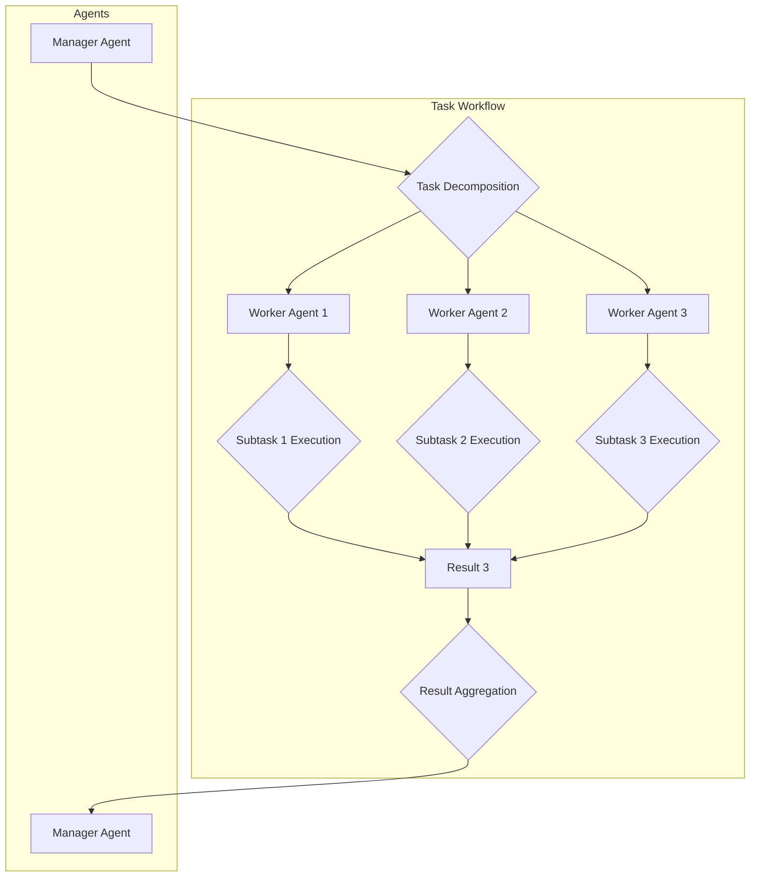

멀티 에이전트 시스템(Multi-Agent Systems, MAS)은 복잡하고 동적인 환경에서 다수의 자율 에이전트(autonomous agents)가 상호작용하며 특정 목표를 달성하는 시스템입니다. 단일 에이전트가 해결하기 어려운 문제, 특히 정보가 분산되어 있거나 다양한 전문 지식이 요구되는 시나리오에서 MAS는 강력한 해결책을 제공합니다. 이는 미래 AI 개발의 핵심 역량으로, 여러 에이전트가 협력하여 시너지를 창출하고, 시스템 전체의 효율성과 견고성을 높이는 데 중점을 둡니다.

## 멀티 에이전트 시스템의 핵심 개념

MAS의 성공은 에이전트 간의 효과적인 협업(collaboration)과 조정(coordination)에 달려 있습니다. 협업은 공동의 목표를 달성하기 위해 에이전트들이 함께 작업하는 행위를 의미하며, 조정은 에이전트들의 행동이 충돌하지 않고 조화롭게 이루어지도록 관리하는 프로세스입니다.

### 협업 패턴(Collaboration Patterns)

1.  **블랙보드 패턴(Blackboard Pattern)**: 중앙 집중식 공유 메모리(shared memory)를 사용하여 에이전트들이 정보를 읽고 쓰는 방식입니다. 각 에이전트는 특정 문제 해결 영역에 특화되어 있으며, 블랙보드에 게시된 문제를 해결하거나, 부분적인 해결책을 제공하여 전체 문제 해결에 기여합니다. 이는 복잡한 문제의 단계적 해결에 유리합니다.
2.  **매니저-워커 패턴(Manager-Worker Pattern)**: 하나의 매니저(manager) 에이전트가 작업을 하위 워커(worker) 에이전트들에게 분배하고, 워커들은 할당된 작업을 수행하여 결과를 매니저에게 보고합니다. 이는 작업을 계층적으로 분해하고 관리하는 데 효율적입니다.
3.  **브로커 패턴(Broker Pattern)**: 에이전트들이 직접 통신하는 대신, 브로커 에이전트가 요청을 받아 적절한 서비스를 제공하는 에이전트에게 연결해 줍니다. 이는 에이전트 간의 결합도(coupling)를 낮추고 유연성을 높입니다.
4.  **계약망 프로토콜(Contract Net Protocol)**: 분산된 작업 할당을 위한 프로토콜입니다. 작업을 생성한 에이전트(manager)가 다른 에이전트들에게 작업 제안(call for proposals)을 보내면, 관심 있는 에이전트(bidders)가 입찰(bid)하고, manager는 최적의 입찰자를 선정하여 계약을 체결합니다. 이는 분산된 리소스 활용에 효과적입니다.

### 조정 메커니즘(Coordination Mechanisms)

조정은 에이전트들이 서로의 행동을 인지하고 영향을 미치며, 불필요한 충돌을 피하고 시너지를 창출하도록 돕습니다.

1.  **직접 통신(Direct Communication)**: 메시지 전달(message passing)을 통해 에이전트들이 직접 정보를 교환하고 협상하는 방식입니다. FIPA(Foundation for Intelligent Physical Agents) ACL(Agent Communication Language)과 같은 표준화된 언어가 사용될 수 있습니다.
2.  **간접 통신(Indirect Communication - Environment)**: 에이전트들이 공유 환경(shared environment)을 통해 상호작용하는 방식입니다. 예를 들어, 한 에이전트가 환경의 상태를 변경하면 다른 에이전트가 이를 감지하고 자신의 행동을 조정합니다.
3.  **조정 언어 및 프레임워크(Coordination Languages & Frameworks)**: 특정 조정 로직을 명시적으로 정의하는 언어나 프레임워크를 사용하여 에이전트들의 행동을 규제합니다. 이는 복잡한 조정 규칙을 체계적으로 관리하는 데 유용합니다.
4.  **합의 알고리즘(Consensus Algorithms)**: 분산된 에이전트들이 특정 의사결정이나 상태에 대해 합의를 이루도록 하는 알고리즘입니다. 블록체인의 합의 메커니즘과 유사하게, 시스템의 일관성과 신뢰성을 확보하는 데 기여합니다.

### 예시: 매니저-워커 패턴 기반 태스크 오케스트레이션(Task Orchestration)

아래 Python 코드는 간단한 매니저-워커 패턴을 통해 여러 AI 에이전트가 작업을 분할하고 처리하는 방식을 보여줍니다. 매니저가 큰 작업을 여러 서브태스크로 나누어 워커들에게 할당하고, 워커들은 개별적으로 처리한 후 결과를 매니저에게 반환합니다.

```python
import queue
import threading
import time

class WorkerAgent(threading.Thread):
    def __init__(self, id, task_queue, result_queue):
        super().__init__()
        self.id = id
        self.task_queue = task_queue
        self.result_queue = result_queue
        self.daemon = True

    def run(self):
        while True:
            try:
                task = self.task_queue.get(timeout=1)
                print(f"Worker {self.id}: Processing task {task}")
                # Simulate work
                time.sleep(0.5)
                result = f"Result of {task} by Worker {self.id}"
                self.result_queue.put(result)
                self.task_queue.task_done()
            except queue.Empty:
                break # Exit if no more tasks for a while

class ManagerAgent:
    def __init__(self, num_workers):
        self.task_queue = queue.Queue()
        self.result_queue = queue.Queue()
        self.workers = []
        for i in range(num_workers):
            worker = WorkerAgent(i, self.task_queue, self.result_queue)
            self.workers.append(worker)
            worker.start()

    def distribute_tasks(self, tasks):
        for task in tasks:
            self.task_queue.put(task)
        
        self.task_queue.join() # Wait for all tasks to be done
        
        results = []
        while not self.result_queue.empty():
            results.append(self.result_queue.get())
        return results

# Example Usage
if __name__ == "__main__":
    manager = ManagerAgent(num_workers=3)
    initial_tasks = [f"Task_{i}" for i in range(10)]
    print("Manager: Distributing tasks...")
    final_results = manager.distribute_tasks(initial_tasks)
    print("Manager: All tasks completed. Final results:")
    for res in final_results:
        print(res)

    # Ensure all worker threads are properly closed if they're not daemon
    # In this example, they are daemon threads, so they will exit when main thread exits.
```

### 멀티 에이전트 시스템 협업 흐름 (Mermaid)



## 2026년 최신 트렌드

2026년에는 멀티 에이전트 시스템이 LLM(Large Language Model)과의 결합을 통해 더욱 발전하고 있습니다. 각 에이전트가 자체적인 LLM을 내장하거나 LLM API를 활용하여 고수준의 추론(reasoning), 계획(planning), 자기 성찰(self-reflection) 능력을 갖추게 됩니다. 이로 인해 에이전트들은 더욱 동적으로 역할을 할당하고, 복잡한 협업 전략을 실시간으로 수립하며, 예측 불가능한 상황에 대한 적응력(adaptability)을 높일 수 있습니다. 또한, 강화 학습(Reinforcement Learning)을 통해 에이전트들이 협업 및 조정 전략을 학습하고 최적화하는 연구도 활발하게 진행되고 있습니다.

## 트레이드오프

### 1. 중앙 집중식 vs. 분산식 조정
*   **중앙 집중식 조정(예: 블랙보드, 매니저-워커)**
    *   **언제 좋고:** 시스템의 일관성을 유지하기 쉽고, 복잡한 조정 로직을 한 곳에서 관리할 수 있어 초기 설계 및 디버깅이 용이합니다. 작은 규모 또는 특정 핵심 기능에 대한 엄격한 제어가 필요한 경우 유리합니다.
    *   **언제 나쁜지:** 단일 실패 지점(single point of failure)이 될 수 있으며, 시스템 규모가 커질수록 병목 현상(bottleneck)이 발생하여 확장성(scalability)이 저하됩니다. 에이전트 수가 많고 동적인 환경에서는 오버헤드가 큽니다.
*   **분산식 조정(예: 계약망 프로토콜, 직접 통신)**
    *   **언제 좋고:** 시스템의 확장성이 높고, 단일 실패 지점이 없어 견고성(robustness)이 뛰어납니다. 에이전트들이 독립적으로 의사결정하여 동적인 환경 변화에 빠르게 적응할 수 있습니다.
    *   **언제 나쁜지:** 전역적인 일관성을 유지하기 어렵고, 에이전트 간의 통신 비용이 증가할 수 있습니다. 시스템의 행동을 예측하고 디버깅하기가 더 복잡하며, 조정 메커니즘 설계가 까다롭습니다.

### 2. 정적 vs. 동적 역할 할당
*   **정적 역할 할당**
    *   **언제 좋고:** 에이전트의 책임과 역할을 명확히 정의할 수 있어 시스템의 안정성과 예측 가능성이 높습니다. 특정 기능에 특화된 에이전트 설계가 용이합니다.
    *   **언제 나쁜지:** 환경 변화나 새로운 태스크에 대한 유연성이 떨어집니다. 특정 역할의 에이전트가 실패하거나 과부하될 경우 전체 시스템의 성능이 저하될 수 있습니다.
*   **동적 역할 할당**
    *   **언제 좋고:** 에이전트들이 실시간으로 상황에 맞춰 역할을 변경하거나 새로 할당받을 수 있어 유연성과 적응성이 극대화됩니다. 리소스 활용 효율을 높이고 시스템의 복원력(resilience)을 향상시킵니다.
    *   **언제 나쁜지:** 역할 변경 로직이 복잡하고, 에이전트 간의 조정 오버헤드가 발생할 수 있습니다. 시스템의 행동을 예측하기 어렵고, 의도치 않은 역할 충돌이 발생할 위험이 있습니다.

### 3. 명시적 vs. 암묵적 조정
*   **명시적 조정(예: 조정 언어, 프로토콜)**
    *   **언제 좋고:** 조정 규칙이 명확하게 정의되어 있어 시스템의 동작을 이해하고 검증하기 쉽습니다. 복잡한 시스템의 행동을 효과적으로 제어할 수 있습니다.
    *   **언제 나쁜지:** 모든 가능한 상황에 대한 규칙을 미리 정의해야 하므로 설계 복잡성이 높고, 새로운 상황에 대한 적응력이 떨어집니다. 규칙 변경 시 시스템 전체에 미치는 영향을 고려해야 합니다.
*   **암묵적 조정(예: 공유 환경, 경쟁/협력 메커니즘)**
    *   **언제 좋고:** 에이전트들이 환경이나 다른 에이전트의 행동을 통해 자연스럽게 조정되므로, 복잡한 규칙 정의 없이도 유연한 행동을 유도할 수 있습니다. 특히 물리적 환경에서의 로봇 에이전트에 유용합니다.
    *   **언제 나쁜지:** 조정의 결과가 예측 불가능할 수 있으며, 최적의 시스템 성능을 보장하기 어렵습니다. 의도치 않은 부작용이나 비효율적인 상호작용이 발생할 수 있습니다.

## 실전 체크리스트

멀티 에이전트 시스템을 설계하고 구현할 때 다음 체크리스트를 활용하여 협업 및 조정 패턴의 효과적인 적용을 검증합니다.

- [ ] **에이전트 간 통신 프로토콜 명확화:** 각 에이전트가 어떤 메시지를 주고받으며, 어떤 의미를 갖는지 FIPA ACL 또는 유사한 표준에 기반하여 명확하게 정의되었는지 확인합니다.
- [ ] **태스크 분해 및 할당 전략 검토:** 전체 목표가 에이전트들의 전문성을 고려하여 적절한 크기의 서브태스크로 분해되고, 효율적인 메커니즘(예: 계약망, 매니저-워커)을 통해 할당되는지 평가합니다.
- [ ] **경합 조건 및 데드락 방지 메커니즘 구현:** 공유 리소스나 데이터에 대한 동시 접근 시 경합 조건(race condition)이나 데드락(deadlock)이 발생하지 않도록 상호 배제(mutual exclusion) 또는 우선순위 기반 조정 로직이 적용되었는지 검증합니다.
- [ ] **실패 처리 및 복구 전략 포함:** 에이전트 하나 또는 일부가 실패하더라도 시스템 전체가 정상적으로 작동하거나, 실패한 에이전트를 대체/복구하는 메커니즘이 설계에 반영되었는지 확인합니다.
- [ ] **확장성 및 성능 테스트 계획 수립:** 에이전트 수가 증가하거나 태스크 복잡성이 높아질 때 시스템의 처리량(throughput)과 응답 시간(latency)이 허용 가능한 수준을 유지하는지 측정하고, 병목 지점을 식별하기 위한 로드 테스트(load test) 시나리오를 마련합니다.
- [ ] **LLM 기반 에이전트의 컨텍스트 관리 효율성:** LLM을 사용하는 에이전트의 경우, 컨텍스트 윈도우(context window) 활용이 최적화되어 불필요한 토큰 소비를 줄이고 추론 정확도를 유지하는지 점검합니다.
- [ ] **보안 및 권한 관리 설계:** 에이전트 간 통신 및 공유 리소스 접근에 대한 보안(예: 인증, 인가)이 강화되어 악의적인 에이전트나 외부 공격으로부터 시스템이 보호되는지 확인합니다.