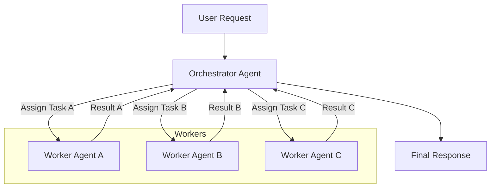

멀티 에이전트 시스템(Multi-Agent System, MAS)은 복잡한 문제를 해결하기 위해 여러 개의 자율적인 에이전트가 협력하는 분산 시스템입니다. 각 에이전트는 특정 목표를 가지며, 환경과 상호작용하고, 다른 에이전트와 통신하며 최종 목표 달성에 기여합니다. 특히 LLM(Large Language Model) 기반 에이전트의 등장으로 MAS는 더욱 다양한 분야에서 복잡성 관리, 유연성 및 확장성을 제공하는 핵심 아키텍처 패턴으로 주목받고 있습니다.

## 왜 멀티 에이전트 시스템 디자인 패턴이 중요한가?

에이전트 기반 시스템은 본질적으로 비선형적이고 동적이며 예측 불가능한 요소를 포함합니다. 이러한 시스템의 개발은 단일 시스템을 구축하는 것보다 훨씬 복잡하며, 에이전트 간의 효율적인 상호작용, 충돌 해결, 조정, 그리고 전체 시스템의 안정성 보장이 필수적입니다. 디자인 패턴은 이러한 복잡성을 관리하고, 재사용 가능한 해결책을 제공하며, 시스템의 구조를 명확하게 하여 개발 효율성과 유지보수성을 높이는 데 기여합니다.

## 핵심 개념

멀티 에이전트 시스템을 이해하기 위한 몇 가지 핵심 개념은 다음과 같습니다:

*   **에이전트 (Agent)**: 자율성(Autonomy), 반응성(Reactivity), 목표 지향성(Pro-activeness), 사회성(Social ability)을 가진 독립적인 소프트웨어 엔티티입니다. 특정 역할을 수행하고, 주변 환경과 상호작용하며, 의사결정을 내립니다.
*   **환경 (Environment)**: 에이전트가 존재하고 상호작용하는 모든 외부 요소를 포함합니다. 이는 물리적 환경일 수도 있고, 디지털 데이터 스페이스일 수도 있습니다.
*   **커뮤니케이션 (Communication)**: 에이전트 간에 정보를 교환하는 수단입니다. 메시지 전달, 공유 메모리, 브로드캐스트 등 다양한 형태가 있습니다.
*   **조정 (Coordination)**: 에이전트들이 공동의 목표를 달성하기 위해 자신들의 행동을 조직화하고 관리하는 과정입니다. 이는 명시적(예: 중앙 스케줄러)이거나 암시적(예: 환경을 통한 상호작용)일 수 있습니다.

## 주요 디자인 패턴

다양한 MAS 디자인 패턴이 존재하지만, 다음은 가장 일반적으로 사용되는 몇 가지 패턴입니다.

### Orchestrator-Worker Pattern (오케스트레이터-워커 패턴)

이 패턴에서는 하나의 중앙 오케스트레이터 에이전트가 전체 작업을 여러 워커 에이전트에게 분배하고, 워커 에이전트들이 각자 할당된 작업을 수행한 후 그 결과를 오케스트레이터에게 보고합니다. 오케스트레이터는 이 결과들을 취합하여 최종 결과를 생성합니다.

*   **장점**: 제어 흐름이 명확하고, 중앙 집중식 로깅 및 모니터링이 용이합니다. 워커 에이전트는 단일 책임 원칙(Single Responsibility Principle)에 따라 특정 역할에만 집중할 수 있습니다.
*   **단점**: 오케스트레이터가 단일 장애점(Single Point of Failure, SPOF)이 될 수 있으며, 시스템 부하가 증가할 경우 병목 현상을 유발할 수 있습니다. 확장성에도 한계가 있을 수 있습니다.



### Blackboard Pattern (블랙보드 패턴)

블랙보드 패턴은 에이전트들이 직접 통신하기보다는 공유 메모리 또는 데이터 저장소인 '블랙보드'를 통해 간접적으로 협력하는 방식입니다. 각 에이전트(Knowledge Source)는 블랙보드의 상태를 관찰하고, 자신의 전문 지식에 따라 문제 해결에 기여할 수 있는 경우 블랙보드에 새로운 정보나 부분적인 해결책을 게시합니다.

*   **장점**: 에이전트 간의 결합도가 매우 낮아(loose coupling) 높은 유연성과 확장성을 제공합니다. 에이전트 추가/삭제가 용이하며, 다양한 유형의 에이전트가 복합적으로 기여할 수 있습니다.
*   **단점**: 동시성 제어 및 충돌 관리가 복잡할 수 있으며, 블랙보드의 일관성 유지가 중요합니다. 통신 흐름을 추적하기 어려울 수 있습니다.

```mermaid
graph TD
    A[User Request] --> C[Controller];
    C -- Post Problem --> B[Blackboard];
    B -- Read Problem --> S1[Knowledge Source 1 (Agent)];
    B -- Read Problem --> S2[Knowledge Source 2 (Agent)];
    S1 -- Post Partial Solution --> B;
    S2 -- Post Partial Solution --> B;
    B -- Read Partial Solution --> S3[Knowledge Source 3 (Agent)];
    S3 -- Post Final Solution --> B;
    B -- Retrieve Solution --> C;
    C --> R[Final Response];
    subgraph Agents
        S1
        S2
        S3
    end
```

### Federated Agent Pattern (연합 에이전트 패턴)

연합 에이전트 패턴은 분산된 자율 에이전트 그룹이 느슨하게 결합되어 협력하는 방식입니다. 중앙 집중식 제어 없이 에이전트 간 직접 통신하거나, 경량의 조정 레이어를 통해 협력합니다. 각 에이전트 페더레이션(Federation)은 자체적인 목표를 가지면서도, 더 큰 시스템 목표를 위해 다른 페더레이션과 정보를 교환할 수 있습니다.

*   **장점**: 높은 확장성과 견고성, 장애 내성을 제공합니다. 에이전트의 자율성이 극대화되어 분산된 환경에서 특히 효율적입니다.
*   **단점**: 에이전트 간의 복잡한 조정 메커니즘이 필요하며, 시스템 전체의 상태를 파악하고 디버깅하기 어려울 수 있습니다.

## 2026년 트렌드 및 시사점

멀티 에이전트 시스템은 LLM 발전과 함께 더욱 지능적이고 자율적인 방향으로 진화하고 있습니다. 2026년에는 다음과 같은 트렌드가 두드러질 것으로 예상됩니다.

*   **자율 학습 및 적응성**: 에이전트들이 실시간으로 환경 변화에 적응하고, 새로운 정보를 학습하여 스스로 행동 전략을 최적화하는 능력이 강조됩니다. 이는 강화 학습(Reinforcement Learning) 및 메타 학습(Meta-Learning) 기술과의 융합을 통해 실현됩니다.
*   **설명 가능성 (Explainability)**: 에이전트의 복잡한 의사결정 과정을 인간이 이해할 수 있도록 설명하는 XAI(Explainable AI) 기술의 중요성이 커집니다. 특히 중요한 비즈니스 의사결정이나 안전에 민감한 영역에서 에이전트의 '이유'를 제공하는 것이 필수적입니다.
*   **신뢰 및 보안**: 분산된 에이전트 간의 상호작용에서 발생할 수 있는 보안 위협과 데이터 프라이버시 문제를 해결하기 위한 신뢰 프레임워크와 블록체인 기반의 분산 신뢰 모델이 발전할 것입니다.
*   **Human-Agent Teaming**: 인간과 에이전트가 Seamless하게 협력하여 복잡한 작업을 수행하는 모델이 일반화됩니다. 에이전트는 인간의 인지 부하를 줄이고, 인간은 에이전트의 행동을 감독하고 지침을 제공하는 역할을 수행합니다.

## 코드 예제: Orchestrator-Worker 패턴 (Python)

아래 코드는 `Orchestrator-Worker` 패턴의 간략한 구현 예시입니다. 실제 시스템에서는 메시지 큐(예: RabbitMQ, Kafka) 또는 분산 오브젝트 시스템(Distributed Object System)을 통해 에이전트 간 통신이 이루어집니다.

```python
import threading
import queue
import time

class Agent:
    def __init__(self, agent_id, role):
        self.agent_id = agent_id
        self.role = role
        self.inbox = queue.Queue() # Simplified message queue

    def receive_message(self, message):
        self.inbox.put(message)

    def process_task(self, task_data):
        print(f"Agent {self.agent_id} ({self.role}) processing task: '{task_data['task_name']}'")
        time.sleep(1 + hash(self.agent_id) % 2) # Simulate variable work time
        result = f"Result from {self.agent_id} for '{task_data['task_name']}' (data: {task_data['payload']})"
        print(f"Agent {self.agent_id} ({self.role}) finished task: '{task_data['task_name']}'")
        return {"task_name": task_data["task_name"], "result": result, "worker_id": self.agent_id}

class Orchestrator(Agent):
    def __init__(self, agent_id, workers):
        super().__init__(agent_id, "Orchestrator")
        self.workers = {worker.agent_id: worker for worker in workers}
        self.results = {}
        self.task_queue = queue.Queue()
        self.active_workers_count = 0
        self.lock = threading.Lock()

    def assign_task_to_worker(self, worker, task_data):
        with self.lock:
            self.active_workers_count += 1
        result = worker.process_task(task_data)
        self.task_queue.put(result) # Orchestrator collects results via queue
        with self.lock:
            self.active_workers_count -= 1

    def start(self, tasks_to_process):
        print(f"Orchestrator {self.agent_id} starting with {len(tasks_to_process)} tasks.")
        worker_ids = list(self.workers.keys())
        
        worker_threads = []
        for i, task_name in enumerate(tasks_to_process):
            worker_id = worker_ids[i % len(worker_ids)] # Simple round-robin assignment
            worker = self.workers[worker_id]
            task_data = {"task_name": task_name, "payload": f"input-data-{i}"}
            print(f"Orchestrator assigning '{task_name}' to Worker {worker_id}")
            
            thread = threading.Thread(target=self.assign_task_to_worker, args=(worker, task_data))
            worker_threads.append(thread)
            thread.start()

        # Wait for all workers to finish
        for thread in worker_threads:
            thread.join()

        # Collect all results from the queue
        while not self.task_queue.empty():
            res = self.task_queue.get()
            self.results[res["task_name"]] = res["result"]

        print(f"Orchestrator {self.agent_id} finished all tasks.")

# Example Usage
worker1 = Agent("W1", "DataProcessor")
worker2 = Agent("W2", "ReportGenerator")
worker3 = Agent("W3", "Validator")

orchestrator = Orchestrator("O1", [worker1, worker2, worker3])

tasks = ["Analyze Sales", "Generate Report", "Validate Data", "Forecast Trends", "Optimize Campaign"]
orchestrator.start(tasks)

print("\nFinal Results Collected by Orchestrator:")
for task_name, result in orchestrator.results.items():
    print(f"- {task_name}: {result}")
```

## 트레이드오프

MAS 디자인 패턴을 선택할 때는 시스템의 요구사항과 제약 조건을 고려한 신중한 트레이드오프 분석이 필요합니다.

*   **중앙 집중식 vs. 분산형 제어**: 중앙 집중식 패턴(예: Orchestrator)은 초기 구현이 용이하고 시스템의 전반적인 가시성이 높습니다. 하지만 단일 장애점(SPOF)이 될 수 있으며, 시스템의 부하가 커질수록 병목 현상을 유발하고 확장성에 제약이 있습니다. 이는 소규모의 예측 가능한 작업 흐름에 적합합니다. 반면, 분산형 패턴(예: Federated)은 높은 확장성, 견고성, 장애 내성을 제공하지만, 복잡한 조정 메커니즘과 디버깅의 어려움이 따릅니다. 대규모의 동적이며 고가용성이 요구되는 시스템에 더 적합합니다.
*   **명시적 vs. 암시적 통신**: 명시적 통신(예: Broker Pattern)은 에이전트 간의 직접적인 메시지 교환을 통해 통신 경로가 명확하고 제어가 용이합니다. 그러나 에이전트 간의 결합도를 높일 수 있으며, 통신 프로토콜 관리에 노력이 필요합니다. 특정 에이전트 간 강한 의존성이 요구되거나 실시간 상호작용이 중요할 때 유리합니다. 암시적 통신(예: Blackboard Pattern)은 공유 환경을 통한 간접 통신으로 에이전트 간 느슨한 결합을 가능하게 합니다. 이는 유연성과 재사용성을 높이지만, 통신 흐름 추적이 어렵고 경쟁 조건(race condition) 발생 가능성이 있습니다. 데이터 중심의 협업이 중요하거나 에이전트의 동적 참여가 필요한 경우 효과적입니다.
*   **상태 관리 복잡성**: 에이전트 내부에서 자체적으로 상태를 관리하는 경우, 각 에이전트의 자율성이 증대되고 외부 의존성이 줄어듭니다. 그러나 전체 시스템의 상태를 파악하고 동기화하는 것이 복잡해질 수 있습니다. 독립적인 의사결정과 독립적인 작업 수행이 중요할 때 적합합니다. 공유 또는 외부 저장소에서 상태를 관리하는 경우, 에이전트 간의 협력이 용이하고 전역 최적화가 가능합니다. 하지만 동시성 제어 및 상태 일관성 유지를 위한 복잡한 메커니즘이 필요하며, 시스템의 부하가 커질 경우 병목 현상을 유발할 수 있습니다. 공유 리소스의 최적화나 일관된 전역 상태가 필수적인 시스템에 유리합니다.

## 실전 체크리스트

멀티 에이전트 시스템을 설계하고 구현할 때 다음 체크리스트를 활용하여 시스템의 견고성과 효율성을 검증할 수 있습니다.

*   [ ] 각 에이전트의 책임(Responsibility)과 목표(Goal)가 단일 책임 원칙(Single Responsibility Principle)에 따라 명확하게 정의되었는가?
*   [ ] 에이전트 간의 통신 프로토콜(Communication Protocol)이 표준화되고, 메시지 포맷(Message Format) 및 스키마(Schema)가 명세화되었는가? (LLM 기반 에이전트의 경우, 프롬프트 구조와 응답 규약 포함)
*   [ ] 시스템의 확장성(Scalability) 요구사항을 충족하기 위한 에이전트 인스턴스 관리 전략(Scale-out, Load Balancing)이 수립되었으며, 동적으로 에이전트 인스턴스를 추가하거나 제거할 수 있는가?
*   [ ] 에이전트 또는 통신 채널의 실패 시 시스템의 견고성(Robustness)을 보장하는 장애 처리(Fault Tolerance) 및 복구 메커니즘이 설계되고 테스트되었는가?
*   [ ] 에이전트 행동의 설명 가능성(Explainability) 및 디버깅(Debugging)을 위한 충분한 수준의 로깅(Logging), 트레이싱(Tracing), 그리고 모니터링(Monitoring) 시스템이 구축되었는가?
*   [ ] 에이전트의 행동이 예상 범위나 윤리적 제약을 벗어나지 않도록 하는 Guardrail(가드레일) 또는 제약 조건(Constraints)이 구현되었으며, 이를 자동으로 검증하는 메커니즘이 있는가?
*   [ ] 멀티 에이전트 시스템의 성능(Performance) 및 효율성을 주기적으로 평가하고 최적화할 수 있는 핵심 지표(Key Metrics)가 정의되었으며, 이를 측정하고 검증할 수 있는 테스트 하네스(Test Harness)가 준비되었는가?