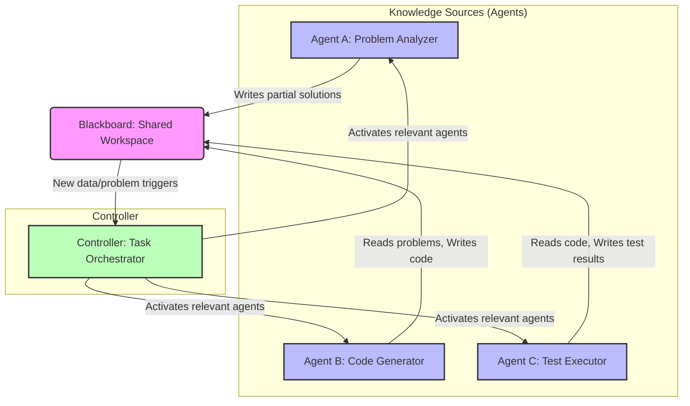

AI 에이전트의 복잡성이 증가하고 단일 에이전트의 역량이 한계에 다다르면서, 여러 에이전트가 상호작용하며 복잡한 목표를 달성하는 Multi-Agent System (MAS)의 중요성이 부각되고 있다. 효과적인 협업 패턴 디자인은 MAS의 효율성, 신뢰성, 그리고 확장성을 결정하는 핵심 요소이다. 이 문서에서는 에이전트 간의 효율적인 협업을 위한 핵심 개념과 디자인 패턴, 그리고 2026년 트렌드를 반영한 실전 가이드를 제시한다.

## Multi-Agent 협업의 핵심 개념

성공적인 에이전트 협업 시스템을 구축하기 위해서는 다음의 핵심 개념들을 명확히 이해하고 설계에 반영해야 한다.

### 역할 분담 (Role Specialization)
각 에이전트에게 특정 역할과 책임을 부여하여 전문성을 극대화한다. 이는 전체 시스템의 복잡성을 줄이고 각 에이전트의 작업 부하를 최적화하는 데 기여한다. 예를 들어, 문제 분석 에이전트, 코드 생성 에이전트, 테스트 에이전트 등으로 역할을 나눌 수 있다.

### 통신 프로토콜 (Communication Protocols)
에이전트들이 정보를 교환하고 작업을 조율하는 방식을 정의한다. 명확하고 효율적인 통신은 오해와 지연을 줄이며, 시스템의 응답성을 향상시킨다. 메시지 큐, Pub/Sub 모델, 공유 메모리 등 다양한 방식이 활용될 수 있다.

### 조정 메커니즘 (Coordination Mechanisms)
여러 에이전트의 행동을 동기화하고 충돌을 방지하며, 공동 목표를 향해 나아가도록 유도하는 전략이다. 스케줄링, 리소스 할당, 작업 위임 등이 포함된다.

### 공유 컨텍스트 (Shared Context)
에이전트들이 공통적으로 접근하고 업데이트할 수 있는 지식 기반 또는 작업 공간이다. 이는 에이전트 간의 암묵적인 협력을 가능하게 하며, 시스템 전체의 일관성을 유지하는 데 필수적이다.

### 충돌 해결 (Conflict Resolution)
에이전트 간의 목표, 리소스 접근, 또는 행동에 대한 불일치가 발생했을 때 이를 감지하고 해결하는 방법이다. 우선순위 기반, 협상 기반, 또는 중재자(Mediator) 패턴 등이 적용될 수 있다.

## 효율적인 협업 패턴 디자인

다양한 문제 도메인에 적용할 수 있는 몇 가지 대표적인 협업 패턴은 다음과 같다.

### 1. 계층형 협업 (Hierarchical Collaboration)
하나의 상위 에이전트(Supervisor)가 하위 에이전트(Worker)들에게 작업을 위임하고 그들의 진행 상황을 모니터링한다. Supervisor는 전체 목표를 관리하고, Worker는 특정 서브태스크를 전문적으로 수행한다.

*   **장점**: 중앙 집중적인 제어, 명확한 책임 분리, 복잡성 관리 용이성.
*   **단점**: Supervisor가 병목 현상이 될 수 있으며, 단일 장애점(Single Point of Failure)이 될 가능성.

### 2. 블랙보드 패턴 (Blackboard Pattern)
중앙의 공유 메모리 공간(Blackboard)을 통해 에이전트들이 간접적으로 상호작용한다. 각 에이전트(Knowledge Source)는 블랙보드에 있는 문제의 일부분을 해결하고 결과를 다시 블랙보드에 기록한다. 조정자(Controller)가 에이전트들의 활성화를 관리한다.

*   **장점**: 높은 유연성, 모듈성, 새로운 에이전트 추가 용이.
*   **단점**: 동시성 관리의 복잡성, 블랙보드 자체의 성능 병목 가능성, 디버깅 어려움.

### 3. 시장 기반 협업 (Market-Based Collaboration)
에이전트들이 리소스나 작업을 경매 방식으로 거래한다. 작업을 수행하려는 에이전트는 입찰(bid)하고, 작업을 위임하려는 에이전트는 가장 효율적인 입찰자를 선택한다. Contract Net Protocol이 대표적인 예시이다.

*   **장점**: 자율성 및 적응성, 동적 리소스 할당, 분산된 의사 결정.
*   **단점**: 복잡한 협상 메커니즘, 최적의 해를 보장하기 어려움, 오버헤드 발생 가능성.

### 4. 파이프라인 협업 (Pipeline Collaboration)
에이전트들이 순차적으로 연결되어 한 에이전트의 출력이 다음 에이전트의 입력이 되는 방식이다. 데이터 처리 워크플로우나 단계별 문제 해결에 적합하다.

*   **장점**: 단순하고 예측 가능한 흐름, 각 단계의 전문화 용이.
*   **단점**: 유연성 부족, 한 단계의 실패가 전체 파이프라인에 영향, 병렬 처리 제한.

## 코드 예시: 블랙보드 패턴 (Python)

다음은 Python을 이용한 간단한 블랙보드 패턴의 예시이다. `Blackboard`는 공유 데이터를 저장하며, `Agent`들은 이 Blackboard를 통해 상호작용한다.

```python
import threading
import time

class Blackboard:
    def __init__(self):
        self.data = {}
        self.lock = threading.Lock()
        print("Blackboard initialized.")

    def update(self, key, value):
        with self.lock:
            self.data[key] = value
            print(f"Blackboard: Updated {key} to {value}")

    def get(self, key):
        with self.lock:
            return self.data.get(key)

class Agent(threading.Thread):
    def __init__(self, name, blackboard, task_type):
        super().__init__()
        self.name = name
        self.blackboard = blackboard
        self.task_type = task_type
        print(f"Agent {self.name} initialized for {self.task_type} tasks.")

    def run(self):
        while True:
            if self.task_type == "producer":
                # Agent produces data and puts it on blackboard
                item_id = self.blackboard.get("next_item_id") or 0
                new_item = f"data_item_{item_id}"
                self.blackboard.update(f"item_{item_id}", new_item)
                self.blackboard.update("next_item_id", item_id + 1)
                time.sleep(1)
            elif self.task_type == "consumer":
                # Agent consumes data from blackboard
                current_item_id = self.blackboard.get("next_item_id")
                if current_item_id and current_item_id > 0:
                    for i in range(current_item_id):
                        item = self.blackboard.get(f"item_{i}")
                        if item and not self.blackboard.get(f"processed_{i}"):
                            print(f"Agent {self.name}: Processing {item}")
                            self.blackboard.update(f"processed_{i}", True)
                            time.sleep(0.5)
                            break # Process one item per cycle
            time.sleep(0.1) # Prevent busy-waiting

# System setup
blackboard = Blackboard()

# Initialize agents
producer_agent = Agent("Producer1", blackboard, "producer")
consumer_agent1 = Agent("ConsumerA", blackboard, "consumer")
consumer_agent2 = Agent("ConsumerB", blackboard, "consumer")

# Start agents
producer_agent.start()
consumer_agent1.start()
consumer_agent2.start()

# Allow agents to run for a while
time.sleep(5)
print("\nFinal Blackboard state:", blackboard.data)

# In a real system, you'd have graceful shutdown logic
# For this example, we'll just let it terminate
```

## Mermaid Diagram: 블랙보드 패턴 시각화



## 2026년 트렌드 및 고려사항

2026년 Multi-Agent System 디자인은 더욱 동적이고 적응적인 방향으로 진화하고 있다. 주요 트렌드는 다음과 같다.

*   **동적 재구성 (Dynamic Reconfiguration)**: 시스템 운영 중에 에이전트의 역할, 통신 프로토콜, 심지어 협업 패턴 자체를 동적으로 변경하고 최적화하는 능력. 이는 예상치 못한 상황 변화나 새로운 목표에 유연하게 대응할 수 있게 한다.
*   **적응형 패턴 (Adaptive Patterns)**: 고정된 패턴 대신, 환경과 태스크의 변화에 따라 가장 적합한 협업 방식을 자율적으로 선택하거나 조합하는 메타-에이전트 (Meta-Agent) 또는 강화 학습 기반 접근법이 중요해지고 있다.
*   **자율 학습 및 진화 (Autonomous Learning & Evolution)**: 각 에이전트가 개별적으로 학습하고 자신의 전문성을 향상시키는 것을 넘어, 협업 과정 자체에서 최적의 상호작용 전략을 학습하고 진화시키는 시스템 설계가 강조된다.
*   **LLM 기반 에이전트의 통합**: Large Language Models (LLM)을 활용한 에이전트가 자연어 기반의 복잡한 추론과 의사소통 능력을 제공함에 따라, LLM 기반 에이전트 간의 효율적인 정보 공유 및 태스크 분배 전략이 중요해진다.

## 트레이드오프

Multi-Agent 시스템의 효율적인 협업 패턴을 디자인할 때는 다음 트레이드오프를 고려해야 한다.

*   **중앙 집중식 제어 vs. 분산형 자율성**: 계층형 패턴은 강력한 제어와 예측 가능성을 제공하지만(복잡도가 낮은 비판적 시스템에 유리), 단일 장애점 위험과 확장성 제약이 있다(고부하 환경에서는 불리). 블랙보드나 시장 기반 패턴은 높은 자율성과 확장성을 제공하지만(유연하고 동적인 환경에 유리), 전체 시스템의 동작을 예측하고 디버깅하기 어렵다(정확한 제어가 필요한 시스템에 불리).
*   **패턴 복잡성 vs. 유연성**: 단순한 파이프라인 패턴은 구현이 쉽고 특정 시나리오에서 효율적이지만(고정된 워크플로우에 유리), 변화하는 요구사항에 대한 유연성이 매우 낮다(잦은 변경이 필요한 시스템에 불리). 블랙보드나 시장 기반 패턴은 훨씬 유연하지만(다양한 문제 해결에 유리), 구현 및 유지보수 비용이 높고 오버헤드가 발생할 수 있다(단순 반복 작업에는 불리).
*   **로버스트니스 vs. 효율성**: 충돌 해결 및 오류 복구 메커니즘은 시스템의 로버스트니스(robustness)를 높이지만(고장 허용 시스템에 필수), 추가적인 통신 및 연산 오버헤드를 발생시켜 효율성을 저하시킬 수 있다(실시간 성능이 중요한 시스템에 불리). 불필요한 복구 로직 없이 최소한의 통신으로 빠르게 작업을 완료하는 시스템은 효율적이지만, 작은 오류에도 전체 시스템이 실패할 위험이 있다.
*   **데이터 일관성 vs. 동시성**: 공유 컨텍스트를 사용하는 경우, 데이터 일관성 유지를 위해 락(lock)이나 트랜잭션(transaction) 메커니즘을 적용하면 동시성이 저하될 수 있다(데이터 무결성이 최우선인 경우 유리). 반대로 느슨한 일관성(eventual consistency)을 허용하면 동시성을 높일 수 있지만(고성능이 요구되는 시스템에 유리), 에이전트들이 오래된 정보로 작업할 위험이 있다(정확성이 중요한 작업에는 불리).

## 실전 체크리스트

Multi-Agent 시스템의 협업 패턴을 디자인하고 구현할 때 다음 체크리스트를 활용하여 시스템의 견고함과 효율성을 검증한다.

- [ ] **에이전트 역할 및 책임 명확화**: 각 에이전트의 구체적인 목표, 입력, 출력, 그리고 의존성을 명확히 정의하고 문서화했는가?
- [ ] **통신 프로토콜 표준화**: 에이전트 간의 모든 통신 채널(메시지 포맷, 데이터 스키마, 전송 방식)이 표준화되어 있고, 예측 가능한 방식으로 동작하는가?
- [ ] **충돌 감지 및 해결 전략 수립**: 리소스 경합, 목표 불일치 등의 충돌 상황을 감지하고, 이를 해결하기 위한 자동화된 우선순위, 협상, 또는 중재 메커니즘이 구현되어 있는가?
- [ ] **성능 및 확장성 테스트**: 예상되는 최대 부하 및 에이전트 수 증가 시나리오에서 시스템의 응답 시간, 처리량, 리소스 사용률이 허용 가능한 범위 내에 있는가?
- [ ] **모니터링 및 로깅 체계 구축**: 각 에이전트의 활동, 통신 내역, 의사 결정 과정, 그리고 시스템 전체의 협업 효율성을 추적하고 분석할 수 있는 중앙 집중식 모니터링 및 로깅 시스템이 마련되어 있는가?
- [ ] **보안 및 접근 제어**: 에이전트 간 통신 채널, 공유 컨텍스트, 그리고 외부 도구 접근에 대한 인증, 권한 부여, 데이터 암호화 등 보안 메커니즘이 적용되어 있는가?
- [ ] **동적 적응성 평가**: 에이전트 추가/제거, 태스크 변경, 환경 변화 등 동적인 상황에서 시스템이 얼마나 유연하게 재구성되고 목표를 달성할 수 있는지 평가하고 개선 계획을 수립했는가?
- [ ] **오류 복구 및 재시도 메커니즘**: 에이전트 또는 외부 서비스의 실패 시, 시스템이 스스로 오류를 감지하고 복구하거나 재시도하여 안정성을 유지하는가?
- [ ] **비용 최적화 방안 고려**: LLM API 호출 비용, 컴퓨팅 리소스 사용량 등 시스템 운영 비용을 최소화하기 위한 전략(예: 캐싱, 효율적인 태스크 분배)이 설계에 반영되어 있는가?