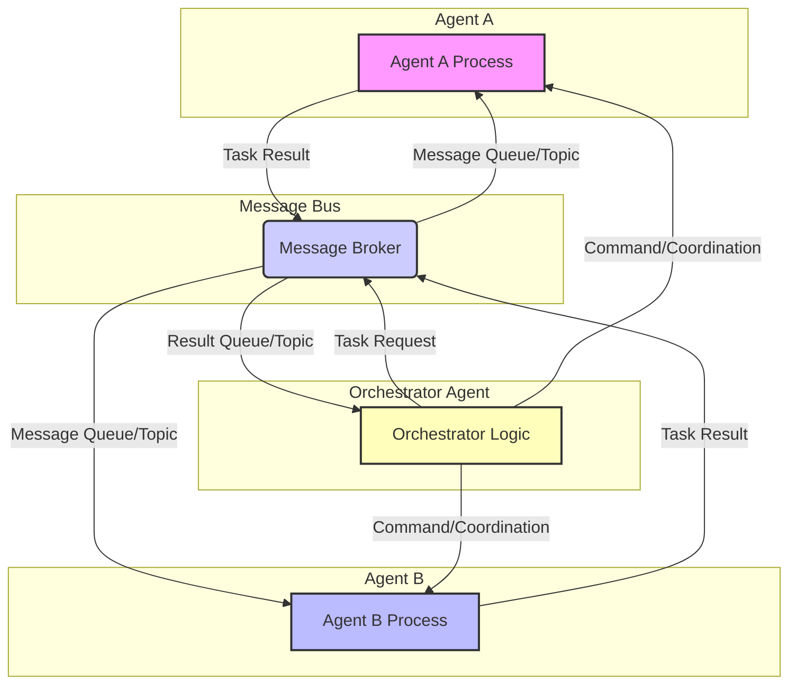

복잡한 문제 해결과 자율적인 시스템 구축에 대한 수요가 증가하면서 멀티 에이전트 시스템(Multi-Agent Systems, MAS)의 중요성이 더욱 커지고 있습니다. 2026년 현재, LLM(Large Language Model) 기반 에이전트 기술의 발전은 MAS가 단순한 자동화를 넘어 동적이고 적응적인 지능형 시스템으로 진화하는 계기가 되고 있습니다. 이러한 MAS의 핵심은 에이전트 간의 효율적인 의사소통과 협업 메커니즘 설계에 있습니다. 각 에이전트가 개별적인 목표를 가지고 독립적으로 동작하면서도, 전체 시스템의 목표를 달성하기 위해 정보를 교환하고 작업을 조정하는 방식은 시스템의 성능, 확장성, 견고성을 결정합니다.

## 멀티 에이전트 시스템 의사소통의 도전 과제
멀티 에이전트 환경에서 의사소통은 본질적으로 복잡합니다. 주요 도전 과제는 다음과 같습니다:
*   **이질성 (Heterogeneity):** 에이전트마다 내부 구조, 능력, 심지어 사용하는 프로토콜이 다를 수 있습니다.
*   **자율성 (Autonomy):** 각 에이전트가 자체적인 의사결정 로직을 가지고 있어 중앙 집중식 제어가 어렵습니다.
*   **비동기성 (Asynchronous Operations):** 에이전트 간 통신은 주로 비동기적으로 발생하며, 메시지 전달 지연이나 순서 문제가 발생할 수 있습니다.
*   **동적 환경 (Dynamic Environments):** 시스템에 에이전트가 추가되거나 제거되는 등 환경이 지속적으로 변화합니다.
*   **의미론적 불일치 (Semantic Mismatch):** 동일한 용어라도 에이전트마다 해석이 다를 수 있어 의미론적 불일치가 발생할 수 있습니다.

이러한 도전 과제를 극복하고 효율적인 MAS를 구축하기 위해서는 잘 정의된 의사소통 및 협업 패턴의 적용이 필수적입니다.

## 핵심 의사소통 패턴
에이전트 간 정보 교환 방식은 시스템의 구조와 성능에 큰 영향을 미칩니다.

### 1. 직접 메시징 (Direct Messaging / Point-to-Point)
가장 기본적인 형태로, 한 에이전트가 특정 다른 에이전트에게 직접 메시지를 보내는 방식입니다. REST API 호출, gRPC, RPC(Remote Procedure Call) 등이 여기에 해당합니다. 특정 대상을 명확히 알고, 즉각적인 응답이 필요할 때 유용합니다.

### 2. 발행-구독 (Publish-Subscribe)
메시지 브로커(Message Broker)를 통해 에이전트들이 특정 '토픽 (Topic)'에 메시지를 발행(Publish)하고, 관심 있는 에이전트들이 해당 토픽을 구독(Subscribe)하여 메시지를 수신합니다. 발신자와 수신자 간의 결합도가 낮아(Loose Coupling) 시스템의 유연성과 확장성이 뛰어납니다. Apache Kafka, RabbitMQ 등이 대표적인 구현체입니다.

### 3. 공유 지식 기반 (Shared Knowledge Base / Blackboard System)
모든 에이전트가 접근하고 수정할 수 있는 중앙 집중식의 공유 데이터 저장소(예: 데이터베이스, 캐시)를 활용합니다. 에이전트들은 이 지식 기반을 관찰하고 필요한 정보를 읽거나 새로운 정보를 기록함으로써 간접적으로 상호작용합니다. 에이전트 간 직접 통신 없이도 정보를 공유할 수 있어 고도로 분산된 의사결정 환경에 적합합니다.

## 주요 협업 패턴
에이전트들이 공동의 목표를 달성하기 위해 작업을 분담하고 조정하는 방식입니다.

### 1. 오케스트레이션 (Orchestration)
중앙의 '오케스트레이터 (Orchestrator)' 또는 '감독 에이전트 (Supervisor Agent)'가 다른 에이전트들의 작업 흐름을 제어하고 조정합니다. 복잡한 워크플로우에서 단계별 진행을 관리하고, 에러 처리 로직을 중앙에서 관리하기 용이합니다. LLM 기반 시스템에서는 'Planner Agent'가 다른 'Worker Agent'들을 조율하는 방식으로 구현될 수 있습니다.

### 2. 코레오그래피 (Choreography)
중앙 제어 없이 각 에이전트가 독립적으로 이벤트에 반응하며 자율적으로 행동합니다. 에이전트 간의 상호작용은 암묵적으로 정의된 프로토콜이나 메시지 교환 패턴을 따릅니다. 시스템의 확장성과 견고성이 뛰어나지만, 전체적인 워크플로우를 파악하기 어려울 수 있습니다.

### 3. 계약망 프로토콜 (Contract Net Protocol, CNP)
분산 환경에서 태스크 할당을 위한 협업 패턴입니다. 태스크가 필요한 에이전트(Manager)가 태스크를 공고(Announce)하면, 수행 가능한 다른 에이전트(Bidder)들이 입찰(Bid)하여 태스크를 수주(Award)하는 방식입니다. 자원의 동적 할당에 효과적입니다.

### 4. 역할 기반 협업 (Role-Based Collaboration)
각 에이전트에 특정 역할(예: 데이터 수집가, 분석가, 의사결정자)을 부여하여 책임과 전문성을 명확히 합니다. 이를 통해 에이전트들이 자신의 역할 범위 내에서 자율적으로 행동하면서도, 정의된 인터페이스를 통해 서로 협력할 수 있습니다. 2026년 LLM 에이전트에서는 페르소나(Persona)를 부여하는 방식과 유사합니다.

## 의사소통 및 협업 패턴 다이어그램
다음 Mermaid 다이어그램은 감독 에이전트(Orchestrator Agent)가 메시지 버스를 통해 워커 에이전트(Agent A, Agent B)에게 태스크를 할당하고 결과를 수신하는 오케스트레이션 패턴을 보여줍니다.



## 실전 코드 예제: 메시지 버스를 활용한 감독 에이전트 시스템
아래 Python 코드는 간단한 메시지 버스(MessageBus)를 구현하고, 이를 통해 감독 에이전트(SupervisorAgent)가 여러 워커 에이전트(Agent)에게 태스크를 할당하고 결과를 수신하는 발행-구독(Publish-Subscribe) 기반의 오케스트레이션 패턴을 시뮬레이션합니다. 이는 LLM 기반 에이전트 간의 비동기적 협업 시스템의 기초가 될 수 있습니다.

```python
import queue
import threading
import time
from typing import Dict, Any, Callable

class MessageBus:
    def __init__(self):
        self.queues: Dict[str, queue.Queue] = {}
        self.subscribers: Dict[str, list[Callable[[Dict[str, Any]], None]]] = {}
        self.lock = threading.Lock()

    def publish(self, topic: str, message: Dict[str, Any]):
        print(f"[{time.time():.2f}] Publishing to '{topic}': {message['type']}")
        with self.lock:
            if topic in self.subscribers:
                for callback in self.subscribers[topic]:
                    # In a real system, this would be asynchronous/non-blocking
                    callback(message)

    def subscribe(self, topic: str, callback: Callable[[Dict[str, Any]], None]):
        with self.lock:
            if topic not in self.subscribers:
                self.subscribers[topic] = []
            self.subscribers[topic].append(callback)
        print(f"Subscribed to '{topic}'")

class Agent(threading.Thread):
    def __init__(self, agent_id: str, bus: MessageBus):
        super().__init__()
        self.agent_id = agent_id
        self.bus = bus
        self.stop_event = threading.Event()
        print(f"Agent {self.agent_id} initialized.")

    def run(self):
        print(f"Agent {self.agent_id} starting.")
        self.bus.subscribe(f"agent.{self.agent_id}.commands", self.handle_command)
        while not self.stop_event.is_set():
            time.sleep(0.1) # Simulate agent activity or waiting for messages
        print(f"Agent {self.agent_id} stopping.")

    def handle_command(self, message: Dict[str, Any]):
        print(f"[{time.time():.2f}] Agent {self.agent_id} received command: {message['type']}")
        if message['type'] == 'perform_task':
            task_data = message.get('data', {})
            print(f"Agent {self.agent_id} performing task: {task_data.get('description')}")
            # Simulate task execution
            time.sleep(1)
            response = {
                'type': 'task_completed',
                'agent_id': self.agent_id,
                'task_id': task_data.get('task_id'),
                'result': 'success',
                'timestamp': time.time()
            }
            self.bus.publish('system.responses', response)
        elif message['type'] == 'stop':
            self.stop_event.set()

    def stop(self):
        self.bus.publish(f"agent.{self.agent_id}.commands", {'type': 'stop'})
        self.stop_event.set()

class SupervisorAgent(threading.Thread):
    def __init__(self, agent_id: str, bus: MessageBus, agents: list[str]):
        super().__init__()
        self.agent_id = agent_id
        self.bus = bus
        self.agents = agents
        self.stop_event = threading.Event()
        self.pending_tasks: Dict[str, Any] = {}
        print(f"SupervisorAgent {self.agent_id} initialized.")

    def run(self):
        print(f"SupervisorAgent {self.agent_id} starting.")
        self.bus.subscribe('system.responses', self.handle_response)
        task_id = 0
        while not self.stop_event.is_set():
            if len(self.pending_tasks) == 0 and task_id < 3: # Send out some initial tasks
                target_agent = self.agents[task_id % len(self.agents)]
                current_task_id = f"task_{task_id}"
                task_message = {
                    'type': 'perform_task',
                    'task_id': current_task_id,
                    'data': {'description': f"Process data for {current_task_id}"}
                }
                self.pending_tasks[current_task_id] = {'target_agent': target_agent, 'sent_time': time.time()}
                self.bus.publish(f"agent.{target_agent}.commands", task_message)
                task_id += 1
            time.sleep(0.5)
        print(f"SupervisorAgent {self.agent_id} stopping.")

    def handle_response(self, message: Dict[str, Any]):
        if message['type'] == 'task_completed':
            task_id = message['task_id']
            agent_id = message['agent_id']
            if task_id in self.pending_tasks:
                print(f"[{time.time():.2f}] Supervisor received completion for {task_id} from {agent_id}. Result: {message['result']}")
                del self.pending_tasks[task_id]
            if not self.pending_tasks and task_id == "task_2": # All tasks completed
                print(f"[{time.time():.2f}] All tasks processed. Supervisor stopping.")
                self.stop_event.set()

    def stop(self):
        self.bus.publish('system.responses', {'type': 'stop'}) # Unsubscribe or handle stopping gracefully
        self.stop_event.set()

if __name__ == "__main__":
    bus = MessageBus()
    agent_ids = ['WorkerA', 'WorkerB']

    worker_agents = [Agent(aid, bus) for aid in agent_ids]
    supervisor = SupervisorAgent('Supervisor', bus, agent_ids)

    for agent in worker_agents:
        agent.start()
    supervisor.start()

    # Wait for supervisor to finish, or for a timeout
    supervisor.join(timeout=10)

    # Ensure all worker agents are stopped
    for agent in worker_agents:
        agent.stop()
        agent.join()

    print("System shut down.")
```

이 예제는 스레드를 사용하여 에이전트의 동시성을 단순하게 표현하지만, 실제 프로덕션 환경에서는 Actor Model (예: Akka, Erlang) 또는 비동기 프레임워크 (예: `asyncio` in Python, Vert.x in Java)와 같은 더욱 견고한 접근 방식이 필요합니다. 또한, 메시지 버스는 Apache Kafka나 RabbitMQ와 같은 전문 메시지 브로커로 대체되어야 합니다.

## 트레이드오프

*   **중앙 집중식 vs. 분산식 조정 (Centralized vs. Decentralized Orchestration)**
    *   **중앙 집중식 (e.g., Supervisor Agent):**
        *   **좋을 때:** 복잡한 워크플로우 제어, 전역 상태 관리, 빠른 디버깅, 일관된 정책 적용이 필요할 때. 초기 시스템 설계 및 제어가 용이하다.
        *   **나쁠 때:** 단일 장애점(Single Point of Failure) 발생 가능성, 확장성(Scalability) 한계, 병목 현상(Bottleneck) 유발, 에이전트의 자율성(Autonomy) 저해.
    *   **분산식 (e.g., Choreography, CNP):**
        *   **좋을 때:** 높은 확장성, 견고성(Resilience), 에이전트 자율성 보장, 시스템 전체의 병목 현상 감소. 동적이고 예측 불가능한 환경에 적합하다.
        *   **나쁠 때:** 복잡한 워크플로우 파악 및 디버깅 어려움, 전역 상태 관리의 비효율성, 에이전트 간 비일관성 발생 가능성.

*   **동기식 vs. 비동기식 통신 (Synchronous vs. Asynchronous Communication)**
    *   **동기식 (e.g., RPC):**
        *   **좋을 때:** 즉각적인 응답이 필수적인 경우, 간단한 요청-응답 패턴, 에러 처리 로직이 명확할 때.
        *   **나쁠 때:** 에이전트 간 강한 결합(Tight Coupling), 응답 지연 시 전체 시스템 블로킹, 낮은 확장성.
    *   **비동기식 (e.g., Message Queues, Pub-Sub):**
        *   **좋을 때:** 높은 확장성과 유연성, 에이전트 간 느슨한 결합(Loose Coupling), 시스템 견고성 증가, 백프레셔(Backpressure) 관리 용이.
        *   **나쁠 때:** 메시지 순서 보장(Ordering) 및 처리 보장(Delivery Guarantees) 복잡성, 디버깅 및 추적 어려움, 상태 일관성 유지 도전.

*   **표준화된 프로토콜 vs. 커스텀 프로토콜 (Standardized vs. Custom Protocols)**
    *   **표준화된 프로토콜 (e.g., FIPA ACL, gRPC):**
        *   **좋을 때:** 상호 운용성(Interoperability) 보장, 기존 도구 및 라이브러리 활용 용이, 시스템 복잡성 감소, 새로운 에이전트 통합 용이.
        *   **나쁠 때:** 특정 도메인에 대한 유연성 부족, 오버헤드(Overhead) 발생 가능성, 학습 곡선(Learning Curve).
    *   **커스텀 프로토콜 (e.g., Custom JSON/Protobuf):**
        *   **좋을 때:** 특정 요구사항에 최적화된 설계, 오버헤드 최소화, 최대의 성능과 효율성.
        *   **나쁠 때:** 낮은 상호 운용성, 개발 및 유지보수 비용 증가, 문서화 및 공유의 어려움, 시스템 확장 시 문제 발생 가능성.

## 실전 체크리스트
*   [ ] **통신 프로토콜 정의:** 각 에이전트의 역할과 필요한 정보 교환 수준에 맞춰 REST API, gRPC, 메시지 큐(Kafka, RabbitMQ) 중 최적의 통신 프로토콜이 명확히 정의되었는가?
*   [ ] **비동기 통신 설계:** 에이전트 간 블로킹을 최소화하고 시스템 확장성을 보장하기 위해 비동기 메시징 패턴(Publish-Subscribe)을 우선적으로 고려하고, 메시지 손실 및 순서 문제를 처리하는 메커니즘이 설계되었는가?
*   [ ] **오케스트레이션 전략 선택:** 중앙 집중식 오케스트레이터(Supervisor Agent) 또는 분산식 코레오그래피(Choreography) 중 현재 시스템의 복잡성, 확장성, 자율성 요구사항에 맞는 조정 전략을 선택하고 구현하였는가?
*   [ ] **에이전트 ID 및 역할 관리:** 시스템 내 모든 에이전트에 고유한 식별자(Agent ID)가 부여되고, 명확한 역할(Role) 정의를 통해 책임 범위와 통신 대상을 명확히 하였는가?
*   [ ] **메시지 스키마 유효성 검증:** 에이전트 간 교환되는 모든 메시지에 대해 JSON Schema 또는 Protobuf 등을 활용한 명확한 스키마가 정의되어 있고, 런타임에 유효성 검증이 이루어지는가?
*   [ ] **에러 처리 및 복구 메커니즘:** 통신 실패, 메시지 처리 오류, 에이전트 비정상 종료 등 발생 가능한 에러 시나리오에 대한 재시도(Retry), 데드 레터 큐(Dead Letter Queue), 폴백(Fallback) 등 견고한 에러 처리 및 복구 메커니즘이 구현되었는가?
*   [ ] **모니터링 및 로깅:** 에이전트 간 메시지 흐름, 처리 지연, 에러 발생 등을 실시간으로 추적하고 분석할 수 있는 중앙 집중식 로깅 및 모니터링 시스템이 구축되었으며, 주요 지표(KPI)가 시각화되는가?