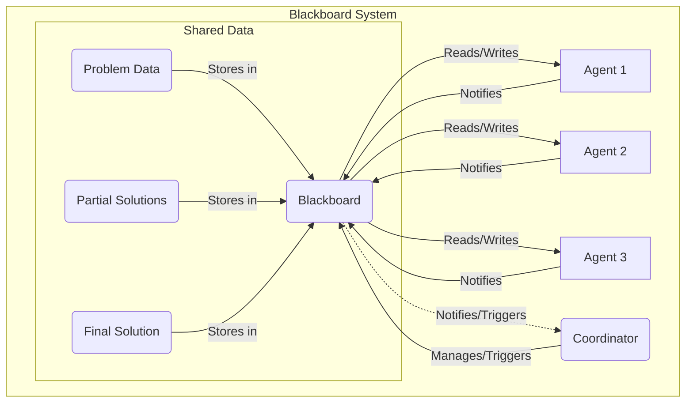

멀티 에이전트 시스템 (Multi-Agent Systems, MAS) 에서 에이전트 간의 효율적인 상호작용 설계는 시스템의 전반적인 성능, 확장성, 그리고 신뢰성을 결정하는 핵심 요소입니다. 특히 복잡한 문제 해결이나 분산된 작업을 수행할 때, 에이전트들이 정보를 교환하고, 작업을 조율하며, 공동의 목표를 달성하는 방식은 시스템의 성공을 좌우합니다. 2026년 현재, LLM 기반 에이전트의 등장으로 에이전트의 자율성과 지능이 비약적으로 발전함에 따라, 더욱 정교하고 유연한 상호작용 패턴의 필요성이 강조되고 있습니다. 잘못 설계된 상호작용은 통신 병목, 데이터 불일치, 비효율적인 자원 활용으로 이어져 시스템 전체의 성능 저하를 초래할 수 있습니다. 이 문서에서는 MAS에서 효과적인 상호작용을 위한 주요 디자인 패턴들을 탐구합니다. 이 패턴들은 에이전트들이 정보를 공유하고, 작업을 분배하며, 협력적인 의사결정을 내리는 데 필요한 구조적 기반을 제공합니다.

## 핵심 상호작용 디자인 패턴

### 1. 블랙보드 패턴 (Blackboard Pattern)

블랙보드 패턴은 공통의 데이터 저장소(블랙보드)를 중심으로 여러 에이전트 또는 지식 소스 (Knowledge Sources, KS) 가 협력하는 방식입니다. 각 에이전트는 블랙보드에 접근하여 정보를 읽고, 새로운 정보를 추가하며, 기존 정보를 수정합니다. 블랙보드는 주로 문제 상태, 부분적인 해결책, 또는 시스템이 추적해야 하는 기타 공유 데이터를 저장합니다. 코디네이터 또는 스케줄러 에이전트가 블랙보드의 변경을 감지하고, 적절한 에이전트를 활성화하여 다음 단계를 수행하도록 지시합니다. 이 패턴은 복잡한 문제 해결, 계획 수립, 데이터 통합 등 다양한 분야에 적용됩니다.

```python
class Blackboard:
    def __init__(self):
        self._data = {}
        self._subscribers = []

    def write(self, key, value):
        self._data[key] = value
        print(f"Blackboard: '{key}' updated to '{value}'")
        self._notify_subscribers(key)

    def read(self, key):
        return self._data.get(key)

    def subscribe(self, agent):
        self._subscribers.append(agent)

    def _notify_subscribers(self, key):
        for agent in self._subscribers:
            agent.on_blackboard_change(key, self._data[key])

class Agent:
    def __init__(self, name, blackboard):
        self.name = name
        self.blackboard = blackboard
        self.blackboard.subscribe(self)

    def on_blackboard_change(self, key, value):
        if key == "task_status" and value == "pending":
            print(f"{self.name}: Detected pending task, processing...")
            # Simulate processing
            self.blackboard.write("task_status", "completed")
        elif key == "task_status" and value == "completed":
            print(f"{self.name}: Task completed confirmation.")

# Usage
blackboard = Blackboard()
agent1 = Agent("AgentA", blackboard)
agent2 = Agent("AgentB", blackboard)

blackboard.write("current_problem", "Analyze logs for anomaly")
blackboard.write("task_status", "pending")
```



### 2. 브로커 패턴 (Broker Pattern)

브로커 패턴은 에이전트들이 서로 직접 통신하지 않고, 중앙의 브로커 (Broker) 를 통해 메시지를 교환하는 패턴입니다. 브로커는 메시지 라우팅, 로드 밸런싱, 서비스 검색 등의 역할을 수행하여 에이전트 간의 결합도를 낮춥니다. 에이전트는 자신이 제공하는 서비스나 관심 있는 이벤트를 브로커에 등록하고, 브로커는 이 정보를 바탕으로 메시지를 적절한 수신자에게 전달합니다. 이 패턴은 분산 환경에서 에이전트 추가/제거가 빈번하거나, 서비스 인터페이스가 자주 변경되는 경우에 유용합니다.

```python
class MessageBroker:
    def __init__(self):
        self._services = {}
        self._subscriptions = {}

    def register_service(self, service_name, agent_id):
        self._services[service_name] = agent_id
        print(f"Broker: Service '{service_name}' registered by '{agent_id}'")

    def subscribe(self, event_type, agent_id):
        if event_type not in self._subscriptions:
            self._subscriptions[event_type] = []
        self._subscriptions[event_type].append(agent_id)
        print(f"Broker: '{agent_id}' subscribed to event '{event_type}'")

    def send_message(self, sender_id, recipient_service, message):
        if recipient_service in self._services:
            recipient_agent_id = self._services[recipient_service]
            print(f"Broker: Message from '{sender_id}' to '{recipient_agent_id}' ({recipient_service}): {message}")
            # In a real system, this would queue or dispatch to the actual agent instance
        else:
            print(f"Broker: Error - Service '{recipient_service}' not found.")

    def publish_event(self, publisher_id, event_type, payload):
        if event_type in self._subscriptions:
            for subscriber_id in self._subscriptions[event_type]:
                print(f"Broker: Event '{event_type}' from '{publisher_id}' to '{subscriber_id}': {payload}")
                # Dispatch event to subscriber_id
        else:
            print(f"Broker: No subscribers for event '{event_type}'.")

class Agent:
    def __init__(self, agent_id, broker):
        self.agent_id = agent_id
        self.broker = broker

    def offer_service(self, service_name):
        self.broker.register_service(service_name, self.agent_id)

    def request_service(self, service_name, message):
        self.broker.send_message(self.agent_id, service_name, message)

    def listen_to_event(self, event_type):
        self.broker.subscribe(event_type, self.agent_id)

    def trigger_event(self, event_type, payload):
        self.broker.publish_event(self.agent_id, event_type, payload)

# Usage
broker = MessageBroker()
ag_task = Agent("TaskAgent", broker)
ag_analyzer = Agent("AnalyzerAgent", broker)
ag_reporter = Agent("ReporterAgent", broker)

ag_task.offer_service("task_execution_service")
ag_analyzer.listen_to_event("data_processed_event")
ag_reporter.listen_to_event("task_completed_event")

ag_analyzer.request_service("task_execution_service", "Process new dataset")
ag_task.trigger_event("task_completed_event", {"task_id": "T001", "status": "Success"})
```

### 3. 컨트랙트 넷 프로토콜 (Contract Net Protocol, CNP)

컨트랙트 넷 프로토콜은 분산된 환경에서 작업을 동적으로 할당하고 협력하는 강력한 패턴입니다. 이 패턴은 일반적으로 다음과 같은 단계를 따릅니다:

1.  **관리자 (Manager)**: 작업을 수행해야 하는 에이전트가 