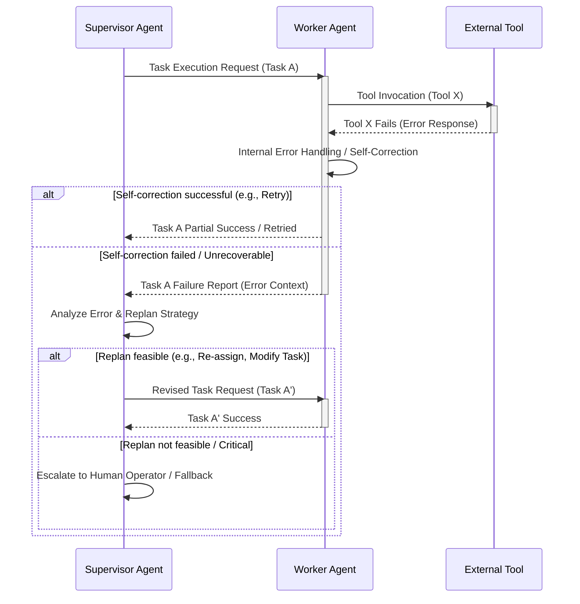

멀티 에이전트 시스템(Multi-Agent System, MAS)은 복잡한 문제 해결을 위해 여러 에이전트가 협력하는 분산형 아키텍처입니다. 그러나 각 에이전트의 자율성과 상호작용의 복잡성으로 인해 실행 오류 발생 가능성이 높습니다. 시스템의 안정적인 운영을 위해서는 예측 불가능한 상황과 오류를 효율적으로 관리하고 최소화하는 디자인 패턴이 필수적입니다. 이 글에서는 2026년 최신 트렌드를 반영하여 멀티 에이전트 시스템의 실행 오류를 최소화하는 핵심 디자인 패턴을 제시합니다.

## 멀티 에이전트 시스템의 오류 발생 요인

멀티 에이전트 시스템에서 오류는 다양한 원인으로 발생할 수 있습니다:

*   **개별 에이전트 오류**: LLM 환각(Hallucination), 잘못된 도구 사용(Tool Use Error), 내부 로직 버그 등.
*   **상호작용 오류**: 에이전트 간 잘못된 통신 프로토콜, 데드락(Deadlock), 메시지 손실, 비동기 작업의 타이밍 문제.
*   **환경적 요인**: 외부 도구(External Tool) 또는 API의 응답 지연, 실패, 네트워크 불안정성, 리소스 고갈 등.
*   **데이터 일관성 문제**: 공유 메모리 또는 상태(State)의 불일치.

이러한 오류들을 사전에 방지하거나 발생 시 빠르게 탐지하고 복구하는 견고한 시스템 설계가 중요합니다.

## 핵심 디자인 패턴

### 1. Supervisor-Worker 패턴

가장 기본적인 패턴으로, 단일 Supervisor 에이전트가 여러 Worker 에이전트의 작업을 조율하고 모니터링합니다. Worker 에이전트에서 오류가 발생하면 Supervisor가 이를 감지하고 재시도, 대체 작업 위임, 또는 복구 전략을 실행합니다.

*   **역할**: Supervisor는 태스크 분배, Worker 상태 모니터링, 오류 로깅, 재시도 로직 관리, 전체적인 워크플로우 제어.
*   **장점**: 중앙 집중식 오류 관리로 복구 로직을 단순화하고, 에이전트 간 의존성 문제 해결에 용이합니다.
*   **고려사항**: Supervisor 자체가 SPOF(Single Point of Failure)가 될 수 있으므로, Supervisor의 이중화 또는 자체 복구 메커니즘이 필요합니다.

### 2. Circuit Breaker 패턴

외부 서비스나 특정 에이전트의 지속적인 실패로 인해 전체 시스템이 영향을 받는 것을 방지합니다. 실패 임계값(Failure Threshold)을 초과하면 해당 서비스 또는 에이전트에 대한 호출을 일정 기간 차단하여 시스템 부하를 줄이고 자율 복구 시간을 제공합니다.

*   **상태**: Closed (정상 작동), Open (요청 차단), Half-Open (제한적인 테스트 요청).
*   **적용**: 외부 API 호출, 리소스 집약적인 에이전트 작업.

### 3. Idempotent Operations (멱등성 연산)

어떤 연산을 여러 번 수행해도 결과가 동일하게 유지되도록 설계하는 패턴입니다. 이는 분산 시스템에서 네트워크 오류나 재시도로 인해 동일한 요청이 중복 전송될 때 데이터 일관성을 보장하는 데 필수적입니다.

*   **구현**: 고유한 요청 ID (Unique Request ID) 사용, 상태 기반 조건부 업데이트.
*   **적용**: 금융 거래, 데이터 저장/업데이트 요청.

### 4. Self-Correction 및 Reflection 메커니즘

에이전트 스스로 자신의 행동이나 결과의 오류를 인지하고 수정하는 능력입니다. 이는 에이전트가 받은 피드백이나 실행 결과를 분석하여 잘못된 추론, 도구 사용, 또는 계획을 개선하는 과정을 포함합니다. LLM 기반 에이전트에서는 특히 중요하며, 프롬프트 엔지니어링을 통해 Reflection 단계를 명시적으로 지시할 수 있습니다.

*   **절차**: 실행 -> 결과 검증 -> 오류 감지 -> 원인 분석 -> 재계획/재실행.
*   **구현**: LLM 기반 Reasoning, 내부 상태 변경, 이전 성공 사례 학습.

### 5. Consensus-based Validation (합의 기반 검증)

Critical한 작업의 결과에 대해 여러 에이전트가 독립적으로 검증하고 합의를 통해 최종 결정을 내리는 패턴입니다. 단일 에이전트의 오류나 환각이 시스템 전체에 미치는 영향을 최소화합니다.

*   **적용**: 중요 데이터 생성, 보안 관련 의사결정, 코드 생성 결과 검증.
*   **고려사항**: 추가적인 리소스 소모 및 지연 발생 가능성.

## 코드 예제: Supervisor-Worker 패턴과 오류 처리

아래 Python 코드는 Supervisor 에이전트가 Worker 에이전트의 작업을 조율하고, Worker 에이전트에서 발생하는 오류를 처리하는 간단한 예시입니다. 여기서는 재시도 로직과 함께 Worker의 자율적인 부분적인 실패 처리 및 Supervisor의 재계획 가능성을 보여줍니다.

```python
import time

class WorkerAgent:
    def __init__(self, agent_id):
        self.agent_id = agent_id
        self.failures = 0

    def perform_task(self, task_description, should_fail=False):
        print(f"Worker {self.agent_id} attempting task: '{task_description}'")
        try:
            # Simulate transient failure for demonstration
            if should_fail and self.failures < 2: 
                self.failures += 1
                raise ValueError(f"Simulated transient error in {task_description}")
            # Simulate external tool call or critical failure
            if "tool_error" in task_description:
                raise ConnectionError("External tool unavailable")

            time.sleep(0.5) # Simulate work
            print(f"Worker {self.agent_id} completed task: '{task_description}'")
            self.failures = 0 # Reset failures on success
            return {"status": "success", "result": f"Data for {task_description}"}
        except (ValueError, ConnectionError) as e:
            print(f"Worker {self.agent_id} encountered error: {e}")
            return {"status": "failed", "error": str(e)}

class SupervisorAgent:
    def __init__(self, worker_agents):
        self.workers = {agent.agent_id: agent for agent in worker_agents}

    def orchestrate_task(self, task_id, task_description, target_agent_id, max_retries=3):
        print(f"\nSupervisor orchestrating task {task_id}: '{task_description}' on Worker {target_agent_id}")
        worker = self.workers.get(target_agent_id)
        if not worker:
            print(f"Error: Worker {target_agent_id} not found.")
            return {"status": "failed", "error": "Worker not found"}

        attempt = 0
        while attempt < max_retries:
            print(f"  Attempt {attempt + 1}/{max_retries} for task {task_id}")
            # Simulate conditional failure for demonstration based on task_id
            should_fail_param = (task_id == "T1" and attempt == 0) or \
                                (task_id == "T2" and attempt < 2) or \
                                ("persistent_error" in task_description) # Persistent failure

            response = worker.perform_task(task_description, should_fail_param)

            if response["status"] == "success":
                print(f"Supervisor: Task {task_id} completed successfully.")
                return response
            else:
                print(f"Supervisor: Task {task_id} failed. Error: {response['error']}")
                # Supervisor's error handling/re-planning logic
                if "tool unavailable" in response["error"].lower() and attempt < max_retries - 1:
                    print("  Supervisor: External tool error, waiting 1s before retry...")
                    time.sleep(1)
                elif "transient error" in response["error"].lower() and attempt < max_retries - 1:
                    print("  Supervisor: Transient error, retrying immediately...")
                else:
                    # Unrecoverable error or max retries reached
                    break 
            attempt += 1

        print(f"Supervisor: Task {task_id} ultimately failed after {max_retries} attempts.")
        return {"status": "failed", "error": "Max retries exceeded or unrecoverable error"}

# Example Usage
worker1 = WorkerAgent("Alpha")
worker2 = WorkerAgent("Beta")
supervisor = SupervisorAgent([worker1, worker2])

supervisor.orchestrate_task("T1", "Process user input with transient error", "Alpha", max_retries=3)
supervisor.orchestrate_task("T2", "Fetch data from external API with tool_error", "Beta", max_retries=3)
supervisor.orchestrate_task("T3", "Analyze data with persistent_error", "Alpha", max_retries=3)
supervisor.orchestrate_task("T4", "Generate report without errors", "Beta", max_retries=3)
```

위 코드를 실행하면 다음과 같은 출력을 볼 수 있으며, Supervisor가 Worker의 실패를 감지하고 재시도하거나 최종 실패를 보고하는 과정을 보여줍니다.

## 멀티 에이전트 시스템 오류 처리 흐름

아래 Mermaid 다이어그램은 Supervisor-Worker 패턴에서 에이전트 간의 일반적인 오류 처리 흐름을 시각화합니다.



## 트레이드오프

멀티 에이전트 시스템에서 실행 오류를 최소화하는 패턴을 적용할 때는 특정 장점과 단점을 고려해야 합니다.

*   **복잡성 증가 (Increased Complexity)**
    *   **언제 좋음**: 고가용성(High Availability) 및 미션 크리티컬(Mission-critical) 시스템에서 오류 복구 및 안정성이 최우선일 때.
    *   **언제 나쁨**: 프로토타입 개발이나 빠른 시장 출시(Time-to-market)가 중요한 초기 단계 프로젝트에서, 추가적인 설계 및 구현 비용이 부담될 때.
*   **성능 오버헤드 (Performance Overhead)**
    *   **언제 좋음**: 오류 발생 시 시스템 중단이 막대한 손실로 이어지는 금융, 자율 주행 등 분야에서 안정적인 운영이 지연보다 중요할 때.
    *   **언제 나쁨**: 실시간 응답 속도가 핵심 요구사항인 저지연(Low Latency) 시스템에서, 재시도, 합의 검증 등의 로직이 병목 현상을 유발할 수 있을 때.
*   **자율성 제한 (Limited Autonomy)**
    *   **언제 좋음**: Supervisor-Worker 패턴처럼 중앙 집중식 제어가 시스템 전체의 일관성 및 보안을 보장해야 할 때.
    *   **언제 나쁨**: 각 에이전트의 높은 자율성과 동적인 의사결정이 필수적인 탐색(Exploration) 또는 개방형 환경(Open-ended Environment) 시스템에서 창발적 행동(Emergent Behavior)을 저해할 수 있을 때.
*   **초기 개발 비용 (Initial Development Cost)**
    *   **언제 좋음**: 장기적으로 유지보수 비용을 절감하고 운영 안정성을 확보하고자 할 때.
    *   **언제 나쁨**: 자원이 제한적이거나, 시스템의 생명주기가 짧을 것으로 예상될 때, 과도한 설계는 비효율적일 수 있습니다.
*   **디버깅 난이도 (Debugging Difficulty)**
    *   **언제 좋음**: 잘 정의된 로깅(Logging) 및 모니터링 시스템과 결합하여 오류 발생 시 문제의 원인을 체계적으로 추적할 수 있을 때.
    *   **언제 나쁨**: 분산된 에이전트 간의 복잡한 상호작용과 비동기적 특성 때문에 오류 재현 및 근본 원인 분석이 어려워질 수 있을 때, 특히 로깅 및 모니터링 인프라가 미비할 경우.

## 실전 체크리스트

멀티 에이전트 시스템에 오류 최소화 패턴을 적용할 때 다음 체크리스트를 활용하여 안정성을 확보하세요.

*   [ ] **각 에이전트의 잠재적 실패 모드 정의**: 각 Worker 에이전트가 어떤 종류의 오류 (예: LLM 환각, 도구 실패, 데이터 불일치)를 일으킬 수 있는지 명확히 식별하고 문서화했는가?
*   [ ] **Supervisor 에이전트의 오류 처리 전략 구현**: Supervisor 에이전트가 Worker 에이전트의 실패를 감지하고, 재시도, 타임아웃, 대체 Worker 위임, 또는 인간 개입(Human Checkpoint) 요청 등 적절한 복구 전략을 자동화했는가?
*   [ ] **멱등성(Idempotency) 보장**: 중요한 상태 변경 연산이 중복 실행되어도 시스템 상태의 일관성이 유지되도록 고유 트랜잭션 ID 또는 조건부 업데이트 로직을 적용했는가?
*   [ ] **Circuit Breaker 또는 Rate Limiter 적용**: 외부 API나 과부하에 취약한 에이전트에 대해 Circuit Breaker 패턴 또는 Rate Limiting을 구현하여 cascading failure를 방지하고 있는가?
*   [ ] **종단 간(End-to-End) 오류 모니터링 및 알림 시스템**: 모든 에이전트와 그들의 상호작용에서 발생하는 오류를 실시간으로 모니터링하고, 정의된 임계값을 초과할 경우 운영팀에 자동으로 알림을 전송하는 시스템을 구축했는가?
*   [ ] **Self-Correction 및 Reflection 메커니즘 통합**: 에이전트가 자신의 실행 결과나 환경 피드백을 바탕으로 스스로 오류를 인지하고 계획을 수정하거나 재시도하는 내부 로직이 포함되어 있는가?
*   [ ] **합의 기반(Consensus-based) 검증 구현**: 핵심 의사결정이나 결과에 대해 최소 N개의 에이전트가 독립적으로 검증하고 합의에 도달해야만 다음 단계로 진행되도록 하는 메커니즘을 적용하여 단일 에이전트의 잘못된 판단을 방지하고 있는가?