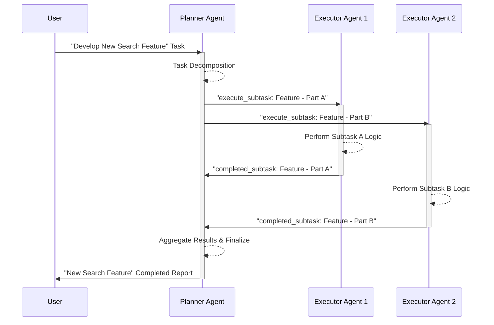

멀티 에이전트 시스템(Multi-Agent System, MAS)은 단일 에이전트가 해결하기 어려운 복잡한 문제를 해결하기 위해 여러 AI 에이전트가 협력하는 시스템입니다. 이러한 시스템의 성공은 에이전트 간의 명확한 역할 분담(Role Distribution)과 효율적인 협업 패턴(Collaboration Patterns) 설계에 달려 있습니다. 체계적인 설계는 시스템의 확장성(Scalability), 견고성(Robustness), 그리고 전반적인 효율성을 크게 향상시킵니다.

## 핵심 개념 (Core Concepts)

### 역할 정의 (Role Definition)
각 에이전트의 역할은 시스템 내에서 수행해야 할 고유한 기능, 책임(Responsibility), 그리고 전문성(Specialization)을 명확하게 정의합니다. 이는 단일 책임 원칙(Single Responsibility Principle)을 에이전트 레벨에 적용하는 것과 유사합니다. 명확하게 정의된 역할은 에이전트의 복잡도를 낮추고, 시스템의 유지보수성(Maintainability)을 높이며, 각 에이전트가 특정 도메인 지식과 도구 사용에 집중하도록 돕습니다.

### 통신 및 조정 메커니즘 (Communication and Coordination Mechanisms)
에이전트 간의 효과적인 통신과 조정은 협업의 핵심입니다. 통신 프로토콜(Communication Protocols)은 메시지의 형식, 내용, 그리고 전달 방식을 정의하며, 메시지 큐(Message Queue), 공유 메모리(Shared Memory), 또는 RESTful API 호출 등이 활용될 수 있습니다. 조정 메커니즘(Coordination Mechanisms)은 에이전트들이 공통의 목표를 달성하기 위해 서로의 행동을 동기화하고 충돌을 해결하는 방법을 포함합니다. 이는 중앙 집중식(Centralized) 오케스트레이터(Orchestrator)나 분산식(Decentralized) 협상(Negotiation) 전략으로 구현될 수 있습니다.

### 지식 공유 (Knowledge Sharing)
협업하는 에이전트들은 종종 공유된 컨텍스트(Shared Context)나 공통의 지식 기반(Common Knowledge Base)이 필요합니다. 이는 작업의 진행 상황, 환경 상태, 다른 에이전트의 능력 등에 대한 정보를 포함합니다. 효율적인 지식 공유는 에이전트들이 중복 작업을 피하고, 더 나은 결정을 내리며, 시스템의 전체적인 인지 능력(Cognitive Capability)을 향상시킵니다.

## 멀티 에이전트 협업 패턴 (Multi-Agent Collaboration Patterns)

### 계층형 협업 (Hierarchical Collaboration)
가장 일반적인 패턴 중 하나로, 감독 에이전트(Supervisor Agent)가 상위 수준의 목표를 설정하고, 이를 하위 작업자 에이전트(Worker Agent)에게 위임합니다. 작업자 에이전트는 할당된 서브태스크(Subtask)를 수행하고 결과를 감독 에이전트에게 보고합니다. 이는 복잡한 문제의 분해(Task Decomposition) 및 관리(Management)에 효과적입니다.

### 피어 투 피어 협업 (Peer-to-Peer Collaboration)
에이전트들이 동등한 위치에서 직접 통신하고 협업하는 패턴입니다. 중앙 집중식 제어 없이 각 에이전트가 자율적으로 판단하고 행동하며, 필요한 경우 다른 에이전트와 직접 상호작용합니다. 이는 시스템의 분산성(Distributed nature)과 견고성(Robustness)을 높이는 데 유리하지만, 전역적인 조정이 필요한 경우 복잡성이 증가할 수 있습니다.

### 블랙보드 패턴 (Blackboard Pattern)
중앙의 공유 데이터 저장소(Blackboard)를 통해 에이전트들이 간접적으로 상호작용하는 패턴입니다. 각 에이전트는 블랙보드에 정보를 추가하거나, 필요한 정보를 읽어 자신의 전문성에 따라 문제를 해결합니다. 이는 에이전트 간의 결합도를 낮추고(Loosely Coupled), 모듈성(Modularity)을 높여 시스템의 유연성을 확보할 수 있습니다.

### 동적 역할 할당 (Dynamic Role Assignment)
2026년 트렌드에 따라, LLM(Large Language Model)의 추론 능력과 실시간 환경 분석을 바탕으로 에이전트의 역할을 동적으로 재할당하는 접근 방식이 주목받고 있습니다. 이는 에이전트의 현재 부하(Load), 전문성, 그리고 시스템의 전체적인 목표 변화에 따라 유연하게 역할을 조절하여 자원 활용을 최적화하고 적응성(Adaptability)을 극대화합니다.

## 구현 예제 (Implementation Example: Python)

아래 Python 코드는 Planner Agent와 Executor Agent 간의 간단한 계층형 협업을 보여줍니다. Planner는 사용자 요청을 받아 서브태스크로 분해하고, Executor는 이를 실행한 뒤 Planner에게 결과를 보고합니다. `queue` 모듈을 사용하여 에이전트 간 비동기 메시지 전달을 구현합니다.

```python
import queue
import threading
import time

# 메시지 클래스 (Message Class)
class AgentMessage:
    def __init__(self, sender: str, receiver: str, content: str):
        self.sender = sender
        self.receiver = receiver
        self.content = content

    def __repr__(self):
        return f"({self.sender} -> {self.receiver}: {self.content})"

# 추상 에이전트 클래스 (Abstract Agent Class)
class BaseAgent(threading.Thread):
    def __init__(self, name: str, inbox: queue.Queue):
        super().__init__()
        self.name = name
        self.inbox = inbox
        self._running = True
        self.outboxes = {} # 다른 에이전트에게 메시지를 보낼 큐 맵

    def register_outbox(self, agent_name: str, outbox_queue: queue.Queue):
        self.outboxes[agent_name] = outbox_queue

    def send_message(self, receiver_name: str, content: str):
        if receiver_name in self.outboxes:
            message = AgentMessage(self.name, receiver_name, content)
            self.outboxes[receiver_name].put(message)
        else:
            print(f"[{self.name}] Error: No outbox registered for {receiver_name}")

    def stop(self):
        self._running = False
        self.inbox.put(None) # 종료 신호

    def run(self):
        print(f"Agent [{self.name}] started.")
        while self._running:
            message = self.inbox.get()
            if message is None:
                break
            self.process_message(message)
            self.inbox.task_done()
        print(f"Agent [{self.name}] stopped.")

    def process_message(self, message: AgentMessage):
        raise NotImplementedError

# 플래너 에이전트 (Planner Agent)
class PlannerAgent(BaseAgent):
    def process_message(self, message: AgentMessage):
        print(f"[{self.name}] received: {message}")
        if "plan_task" in message.content:
            task_description = message.content.split(": ")[1]
            print(f"[{self.name}] Planning for: '{task_description}'")
            self.send_message("Executor1", f"execute_subtask: {task_description} - Part A")
            self.send_message("Executor2", f"execute_subtask: {task_description} - Part B")
        elif "completed_subtask" in message.content:
            print(f"[{self.name}] received completion: {message.content}")

# 실행자 에이전트 (Executor Agent)
class ExecutorAgent(BaseAgent):
    def process_message(self, message: AgentMessage):
        print(f"[{self.name}] received: {message}")
        if "execute_subtask" in message.content:
            subtask_description = message.content.split(": ")[1]
            print(f"[{self.name}] Executing: '{subtask_description}'")
            time.sleep(1) # 작업 시뮬레이션
            self.send_message("Planner", f"completed_subtask: {subtask_description}")

# --- 시스템 설정 및 실행 (System Setup and Execution) ---
if __name__ == "__main__":
    # 에이전트 인박스 큐 생성
    planner_inbox = queue.Queue()
    executor1_inbox = queue.Queue()
    executor2_inbox = queue.Queue()

    # 에이전트 인스턴스 생성
    planner = PlannerAgent("Planner", planner_inbox)
    executor1 = ExecutorAgent("Executor1", executor1_inbox)
    executor2 = ExecutorAgent("Executor2", executor2_inbox)

    # 에이전트 간 통신 경로 등록
    planner.register_outbox("Executor1", executor1_inbox)
    planner.register_outbox("Executor2", executor2_inbox)
    executor1.register_outbox("Planner", planner_inbox)
    executor2.register_outbox("Planner", planner_inbox)

    # 모든 에이전트 시작
    agents = [planner, executor1, executor2]
    for agent in agents:
        agent.start()

    # 초기 작업 요청
    planner_inbox.put(AgentMessage("User", "Planner", "plan_task: Develop New Search Feature"))

    # 에이전트가 작업을 처리할 시간 제공
    time.sleep(5)

    # 모든 에이전트 종료
    for agent in agents:
        agent.stop()
    for agent in agents:
        agent.join() # 스레드 종료 대기

    print("Multi-agent system stopped successfully.")
```

위 코드를 Mermaid Sequence Diagram으로 시각화하면 다음과 같습니다.



## 트레이드오프 (Trade-offs)

멀티 에이전트 시스템의 역할 분담 및 협업 패턴을 디자인할 때 고려해야 할 주요 트레이드오프는 다음과 같습니다.

*   **중앙 집중식 vs. 분산식 조정 (Centralized vs. Decentralized Coordination)**
    *   **중앙 집중식**: 초기 설계 및 디버깅 용이, 전역 최적화 가능성 높음. 하지만 단일 실패 지점(Single Point of Failure)이 될 수 있고 확장성(Scalability)에 한계가 있습니다.
        *   **언제 좋음**: 소규모 시스템, 엄격한 제어가 필요하거나 복잡성 관리가 중요한 경우.
        *   **언제 나쁨**: 높은 확장성과 견고성이 요구되는 대규모, 동적 시스템.
    *   **분산식**: 높은 확장성, 견고성, 에이전트의 자율성 보장. 하지만 설계 복잡성이 크고, 전역 최적화가 어렵거나 수렴(Convergence)을 보장하기 어려울 수 있습니다.
        *   **언제 좋음**: 대규모, 동적인 환경에서 높은 유연성과 복원력이 필요한 시스템.
        *   **언제 나쁨**: 단순한 태스크나 엄격한 전역 제어가 필요한 경우.

*   **명시적 역할 vs. 동적 역할 (Explicit vs. Dynamic Roles)**
    *   **명시적 역할**: 각 에이전트의 책임이 명확하여 예측 가능성(Predictability)과 안정성(Stability)이 높고 구현이 용이합니다. 하지만 유연성(Flexibility)이 부족하여 변화하는 환경에 적응하기 어렵습니다.
        *   **언제 좋음**: 잘 정의된 태스크와 안정적인 환경에서 작동하는 시스템.
        *   **언제 나쁨**: 요구사항이 자주 변경되거나 불확실성이 높은 환경.
    *   **동적 역할**: 시스템의 유연성(Adaptability)과 적응성(Flexibility)을 극대화하여 자원 활용을 최적화할 수 있습니다. 하지만 구현이 복잡하고 디버깅이 어려울 수 있으며, 시스템의 행동을 예측하기 어려울 수 있습니다.
        *   **언제 좋음**: 고도의 적응성이 필요한 시스템, 다양한 유형의 태스크를 처리해야 하는 경우.
        *   **언제 나쁨**: 성능 임계치(Performance Critical)가 높거나, 높은 신뢰성(High Assurance)이 요구되는 시스템.

*   **동기 vs. 비동기 통신 (Synchronous vs. Asynchronous Communication)**
    *   **동기 통신**: 메시지 전달 및 응답 순서가 보장되어 이해하기 쉽습니다. 하지만 송신 에이전트가 수신 에이전트의 응답을 기다리므로 블로킹(Blocking)이 발생하고 시스템의 전체 처리량(Throughput)이 저하될 수 있습니다.
        *   **언제 좋음**: 의존성이 높고 메시지 볼륨이 적은 중요한 상호작용.
        *   **언제 나쁨**: 높은 동시성(Concurrency)과 처리량이 필요한 분산 시스템.
    *   **비동기 통신**: 에이전트들이 서로의 응답을 기다리지 않고 작업을 계속 진행하여 논블로킹(Non-blocking) 방식으로 작동합니다. 이는 시스템의 확장성(Scalability)과 성능(Performance)을 향상시키지만, 메시지 순서 보장과 복잡한 상태 관리(State Management)에 어려움이 있을 수 있습니다.
        *   **언제 좋음**: 고도로 분산된 시스템, 높은 동시성과 낮은 지연 시간(Low Latency)이 요구되는 경우.
        *   **언제 나쁨**: 엄격한 메시지 처리 순서가 요구되거나 상호작용이 매우 단순한 경우.

## 실전 체크리스트 (Practical Checklist)

멀티 에이전트 시스템을 설계하고 구현할 때 다음 체크리스트를 활용하여 견고성과 효율성을 확보할 수 있습니다.

*   - [ ] 각 에이전트의 책임과 역할 경계가 단일 책임 원칙(Single Responsibility Principle)에 따라 명확히 정의되었는가?
*   - [ ] 에이전트 간 통신 프로토콜이 명확하며, 메시지 구조와 형식이 표준화되어 상호운용성(Interoperability)을 보장하는가?
*   - [ ] 시스템의 예상되는 규모, 복잡도, 동적 변화 요구사항을 고려하여 최적의 협업 패턴(계층형, P2P, 블랙보드, 동적 역할 할당 등)을 선택했는가?
*   - [ ] 에이전트 간 공유되는 지식(Shared Knowledge)의 일관성(Consistency)과 최신성(Freshness)을 유지하기 위한 동기화 및 캐싱 전략이 수립되었는가?
*   - [ ] 특정 에이전트의 실패가 전체 시스템에 미치는 영향을 최소화하고 스스로 복구(Self-healing)할 수 있는 견고성(Robustness) 및 오류 처리(Error Handling) 메커니즘이 설계되었는가?
*   - [ ] 에이전트의 행동을 모니터링하고 디버깅할 수 있는 추적(Observability), 로깅(Logging), 그리고 성능 측정 시스템이 구축되었는가?
*   - [ ] LLM 기반 추론을 활용하여 동적 환경 변화에 에이전트 역할이나 협업 방식이 유연하게 적응(Adaptive)하고 재구성(Reconfigurable)될 수 있는가?