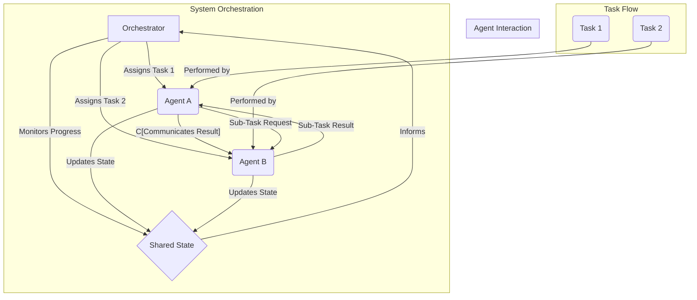

자율 에이전트(Autonomous Agents)가 복잡한 목표를 달성하기 위해 효과적으로 상호작용하고 조정하는 능력은 현대 AI 시스템의 핵심 과제입니다. 단일 에이전트로는 처리하기 어려운 스케일과 복잡성을 가진 태스크(Task)를 멀티 에이전트 시스템(Multi-Agent System, MAS)은 분산된 지능과 자원을 활용하여 해결할 수 있습니다. 이는 특히 2026년 기준, 대규모 언어 모델(Large Language Model, LLM) 기반 에이전트들이 등장하면서 더욱 중요해지고 있습니다. 이 글에서는 멀티 에이전트 시스템 내에서 태스크 협업(Task Collaboration) 및 조정(Coordination)을 위한 다양한 방법론과 실전 적용 전략을 다룹니다.

## 멀티 에이전트 시스템의 협업 및 조정 필요성

복잡한 시스템 환경에서 개별 에이전트의 능력은 제한적입니다. 특정 지식 도메인이나 도구 사용에 특화된 에이전트들이 모여 협업할 때, 전체 시스템은 더 높은 수준의 문제 해결 능력을 갖추게 됩니다. 예를 들어, 소프트웨어 개발 프로젝트에서 코드를 작성하는 에이전트, 테스트 케이스를 생성하는 에이전트, 문서를 작성하는 에이전트가 유기적으로 연결되어야 효율적인 워크플로우를 구성할 수 있습니다. 이러한 상호작용은 단순히 태스크를 분할하는 것을 넘어, 에이전트 간의 **커뮤니케이션(Communication)**, **상호 의존성(Interdependency)** 관리, **자원 공유(Resource Sharing)**, 그리고 **갈등 해결(Conflict Resolution)**을 포함합니다.

## 핵심 조정 전략

멀티 에이전트 시스템에서 효과적인 조정을 위해 다음과 같은 핵심 전략이 사용됩니다.

### 1. 중앙 집중식 조정 (Centralized Coordination)

중앙 집중식 조정은 하나의 마스터 에이전트(Master Agent) 또는 오케스트레이터(Orchestrator)가 전체 시스템의 태스크 분배, 에이전트 상태 모니터링, 그리고 조정 결정을 담당합니다. 이 방식은 구현이 비교적 간단하고 전체 시스템의 상태를 한눈에 파악하기 용이하다는 장점이 있습니다. 그러나 단일 실패 지점(Single Point of Failure)이 될 수 있으며, 시스템의 규모가 커질수록 병목 현상(Bottleneck)이 발생할 가능성이 있습니다.

```python
class Task:
    def __init__(self, id, description, priority):
        self.id = id
        self.description = description
        self.priority = priority
        self.assigned_agent = None
        self.status = "pending"

class Agent:
    def __init__(self, id, capabilities):
        self.id = id
        self.capabilities = capabilities

    def perform_task(self, task):
        print(f"Agent {self.id} performing task {task.id}: {task.description}")
        task.status = "completed"
        # Simulate task completion logic

class CentralizedOrchestrator:
    def __init__(self, agents):
        self.agents = agents
        self.tasks = []

    def add_task(self, task):
        self.tasks.append(task)

    def distribute_tasks(self):
        for task in sorted(self.tasks, key=lambda t: t.priority, reverse=True):
            if task.status == "pending":
                # Simple capability-based assignment
                for agent in self.agents:
                    if any(cap in agent.capabilities for cap in ["coding", "testing"]): # Example capability
                        task.assigned_agent = agent.id
                        agent.perform_task(task)
                        break

# Example Usage
agents = [Agent(1, ["coding"]), Agent(2, ["testing", "coding"])]
orchestrator = CentralizedOrchestrator(agents)
orchestrator.add_task(Task(101, "Implement login feature", 2))
orchestrator.add_task(Task(102, "Write unit tests for login", 1))
orchestrator.distribute_tasks()
```

### 2. 분산형 조정 (Decentralized Coordination)

분산형 조정에서는 에이전트들이 명시적인 중앙 제어 없이 직접 상호작용하며 태스크를 조정합니다. 각 에이전트는 자신의 목표와 주변 환경, 다른 에이전트의 상태를 기반으로 자율적으로 의사결정을 내립니다. 이 방식은 시스템의 **확장성(Scalability)**과 **견고성(Robustness)**이 높지만, 전역적인 최적화(Global Optimization)가 어렵고 복잡한 상호작용 패턴으로 인해 시스템의 행동을 예측하기 어려울 수 있습니다.

일반적인 분산형 조정 메커니즘은 다음과 같습니다.

*   **메시지 전달 (Message Passing)**: 에이전트들이 서로 메시지를 주고받으며 정보를 교환하고 조율합니다. (e.g., ACL - Agent Communication Language)
*   **블랙보드 시스템 (Blackboard System)**: 공유된 데이터 구조인 '블랙보드'에 에이전트들이 정보를 쓰고 읽으면서 암묵적으로 협력합니다. 각 에이전트는 블랙보드에 있는 문제의 일부분을 해결하고 결과를 다시 블랙보드에 게시합니다.
*   **시장 기반 조정 (Market-based Coordination)**: 태스크에 대한 입찰(Bidding) 또는 경매(Auction) 메커니즘을 통해 에이전트들이 자율적으로 태스크를 획득하고 수행합니다. 이는 동적인 자원 할당에 효과적입니다.



## 2026년 트렌드: 동적 조정 및 LLM 에이전트

2026년 현재, 멀티 LLM 에이전트 시스템은 정적 계획(Static Planning)보다는 동적인 조정(Dynamic Coordination)과 상황 인식(Context Awareness)에 중점을 두고 발전하고 있습니다. LLM 기반 에이전트는 복잡한 자연어 추론 능력을 통해 다음과 같은 진화된 조정 방식을 가능하게 합니다.

*   **자연어 기반 협상 (Natural Language Negotiation)**: 에이전트들이 자연어로 태스크 분배, 자원 요구, 문제 해결 방안 등을 협상합니다. 이를 통해 보다 유연하고 상황에 맞는 조정이 가능해집니다.
*   **제로샷/퓨샷 학습 기반 역할 부여 (Zero-shot/Few-shot Role Assignment)**: 새로운 태스크나 예상치 못한 상황이 발생했을 때, LLM 에이전트가 사전 정의된 규칙 없이도 스스로 역할을 정의하고 다른 에이전트에게 위임하거나 협력을 요청할 수 있습니다.
*   **자기 조직화 (Self-organization)**: 에이전트들이 환경 변화에 따라 스스로 팀을 구성하고 해체하며, 태스크의 우선순위를 동적으로 조절합니다.

## 트레이드오프

멀티 에이전트 시스템의 태스크 협업 및 조정 방법론 선택은 시스템의 특성과 요구사항에 따라 신중하게 이루어져야 합니다.

*   **중앙 집중식 vs. 분산형 조정**: 
    *   **언제 좋은가**: 중앙 집중식은 소규모, 예측 가능한 시스템 또는 강력한 제어가 필요한 경우에 적합합니다. 구현 및 디버깅이 용이합니다. 분산형은 대규모, 동적, 고가용성(High Availability)이 요구되는 시스템에 적합합니다. 단일 실패 지점이 없어 견고합니다.
    *   **언제 나쁜가**: 중앙 집중식은 확장성(Scalability)이 낮고, 단일 실패 지점 위험이 있습니다. 분산형은 시스템 행동 예측이 어렵고, 전역 최적화 달성이 복잡하며, 초기 설계 및 디버깅 비용이 높을 수 있습니다.

*   **명시적 vs. 암묵적 커뮤니케이션**: 
    *   **언제 좋은가**: 명시적 커뮤니케이션(메시지 전달)은 에이전트 간의 정보 교환이 명확하고 추적 가능해야 할 때 좋습니다. 암묵적 커뮤니케이션(블랙보드, 환경 변화)은 통신 오버헤드를 줄이고, 시스템의 응집도를 낮출 수 있어 복잡성이 높은 시스템에 유용합니다.
    *   **언제 나쁜가**: 명시적 커뮤니케이션은 메시지 오버헤드와 복잡한 프로토콜 관리가 필요할 수 있습니다. 암묵적 커뮤니케이션은 정보 흐름을 추적하기 어렵고, 에이전트 간 오해나 충돌 발생 시 원인 파악이 어려울 수 있습니다.

*   **정적 vs. 동적 태스크 할당**: 
    *   **언제 좋은가**: 정적 할당은 태스크 및 에이전트의 역할이 고정되어 있을 때 효율적이며, 예측 가능성이 높습니다. 동적 할당은 태스크 부하가 변동이 심하거나 에이전트의 가용성이 불규칙할 때 시스템의 유연성과 효율성을 극대화합니다.
    *   **언제 나쁜가**: 정적 할당은 환경 변화나 에이전트 실패에 대한 대응 능력이 낮습니다. 동적 할당은 할당 로직의 복잡성이 높고, 안정성 유지를 위한 추가적인 모니터링 및 제어 메커니즘이 필요합니다.

## 실전 체크리스트

멀티 에이전트 시스템에서 태스크 협업 및 조정을 구현할 때 다음 체크리스트를 활용하여 시스템의 설계 및 구현을 검증할 수 있습니다.

- [ ] **태스크 분해 가능성 확인**: 복잡한 목표가 독립적이거나 최소한의 의존성을 가진 하위 태스크(Sub-task)로 효과적으로 분해될 수 있는지 검증합니다.
- [ ] **에이전트 역할 및 책임 명확화**: 각 에이전트의 기능(Capability), 책임(Responsibility), 그리고 다른 에이전트와의 인터페이스(Interface)가 명확하게 정의되어 있는지 확인합니다.
- [ ] **커뮤니케이션 프로토콜 설계**: 에이전트 간의 메시지 형식, 전달 메커니즘(동기/비동기), 그리고 오류 처리 전략이 명확하게 설계되어 있는지 확인합니다.
- [ ] **조정 메커니즘 선택 및 검증**: 시스템의 확장성, 견고성, 성능 요구사항에 적합한 중앙 집중식 또는 분산형 조정 전략이 선택되었으며, 해당 전략이 시뮬레이션 또는 테스트를 통해 검증되었는지 확인합니다.
- [ ] **갈등 해결 전략 포함**: 자원 경합, 태스크 충돌 등 에이전트 간 잠재적 갈등 상황에 대한 감지 및 해결(Conflict Resolution) 전략이 시스템에 내장되어 있는지 확인합니다.
- [ ] **전역 상태 가시성 및 일관성**: 분산된 시스템에서 필요한 경우, 에이전트들이 전역적인 시스템 상태(Global State)를 일관성 있게 인지하고 접근할 수 있는 메커니즘(예: 공유 컨텍스트, 이벤트 스트림)이 마련되어 있는지 확인합니다.
- [ ] **성능 및 확장성 테스트**: 에이전트 수 증가, 태스크 복잡도 증가에 따른 시스템의 성능 저하 및 확장성 한계(Scalability Limits)를 사전에 테스트하고 병목 지점을 식별합니다.
