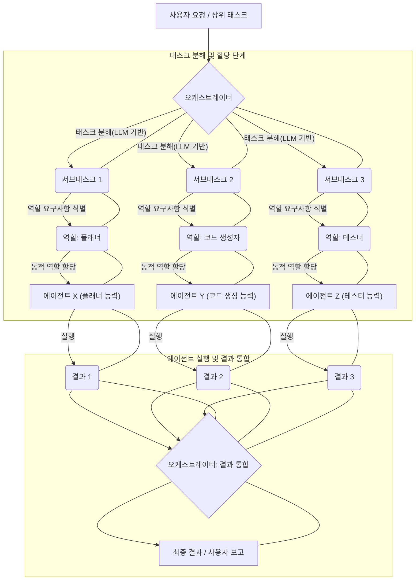

멀티 에이전트 시스템(Multi-Agent System, MAS)은 복잡한 문제를 해결하기 위해 여러 에이전트가 협력하는 분산형 시스템입니다. 이러한 시스템의 효율성과 견고성을 결정하는 핵심 요소 중 하나는 바로 태스크 분해(Task Decomposition)와 역할 할당(Role Assignment) 전략입니다. 고도로 복잡한 태스크를 단일 에이전트가 처리하는 것은 비효율적이거나 불가능할 수 있으므로, 태스크를 작고 관리 가능한 서브태스크(Sub-task)로 나누고, 각 서브태스크에 가장 적합한 에이전트에게 역할을 할당하는 것은 MAS의 성공에 필수적입니다.

## 태스크 분해 전략

태스크 분해는 주어진 상위 태스크(High-level Task)를 에이전트가 개별적으로 처리할 수 있는 하위 태스크(Lower-level Task)로 나누는 과정입니다. 효과적인 분해는 에이전트 간의 병렬 처리, 전문화된 지식 활용, 그리고 시스템의 전반적인 효율성을 극대화합니다.

### 1. 계층적 분해 (Hierarchical Decomposition)
가장 일반적인 형태 중 하나로, 상위 레벨의 코디네이터 또는 슈퍼바이저 에이전트(Supervisor Agent)가 큰 태스크를 여러 중간 태스크로 분해하고, 다시 이 중간 태스크들이 더 작은 실행 가능한 태스크들로 분해되는 구조입니다.

*   **장점:** 복잡성 관리 용이, 명확한 책임 분리.
*   **단점:** 중앙 집중적인 계획에 의존할 수 있으며, 단일 실패 지점(Single Point of Failure)이 될 수 있습니다.

### 2. 기능적 분해 (Functional Decomposition)
태스크를 시스템 내 에이전트의 기능적 전문성에 따라 분해하는 방법입니다. 예를 들어, 소프트웨어 개발 태스크는 '요구사항 분석', '설계', '구현', '테스트', '배포'와 같은 기능적 영역으로 나눌 수 있습니다. 각 기능 영역은 해당 전문성을 가진 에이전트 그룹에게 할당됩니다.

*   **장점:** 에이전트의 전문성 극대화, 재사용성 증가.
*   **단점:** 기능 간의 강한 의존성이 발생할 경우 오버헤드 증가.

### 3. 데이터 기반 분해 (Data-Driven Decomposition)
처리해야 할 데이터셋이 크거나 여러 소스에서 오는 경우, 데이터를 기준으로 태스크를 분해하는 방식입니다. 각 에이전트 또는 에이전트 그룹이 특정 데이터 세그먼트나 데이터 소스를 담당하게 됩니다. 빅데이터 처리, 분산 컴퓨팅 환경에서 유용합니다.

*   **장점:** 데이터 병렬 처리 용이, 확장성(Scalability) 확보.
*   **단점:** 데이터 일관성(Data Consistency) 및 동기화(Synchronization) 관리가 복잡해질 수 있습니다.

### 4. 목표 지향적 분해 (Goal-Oriented Decomposition)
최종 목표를 달성하기 위한 중간 목표(Sub-goals)를 설정하고, 각 중간 목표를 달성하는 것을 하나의 태스크로 간주합니다. 에이전트는 특정 중간 목표를 달성하기 위한 계획을 수립하고 실행합니다.

*   **장점:** 유연한 계획 수립, 자율성 강화.
*   **단점:** 목표 간의 의존성 및 충돌 관리 필요.

## 역할 할당 방법

태스크 분해 후, 각 서브태스크를 어떤 에이전트에게 맡길 것인가가 역할 할당의 핵심입니다. 역할 할당은 에이전트의 능력(Capabilities), 가용성(Availability), 그리고 시스템의 전체적인 목표 달성 효율성을 고려하여 이루어져야 합니다.

### 1. 정적 역할 할당 (Static Role Assignment)
시스템 설계 시 각 에이전트에게 미리 정의된 역할을 부여하는 방식입니다. 에이전트는 특정 기능이나 전문성을 가지고 태어나며, 그 역할은 시스템 수명 주기 동안 거의 변하지 않습니다.

*   **적합한 경우:** 예측 가능한 환경, 안정적인 태스크 플로우, 에이전트의 전문성이 명확할 때.
*   **예시:** 특정 API를 호출하는 `API_Caller` 에이전트, 코드 리뷰를 담당하는 `Code_Reviewer` 에이전트.

### 2. 동적 역할 할당 (Dynamic Role Assignment)
런타임에 태스크의 요구사항, 에이전트의 현재 상태, 가용 리소스 등을 고려하여 실시간으로 역할을 할당하는 방식입니다. 이는 시스템의 적응성(Adaptability)과 유연성(Flexibility)을 크게 향상시킵니다.

*   **적합한 경우:** 예측 불가능한 환경, 변화하는 태스크 요구사항, 에이전트의 가용성이 유동적일 때.
*   **메커니즘:**
    *   **능력 기반 매칭 (Capability-Based Matching):** 태스크가 요구하는 스킬셋과 에이전트가 보유한 스킬셋을 매칭하여 할당합니다.
    *   **경매/협상 기반 (Auction/Negotiation-Based):** 태스크를 공개하고 에이전트들이 자신의 능력과 부하를 고려하여 입찰하거나 협상하여 태스크를 가져갑니다.
    *   **LLM 기반 오케스트레이션 (LLM-based Orchestration):** 중앙 오케스트레이터 LLM이 전체 태스크를 이해하고, 각 서브태스크에 필요한 전문성과 에이전트의 가용성을 종합적으로 판단하여 역할을 할당합니다. 이는 2026년 최신 트렌드 중 하나로, 복잡한 판단 로직을 LLM에 위임하여 동적이고 지능적인 할당이 가능합니다.

### 3. 유연한 역할 정의 (Flexible Role Definition)
에이전트가 고정된 역할을 가지는 대신, 여러 역할을 수행할 수 있는 잠재력을 가지도록 설계하고, 필요에 따라 역할을 동적으로 스위칭하는 방식입니다. 이는 에이전트의 활용률을 높이고, 시스템 전체의 리소스 효율성을 개선합니다.

## 구현 패턴: 오케스트레이터와 에이전트 협업

멀티 에이전트 시스템에서 태스크 분해와 역할 할당은 일반적으로 오케스트레이터(Orchestrator) 에이전트와 워커(Worker) 에이전트 간의 협업 패턴으로 구현됩니다.

### 오케스트레이터의 역할
*   상위 태스크 수신 및 이해
*   태스크 분해 전략 적용 (예: LLM을 활용한 추론 기반 분해)
*   분해된 서브태스크 관리
*   각 서브태스크에 대한 요구 스킬셋 식별
*   워커 에이전트의 능력 및 상태 모니터링
*   역할 할당 메커니즘을 통해 서브태스크 할당
*   워커 에이전트의 진행 상황 추적 및 결과 취합

### 워커 에이전트의 역할
*   할당된 역할(서브태스크) 수신 및 이해
*   할당된 태스크 실행
*   필요 시 외부 도구(Tools) 사용
*   결과를 오케스트레이터에게 보고

다음은 단순화된 Python 유사 코드 예시입니다.

```python
from enum import Enum

class AgentRole(Enum):
    PLANNER = "planner"
    CODE_GENERATOR = "code_generator"
    TESTER = "tester"
    DOCUMENTER = "documenter"
    
class Agent:
    def __init__(self, agent_id: str, capabilities: list[AgentRole]):
        self.agent_id = agent_id
        self.capabilities = set(capabilities)
        self.current_task = None
        
    def assign_task(self, task_description: str, role: AgentRole):
        if role not in self.capabilities:
            print(f"Agent {self.agent_id} cannot perform role {role.name}")
            return False
        
        self.current_task = {"description": task_description, "role": role}
        print(f"Agent {self.agent_id} assigned task: '{task_description}' as {role.name}")
        return True

    def execute_task(self):
        if not self.current_task:
            print(f"Agent {self.agent_id} has no task.")
            return "No task"

        print(f"Agent {self.agent_id} executing task: '{self.current_task['description']}'")
        # Simulate task execution based on role
        if self.current_task['role'] == AgentRole.PLANNER:
            result = f"Plan for '{self.current_task['description']}' created."
        elif self.current_task['role'] == AgentRole.CODE_GENERATOR:
            result = f"Code for '{self.current_task['description']}' generated."
        elif self.current_task['role'] == AgentRole.TESTER:
            result = f"Tests for '{self.current_task['description']}' executed."
        elif self.current_task['role'] == AgentRole.DOCUMENTER:
            result = f"Documentation for '{self.current_task['description']}' written."
        else:
            result = "Unknown role task completed."
        
        self.current_task = None # Task completed
        return result

class Orchestrator:
    def __init__(self, agents: list[Agent]):
        self.available_agents = {agent.agent_id: agent for agent in agents}
        self.task_queue = []
        
    def add_task(self, high_level_task: str):
        print(f"\nOrchestrator received high-level task: '{high_level_task}'")
        # Simulate LLM-based decomposition and role identification (2026 Trend)
        if "develop a feature" in high_level_task.lower():
            self.task_queue.append({"description": "Design feature architecture", "role_needed": AgentRole.PLANNER})
            self.task_queue.append({"description": "Implement core logic", "role_needed": AgentRole.CODE_GENERATOR})
            self.task_queue.append({"description": "Write unit and integration tests", "role_needed": AgentRole.TESTER})
            self.task_queue.append({"description": "Create user documentation", "role_needed": AgentRole.DOCUMENTER})
        else:
            self.task_queue.append({"description": high_level_task, "role_needed": AgentRole.PLANNER}) # Default
            
    def distribute_tasks(self):
        print("Orchestrator distributing tasks...")
        for task in list(self.task_queue): # Iterate over a copy to allow modification
            assigned = False
            for agent_id, agent in self.available_agents.items():
                if task['role_needed'] in agent.capabilities and agent.current_task is None:
                    if agent.assign_task(task['description'], task['role_needed']):
                        self.task_queue.remove(task)
                        assigned = True
                        break
            if not assigned:
                print(f"No available agent for task: '{task['description']}' ({task['role_needed'].name})")
    
    def run(self):
        while self.task_queue or any(agent.current_task for agent in self.available_agents.values()):
            self.distribute_tasks()
            for agent_id, agent in self.available_agents.items():
                if agent.current_task:
                    print(f"Agent {agent_id} current task: {agent.current_task['description']}")
                    result = agent.execute_task()
                    print(f"Agent {agent_id} completed: {result}")
            
            if not self.task_queue and not any(agent.current_task for agent in self.available_agents.values()):
                break # All tasks processed and agents idle

# Example Usage
planner_agent = Agent("A1", [AgentRole.PLANNER])
coder_agent = Agent("A2", [AgentRole.CODE_GENERATOR])
tester_agent = Agent("A3", [AgentRole.TESTER])
doc_agent = Agent("A4", [AgentRole.DOCUMENTER, AgentRole.PLANNER]) # A4 can also plan

orchestrator = Orchestrator([planner_agent, coder_agent, tester_agent, doc_agent])
orchestrator.add_task("Develop a new user authentication feature")
orchestrator.add_task("Review legacy code for refactoring") # Example of a single task
orchestrator.run()

```

### 멀티 에이전트 태스크 흐름 및 역할 할당



## 트레이드오프

멀티 에이전트 시스템에서 태스크 분해 및 역할 할당 전략을 선택할 때는 여러 트레이드오프를 고려해야 합니다.

*   **중앙 집중식 오케스트레이션 vs. 분산형 자율 협업:**
    *   **중앙 집중식 (Centralized):** 오케스트레이터가 모든 태스크 분해 및 역할 할당을 제어.
        *   **언제 좋음:** 시스템의 일관성 및 제어가 중요하고, 태스크의 복잡성이 매우 높지 않을 때. 초기 구현이 간단할 수 있습니다.
        *   **언제 나쁨:** 단일 실패 지점(Single Point of Failure)이 되며, 시스템의 확장성(Scalability) 및 견고성(Robustness)이 저하될 수 있습니다. 오케스트레이터의 부하가 커질 수 있습니다.
    *   **분산형 (Decentralized):** 에이전트들이 자율적으로 태스크를 발견하고 역할을 협상하여 할당.
        *   **언제 좋음:** 높은 확장성, 견고성, 그리고 동적인 환경에서 빠른 적응이 필요할 때. 시스템의 자율성이 극대화됩니다.
        *   **언제 나쁨:** 에이전트 간의 조정 및 충돌 해결 메커니즘이 복잡해질 수 있으며, 전체 시스템의 전역적 최적화(Global Optimization)가 어려울 수 있습니다.

*   **정적 역할 할당 vs. 동적 역할 할당:**
    *   **정적 할당 (Static Assignment):** 에이전트의 역할이 고정되어 미리 정의됨.
        *   **언제 좋음:** 시스템의 예측 가능성이 높고, 에이전트의 전문성이 명확하여 역할 변경이 거의 필요 없을 때. 구현 및 관리가 간단합니다.
        *   **언제 나쁨:** 환경 변화나 태스크 요구사항 변경에 유연하게 대응하기 어렵습니다. 특정 에이전트가 과부하되거나 유휴 상태로 남을 수 있습니다.
    *   **동적 할당 (Dynamic Assignment):** 런타임에 태스크와 에이전트 상태에 따라 역할이 실시간으로 할당됨.
        *   **언제 좋음:** 변화무쌍한 환경에서 높은 적응성과 리소스 활용률이 요구될 때. 시스템의 효율성과 유연성이 극대화됩니다.
        *   **언제 나쁨:** 할당 메커니즘 자체가 복잡하고, 오버헤드가 발생할 수 있습니다. LLM 기반의 경우 추가적인 추론 비용이 발생합니다.

*   **태스크 분해의 세분성 (Granularity of Decomposition):**
    *   **거친 분해 (Coarse-grained):** 태스크를 비교적 크게 분해.
        *   **언제 좋음:** 에이전트 간의 통신 오버헤드를 줄일 수 있고, 태스크의 의존성이 낮을 때.
        *   **언제 나쁨:** 병렬 처리의 기회를 줄이고, 에이전트의 과부하 또는 유휴 시간을 초래할 수 있습니다. 복잡한 태스크를 하나의 에이전트가 처리하기 어려울 수 있습니다.
    *   **세밀한 분해 (Fine-grained):** 태스크를 매우 작게 분해.
        *   **언제 좋음:** 높은 병렬 처리율을 달성하고, 에이전트의 리소스 활용을 최적화할 수 있을 때.
        *   **언제 나쁨:** 에이전트 간의 통신 및 조정 오버헤드가 크게 증가하여 전체 시스템 성능을 저해할 수 있습니다. 태스크 관리의 복잡성이 증가합니다.

## 실전 체크리스트

멀티 에이전트 시스템에서 태스크 분해 및 역할 할당 전략을 구현할 때 다음 체크리스트를 활용하여 시스템의 견고성과 효율성을 검증할 수 있습니다.

*   [ ] **태스크 분해 기준 명확화:** 최상위 태스크가 최소 < 3개 이상의 독립적이거나 순차적인 서브태스크로 분해될 수 있는 명확한 기준(예: 기능, 데이터, 목표)이 정의되어 있는가?
*   [ ] **에이전트 역량 정의 및 매핑:** 각 에이전트가 수행할 수 있는 최소 1개 이상의 전문 역량(Capabilities)이 명확히 정의되어 있고, 서브태스크의 요구사항과 효과적으로 매핑되는가?
*   [ ] **동적 역할 할당 메커니즘 구현:** 에이전트의 가용성, 부하, 성능 데이터를 기반으로 역할을 동적으로 재할당하거나 우선순위를 조정하는 메커니즘이 구현되어 있는가? (예: `agents/multi-agent-decision-making-patterns` 참조)
*   [ ] **태스크 완료 및 결과 통합 프로토콜:** 서브태스크가 완료된 후, 결과가 오케스트레이터 또는 다음 단계 에이전트에게 전달되고 최종적으로 통합되는 안정적인 통신 프로토콜 및 데이터 스키마가 정의되어 있는가?
*   [ ] **충돌 해결 및 재계획 전략:** 태스크 충돌(Task Conflict) 또는 에이전트 실패 시, 이를 감지하고 해결하기 위한 재계획(Replanning) 또는 역할 재할당 전략(예: 대체 에이전트 투입)이 마련되어 있는가? (예: `agents/collaboration-conflict-resolution-multi-agent-systems` 참조)
*   [ ] **시스템 모니터링 및 성능 측정:** 각 에이전트의 태스크 처리 시간, 성공률, 리소스 사용량, 그리고 전체 태스크의 완료 시간 등 핵심 메트릭(Key Metrics)을 실시간으로 모니터링하고 분석할 수 있는 대시보드가 구축되어 있는가?
*   [ ] **확장성 및 부하 분산 고려:** 시스템에 새로운 태스크나 에이전트가 추가될 때, 태스크 분해 및 역할 할당 로직이 선형적으로 확장될 수 있으며, 특정 에이전트에 부하가 집중되지 않도록 하는 부하 분산(Load Balancing) 전략이 설계되어 있는가?