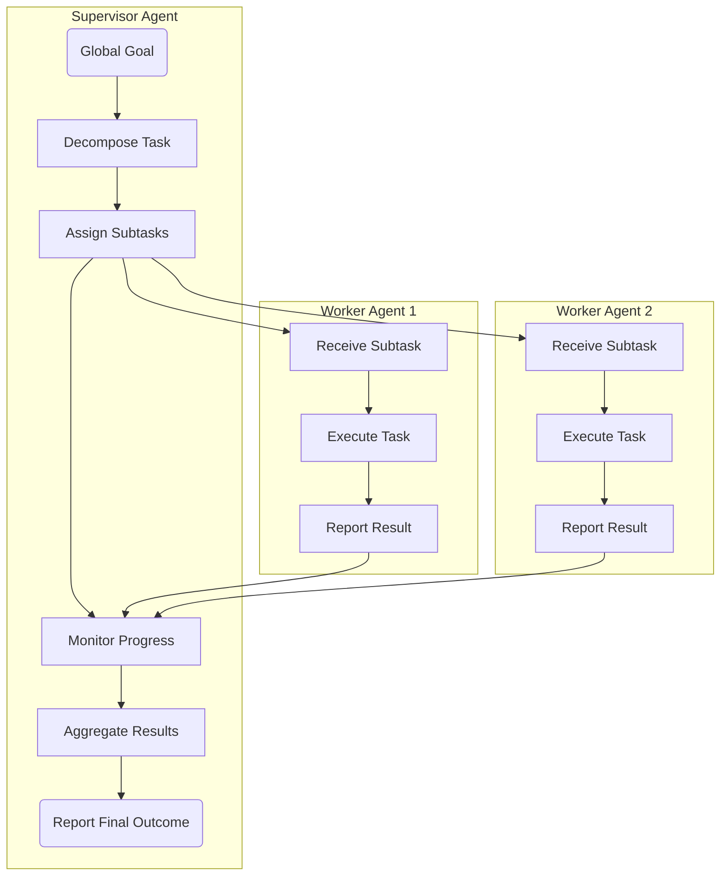

멀티 에이전트 시스템(Multi-Agent Systems, MAS)은 복잡한 문제를 해결하기 위해 여러 독립적인 에이전트들이 협력하는 분산 컴퓨팅 패러다임입니다. 2026년 현재, 인공지능 에이전트의 발전으로 단순 반복 작업을 넘어 복잡한 의사결정과 문제 해결에 MAS를 도입하는 사례가 증가하고 있습니다. 하지만 에이전트 간의 효율적인 태스크 위임(Task Delegation)과 조율(Coordination)은 시스템의 성능과 안정성을 좌우하는 핵심 과제입니다. 본 엔트리는 MAS의 복잡성을 관리하고 실용적인 협업을 가능하게 하는 디자인 패턴을 제시합니다.

## 멀티 에이전트 협업의 필요성 및 도전 과제

단일 에이전트는 특정 도메인이나 태스크에 최적화될 수 있지만, 현실 세계의 복잡한 문제는 다양한 지식과 도구를 요구합니다. 멀티 에이전트 시스템은 이러한 문제에 대해 분산된 전문성을 활용하여 더 유연하고 확장 가능한 해결책을 제공합니다. 예를 들어, 소프트웨어 개발 과정에서 코드 생성, 테스트, 문서화, 리팩토링 등 여러 전문 에이전트가 협력할 수 있습니다.

하지만 에이전트 협업에는 다음과 같은 도전 과제가 따릅니다:
*   **태스크 분해 및 할당**: 전체 목표를 개별 에이전트가 처리할 수 있는 작은 태스크로 분해하고, 이를 가장 적합한 에이전트에게 할당하는 과정이 복잡합니다.
*   **커뮤니케이션 오버헤드**: 에이전트 간의 잦은 상호작용은 시스템의 효율성을 저하시킬 수 있습니다.
*   **충돌 해결**: 리소스 경쟁, 상충되는 목표 등으로 인한 에이전트 간의 충돌을 감지하고 해결해야 합니다.
*   **조율 및 동기화**: 분산된 태스크의 진행 상황을 모니터링하고, 최종 목표 달성을 위해 결과를 통합하는 조율 메커니즘이 필수적입니다.
*   **실패 복구**: 특정 에이전트의 실패가 전체 시스템에 미치는 영향을 최소화하고 복구하는 전략이 중요합니다.

## 핵심 태스크 위임 및 조율 패턴

이러한 도전 과제를 해결하기 위해 몇 가지 핵심적인 디자인 패턴이 활용됩니다.

### 1. 계층적 위임 (Hierarchical Delegation) 패턴

이 패턴은 명확한 상위-하위 관계를 설정하여 태스크를 구조적으로 위임합니다. 상위 에이전트는 전체 목표를 관리하고 하위 태스크로 분해하여 하위 에이전트들에게 할당합니다. 하위 에이전트는 할당된 태스크를 수행하고 결과를 상위 에이전트에게 보고합니다.

*   **장점**: 명확한 책임 분리, 복잡한 태스크의 효율적인 분해, 시스템 가시성 향상.
*   **단점**: 중앙 집중형 구조로 인한 병목 현상 가능성, 상위 에이전트의 과부하, 단일 실패 지점(Single Point of Failure).

### 2. 블랙보드 (Blackboard) 패턴

블랙보드 패턴은 모든 에이전트가 접근할 수 있는 공유된 작업 공간인 '블랙보드'를 통해 간접적으로 협력합니다. 에이전트들은 블랙보드의 상태를 관찰하고, 자신의 전문성에 따라 관련 데이터를 추가하거나 수정합니다. 조율 에이전트(혹은 블랙보드 자체)는 전체적인 문제 해결 과정을 관리합니다.

*   **장점**: 느슨한 결합(Loose Coupling), 유연한 에이전트 추가/제거, 동시성 처리 용이.
*   **단점**: 블랙보드 관리의 복잡성, 데이터 일관성 유지 문제, 경쟁 조건 발생 가능성.

### 3. 경매/시장 기반 (Auction/Market-Based) 패턴

이 패턴은 태스크를 서비스로 간주하고, 에이전트들이 이 서비스에 대한 '입찰'을 통해 태스크를 할당받는 방식입니다. 태스크를 요청하는 에이전트(클라이언트)는 태스크를 공고하고, 수행 가능한 에이전트(서버)는 자신의 능력과 비용을 고려하여 입찰합니다. 클라이언트는 가장 적합한 입찰을 선택하여 태스크를 위임합니다.

*   **장점**: 동적 태스크 할당, 자율적인 리소스 최적화, 높은 유연성과 확장성.
*   **단점**: 입찰 및 계약 과정의 오버헤드, 악의적인 에이전트의 개입 가능성, 복잡한 메커니즘 설계 필요.

### 4. 상호 전파 (Gossip/Epidemic) 패턴

이 패턴은 에이전트들이 주기적으로 이웃 에이전트와 정보를 교환하며 시스템 전반에 정보가 전파되도록 합니다. 명시적인 중앙 조율 없이 분산된 방식으로 정보 일관성을 유지하거나 태스크를 확산시키는 데 사용됩니다.

*   **장점**: 높은 장애 허용성, 확장성, 중앙 집중형 병목 현상 없음.
*   **단점**: 정보 전파 지연, 정보 일관성 보장의 어려움, 특정 태스크에만 적합.

## 코드 예제: 계층적 태스크 위임 (Python)

다음은 간단한 계층적 위임 패턴을 구현한 Python 코드 예제입니다. `SupervisorAgent`가 `WorkerAgent`에게 서브태스크를 위임하고 결과를 취합합니다.

```python
import threading
import time
from queue import Queue

class WorkerAgent:
    def __init__(self, agent_id: str):
        self.id = agent_id
        self.task_queue = Queue()
        self.results = {}

    def _process_task(self, task: dict):
        print(f"[{self.id}] Processing task: {task['name']}...")
        time.sleep(task.get("duration", 1)) # Simulate work
        result = f"Result of {task['name']} by {self.id}: {task['data'].upper()}"
        print(f"[{self.id}] Completed task: {task['name']}")
        return result

    def start(self):
        def run():
            while True:
                task = self.task_queue.get()
                if task is None: # Sentinel for shutdown
                    break
                self.results[task["name"]] = self._process_task(task)
                self.task_queue.task_done()
        self.thread = threading.Thread(target=run)
        self.thread.start()

    def stop(self):
        self.task_queue.put(None)
        self.thread.join()

class SupervisorAgent:
    def __init__(self, num_workers: int):
        self.workers = [WorkerAgent(f"Worker-{i}") for i in range(num_workers)]
        for worker in self.workers:
            worker.start()
        self.worker_idx = 0

    def delegate_task(self, main_task: str, subtasks: list[dict]):
        print(f"[Supervisor] Delegating main task: {main_task}")
        delegated_tasks = []
        for subtask in subtasks:
            worker = self.workers[self.worker_idx]
            worker.task_queue.put(subtask)
            delegated_tasks.append((subtask["name"], worker.id))
            self.worker_idx = (self.worker_idx + 1) % len(self.workers)
            print(f"[Supervisor] Subtask '{subtask['name']}' delegated to {worker.id}")
        
        # Wait for all subtasks to complete
        for worker in self.workers:
            worker.task_queue.join()
        
        # Collect results
        final_results = {}
        for subtask_name, worker_id in delegated_tasks:
            for worker in self.workers:
                if worker.id == worker_id and subtask_name in worker.results:
                    final_results[subtask_name] = worker.results[subtask_name]
                    break
        
        print(f"[Supervisor] Main task '{main_task}' completed. All subtasks processed.")
        return final_results

    def shutdown(self):
        for worker in self.workers:
            worker.stop()
        print("[Supervisor] All workers shut down.")

if __name__ == "__main__":
    supervisor = SupervisorAgent(num_workers=2)

    # Define a complex task with subtasks
    complex_task_subtasks = [
        {"name": "DataProcessing", "data": "raw data part a", "duration": 2},
        {"name": "Analysis", "data": "intermediate result x", "duration": 1},
        {"name": "Reporting", "data": "analysis summary", "duration": 3},
        {"name": "Validation", "data": "report draft", "duration": 1}
    ]

    results = supervisor.delegate_task("EndToEndReportGeneration", complex_task_subtasks)
    print("\nFinal Aggregated Results:")
    for subtask, res in results.items():
        print(f"- {subtask}: {res}")
    
    supervisor.shutdown()
```

## Mermaid 다이어그램: 계층적 위임 및 조율 흐름



## 트레이드오프

멀티 에이전트 시스템에서 태스크 위임 및 조율 패턴을 디자인할 때는 다음 트레이드오프를 고려해야 합니다.

*   **중앙 집중식 vs. 분산식 제어**:
    *   **언제 좋은가 (Centralized)**: 시스템의 복잡도가 높고, 전체적인 최적화가 중요하며, 명확한 제어와 디버깅이 필요한 경우 (예: 계층적 위임).
    *   **언제 나쁜가 (Centralized)**: 시스템의 확장성이 중요하고, 단일 실패 지점을 피해야 하며, 에이전트의 자율성이 극대화되어야 하는 경우.
    *   **언제 좋은가 (Distributed)**: 높은 장애 허용성과 확장성이 요구되며, 에이전트 간 느슨한 결합이 필요한 경우 (예: 블랙보드, 경매 기반, 상호 전파).
    *   **언제 나쁜가 (Distributed)**: 시스템의 전역적인 상태 관리가 어렵고, 예측 불가능한 동작이 발생할 수 있으며, 디버깅이 복잡한 경우.

*   **결합도 (Coupling) vs. 유연성 (Flexibility)**:
    *   **언제 좋은가 (Tight Coupling)**: 에이전트 간의 특정 상호작용이 성능에 critical하고, 안정적인 협업 프로토콜이 필요한 경우. (예: 특정 라이브러리/프레임워크를 공유하는 에이전트)
    *   **언제 나쁜가 (Tight Coupling)**: 시스템 변경 시 파급 효과가 크고, 새로운 에이전트 추가나 기존 에이전트 수정이 빈번한 경우.
    *   **언제 좋은가 (Loose Coupling)**: 에이전트의 독립적인 개발 및 배포가 중요하며, 시스템의 진화가 예측 불가능할 때 (예: 블랙보드 패턴).
    *   **언제 나쁜가 (Loose Coupling)**: 에이전트 간의 조율이 비효율적이거나 데이터 일관성 보장이 어려울 수 있는 경우.

*   **오버헤드 (Overhead) vs. 최적화 (Optimization)**:
    *   **언제 좋은가 (High Overhead, High Optimization)**: 태스크 할당 및 조율 과정에서 많은 계산이나 통신이 필요하더라도, 전역적인 리소스 활용 효율성을 극대화해야 하는 경우 (예: 정교한 경매 기반 시스템).
    *   **언제 나쁜가 (High Overhead, High Optimization)**: 실시간 응답이 중요하고, 각 에이전트가 처리하는 태스크의 가치가 상대적으로 낮아 오버헤드가 이득을 상회하는 경우.
    *   **언제 좋은가 (Low Overhead, Suboptimal)**: 빠른 처리 속도와 간단한 구현이 우선이며, 약간의 비효율성을 감수할 수 있는 경우 (예: 라운드 로빈(Round Robin) 태스크 할당).
    *   **언제 나쁜가 (Low Overhead, Suboptimal)**: 시스템의 리소스가 제한적이거나, 각 태스크의 비용이 매우 커서 최적화된 할당이 필수적인 경우.

## 실전 체크리스트

멀티 에이전트 시스템에서 태스크 위임 및 조율 패턴을 성공적으로 적용하기 위한 실전 체크리스트입니다.

- [ ] **에이전트 역할 및 책임 명확화**: 각 에이전트의 전문 분야와 책임 범위를 명확히 정의하고 문서화했는가? (예: `Supervisor`는 계획 및 조율, `Worker`는 실행)
- [ ] **커뮤니케이션 프로토콜 설계**: 에이전트 간 데이터 교환 형식, 메시징 방식(동기/비동기), 오류 처리 메커니즘을 표준화했는가? (예: JSON 기반 메시지, RabbitMQ)
- [ ] **태스크 분해 전략 수립**: 복잡한 최상위 목표를 에이전트가 처리 가능한 작은 서브태스크로 자동 또는 반자동으로 분해하는 전략을 정의했는가?
- [ ] **조율 메커니즘 선택 및 구현**: 시스템의 요구사항(확장성, 일관성, 성능)에 따라 적절한 조율 패턴(계층적, 블랙보드, 경매 등)을 선택하고 구현했는가?
- [ ] **모니터링 및 로깅 시스템 구축**: 각 에이전트의 상태, 태스크 진행 상황, 커뮤니케이션 로그를 실시간으로 모니터링하고 기록하여 문제 발생 시 진단할 수 있는가?
- [ ] **실패 복구 및 재시도 전략**: 에이전트 또는 태스크 실패 시 자동으로 복구하거나 재시도하는 메커니즘(예: 데드레터 큐, 재시도 로직)을 구현했는가?
- [ ] **보안 및 접근 제어**: 에이전트 간 통신 및 공유 리소스에 대한 접근 제어(Authentication & Authorization)를 설정하여 무단 접근이나 조작을 방지하는가?