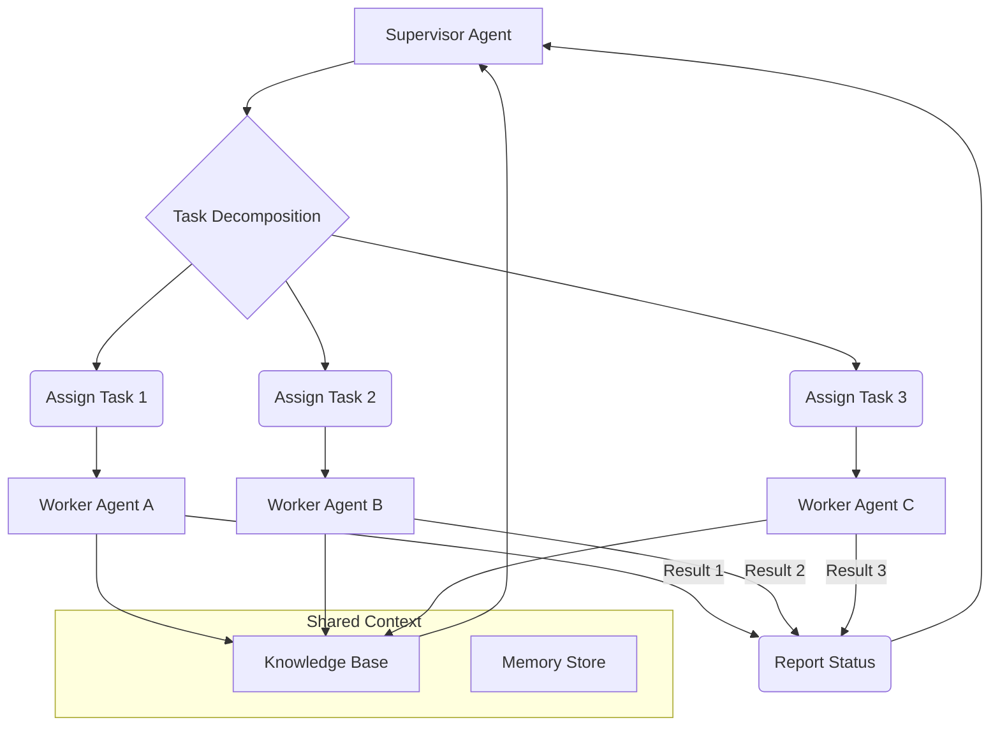

복잡한 실세계 문제 해결에 단일 AI 에이전트는 본질적인 한계를 가집니다. 문제의 규모, 필요한 전문 지식의 다양성, 동적인 환경 변화에 대응하기 위해서는 여러 AI 에이전트가 유기적으로 상호작용하며 태스크를 분배하고 협업하는 시스템이 필수적입니다. 이러한 다중 에이전트 시스템(Multi-Agent System, MAS)은 AI 시스템의 확장성과 강건성(robustness)을 결정짓는 핵심 요소입니다.

## 다중 에이전트 협업의 핵심 개념

효율적인 다중 에이전트 협업 시스템을 설계하기 위해서는 다음과 같은 핵심 개념들을 고려해야 합니다.

### 태스크 분해 (Task Decomposition)
복잡한 메인 태스크를 에이전트들이 처리할 수 있는 작고 관리 가능한 서브 태스크로 분해하는 과정입니다. 효과적인 분해는 에이전트 간의 의존성을 최소화하고 병렬 처리를 가능하게 합니다. 2026년에는 LLM 기반의 자율 에이전트가 동적으로 태스크 그래프를 생성하고 최적화하는 방식이 보편화되고 있습니다.

### 역할 할당 (Role Assignment)
분해된 서브 태스크에 가장 적합한 전문성을 가진 에이전트를 할당하는 과정입니다. 에이전트들은 특정 도메인 지식, 툴 사용 능력, 또는 특정 유형의 추론 능력 등 고유한 역할을 가질 수 있습니다. 동적 역할 할당(Dynamic Role Assignment)은 런타임에 에이전트의 가용성과 성능을 기반으로 최적의 할당을 수행하여 시스템 효율성을 극대화합니다.

### 통신 프로토콜 (Communication Protocols)
에이전트들이 정보를 교환하고 상태를 동기화하는 규칙과 형식입니다. 명확하고 효율적인 통신은 오해를 줄이고 협업을 원활하게 합니다. 비동기 메시지 큐(asynchronous message queues), 공유 메모리(shared memory), 또는 퍼블리시/서브스크라이브(publish/subscribe) 패턴 등이 사용됩니다.

### 조정 메커니즘 (Coordination Mechanisms)
에이전트들이 공유 목표를 향해 행동을 조율하고 충돌을 해결하는 방법입니다. 분산된 의사결정을 통해 전체 시스템의 최적화를 목표로 합니다. 여기에는 경매(auction) 메커니즘, 협상(negotiation), 또는 중앙 집중식 스케줄러(centralized scheduler) 등이 포함될 수 있습니다.

### 공유 상태 및 지식 베이스 (Shared State & Knowledge Base)
모든 에이전트가 접근하고 업데이트할 수 있는 공통된 정보 저장소입니다. 이는 에이전트 간의 암묵적인 협업을 가능하게 하고, 중복 작업을 방지하며, 시스템의 일관성을 유지하는 데 중요합니다. 2026년에는 RAG(Retrieval Augmented Generation) 패턴과 결합된 벡터 데이터베이스 기반의 공유 지식 그래프(Knowledge Graph)가 보편화되고 있습니다.

## 시스템 디자인 패턴

### 1. 계층적 오케스트레이션 (Hierarchical Orchestration)
중앙 Supervisor 에이전트가 전체 태스크를 관리하고 하위 Worker 에이전트들에게 서브 태스크를 분배하는 방식입니다. Supervisor는 태스크 분해, 역할 할당, 진행 상황 모니터링, 충돌 해결 등을 담당합니다. 단순한 구조와 명확한 제어 흐름이 장점이지만, Supervisor에 병목 현상이 발생할 수 있습니다.



### 2. 분산형/군집 지능 (Decentralized/Swarm Intelligence)
에이전트들이 중앙 제어 없이 직접 상호작용하며 협업하는 방식입니다. 각 에이전트는 로컬 정보를 기반으로 의사결정을 내리고, 단순한 규칙에 따라 행동하여 전체 시스템 차원의 복잡한 문제를 해결합니다. 단일 장애점(single point of failure)이 없고 확장성이 뛰어나지만, 전역적인 최적화를 보장하기 어렵고 예측 불가능한 행동이 나타날 수 있습니다.

### 3. 시장 기반 시스템 (Market-Based Systems)
태스크와 에이전트 간에 자율적인 경제 시스템을 도입하여 자원 할당 및 태스크 분배를 수행합니다. 에이전트들은 태스크를 수행하기 위해 입찰(bid)하거나, 다른 에이전트에게 서브 태스크를 위임하기 위해 대가를 지불합니다. 유연하고 자율적인 자원 관리가 가능하며 동적인 환경에 잘 적응하지만, 설계 및 구현이 복잡하고 초기 셋업 비용이 높습니다.

## 2026년 트렌드 반영

최신 다중 에이전트 시스템은 단순히 태스크를 분배하는 것을 넘어, 다음과 같은 고도화된 접근 방식을 통합하고 있습니다.

*   **적응형 태스크 그래프 (Adaptive Task Graphs)**: 에이전트의 실행 결과와 환경 변화에 따라 동적으로 태스크 분해 및 재할당 로직을 조정합니다.
*   **동적 역할 재정의 (Dynamic Role Redefinition)**: 에이전트가 학습을 통해 새로운 역할을 습득하거나 기존 역할을 변경하여 시스템의 전반적인 유연성을 높입니다.
*   **신뢰 및 평판 시스템 (Trust and Reputation Systems)**: 에이전트의 과거 수행 이력을 바탕으로 신뢰도를 부여하고, 이를 태스크 할당 및 협업 의사결정에 활용하여 시스템의 강건성을 강화합니다.
*   **보안 및 검증 (Security and Validation)**: 에이전트 간 통신 및 데이터 교환에서 발생할 수 있는 보안 취약점을 최소화하고, 에이전트의 행동을 실시간으로 모니터링하여 예측 불가능하거나 유해한 결과를 방지하는 메커니즘이 중요해지고 있습니다.
*   **Human-in-the-Loop (HITL) Integration**: 복잡하거나 중요한 의사결정 단계에서 인간의 개입을 허용하여 에이전트 시스템의 신뢰성과 제어 가능성을 높입니다.

## 코드 예제: 간단한 Supervisor-Worker 패턴 (Python)

이 예제는 간단한 메시지 큐를 사용하여 Supervisor와 Worker 에이전트 간의 태스크 분배 및 결과 수집을 시뮬레이션합니다. 실제 시스템에서는 RabbitMQ, Kafka 또는 Redis 같은 메시지 브로커를 사용합니다.

```python
import queue
import threading
import time

class Task:
    def __init__(self, task_id: str, description: str):
        self.task_id = task_id
        self.description = description
        self.result = None

class WorkerAgent(threading.Thread):
    def __init__(self, agent_id: str, task_queue: queue.Queue, result_queue: queue.Queue):
        super().__init__()
        self.agent_id = agent_id
        self.task_queue = task_queue
        self.result_queue = result_queue
        self.running = True

    def run(self):
        while self.running:
            try:
                task = self.task_queue.get(timeout=1) # 1초 타임아웃
                print(f"Worker {self.agent_id} processing task {task.task_id}: {task.description}")
                # Simulate work
                time.sleep(2) 
                task.result = f"Completed by {self.agent_id} with data for '{task.description}'"
                self.result_queue.put(task)
                self.task_queue.task_done()
            except queue.Empty:
                continue

    def stop(self):
        self.running = False

class SupervisorAgent:
    def __init__(self, num_workers: int):
        self.task_queue = queue.Queue()
        self.result_queue = queue.Queue()
        self.workers = []
        for i in range(num_workers):
            worker = WorkerAgent(f"W{i+1}", self.task_queue, self.result_queue)
            self.workers.append(worker)

    def start_workers(self):
        for worker in self.workers:
            worker.start()

    def distribute_task(self, task: Task):
        print(f"Supervisor distributing task {task.task_id}")
        self.task_queue.put(task)

    def collect_results(self, expected_tasks: int):
        results = []
        for _ in range(expected_tasks):
            result_task = self.result_queue.get()
            results.append(result_task)
            print(f"Supervisor collected result for task {result_task.task_id}: {result_task.result}")
        return results

    def shutdown_workers(self):
        for worker in self.workers:
            worker.stop()
        for worker in self.workers:
            worker.join()
        print("All workers shut down.")

# --- 시스템 실행 --- #
if __name__ == "__main__":
    supervisor = SupervisorAgent(num_workers=3)
    supervisor.start_workers()

    tasks_to_process = [
        Task("T1", "데이터 분석 보고서 생성"),
        Task("T2", "이미지 전처리"),
        Task("T3", "텍스트 요약"),
        Task("T4", "코드 리뷰 제안"),
        Task("T5", "새로운 아이디어 발상")
    ]

    for task in tasks_to_process:
        supervisor.distribute_task(task)

    # Wait for all tasks to be processed
    supervisor.task_queue.join() 

    final_results = supervisor.collect_results(len(tasks_to_process))
    print("\n--- Final Results ---")
    for res in final_results:
        print(f"Task {res.task_id}: {res.result}")

    supervisor.shutdown_workers()

```

## 트레이드오프

### 1. 중앙 집중식 vs 분산식 오케스트레이션
*   **중앙 집중식 (Centralized Orchestration)**:
    *   **언제 좋은가 (When Good)**: 초기 개발이 용이하고, 전역적인 최적화 및 제어가 필요한 경우, 시스템 규모가 작거나 중간일 때 적합합니다. Supervisor가 명확한 단일 책임(Single Responsibility)을 가질 때 효율적입니다.
    *   **언제 나쁜가 (When Bad)**: Supervisor가 병목 현상(bottleneck)을 일으키거나, 단일 장애점(single point of failure)이 될 수 있습니다. 높은 확장성과 강건성이 요구되는 대규모 분산 시스템에는 부적합합니다.
*   **분산식 (Decentralized Orchestration)**:
    *   **언제 좋은가 (When Good)**: 높은 확장성(scalability)과 강건성(robustness)이 요구되는 대규모 시스템, 동적이고 예측 불가능한 환경에 적합합니다. 단일 장애점이 없어 시스템 다운타임(downtime)이 줄어듭니다.
    *   **언제 나쁜가 (When Bad)**: 초기 설계 및 구현이 복잡하며, 전역적인 시스템 상태를 파악하기 어렵고, 에이전트 간의 충돌 해결 및 전역 최적화가 어려울 수 있습니다.

### 2. 세분화된 태스크 분해 vs 거친 태스크 분해
*   **세분화된 태스크 분해 (Fine-grained Task Decomposition)**:
    *   **언제 좋은가 (When Good)**: 병렬성을 극대화하고, 에이전트 간의 작업 분담을 명확히 할 수 있습니다. 특정 에이전트의 장애가 전체 시스템에 미치는 영향을 최소화할 수 있습니다.
    *   **언제 나쁜가 (When Bad)**: 태스크 관리 오버헤드(overhead)와 에이전트 간 통신 비용이 증가할 수 있습니다. 너무 세분화되면 협업의 의미가 퇴색되고 오히려 비효율적일 수 있습니다.
*   **거친 태스크 분해 (Coarse-grained Task Decomposition)**:
    *   **언제 좋은가 (When Good)**: 태스크 관리 오버헤드와 통신 비용을 줄일 수 있습니다. 태스크 간의 의존성이 높은 경우에 유리합니다.
    *   **언제 나쁜가 (When Bad)**: 병렬성 활용이 제한되고, 에이전트의 전문성을 충분히 활용하기 어려울 수 있습니다. 태스크가 너무 크면 단일 에이전트가 처리하기 어려워질 수 있습니다.

### 3. 동기식 vs 비동기식 통신
*   **동기식 통신 (Synchronous Communication)**:
    *   **언제 좋은가 (When Good)**: 태스크의 순차적 실행이 중요하거나, 즉각적인 응답이 필요한 경우에 적합합니다. 구현이 비교적 간단하고 디버깅이 용이합니다.
    *   **언제 나쁜가 (When Bad)**: 한 에이전트가 블로킹(blocking)되면 전체 시스템의 지연을 초래할 수 있습니다. 확장성이 제한적입니다.
*   **비동기식 통신 (Asynchronous Communication)**:
    *   **언제 좋은가 (When Good)**: 높은 처리량(throughput)과 확장성이 필요한 시스템에 적합합니다. 에이전트들이 독립적으로 작업을 수행하여 병목 현상을 줄일 수 있습니다.
    *   **언제 나쁜가 (When Bad)**: 시스템의 상태 추적이 복잡해지고, 디버깅이 어려울 수 있습니다. 순서 보장(order guarantee)이 필요한 경우 추가적인 메커니즘이 필요합니다.

## 실전 체크리스트

다중 AI 에이전트 협업 시스템을 실제 프로젝트에 적용할 때 다음 항목들을 검증하십시오.

- [ ] **태스크 분해 완전성 (Task Decomposition Completeness)**: 복잡한 메인 태스크가 모든 서브 태스크로 논리적으로 빠짐없이 분해되었는가? (미분해된 에지 케이스 유무 확인)
- [ ] **에이전트 역할 명확성 (Agent Role Clarity)**: 각 에이전트의 역할과 책임이 명확하게 정의되어 있고, 불필요한 중복이나 책임 불분명이 없는가?
- [ ] **통신 프로토콜 효율성 (Communication Protocol Efficiency)**: 에이전트 간의 메시지 교환 오버헤드(overhead)가 최소화되어 있으며, 필요한 정보가 적시에 전달되는가? (평균 메시지 대기 시간 측정)
- [ ] **충돌 해결 메커니즘 동작 (Conflict Resolution Mechanism Operationality)**: 에이전트 간에 발생할 수 있는 자원 경합 또는 행동 충돌 시 이를 감지하고 해결하는 메커니즘이 효과적으로 작동하는가? (충돌 발생 시 해결 성공률 90% 이상)
- [ ] **확장성 및 성능 부하 테스트 (Scalability & Performance Load Test)**: 에이전트 수가 증가하거나 태스크 부하가 높을 때 시스템이 안정적으로 성능을 유지하는가? (처리량 50% 증가 시 응답 시간 20% 이내 증가 목표)
- [ ] **보안 및 접근 제어 (Security & Access Control)**: 에이전트 간 통신 채널이 암호화되어 있고, 각 에이전트의 공유 자원 접근 권한이 최소한의 원칙(least privilege)에 따라 관리되는가?
- [ ] **실시간 모니터링 및 로깅 (Real-time Monitoring & Logging)**: 각 에이전트의 상태, 태스크 진행 상황, 통신 로그 및 오류를 실시간으로 모니터링하고 분석할 수 있는 시스템이 구축되어 있는가? (주요 지표 대시보드 구축 및 알림 설정)