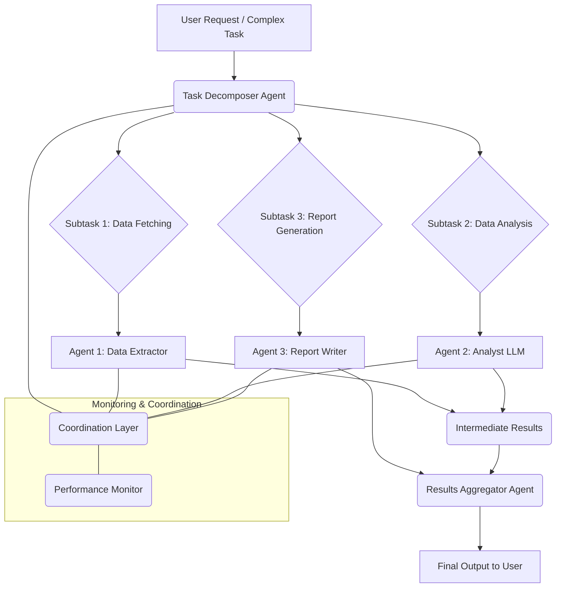

멀티 에이전트 시스템 (Multi-Agent Systems, MAS)은 복잡하고 동적인 문제를 해결하기 위한 강력한 패러다임입니다. 여러 개의 자율적인 에이전트들이 협력하여 전체 시스템의 목표를 달성하는 방식은 기존의 중앙 집중식 시스템으로는 처리하기 어려운 규모와 복잡성을 가진 태스크에 특히 유용합니다. 그러나 이러한 시스템의 효율성을 극대화하기 위해서는 태스크를 효과적으로 분배하고 에이전트 간의 협업을 최적화하는 전략이 필수적입니다.

## 핵심 개념 및 중요성

멀티 에이전트 시스템에서 태스크 분배와 협업은 단순히 작업을 나누는 것을 넘어, 각 에이전트의 강점과 현재 상태를 고려하여 최적의 성능을 이끌어내는 것을 의미합니다. 이는 다음과 같은 핵심 개념들을 포함합니다:

### 1. 태스크 분해 (Task Decomposition)
복잡한 메인 태스크를 에이전트가 처리할 수 있는 작고 관리 가능한 서브 태스크 (sub-tasks)로 분해하는 과정입니다. 이는 계층적으로 이루어질 수 있으며, 한 에이전트가 받은 서브 태스크를 다시 더 작은 단위로 분해하여 다른 에이전트에게 위임할 수도 있습니다.

### 2. 자원 할당 (Resource Allocation)
분해된 서브 태스크를 가장 적절한 에이전트에게 할당하는 과정입니다. 에이전트의 능력 (capabilities), 현재 작업 부하 (current workload), 가용한 자원 (available resources) 등을 종합적으로 고려하여 결정됩니다. 이는 정적일 수도, 실시간으로 동적으로 변화할 수도 있습니다.

### 3. 조정 메커니즘 (Coordination Mechanisms)
에이전트들이 상호작용하고, 정보를 공유하며, 목표를 조율하고, 잠재적 충돌을 해결하는 데 사용하는 프로토콜 및 전략입니다. 효과적인 조정은 시스템 전체의 응집력과 효율성을 보장합니다.

## 태스크 분배 전략

### 중앙 집중식 오케스트레이터 (Centralized Orchestrator)
하나의 전담 오케스트레이터 에이전트가 모든 태스크를 분해하고 에이전트들에게 할당합니다. 구현이 비교적 간단하고 전체 시스템에 대한 전역적 최적화가 가능합니다.

### 분산형/시장 기반 접근 (Decentralized/Market-Based Approaches)
에이전트들이 태스크를 놓고 경쟁하거나 협상하는 방식입니다. 대표적인 예는 컨트랙트 넷 프로토콜 (Contract Net Protocol)로, 매니저 에이전트가 태스크를 알리면 워커 에이전트들이 입찰 (bid)하고, 매니저는 가장 적합한 워커를 선택합니다. 이 방식은 시스템의 견고성과 확장성을 높입니다.

### 스웜 인텔리전스 (Swarm Intelligence)
명시적인 중앙 제어 없이, 에이전트들이 간단한 지역적 규칙 (local rules)에 따라 상호작용하면서 복잡한 전역적 행동 (global behavior)을 나타내는 방식입니다. 특정 문제 (예: 최적화, 탐색)에 효과적입니다.

## 에이전트 협업 패턴

### 공유 지식 기반 (Shared Knowledge Base)
에이전트들이 공통의 지식 저장소 (예: Vector DB, Graph DB)에 정보를 업데이트하고 검색하여 협업합니다. 이는 컨텍스트 일관성 (context consistency)과 효율적인 정보 공유를 가능하게 합니다.

### 메시지 전달 (Message Passing)
에이전트들이 직접적으로 메시지를 주고받으며 협상, 태스크 업데이트, 결과 공유 등을 수행합니다. FIPA ACL (Foundation for Intelligent Physical Agents Agent Communication Language)과 같은 표준화된 통신 언어가 사용되기도 합니다.

### 합의 메커니즘 (Consensus Mechanisms)
에이전트들이 특정 의사결정이나 시스템 상태에 대해 합의를 도출하는 방법입니다. 분산 합의 알고리즘 (Distributed Consensus Algorithms)이 이에 해당하며, 시스템의 안정성과 신뢰성을 확보하는 데 기여합니다.

## 2026년 최신 트렌드: LLM 기반 에이전트의 부상

2026년에는 대규모 언어 모델 (LLM)을 활용한 에이전트들이 태스크 분배 및 협업의 복잡성을 한 차원 높이고 있습니다. LLM은 에이전트에게 고급 추론, 동적 플래닝, 자연어 기반 의사소통 능력을 부여하여 다음과 같은 트렌드를 주도합니다:

*   **동적 리플래닝 (Dynamic Re-planning)**: LLM 에이전트는 실시간으로 환경 변화, 예기치 않은 오류, 새로운 정보에 따라 기존의 플랜을 수정하고 새로운 액션 시퀀스를 생성할 수 있습니다. 이는 시스템의 적응력을 극대화합니다.
*   **셀프-힐링 시스템 (Self-Healing Systems)**: 에이전트들이 LLM의 추론 능력을 활용하여 시스템 내의 오류나 실패를 스스로 감지하고 진단하며, 복구 전략을 수립하여 실행합니다. 이를 통해 시스템의 가용성과 견고성이 크게 향상됩니다.
*   **인간-에이전트 협업 강화 (Enhanced Human-Agent Teaming)**: LLM은 에이전트가 인간의 의도를 더 잘 이해하고, 자연어로 복잡한 설명을 제공하며, 인간의 피드백을 즉시 반영하여 협업의 효율성을 높입니다.

## 예제 코드: 간단한 태스크 분배 시뮬레이션

다음 Python 코드는 에이전트의 스킬과 캐패시티를 기반으로 태스크를 중앙 집중식으로 분배하는 간단한 시뮬레이션입니다.

```python
class Task:
    def __init__(self, task_id, complexity, required_skills):
        self.task_id = task_id
        self.complexity = complexity
        self.required_skills = required_skills # set of skills
        self.assigned_to = None

class Agent:
    def __init__(self, agent_id, skills, capacity):
        self.agent_id = agent_id
        self.skills = skills # set of skills
        self.capacity = capacity
        self.current_load = 0

    def can_perform(self, task):
        # 에이전트가 필요한 모든 스킬을 가지고 있고, 캐패시티가 충분한지 확인
        return all(skill in self.skills for skill in task.required_skills) and \
               (self.current_load + task.complexity) <= self.capacity

    def assign_task(self, task):
        if self.can_perform(task):
            task.assigned_to = self.agent_id
            self.current_load += task.complexity
            print(f"Agent {self.agent_id} assigned Task {task.task_id} (Load: {self.current_load}/{self.capacity})")
            return True
        return False

# 예제 태스크와 에이전트 정의
tasks = [
    Task("T1", 5, {"coding", "testing"}),
    Task("T2", 3, {"documentation"}),
    Task("T3", 7, {"coding", "deploy"}),
    Task("T4", 4, {"testing"})
]

agents = [
    Agent("A1", {"coding", "testing", "deploy"}, 10),
    Agent("A2", {"documentation", "testing"}, 8),
    Agent("A3", {"coding", "testing"}, 6)
]

print("\n--- Centralized Task Assignment ---")
for task in tasks:
    assigned = False
    for agent in agents:
        if agent.assign_task(task):
            assigned = True
            break # 첫 번째 가능한 에이전트에 할당
    if not assigned:
        print(f"Task {task.task_id} could not be assigned due to skill or capacity mismatch.")

print("\n--- Final Agent Loads ---")
for agent in agents:
    print(f"Agent {agent.agent_id}: Current Load = {agent.current_load}/{agent.capacity}")
```

## 멀티 에이전트 태스크 오케스트레이션 워크플로우



## 트레이드오프

멀티 에이전트 시스템에서 태스크 분배와 협업 전략을 선택할 때는 여러 트레이드오프를 고려해야 합니다.

*   **중앙 집중식 vs. 분산형 제어**: 
    *   **중앙 집중식**: 구현이 간단하고 전역적 최적화가 용이합니다. 그러나 단일 실패 지점 (Single Point of Failure)이 되며 확장성 (Scalability)에 제약이 있습니다. 작은 규모의 고정된 태스크에 유리하며, 시스템 제어 및 예측 가능성이 중요할 때 좋습니다.
    *   **분산형**: 시스템의 견고성 (Robustness)과 확장성이 높고, 에이전트들이 자율적으로 적응할 수 있습니다. 하지만 조정 메커니즘이 복잡하고, 전역적 최적화가 어려울 수 있으며, 시스템의 행동을 예측하기 어렵습니다. 대규모의 동적인 환경, 높은 가용성과 적응력이 요구될 때 적합합니다.

*   **통신 오버헤드 vs. 정보 풍부성**: 
    *   **낮은 통신 오버헤드**: 에이전트 간 메시지 교환을 최소화하여 네트워크 부하와 지연 시간을 줄입니다. 그러나 에이전트들이 최신 정보 없이 불완전한 의사결정을 내릴 수 있습니다. 실시간성이 중요하고 에이전트 간 상호 의존성이 낮은 태스크에 적합합니다.
    *   **높은 정보 풍부성**: 에이전트들이 더 많은 정보를 공유하여 더 정확하고 협력적인 의사결정을 내릴 수 있습니다. 하지만 통신 비용과 복잡성이 증가하며, 대규모 시스템에서는 메시지 폭풍 (message storm)이 발생할 수 있습니다. 복잡한 추론과 고도의 협업이 필요한 태스크에 유리합니다.

*   **에이전트 자율성 수준**: 
    *   **높은 자율성**: 에이전트들이 스스로 학습하고 적응하며, 예상치 못한 상황에 대응할 수 있는 능력이 뛰어납니다. 그러나 시스템 제어가 어려워질 수 있고, 에이전트 간 목표 불일치 (goal divergence)나 예상치 못한 부작용 (side effects)이 발생할 위험이 있습니다. 개방적이고 변화무쌍한 환경에서 혁신적인 문제 해결이 필요할 때 고려됩니다.
    *   **낮은 자율성**: 에이전트의 행동이 예측 가능하고 제어하기 쉽습니다. 디버깅과 검증이 용이하지만, 새로운 상황에 대한 적응력이 떨어지고 문제 해결 능력이 제한적입니다. 안정성과 예측 가능성이 최우선이며, 잘 정의된 반복적인 태스크에 적합합니다.

## 실전 체크리스트

멀티 에이전트 시스템을 프로젝트에 적용할 때 다음 체크리스트를 활용하여 구현의 견고성과 효율성을 검증하세요:

*   [ ] **태스크 분해 명확성**: 복잡한 메인 태스크가 에이전트가 처리 가능한 독립적인 서브 태스크로 명확하게 분해되었는가? (예: 각 서브 태스크가 명확한 입력과 출력을 가지는가?)
*   [ ] **통신 프로토콜 정의**: 에이전트 간의 통신 프로토콜 (예: 메시지 형식, 전달 메커니즘, 핸드셰이크)이 명확히 정의되고 구현되었는가? (예: FIPA ACL 또는 사용자 정의 JSON 스키마를 사용하는가?)
*   [ ] **동적 자원 할당 구현**: 에이전트의 실시간 작업 부하 및 가용 능력에 따라 태스크가 동적으로 재할당될 수 있는 메커니즘이 구현되었는가? (예: 작업 큐, 입찰 시스템이 작동하는가?)
*   [ ] **에이전트 성능 모니터링**: 각 에이전트의 성능, 작업 완료율, 오류 발생률을 실시간으로 모니터링하고 시각화하는 대시보드가 있는가?
*   [ ] **장애 허용 및 자가 복구**: 에이전트 하나 또는 일부가 실패했을 때 시스템 전체가 계속 작동하고, 실패한 에이전트가 자동으로 복구되거나 대체될 수 있는가?
*   [ ] **충돌 해결 메커니즘**: 에이전트 간의 자원 경합 또는 목표 충돌 시 이를 감지하고 해결하기 위한 명확한 정책이나 알고리즘이 존재하는가?
*   [ ] **전역 목표 정렬**: 개별 에이전트의 로컬 목표가 시스템 전체의 최종 목표와 일치하도록 유도하는 메커니즘 (예: 보상 함수, 감독 에이전트)이 설계되고 검증되었는가?