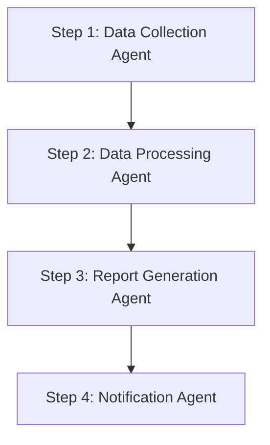
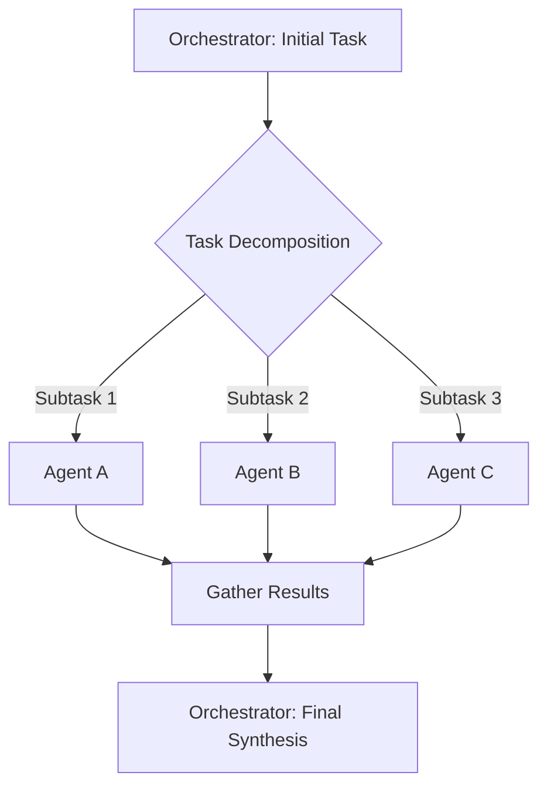

현대 비즈니스 환경에서 복잡한 프로세스는 수동 작업, 정보 사일로, 비효율적인 의사결정으로 인해 생산성 저하와 오류 발생 가능성을 높입니다. 이러한 과제를 해결하기 위해 멀티 에이전트 워크플로우(Multi-Agent Workflow)는 개별적으로 지능을 가진 에이전트들이 협력하여 전체 프로세스를 자동화하고 최적화하는 강력한 접근 방식입니다.

## 멀티 에이전트 워크플로우의 핵심 개념
멀티 에이전트 시스템(Multi-Agent System, MAS)은 특정 목표를 달성하기 위해 서로 상호작용하는 여러 지능형 에이전트로 구성됩니다. 비즈니스 자동화 맥락에서 이 패턴은 다음과 같은 주요 구성 요소를 포함합니다.

### 1. 에이전트(Agent)
각 에이전트는 특정 역할(Role)과 책임(Responsibility)을 가지며, 제한된 범위 내에서 의사결정을 내리고 행동을 수행합니다. 예를 들어, '데이터 수집 에이전트', '보고서 생성 에이전트', '승인 에이전트' 등이 있습니다. 각 에이전트는 도구(Tool)를 사용하여 외부 시스템과 상호작용할 수 있습니다.

### 2. 오케스트레이터(Orchestrator)
오케스트레이터는 전체 워크플로우의 흐름을 관리하고, 작업을 분해하며, 적절한 에이전트에게 할당하고, 그들의 결과를 통합합니다. 중앙 집중식 제어를 통해 에이전트 간의 협업(Collaboration)과 조정(Coordination)을 용이하게 합니다.

### 3. 통신 메커니즘(Communication Mechanism)
에이전트 간 또는 에이전트와 오케스트레이터 간에 정보를 교환하는 방법입니다. 명시적인 메시징(Messaging) 시스템부터 공유 메모리(Shared Memory) 또는 데이터베이스(Database)를 통한 간접 통신까지 다양합니다.

### 4. 환경(Environment)
에이전트들이 활동하고 상호작용하는 외부 시스템 및 데이터 소스입니다. 이는 API, 데이터베이스, 파일 시스템, 사용자 인터페이스 등을 포함할 수 있습니다.

## 일반적인 멀티 에이전트 워크플로우 디자인 패턴

### 1. 순차적 워크플로우 (Sequential Workflow)
가장 기본적인 패턴으로, 한 에이전트의 출력이 다음 에이전트의 입력이 되는 선형적인 흐름입니다. 각 에이전트는 특정 단일 작업을 완수합니다.



### 2. 계층적 워크플로우 (Hierarchical Workflow)
하나의 슈퍼바이저(Supervisor) 에이전트가 상위 수준의 목표를 관리하고, 이를 하위 워커(Worker) 에이전트들에게 분배하는 방식입니다. 워커 에이전트들은 각자의 전문 분야에서 작업을 수행하고, 결과를 슈퍼바이저에게 보고합니다. 이는 복잡한 문제를 효율적으로 분해하고 관리하는 데 유용합니다.

### 3. 병렬 및 팬아웃/팬인 워크플로우 (Parallel and Fan-out/Fan-in Workflow)
특정 단계에서 여러 작업을 동시에 처리할 수 있을 때 사용됩니다. 오케스트레이터는 작업을 여러 에이전트에게 병렬로 분배(Fan-out)하고, 모든 에이전트의 작업이 완료되면 그 결과들을 다시 통합(Fan-in)합니다.



### 4. 조정 및 협력 워크플로우 (Coordination and Collaboration Workflow)
에이전트들이 동적으로 서로 소통하고 협력하여 공동의 목표를 달성하는 패턴입니다. 이는 명확한 선형 구조보다는 유연한 상호작용이 필요한 상황에 적합합니다. 예를 들어, 고객 서비스 챗봇에서 여러 에이전트(FAQ 에이전트, 주문 조회 에이전트, 기술 지원 에이전트)가 상황에 따라 대화를 주고받는 경우입니다.

## 멀티 에이전트 워크플로우 구현 고려사항

### 1. 상태 관리 (State Management)
각 에이전트가 작업을 수행하면서 생성하거나 변경하는 정보를 어떻게 공유하고 관리할 것인가가 중요합니다. 장기 실행 워크플로우의 경우, 에이전트의 메모리(Memory)나 공유 컨텍스트(Shared Context)의 일관성을 유지하는 것이 중요합니다.

### 2. 도구 사용 (Tool Use)
에이전트가 외부 시스템(데이터베이스, API, 레거시 시스템 등)과 상호작용하기 위한 도구 인터페이스를 잘 설계해야 합니다. 이는 에이전트의 유용성을 극대화하는 핵심 요소입니다.

### 3. 오류 처리 및 복구 (Error Handling and Recovery)
어떤 에이전트가 실패했을 때 전체 워크플로우가 중단되지 않고, 오류를 감지하고 복구하거나 인간 개입을 요청하는 메커니즘이 필수적입니다.

### 4. 모니터링 및 로깅 (Monitoring and Logging)
워크플로우의 각 단계와 에이전트의 행동을 투명하게 추적하고 기록하여 디버깅, 성능 분석 및 감사(Audit)에 활용할 수 있어야 합니다. 2026년 트렌드에서는 `spanlens-trace-monitoring`과 같은 기술을 활용한 상세한 `observability` 확보가 중요합니다.

다음은 간단한 멀티 에이전트 워크플로우의 Python 유사 코드 예시입니다.

```python
class Agent:
    def __init__(self, name, role, tools=None):
        self.name = name
        self.role = role
        self.tools = tools if tools else []
        self.memory = []

    def execute_task(self, task_description, context=None):
        print(f"[{self.name} ({self.role})] Executing: {task_description} with context: {context[:50]}...")
        # Simulate LLM interaction and tool use
        # In a real system, this would involve calling an LLM and parsing its output
        # to decide which tools to use and how.
        # For simplicity, we just return a simulated result.
        
        if "fetch data" in task_description.lower():
            result = "Fetched sales data for Q1 2026."
        elif "analyze data" in task_description.lower():
            result = "Analyzed data: identified 15% revenue increase in Q1 2026 for Product X."
        elif "generate report" in task_description.lower():
            result = "Generated draft sales report for Q1 2026."
        elif "review report" in task_description.lower():
            if "increase" in context.lower():
                result = "Approved sales report. Highlighted Product X's growth."
            else:
                result = "Report needs revision. Data inconsistent."
        else:
            result = f"Completed generic task: '{task_description}'."

        self.memory.append((task_description, result))
        return result

class Orchestrator:
    def __init__(self, agents):
        self.agents = {agent.name: agent for agent in agents}

    def run_workflow(self, initial_task):
        print(f"\n--- Orchestrator starting workflow for: {initial_task} ---")
        
        # Step 1: Planning Agent for task decomposition
        print("\n--- Planning Phase ---")
        planner_agent = self.agents["Planner"]
        plan = planner_agent.execute_task(f"Decompose the task: {initial_task} into actionable steps.", context="")
        # In a real system, 'plan' would be a structured list of subtasks
        subtasks = [
            "Fetch raw sales data for Q1 2026",
            "Analyze sales trends and identify key performers",
            "Generate a draft sales report",
            "Review and finalize the sales report"
        ]
        
        current_context = "Initial request: " + initial_task
        results = []

        # Step 2: Execute subtasks sequentially
        for subtask in subtasks:
            print(f"\n--- Executing Subtask: {subtask} ---")
            if "fetch data" in subtask.lower():
                agent = self.agents["DataFetcher"]
            elif "analyze" in subtask.lower():
                agent = self.agents["Analyzer"]
            elif "generate report" in subtask.lower():
                agent = self.agents["Reporter"]
            elif "review report" in subtask.lower():
                agent = self.agents["Reviewer"]
            else:
                agent = self.agents["GenericWorker"]
            
            task_result = agent.execute_task(subtask, context=current_context)
            current_context += "\n" + task_result # Accumulate context
            results.append(task_result)
        
        print(f"\n--- Workflow Completed for: {initial_task} ---")
        return "\n".join(results)

# Define agents with their specific roles and tools
planner = Agent("Planner", "Task Planning", tools=["DecompositionTool"])
data_fetcher = Agent("DataFetcher", "Data Retrieval", tools=["DatabaseQueryTool", "APICallTool"])
analyzer = Agent("Analyzer", "Data Analysis", tools=["StatisticalModel", "VisualizationTool"])
reporter = Agent("Reporter", "Report Generation", tools=["DocumentGenTool"])
reviewer = Agent("Reviewer", "Quality Assurance", tools=["ValidationTool", "HumanApprovalInterface"])
generic_worker = Agent("GenericWorker", "General Task Execution")

agents = [planner, data_fetcher, analyzer, reporter, reviewer, generic_worker]
orchestrator = Orchestrator(agents)

# Run a business automation task
final_workflow_output = orchestrator.run_workflow("Automate the quarterly sales report generation process for Q1 2026")
print(f"\nFinal Workflow Output:\n{final_workflow_output}")
```

## 트레이드오프 (Trade-offs)

*   **복잡성 vs. 유연성**: 멀티 에이전트 시스템은 복잡한 비즈니스 로직을 다루는 데 높은 유연성을 제공하지만, 초기 설계 및 구현의 복잡성이 증가합니다. 이는 변화에 민감한 비즈니스 프로세스에 적합하며, 단순 반복 작업에는 과도할 수 있습니다.
*   **자율성 vs. 제어**: 각 에이전트에게 높은 자율성을 부여하면 예기치 못한 상황에 대한 적응력이 높아지지만, 전체 시스템의 예측 가능성과 제어 가능성이 낮아질 수 있습니다. 핵심 비즈니스 로직이나 규제 준수가 중요한 영역에서는 더 엄격한 제어 및 가드레일(Guardrails)이 필요합니다.
*   **비용 효율성 vs. 성능**: 에이전트 간 통신 및 조정 오버헤드는 단일 에이전트 시스템보다 높은 리소스 사용량과 잠재적인 지연을 초래할 수 있습니다. `Gemini 3.5 Flash`와 같은 저지연/저비용 모델을 활용하고 효율적인 `llm-api-cost-optimization` 전략을 통해 이 트레이드오프를 관리할 수 있습니다.
*   **확장성 vs. 관리 용이성**: 에이전트의 수를 늘려 워크로드(Workload)를 분산하면 확장성이 향상되지만, 수많은 에이전트의 상태, 상호작용, 도구 사용을 추적하고 관리하는 데 어려움이 따를 수 있습니다. `distributed-ai-harness-design` 패턴을 통해 이를 완화할 수 있습니다.

## 실전 체크리스트

멀티 에이전트 워크플로우를 실제 업무에 적용할 때 다음 항목들을 검증해야 합니다.

*   [ ] 각 에이전트의 역할(Role)과 책임(Responsibility)이 명확히 정의되고 오버랩(Overlap)이 없는가?
*   [ ] 워크플로우의 각 단계에서 에이전트 간 통신 프로토콜(Communication Protocol)이 명확하며, 데이터 일관성(Data Consistency)이 보장되는가?
*   [ ] 에이전트가 사용하는 모든 외부 도구(Tool)의 API 명세가 최신이며, 안정적인 호출 및 오류 처리(Error Handling) 로직이 구현되었는가?
*   [ ] 워크플로우의 실패 지점(Failure Points)을 식별하고, 각 실패에 대한 자동 복구(Auto-Recovery) 또는 인간 개입(Human Checkpoint) 메커니즘이 설계되었는가?
*   [ ] 전체 워크플로우의 실행 상태, 각 에이전트의 활동, 그리고 주요 의사결정 과정을 추적할 수 있는 `observability` 및 로깅(Logging) 시스템이 구축되었는가?
*   [ ] 워크플로우가 처리하는 데이터의 보안(Security) 및 개인정보 보호(Privacy) 요구사항을 충족하며, `llm-agent-context-sensitive-data-leakage-prevention` 같은 가드레일이 적용되었는가?
*   [ ] 비즈니스 목표 달성률(Goal Attainment Rate), 처리 시간(Processing Time), 비용(Cost) 등 핵심 성과 지표(KPI)를 측정하고 최적화할 수 있는 평가 프레임워크가 마련되었는가?
