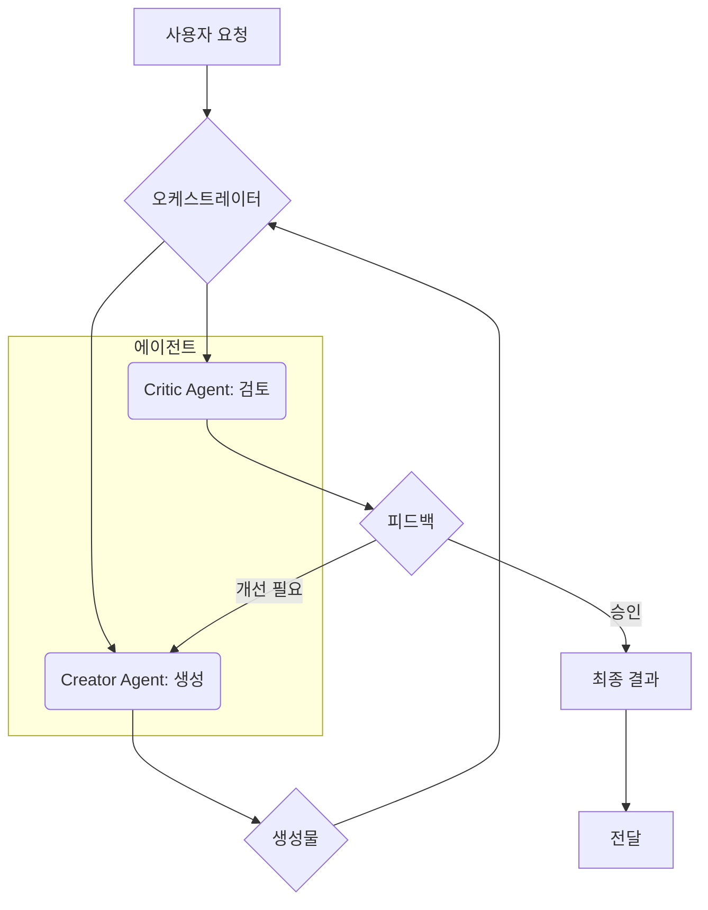

LLM 기반 애플리케이션의 복잡도 증가에 따라, 단일 LLM의 한계를 극복하기 위해 복수 LLM 에이전트에게 특정 역할을 분담시키는 패턴이 중요합니다. 이 패턴은 각 LLM의 강점을 활용하여 워크플로우 효율성과 결과물 품질을 최적화하며, 특히 생성과 비판을 분담하는 'Creator-Critic' 아키텍처는 2026년 핵심 트렌드입니다.

## 핵심 개념

### 전문화 (Specialization)
각 에이전트가 특정 태스크에 최적화되어 컨텍스트를 줄이고 전문성을 높여 결과물의 정확성과 품질을 향상시킵니다.

### 오케스트레이션 (Orchestration)
중앙 오케스트레이터가 태스크 흐름 관리, 에이전트 통신 중재, 출력 통합을 담당하여 워크플로우 효율성과 시스템 일관성을 유지합니다.

### 모델 다양성 활용
Claude는 추론/생성, GPT는 비판적 분석, Llama는 fine-tuning 효율성에 강점이 있습니다. 역할 분담은 각 모델 특성을 고려하여 최적의 모델을 할당합니다.

## Creator-Critic 아키텍처

'Creator-Critic'은 가장 효과적인 복수 LLM 에이전트 분담 패턴입니다.

*   **Creator Agent (생성 에이전트)**: 코드, 초안 등 초기 아웃풋 생성 담당. (예: Claude 3.5 Sonnet)
*   **Critic Agent (비판 에이전트)**: 생성물의 오류 지적, 개선점 제안으로 품질 향상. (예: GPT-4o, fine-tuning Llama)

이 패턴은 생성과 비판을 결합하여 최종 결과물의 완성도를 극대화합니다.

### 워크플로우 예시



## 코드 스니펫

```python
# Concept: Multi-Agent Workflow
from openai import OpenAI

def multi_agent_process(task, creator_model, critic_model):
    client = OpenAI()
    # 1. Creator generates
    creator_output = client.chat.completions.create(model=creator_model, messages=[{"role": "user", "content": f"Generate for: {task}"}]).choices[0].message.content
    # 2. Critic reviews
    critic_feedback = client.chat.completions.create(model=critic_model, messages=[{"role": "user", "content": f"Review: {creator_output}"}]).choices[0].message.content
    # 3. Decision/Refinement
    return {"initial_output": creator_output, "feedback": critic_feedback}
```

## 2026년 트렌드

*   **하이퍼-전문화 에이전트**: 특정 도메인/패턴 전문성 극대화.
*   **적응형 오케스트레이션**: 태스크, 자원, 비용 기반 최적 에이전트 조합 동적 선택.
*   **자율 학습/개선**: 에이전트 팀 자체 학습 및 협업 전략 개선.
*   **보안/신뢰성**: 데이터 프라이버시, 정보 유출 방지, 신뢰할 수 있는 통신 (`ephemeral-credentials-session-llm-harness` 연계).
*   **AI-Native IDE 통합**: IDE 내 멀티-에이전트 워크플로우 구성/모니터링, 실시간 생성/리뷰/테스트.

## 트레이드오프

*   **복잡성 vs. 품질**: Good: 고품질 요구 복잡 프로젝트. Bad: 단순 태스크 시 오케스트레이션 오버헤드.
*   **비용 vs. 성능**: Good: 개발 시간 단축, 버그 감소로 비즈니스 가치 창출 시. Bad: 예산 제한 시 비효율.
*   **지연 시간 vs. 견고성**: Good: 단계별 검증으로 오류율 감소, 시스템 견고성 향상. Bad: 실시간 응답 필수 앱.
*   **의존성 관리 vs. 유연성**: Good: 역할/인터페이스 명확 시 에이전트 독립 개선/교체 유연성. Bad: 역할 모호 시 유지보수 비용 증가.

## 실전 체크리스트

*   - [ ] 각 에이전트 역할/책임(Role and Responsibilities) 명확성 검증.
*   - [ ] 통신 프로토콜(Communication Protocol) 표준화 여부 확인.
*   - [ ] 컨텍스트(Context)가 최소한의 정보로 최적화되었는가? (Ambient Knowledge Injection)
*   - [ ] 비판(Critic) 에이전트의 평가 기준(Evaluation Criteria)이 측정 가능한가?
*   - [ ] 워크플로우 실행 시간 및 API 호출 비용 모니터링 및 최적화 계획 수립 여부.
*   - [ ] 에이전트 실패 시 대체 전략, 재시도, 오류 처리 로직 구현 여부.
*   - [ ] 주요 출력물 버전 관리(Version Control) 및 롤백(Rollback) 기능 지원 여부.
*   - [ ] `production-db-ai-agent-guardrails`와 같은 안전 장치 마련 여부.