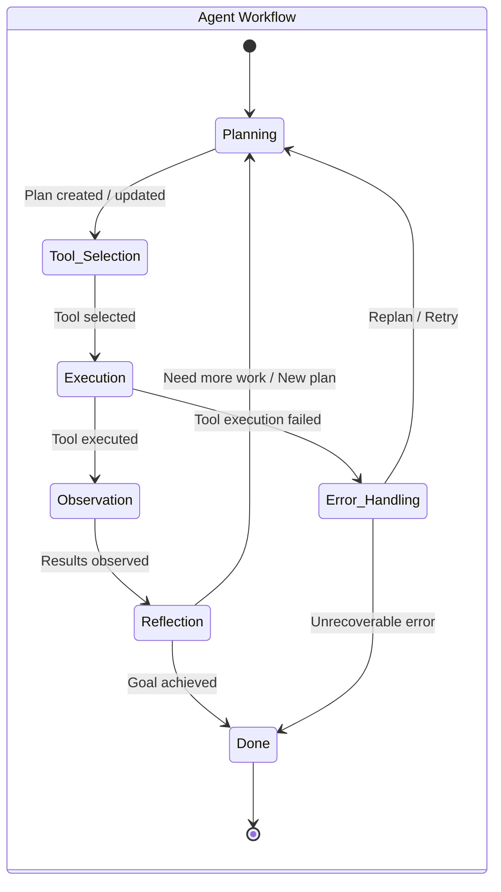

다단계 에이전트 시스템에서 의사결정 로직의 설계는 에이전트의 복잡한 목표 달성 능력과 효율성을 결정하는 핵심 요소이다. 단일 단계의 의사결정은 제한적인 범위 내에서 즉각적인 행동을 유발하지만, 다단계 에이전트는 장기적인 목표를 위해 여러 단계에 걸쳐 연속적이고 상호 의존적인 의사결정을 수행해야 한다. 이 엔트리는 다단계 에이전트의 의사결정 로직을 효과적으로 설계하고 구현하기 위한 패턴과 전략을 탐구한다.

## 다단계 의사결정의 본질

다단계 의사결정은 에이전트가 복잡한 문제를 해결하기 위해 일련의 추상화된 단계나 상태를 거쳐 진행되는 과정이다. 각 단계는 이전 단계의 결과에 기반하며 다음 단계의 입력으로 작용한다. 이러한 구조는 에이전트가 복잡한 과제를 하위 목표로 분해하고, 각 하위 목표를 달성하기 위한 최적의 경로를 동적으로 탐색하게 한다.

핵심 구성 요소:
*   **상태 관리 (State Management)**: 현재 에이전트의 상황, 진행 상태, 과거 의사결정 결과 등을 체계적으로 기록하고 관리한다.
*   **전환 로직 (Transition Logic)**: 특정 조건이 충족될 때 에이전트가 한 단계에서 다음 단계로 이동하는 규칙을 정의한다.
*   **도구 사용 (Tool Use)**: 각 단계에서 특정 작업을 수행하기 위해 외부 도구나 API를 호출하는 메커니즘을 통합한다.
*   **피드백 루프 (Feedback Loops)**: 현재 단계의 실행 결과를 평가하고, 필요에 따라 이전 단계로 돌아가거나 의사결정 로직을 조정하는 메커니즘이다.

## 의사결정 로직 디자인 패턴

### 1. 계층적 의사결정 트리 (Hierarchical Decision Trees)
복잡한 의사결정 과정을 계층적으로 분해하여 관리한다. 최상위 노드는 큰 목표를 나타내고, 하위 노드는 이를 달성하기 위한 구체적인 단계나 조건을 정의한다. 특정 조건에 따라 다른 경로를 선택하게 하여 유연성을 확보한다.

### 2. 유한 상태 머신 (Finite State Machines, FSM)
에이전트의 행동을 미리 정의된 유한한 상태와 이들 간의 전환으로 모델링한다. 각 상태는 특정 행동을 담당하며, 특정 이벤트나 조건 발생 시 다른 상태로 전환된다. FSM은 예측 가능하고 제어 가능한 의사결정 흐름에 적합하다.

### 3. 행동 트리 (Behavior Trees)
FSM보다 더 유연하고 모듈화된 의사결정 구조를 제공한다. 행동 트리는 `Sequence`, `Selector`, `Parallel`, `Decorator`와 같은 노드를 사용하여 복잡한 행동 시퀀스를 구성한다. 에이전트가 실패하거나 성공할 때 다른 행동 경로로 쉽게 전환할 수 있다. 이는 게임 AI에서 널리 사용되며, LLM 에이전트의 동적 계획에도 적용 가능하다.

### 4. 목표 기반 계획 (Goal-Oriented Planning)
에이전트가 명확한 목표를 부여받고, 해당 목표를 달성하기 위한 일련의 하위 목표와 행동 계획을 스스로 생성하는 방식이다. LLM 기반 에이전트에서 주로 사용되며, `Plan-and-Execute` 또는 `ReAct`와 같은 패턴이 이 범주에 속한다. 에이전트는 현재 상태에서 목표까지의 경로를 탐색하고, 필요에 따라 계획을 수정한다.

## 구현 전략

다단계 의사결정 로직을 구현할 때는 다음과 같은 전략을 고려해야 한다.

### 컨텍스트 및 메모리 관리
각 의사결정 단계에서 필요한 관련 정보(컨텍스트)를 효과적으로 관리해야 한다. 장기 기억(Long-Term Memory)과 단기 기억(Short-Term Memory)을 구분하고, 필요한 정보만 컨텍스트 윈도우에 포함하여 LLM 호출 비용과 지연 시간을 최적화한다.

### 도구 오케스트레이션 (Tool Orchestration)
다단계 에이전트는 다양한 도구를 활용하여 작업을 수행한다. 각 단계에서 어떤 도구가 필요한지, 도구의 입력과 출력을 어떻게 관리할지, 도구 실행 실패 시 어떻게 처리할지에 대한 명확한 오케스트레이션 로직이 필수적이다.

### 자기 수정 및 반성 (Self-Correction & Reflection)
에이전트가 의사결정의 결과를 평가하고, 예상과 다른 경우 스스로 계획을 수정하거나 새로운 정보를 학습하여 다음 의사결정에 반영하는 메커니즘이다. 이는 에이전트의 견고성과 적응성을 높이는 데 기여한다.

### 2026년 최신 트렌드 반영
2026년에는 다단계 에이전트의 **적응성(Adaptability)**과 **설명 가능성(Explainability)**이 더욱 강조될 것이다.
*   **적응성**: 동적 환경 변화에 실시간으로 반응하여 의사결정 로직을 수정하는 능력이 중요해진다. LLM 기반의 자율 에이전트들이 복잡한 환경에서 불확실성에 대처하기 위한 능동적인 계획 및 수정 메커니즘을 내재화해야 한다.
*   **설명 가능성**: 에이전트가 왜 특정 의사결정을 내렸는지, 어떤 단계를 거쳐 현재 상태에 도달했는지 추적하고 이해할 수 있도록 의사결정 과정을 로깅하고 시각화하는 기술이 발전하고 있다. 이는 에이전트의 신뢰성을 높이고 디버깅을 용이하게 한다.

### 코드 예시: 간단한 다단계 에이전트 시뮬레이션 (Python)

```python
from enum import Enum

class AgentState(Enum):
    PLANNING = "Planning"
    TOOL_USE = "Tool Use"
    OBSERVATION = "Observation"
    REFLECTION = "Reflection"
    DONE = "Done"
    ERROR = "Error"

class Tool:
    def __init__(self, name):
        self.name = name

    def execute(self, task):
        print(f"Executing tool '{self.name}' for task: {task}")
        if "fail" in task:
            return {"status": "error", "message": f"Tool '{self.name}' failed on '{task}'"}
        return {"status": "success", "result": f"Completed '{task}' with '{self.name}'"}

class MultiStageAgent:
    def __init__(self, name, tools):
        self.name = name
        self.state = AgentState.PLANNING
        self.current_task = None
        self.plan_history = []
        self.tools = {tool.name: tool for tool in tools}

    def _plan(self):
        print(f"[{self.name}][{self.state.value}] Planning next steps...")
        if not self.current_task:
            self.current_task = "Analyze market data"
            self.plan_history.append(self.current_task)
            print(f"[{self.name}] New task identified: {self.current_task}")
        else:
            print(f"[{self.name}] Continuing plan for: {self.current_task}")
        self.state = AgentState.TOOL_USE

    def _tool_use(self):
        print(f"[{self.name}][{self.state.value}] Selecting and using tools...")
        if "market data" in self.current_task.lower():
            tool_name = "DataAnalyzer"
        elif "report" in self.current_task.lower():
            tool_name = "ReportGenerator"
        else:
            tool_name = "DefaultTool"
        
        if tool_name not in self.tools:
            print(f"[{self.name}] Error: Tool '{tool_name}' not found.")
            self.state = AgentState.ERROR
            return
            
        tool = self.tools[tool_name]
        result = tool.execute(self.current_task)
        self.last_tool_result = result
        print(f"[{self.name}] Tool result: {result}")
        if result["status"] == "error":
            self.state = AgentState.ERROR
        else:
            self.state = AgentState.OBSERVATION

    def _observe(self):
        print(f"[{self.name}][{self.state.value}] Observing results...")
        if self.last_tool_result and self.last_tool_result["status"] == "success":
            print(f"[{self.name}] Task '{self.current_task}' succeeded. Result: {self.last_tool_result['result']}")
            self.state = AgentState.REFLECTION
        else:
            print(f"[{self.name}] Task '{self.current_task}' failed. Entering error state.")
            self.state = AgentState.ERROR

    def _reflect(self):
        print(f"[{self.name}][{self.state.value}] Reflecting on outcome...")
        if "market data" in self.current_task.lower():
            print(f"[{self.name}] Reflection: Market data analyzed. Next, generate report.")
            self.current_task = "Generate market report"
            self.plan_history.append(self.current_task)
            self.state = AgentState.PLANNING
        else:
            print(f"[{self.name}] Reflection: All tasks complete for now.")
            self.state = AgentState.DONE

    def _handle_error(self):
        print(f"[{self.name}][{self.state.value}] Handling error for task: {self.current_task}")
        if len(self.plan_history) > 1:
            # Simple retry by replanning or reverting
            print(f"[{self.name}] Attempting to replan for: {self.current_task}")
            self.plan_history.pop() # Remove failed task from history
            self.current_task = self.plan_history[-1] if self.plan_history else None
            self.state = AgentState.PLANNING
        else:
            print(f"[{self.name}] Critical error, cannot recover. Terminating.")
            self.state = AgentState.DONE # Or a dedicated FAILED state

    def run(self):
        print(f"[{self.name}] Agent started.")
        while self.state != AgentState.DONE:
            if self.state == AgentState.PLANNING:
                self._plan()
            elif self.state == AgentState.TOOL_USE:
                self._tool_use()
            elif self.state == AgentState.OBSERVATION:
                self._observe()
            elif self.state == AgentState.REFLECTION:
                self._reflect()
            elif self.state == AgentState.ERROR:
                self._handle_error()
            
            # Simulate some processing time
            import time
            time.sleep(0.1)
        print(f"[{self.name}] Agent finished. Final state: {self.state.value}")

# Example usage
tools = [Tool("DataAnalyzer"), Tool("ReportGenerator"), Tool("DefaultTool")]
agent = MultiStageAgent("ReportAgent", tools)
agent.run()

# Example with an error scenario
print("--- Running agent with error scenario ---")
error_tools = [Tool("DataAnalyzer"), Tool("ReportGenerator"), Tool("DefaultTool")]
error_agent = MultiStageAgent("ErrorAgent", error_tools)
error_agent.current_task = "Analyze market data and expect fail" # Inject a failing task
error_agent.run()
```

### 다단계 의사결정 흐름 (Mermaid)



## 트레이드오프

*   **구현 복잡성 vs. 유연성**:
    *   **좋은 경우**: FSM은 예측 가능한 특정 흐름이 명확하고 상태 전환이 단순한 시스템에 적합하다. 디버깅이 용이하고 성능이 예측 가능하다.
    *   **나쁜 경우**: 행동 트리나 목표 기반 계획은 복잡하고 동적인 환경에서 에이전트의 행동을 유연하게 조절해야 할 때 더 유리하다. FSM은 상태가 많아지면 스파게티 코드가 되기 쉽다.
*   **결정론적 행동 vs. 적응적 행동**:
    *   **좋은 경우**: 규칙 기반 또는 FSM 기반의 결정론적 로직은 안전이 중요하거나 예측 가능한 응답이 필요한 시스템(예: 산업 제어)에 적합하다.
    *   **나쁜 경우**: LLM 기반의 적응적 로직은 미지의 상황이나 빠르게 변화하는 환경에서 새로운 문제 해결 전략을 찾아야 할 때 더 효과적이다. 결정론적 방식은 새로운 상황에 취약하다.
*   **성능 효율성 vs. 견고성**:
    *   **좋은 경우**: 단순한 휴리스틱이나 규칙 기반의 의사결정은 빠른 응답 시간과 낮은 컴퓨팅 자원을 요구하는 경우에 유리하다.
    *   **나쁜 경우**: 복잡한 계획 및 반성 메커니즘은 시스템의 견고성과 오류 회복력을 높이지만, 더 많은 연산 자원과 시간을 소모할 수 있다. 미션 크리티컬한 상황에서는 견고성이 우선시된다.
*   **설명 가능성 vs. 자율성**:
    *   **좋은 경우**: 명시적인 규칙이나 상태 전환을 따르는 에이전트는 의사결정 경로를 추적하기 쉬워 설명 가능성이 높다. 규제 준수나 감사에 유리하다.
    *   **나쁜 경우**: LLM 기반의 고도로 자율적인 에이전트는 복잡한 추론 과정으로 인해 의사결정의 내부 작동을 완전히 설명하기 어려울 수 있다. 높은 자율성은 예측 불가능성을 동반할 수 있다.

## 실전 체크리스트

프로젝트에 다단계 에이전트의 의사결정 로직을 적용할 때 다음 항목들을 검증해야 한다.

- [ ] **각 의사결정 단계의 목표와 결과가 명확하게 정의되어 있는가?**: 단계별 책임과 성공 기준을 명확히 설정하여 모호성을 제거한다.
- [ ] **에이전트 상태를 지속적으로 관리하고 다음 단계로 전달하는 메커니즘이 견고한가?**: 상태 저장 및 로딩, 컨텍스트 전달 로직의 무결성을 확인한다.
- [ ] **각 단계에서 발생할 수 있는 오류 시나리오와 이에 대한 회복(recovery) 전략이 설계되어 있는가?**: 도구 실행 실패, LLM 응답 오류 등에 대한 구체적인 예외 처리를 포함한다.
- [ ] **의사결정 로직이 지나치게 복잡해지지 않도록 모듈화 및 추상화가 잘 되어 있는가?**: 행동 트리나 FSM과 같은 패턴을 활용하여 관리 용이성을 확보한다.
- [ ] **에이전트의 의사결정 경로와 결과가 로깅되고 추적 가능한가?**: 디버깅, 감사, 성능 최적화를 위한 충분한 가시성을 제공한다.
- [ ] **동적 환경 변화에 대응하여 의사결정 로직을 적응적으로 변경할 수 있는 메커니즘이 있는가?**: 새로운 도구, 변경된 요구사항, 예측 불가능한 입력에 대한 유연성을 평가한다.
- [ ] **과도한 LLM 호출을 방지하고 컨텍스트 윈도우를 최적화하기 위한 전략이 적용되어 있는가?**: 캐싱, 컨텍스트 압축, 관련 정보 필터링 등의 기법을 확인한다.