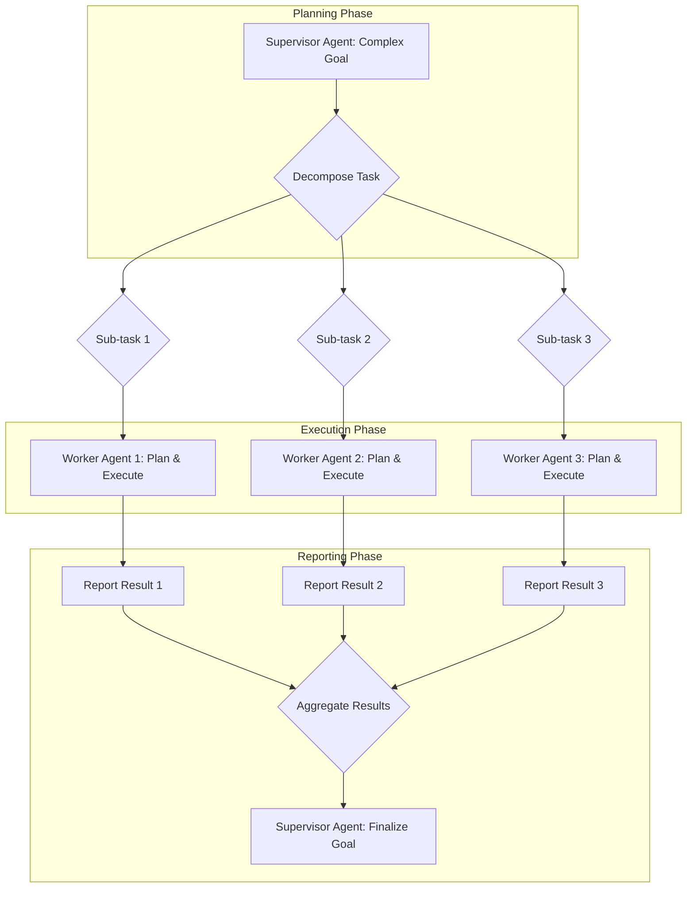

다단계 태스크를 위한 에이전트 플래닝 및 실행 패턴 디자인은 복잡한 실제 문제를 에이전트(AI Agents)가 신뢰성 있고 효율적으로 해결하도록 돕는 핵심 전략입니다. 단순한 질의응답을 넘어, 다수의 단계와 의존성을 가진 복잡한 목표를 달성하기 위해서는 정교한 플래닝(Planning)과 실행(Execution) 메커니즘이 필수적입니다. 기존 에이전트 시스템의 한계는 종종 복잡한 태스크를 단일 단계로 처리하려 하거나, 실행 중 발생하는 예외 상황을 효과적으로 관리하지 못하는 데서 비롯됩니다. 이 엔트리는 이러한 갭을 해소하고 에이전트의 견고성(Robustness)과 지능을 향상시키기 위한 설계 원칙과 패턴을 다룹니다.

## 핵심 개념 및 중요성

에이전트 플래닝은 주어진 목표(Goal)를 달성하기 위한 일련의 행동(Action) 시퀀스를 결정하는 과정입니다. 실행은 이 계획에 따라 실제로 행동을 수행하고, 그 결과를 모니터링하며 필요에 따라 계획을 조정하는 과정입니다. 다단계 태스크는 고정된(Fixed) 단일 플랜으로 처리하기 어렵습니다. 환경의 불확실성, 도구 사용의 실패, 예측치 못한 결과 등 다양한 변수가 존재하기 때문입니다. 따라서 에이전트는 동적으로 계획을 수립하고, 실행 결과를 평가하며, 이를 바탕으로 다음 행동을 결정하는 능력이 중요합니다. 2026년 에이전트 기술의 발전은 이러한 동적이고 적응적인 플래닝 및 실행 패턴을 통해 더욱 복잡한 실제 시나리오에 적용 가능하게 합니다.

### 태스크 분해 (Task Decomposition)
복잡한 태스크를 더 작고 관리하기 쉬운 하위 태스크(Sub-tasks)로 나누는 과정입니다. 이는 문제의 복잡성을 줄이고, 에이전트가 각 하위 태스크에 집중하여 효율성을 높이는 데 기여합니다.
*   **계층적 분해 (Hierarchical Decomposition)**: 큰 목표를 트리(Tree) 구조로 분해. 상위 에이전트(Supervisor Agent)가 큰 그림을 그리고 하위 에이전트(Worker Agent)가 세부 태스크를 처리합니다.
*   **순차적 분해 (Sequential Decomposition)**: 태스크를 순차적인 단계로 나누며, 이전 단계의 결과가 다음 단계의 입력이 됩니다.

### 플래닝 전략 (Planning Strategies)
*   **딜리버러티브 플래닝 (Deliberative Planning)**: 태스크 실행 전에 전체 계획을 수립합니다. 초기 계획의 품질은 높지만, 환경 변화에 유연하게 대응하기 어렵습니다.
*   **리액티브 플래닝 (Reactive Planning)**: 환경 변화에 즉각적으로 반응하여 계획을 동적으로 조정합니다. 예측 불가능한 상황에 강하지만, 장기적인 목표 달성에는 비효율적일 수 있습니다.
*   **하이브리드 플래닝 (Hybrid Planning)**: 딜리버러티브와 리액티브 플래닝의 장점을 결합합니다. 상위 레벨에서는 딜리버러티브하게 큰 계획을 수립하고, 하위 레벨에서는 리액티브하게 실행 중 발생하는 문제를 처리합니다.

### 실행 및 모니터링 (Execution and Monitoring)
계획된 행동을 수행하고, 그 결과를 지속적으로 관찰하는 과정입니다. 예상치 못한 오류나 결과 불일치 발생 시, 이를 감지하고 에이전트가 자체 수정(Self-correction)하거나 재계획(Replanning)을 시작할 수 있도록 트리거합니다.
*   **실행 가드레일 (Execution Guardrails)**: 안전성(Safety)과 비용(Cost)을 제어하기 위한 제약 조건입니다. 무한 루프(Infinite Loop) 방지, 비정상적인 자원 사용 감지 등이 포함됩니다.
*   **휴먼 체크포인트 (Human Checkpoints)**: 중요한 의사결정 지점이나 장기 실행 태스크(Long-running Task)의 중간 단계에서 사람의 개입을 요청하여 안정성을 확보합니다.

## 에이전트 플래닝 및 실행 패턴

### 1. 계층적 플래닝 및 위임 (Hierarchical Planning and Delegation)
복잡한 태스크를 상위 에이전트가 인지하고, 이를 여러 하위 태스크로 분해하여 전문화된 하위 에이전트들에게 위임하는 패턴입니다. 각 하위 에이전트는 자신의 영역 내에서 독립적으로 플래닝 및 실행을 수행하며, 그 결과를 상위 에이전트에게 보고합니다.



### 2. Plan-Execute-Reflect (PER) 루프
가장 일반적이고 효과적인 에이전트 패턴 중 하나입니다. 에이전트는 목표에 대한 계획을 세우고(Plan), 이를 실행한 후(Execute), 실행 결과를 바탕으로 성과를 반성(Reflect)하고 다음 계획을 개선합니다. 이 과정을 반복하며 점진적으로 목표에 도달합니다.

```python
from typing import List, Dict, Any

class Tool:
    def __init__(self, name: str, func):
        self.name = name
        self.func = func

    def use(self, *args, **kwargs):
        return self.func(*args, **kwargs)

class Agent:
    def __init__(self, name: str, tools: List[Tool]):
        self.name = name
        self.tools = {tool.name: tool for tool in tools}
        self.memory: List[str] = []
        self.current_plan: List[Dict[str, Any]] = []

    def _call_llm(self, prompt: str) -> str:
        # Simulate LLM call
        # In a real scenario, this would interface with a large language model API
        print(f"[{self.name}] LLM Input: {prompt[:100]}...")
        # Placeholder for actual LLM response based on prompt
        if "plan" in prompt.lower():
            if "research" in prompt.lower() and "implement" in prompt.lower():
                return '{"plan": [{"task": "research_topic", "tool": "search_engine", "args": {"query": "agent planning patterns 2026"}}, {"task": "outline_solution", "tool": "text_processor", "args": {"text": "research_results"}}, {"task": "implement_code", "tool": "code_editor", "args": {"code": "solution_outline"}}, {"task": "test_code", "tool": "code_tester", "args": {"code": "implemented_code"}}]}'
            return '{"plan": [{"task": "generic_task", "tool": "generic_tool", "args": {}}]}'
        elif "reflect" in prompt.lower():
            return "Reflection: The execution was successful, proceed to next step."
        return "Simulated LLM response for: " + prompt[:50]

    def plan(self, objective: str) -> None:
        planning_prompt = f"Objective: {objective}. Current Memory: {self.memory}. Generate a detailed, sequential plan to achieve this objective. Each step should include a 'task', 'tool' to use, and 'args'. Output as JSON."
        llm_response = self._call_llm(planning_prompt)
        try:
            plan_data = json.loads(llm_response)
            self.current_plan = plan_data.get("plan", [])
            print(f"[{self.name}] Generated Plan: {self.current_plan}")
        except json.JSONDecodeError:
            print(f"[{self.name}] Failed to parse plan from LLM: {llm_response}")
            self.current_plan = [{"task": "replan", "tool": "self", "args": {"objective": objective}}]

    def execute(self) -> Dict[str, Any]:
        results = {}
        if not self.current_plan:
            print(f"[{self.name}] No plan to execute.")
            return {"status": "failed", "reason": "no_plan"}

        for step in self.current_plan:
            task = step.get("task")
            tool_name = step.get("tool")
            args = step.get("args", {})

            print(f"[{self.name}] Executing task: {task} using tool: {tool_name}")
            
            if tool_name == "self": # Special case for self-reflection/re-planning
                if task == "replan":
                    print(f"[{self.name}] Re-planning due to previous failure or no plan.")
                    self.plan(args.get("objective", ""))
                    if self.current_plan: # Try to execute new plan
                        return self.execute()
                    else:
                        return {"status": "failed", "reason": "replan_failed"}
                else:
                    print(f"[{self.name}] Unknown self-task: {task}")
                    results[task] = {"status": "failed", "output": f"Unknown self-task: {task}"}
                    break # Stop execution on unknown self-task
            elif tool_name in self.tools:
                try:
                    tool_output = self.tools[tool_name].use(**args)
                    self.memory.append(f"Tool {tool_name} output for {task}: {tool_output}")
                    results[task] = {"status": "success", "output": tool_output}
                except Exception as e:
                    print(f"[{self.name}] Tool {tool_name} failed for task {task}: {e}")
                    self.memory.append(f"Tool {tool_name} failed for {task}: {e}")
                    results[task] = {"status": "failed", "error": str(e)}
                    break # Stop execution on tool failure for simplicity, could add retry logic
            else:
                print(f"[{self.name}] Tool '{tool_name}' not found for task '{task}'.")
                results[task] = {"status": "failed", "output": f"Tool '{tool_name}' not found."}
                break # Stop execution on missing tool

        final_status = "success" if all(r.get("status") == "success" for r in results.values()) else "failed"
        return {"status": final_status, "results": results}

    def reflect(self, objective: str, execution_result: Dict[str, Any]) -> None:
        reflection_prompt = f"Objective: {objective}. Previous Plan: {self.current_plan}. Execution Result: {execution_result}. Current Memory: {self.memory}. Reflect on the outcome. Was the objective met? What went well? What went wrong? How can the plan be improved for next time or if the objective was not met, suggest next steps. Output concise text."
        llm_reflection = self._call_llm(reflection_prompt)
        self.memory.append(f"Reflection: {llm_reflection}")
        print(f"[{self.name}] Reflection: {llm_reflection}")
        # Based on reflection, the agent might decide to replan or continue.
        # For this example, we'll just print the reflection.

import json
import time

# --- Mock Tools ---
def mock_search_engine(query: str):
    print(f"  > Searching for: {query}")
    time.sleep(0.5)
    return f"Found results for '{query}' related to AI agents."

def mock_text_processor(text: str):
    print(f"  > Processing text: {text[:30]}...")
    time.sleep(0.3)
    return "Processed text output: A clear outline generated."

def mock_code_editor(code: str):
    print(f"  > Writing code based on: {code[:30]}...")
    time.sleep(1)
    return "Python code for agent pattern implemented."

def mock_code_tester(code: str):
    print(f"  > Testing code: {code[:30]}...")
    time.sleep(0.7)
    return "Code tests passed successfully."

# --- Setup Agent ---
tools_list = [
    Tool("search_engine", mock_search_engine),
    Tool("text_processor", mock_text_processor),
    Tool("code_editor", mock_code_editor),
    Tool("code_tester", mock_code_tester)
]
my_agent = Agent("DevAgent", tools_list)

# --- Run PER Loop ---
objective = "Research agent planning patterns and implement a simple code example."
print(f"\n--- Starting Agent for Objective: {objective} ---\n")

for i in range(3): # Simulate a few iterations of PER
    print(f"\n=== Iteration {i+1} ===")
    my_agent.plan(objective)
    execution_outcome = my_agent.execute()
    my_agent.reflect(objective, execution_outcome)

    if execution_outcome.get("status") == "success" and "Code tests passed successfully." in my_agent.memory[-1]:
        print("\nObjective likely achieved!")
        break
    elif execution_outcome.get("status") == "failed":
        print("\nExecution failed, attempting to replan or stopping.")
        if "replan_failed" in execution_outcome.get("reason", ""):
            print("Re-planning attempt failed, stopping.")
            break
        # A more sophisticated agent would adjust its objective or plan based on reflection
        # For this example, we allow it to try a few times.
```

### 3. 동적 태스크 그래프 (Dynamic Task Graph)
태스크 간의 의존성(Dependencies)을 그래프 형태로 모델링하여, 병렬 실행이 가능한 태스크를 동시에 처리하고, 실패 시 영향을 받는 부분만 재실행(Re-execute)하거나 재계획하는 패턴입니다. 이는 복잡한 워크플로우(Workflow)의 효율성과 견고성을 크게 향상시킵니다. 2026년에는 DAG(Directed Acyclic Graph) 기반 워크플로우 오케스트레이션(Orchestration) 시스템이 에이전트 환경에서 더욱 중요해질 것입니다.

## 트레이드오프

*   **딜리버러티브 플래닝 vs. 리액티브 플래닝**:
    *   **딜리버러티브 (사전 계획)**:
        *   **장점**: 초기 계획의 일관성과 효율성이 높고, 자원 할당이 예측 가능합니다. 복잡하지만 안정적인 환경에서 유리합니다.
        *   **단점**: 환경 변화에 대한 유연성이 낮고, 초기 계획 수립에 시간이 오래 걸릴 수 있습니다. 불확실성이 높은 환경에는 부적합합니다.
    *   **리액티브 (실시간 반응)**:
        *   **장점**: 변화하는 환경에 즉각적으로 적응할 수 있으며, 예기치 않은 상황에 강합니다. 동적이고 예측 불가능한 환경에서 유용합니다.
        *   **단점**: 장기적인 목표 달성에 비효율적일 수 있으며, 전역 최적화(Global Optimization)가 어렵습니다. 단순하거나 반복적인 태스크에 더 적합합니다.

*   **중앙 집중식 실행 제어 vs. 분산 실행 제어**:
    *   **중앙 집중식**:
        *   **장점**: 모든 태스크와 상태에 대한 전역적인 시야를 제공하여 쉬운 모니터링과 디버깅이 가능합니다. 태스크 간 충돌을 효과적으로 방지할 수 있습니다.
        *   **단점**: 단일 실패 지점(Single Point of Failure)이 될 수 있으며, 확장성(Scalability)에 한계가 있습니다. 복잡한 시스템에서는 병목 현상이 발생할 수 있습니다.
    *   **분산식**:
        *   **장점**: 높은 확장성과 내결함성(Fault Tolerance)을 제공하며, 개별 에이전트가 독립적으로 작동하여 병렬 처리(Parallel Processing)가 용이합니다.
        *   **단점**: 상태 동기화 및 조정(Coordination)이 복잡하며, 디버깅이 어렵습니다. 태스크 간 의존성 관리에 추가적인 메커니즘이 필요합니다.

*   **엄격한 태스크 분해 vs. 적응형 태스크 분해**:
    *   **엄격한 (사전 정의된 분해)**:
        *   **장점**: 예측 가능하며, 각 하위 태스크의 범위가 명확하여 개발 및 테스트가 용이합니다. 구조화된 태스크에 효율적입니다.
        *   **단점**: 새로운 종류의 문제나 예상치 못한 상황 발생 시 유연하게 대처하기 어렵습니다. 초기 설계에 많은 노력이 필요합니다.
    *   **적응형 (동적/온디맨드 분해)**:
        *   **장점**: 태스크 실행 중 발생하는 새로운 정보를 바탕으로 동적으로 분해 전략을 조정할 수 있습니다. 미지의 문제 해결에 유리합니다.
        *   **단점**: 분해 과정 자체에 대한 복잡성이 증가하며, 계획의 일관성 유지에 어려움이 있을 수 있습니다. 예측 불가능한 결과로 이어질 위험이 있습니다.

## 실전 체크리스트

프로젝트에 다단계 에이전트 플래닝 및 실행 패턴을 적용할 때 다음 항목들을 검증해야 합니다.

*   [ ] **명확한 목표 정의 및 성공 기준 수립**: 최상위 목표(Overall Goal)와 각 하위 태스크(Sub-task)의 성공 기준이 명확하게 정의되었는가? (구체적이고 측정 가능한 지표 포함)
*   [ ] **강력한 오류 처리 및 재시도 정책 구현**: 각 실행 단계에서 발생할 수 있는 잠재적 오류를 식별하고, 적절한 재시도(Retry) 로직과 함께 에이전트가 자체 수정(Self-correction)할 수 있는 메커니즘이 구현되었는가?
*   [ ] **중간 상태 및 진행 상황 모니터링 시스템 구축**: 에이전트의 실행 과정에서 각 하위 태스크의 중간 상태(Intermediate State)와 전체 진행 상황을 실시간으로 추적하고 시각화할 수 있는 대시보드(Dashboard)가 있는가?
*   [ ] **장기 실행 태스크를 위한 영속성 메모리(Persistent Memory) 설계**: 에이전트가 장기간에 걸쳐 실행될 경우, 이전 태스크의 결과와 학습 내용을 저장하고 활용할 수 있는 영속성 메모리 시스템이 설계되었는가? (예: Vector DB, Knowledge Graph)
*   [ ] **비용 관리 및 무한 루프 방지 메커니즘**: 에이전트의 실행 비용이 예상 범위를 초과하거나, 무한 루프에 빠지는 것을 방지하기 위한 가드레일(Guardrails) 및 제한(Limits)이 설정되어 있는가? (예: 최대 재시도 횟수, 시간 제한, 토큰 비용 모니터링)
*   [ ] **인간 개입(Human-in-the-loop)을 위한 체크포인트 정의**: 복잡하거나 민감한 의사결정 지점에서 인간의 승인(Approval)이나 검증(Validation)을 요청하는 체크포인트가 적절히 배치되었는가?
*   [ ] **동적 계획 수립 및 재계획(Replanning) 능력**: 예상치 못한 상황이나 실패 발생 시, 에이전트가 기존 계획을 동적으로 수정하거나 새로운 계획을 수립하여 목표 달성을 재시도할 수 있는가?