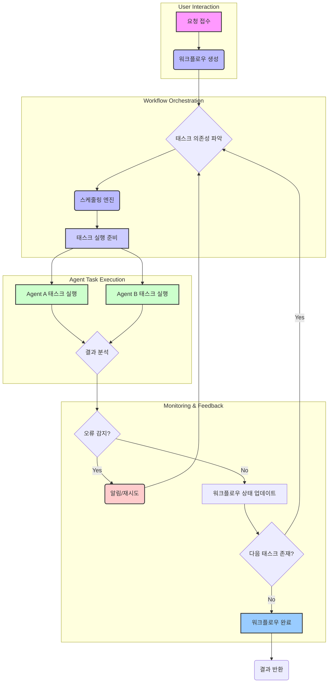

자율 에이전트 시스템이 복잡한 문제 해결을 위해 다단계 워크플로우를 수행하는 것은 더 이상 드문 일이 아닙니다. 이러한 워크플로우는 여러 태스크가 순차적 또는 병렬적으로 실행되고, 각 태스크의 결과가 다음 태스크의 입력으로 작용할 수 있습니다. 이러한 복잡성 속에서 시스템의 안정성, 효율성, 그리고 신뢰성을 보장하기 위해서는 정교한 태스크 스케줄링 및 모니터링 기술이 필수적입니다. 이 엔트리는 다단계 자율 에이전트 워크플로우를 위한 스케줄링 및 모니터링의 핵심 개념, 최신 트렌드, 그리고 실전 적용 방안을 다룹니다.

## 핵심 개념

### 태스크 정의 및 의존성 그래프 (Task Definition & Dependency Graph)
자율 에이전트 워크플로우는 명확하게 정의된 개별 태스크(Task)의 집합으로 구성됩니다. 각 태스크는 특정 목표를 가지며, 입력, 출력, 예상 실행 시간, 그리고 성공/실패 조건을 포함합니다. 이러한 태스크들 간의 실행 순서는 의존성(dependency)으로 표현되며, 이는 방향성 비순환 그래프(DAG, Directed Acyclic Graph) 형태로 시각화될 수 있습니다. DAG는 워크플로우의 병렬성을 파악하고 최적의 실행 계획을 수립하는 데 핵심적인 역할을 합니다.

### 태스크 스케줄링 (Task Scheduling)
스케줄링은 정의된 태스크를 정해진 의존성과 제약 조건에 따라 실행할 순서를 결정하고 자원을 할당하는 과정입니다. 다단계 자율 에이전트 환경에서는 다음과 같은 스케줄링 전략이 활용될 수 있습니다.

*   **토폴로지 정렬 기반 스케줄링 (Topological Sort-based Scheduling)**: DAG의 특성을 활용하여 의존성이 없는 태스크부터 실행하고, 완료된 태스크에 따라 다음 태스크의 의존성을 해제하며 순차적으로 스케줄링합니다.
*   **우선순위 기반 스케줄링 (Priority-based Scheduling)**: 태스크의 중요도, 긴급성, 또는 자원 요구량에 따라 우선순위를 부여하고, 높은 우선순위의 태스크를 먼저 실행합니다.
*   **동적 스케줄링 (Dynamic Scheduling)**: 워크플로우 실행 중 발생하는 이벤트, 자원 가용성 변화, 또는 태스크의 실패에 따라 실시간으로 스케줄링 계획을 조정합니다.
*   **자원 제약형 스케줄링 (Resource-constrained Scheduling)**: 사용 가능한 컴퓨팅 자원(CPU, GPU, 메모리 등)을 고려하여 태스크를 할당하고 실행 순서를 결정합니다.

### 워크플로우 오케스트레이션 (Workflow Orchestration)
오케스트레이션은 스케줄링된 태스크들을 실제로 실행하고, 그 상태를 추적하며, 오류 발생 시 적절히 대응하는 전반적인 관리 메커니즘을 의미합니다. 이는 워크플로우 엔진이나 오케스트레이터에 의해 수행되며, 각 에이전트 태스크의 시작, 일시 중지, 재개, 중단 등을 제어합니다. 복잡한 에이전트 시스템에서는 서브 워크플로우를 호출하거나 외부 시스템과 연동하는 기능이 포함되기도 합니다.

### 모니터링 및 관측성 (Monitoring & Observability)
워크플로우의 각 단계와 개별 태스크의 실행 상태를 실시간으로 추적하는 것은 문제 진단과 성능 최적화에 필수적입니다. 주요 모니터링 항목은 다음과 같습니다.

*   **태스크 상태 (Task Status)**: 대기 중(Pending), 실행 중(Running), 완료(Completed), 실패(Failed), 중단(Aborted).
*   **성능 지표 (Performance Metrics)**: 태스크별 실행 시간, 자원 사용량(CPU, 메모리, 네트워크), 처리량(Throughput).
*   **로그 및 이벤트 (Logs & Events)**: 에이전트의 내부 동작, 결정 과정, 외부 도구 호출 결과 등을 상세히 기록하여 투명성을 확보합니다.
*   **경고 시스템 (Alerting System)**: 태스크 실패, 지연, 비정상적인 자원 사용 등의 문제가 발생할 경우 즉시 담당자에게 알림을 전송합니다.

### 오류 처리 및 복구 (Error Handling & Recovery)
다단계 워크플로우는 필연적으로 오류가 발생할 수 있습니다. 효과적인 오류 처리 및 복구 전략은 시스템의 견고성을 높입니다.

*   **재시도 (Retries)**: 일시적인 오류에 대해 태스크를 자동으로 재시도합니다.
*   **폴백 (Fallback)**: 특정 태스크가 실패할 경우, 미리 정의된 대체 태스크나 경로로 전환합니다.
*   **인간 개입 (Human Intervention)**: 복잡하거나 예상치 못한 오류 발생 시, 인간 운영자에게 알림을 보내고 수동 개입을 요청합니다.
*   **롤백 (Rollback)**: 실패한 워크플로우를 이전의 안정적인 상태로 되돌립니다.

## 2026년 최신 트렌드

### LLM 기반 동적 스케줄링 (LLM-driven Dynamic Scheduling)
최근 LLM(Large Language Model)의 발전은 에이전트의 스케줄링 방식에 혁신을 가져오고 있습니다. LLM은 워크플로우의 현재 상태, 사용 가능한 자원, 과거 실행 이력, 심지어 외부 정보를 종합하여 최적의 다음 태스크를 동적으로 결정할 수 있습니다. 이를 통해 예상치 못한 상황에 대한 적응성과 유연성이 크게 향상됩니다. 예를 들어, 특정 태스크가 예상보다 오래 걸리거나 실패할 경우, LLM은 즉시 다른 태스크를 우선하거나 대체 경로를 생성하여 워크플로우의 목표 달성을 최적화할 수 있습니다.

### 자율 치유 워크플로우 (Self-healing Workflows)
모니터링 시스템에서 감지된 이상 징후를 LLM 에이전트가 자체적으로 분석하고, 해결책을 모색하여 워크플로우를 자동으로 복구하는 '자율 치유' 기능이 부상하고 있습니다. 이는 단순한 재시도 수준을 넘어, 문제의 근본 원인을 파악하고, 워크플로우 정의를 수정하거나, 관련 에이전트의 동작 방식을 조정하는 등의 복잡한 해결 과정을 포함합니다. 목표는 인간의 개입 없이도 시스템이 장기간 안정적으로 운영되는 것입니다.

### 지능형 이상 탐지 (Intelligent Anomaly Detection)
기존의 임계값 기반 모니터링을 넘어, AI/ML 모델을 활용하여 워크플로우의 정상적인 패턴을 학습하고 비정상적인 동작을 자동으로 탐지하는 기술이 중요해지고 있습니다. 이는 태스크 실행 시간의 미묘한 변화, 자원 사용량의 비정상적인 급증, 또는 특정 에이전트의 반복적인 실패 패턴 등을 조기에 감지하여 잠재적인 문제를 사전에 예방하는 데 기여합니다. 예측적 모니터링은 시스템의 안정성을 획기적으로 향상시킬 수 있습니다.

## 코드 예제: 간단한 태스크 스케줄러 (Python)

이 예제는 Python을 사용하여 간단한 태스크 의존성 그래프를 정의하고, 이를 토폴로지 정렬 방식으로 스케줄링하는 기본 구조를 보여줍니다.

```python
from collections import deque

class Task:
    def __init__(self, name, duration):
        self.name = name
        self.duration = duration
        self.status = "PENDING"
        self.dependencies = []
        self.dependents = []

    def add_dependency(self, task):
        self.dependencies.append(task)
        task.dependents.append(self)

    def execute(self):
        print(f"Executing task: {self.name} (Duration: {self.duration}s)")
        self.status = "RUNNING"
        # Simulate work
        import time
        time.sleep(self.duration)
        self.status = "COMPLETED"
        print(f"Task {self.name} completed.")
        return True # For simplicity, assume success

class WorkflowScheduler:
    def __init__(self, tasks):
        self.tasks = {task.name: task for task in tasks}
        self.ready_queue = deque()
        self.in_degree = {task.name: len(task.dependencies) for task in tasks}
        self.completed_tasks = set()

    def initialize_ready_queue(self):
        for task_name, degree in self.in_degree.items():
            if degree == 0:
                self.ready_queue.append(self.tasks[task_name])

    def run_workflow(self):
        self.initialize_ready_queue()
        print("Workflow started.\n")

        while self.ready_queue:
            current_task = self.ready_queue.popleft()
            if current_task.name in self.completed_tasks:
                continue # Already processed, should not happen with proper DAG

            # Simulate task execution (in a real system, this would be async/multi-threaded)
            current_task.execute()
            self.completed_tasks.add(current_task.name)

            for dependent_task in current_task.dependents:
                self.in_degree[dependent_task.name] -= 1
                if self.in_degree[dependent_task.name] == 0:
                    self.ready_queue.append(dependent_task)
        
        print("\nWorkflow completed.")

# Define tasks
task_a = Task("Data Ingestion", 2)
task_b = Task("Preprocessing", 3)
task_c = Task("Feature Extraction", 4)
task_d = Task("Model Training", 5)
task_e = Task("Evaluation", 2)
task_f = Task("Deployment", 1)

# Define dependencies
task_b.add_dependency(task_a)
task_c.add_dependency(task_a)
task_d.add_dependency(task_b)
task_d.add_dependency(task_c)
task_e.add_dependency(task_d)
task_f.add_dependency(task_e)

all_tasks = [task_a, task_b, task_c, task_d, task_e, task_f]
scheduler = WorkflowScheduler(all_tasks)
scheduler.run_workflow()

```

위 코드는 `Task` 클래스를 정의하여 이름, 실행 시간, 상태, 그리고 의존성을 관리합니다. `WorkflowScheduler`는 토폴로지 정렬 원리를 사용하여 의존성이 해결된 태스크부터 `ready_queue`에 추가하고 실행합니다. 실제 환경에서는 비동기(asynchronous) 실행, 병렬 처리, 분산 환경 고려, 그리고 오류 처리 로직이 추가되어야 합니다.

## 다단계 자율 에이전트 워크플로우 다이어그램

다음 Mermaid 다이어그램은 일반적인 다단계 자율 에이전트 워크플로우의 스케줄링 및 모니터링 흐름을 시각화합니다.



## 트레이드오프

### 1. 중앙 집중식 vs. 분산형 스케줄링 (Centralized vs. Decentralized Scheduling)
*   **언제 좋은가 (When Good)**: 중앙 집중식 스케줄러는 전체 워크플로우에 대한 가시성이 높아 자원 최적화, 전역적인 우선순위 관리, 그리고 복잡한 의존성 처리에 유리합니다. 소규모 또는 중간 규모의 예측 가능한 워크로드에 적합합니다. 분산형 스케줄링은 높은 확장성과 단일 장애점(Single Point of Failure) 감소에 좋습니다. 대규모, 고가용성(High-Availability)이 요구되는 시스템에 적합하며, 각 에이전트가 자체적으로 다음 행동을 결정하는 자율성이 높은 시나리오에 유리합니다.
*   **언제 나쁜가 (When Bad)**: 중앙 집중식 스케줄러는 확장성(Scalability) 문제가 발생할 수 있으며, 단일 장애점이 될 위험이 있습니다. 분산형 스케줄링은 전체 워크플로우에 대한 일관된 전역 상태를 유지하기 어렵고, 디버깅 및 모니터링이 복잡해질 수 있습니다. 자원 할당의 비효율성을 초래할 수도 있습니다.

### 2. 명시적 vs. 암시적 태스크 의존성 (Explicit vs. Implicit Task Dependencies)
*   **언제 좋은가 (When Good)**: 명시적 의존성(코드나 설정 파일에 직접 정의)은 워크플로우의 흐름을 이해하고 디버깅하기 매우 쉽습니다. 예측 가능하며 안정적인 워크플로우에 적합합니다. 암시적 의존성(태스크 출력 파일명 규칙, 메시지 큐 등)은 유연성을 제공하여, 새로운 태스크를 쉽게 추가하거나 제거할 수 있습니다. 동적으로 변화하는 환경이나 마이크로서비스 아키텍처에서 유리합니다.
*   **언제 나쁜가 (When Bad)**: 명시적 의존성은 워크플로우 변경 시 코드 수정이 필요하며, 유연성이 떨어집니다. 워크플로우가 매우 복잡해지면 정의 자체가 어려워질 수 있습니다. 암시적 의존성은 의존 관계를 파악하기 어렵게 만들어 워크플로우 이해도를 저하시키고, 예상치 못한 오류를 유발할 수 있습니다. 디버깅이 까다롭습니다.

### 3. 실시간 vs. 배치 모니터링 (Real-time vs. Batch Monitoring)
*   **언제 좋은가 (When Good)**: 실시간 모니터링은 즉각적인 문제 감지와 빠른 대응이 가능하여, 고가용성 시스템이나 사용자 경험에 민감한 서비스에 필수적입니다. 자율 치유 워크플로우 구현에 중요합니다. 배치 모니터링은 자원 소모가 적고, 장기적인 추세 분석 및 보고서 생성에 유리합니다. 시스템의 전반적인 건강 상태나 비용 효율성 분석에 적합합니다.
*   **언제 나쁜가 (When Bad)**: 실시간 모니터링은 상당한 자원(CPU, 네트워크 대역폭)을 소모하며, 데이터 처리 파이프라인의 복잡성을 증가시킵니다. 배치 모니터링은 문제 발생 시 즉각적인 알림이나 조치가 불가능하여, 시스템 장애 발생 시 파급 효과가 클 수 있습니다. 빠른 대응이 필요한 상황에는 부적합합니다.

## 실전 체크리스트

다단계 자율 에이전트 워크플로우를 프로젝트에 적용할 때 다음 항목들을 검증하십시오.

*   [ ] **태스크 정의 명확성**: 각 태스크의 입력, 출력, 전제 조건, 후속 조건을 명확히 정의하고 문서화했는가?
*   [ ] **의존성 그래프 시각화**: 워크플로우의 태스크 의존성(DAG)을 시각적으로 표현하여 한눈에 파악할 수 있는 도구를 도입했는가?
*   [ ] **스케줄링 전략 최적화**: 워크로드 특성(병렬성, 우선순위)에 맞는 스케줄링 전략(토폴로지, 우선순위, 동적)을 선택하고 구현했는가?
*   [ ] **오류 처리 및 복구 메커니즘**: 태스크 실패 시 재시도, 폴백, 알림, 롤백 등 최소한의 오류 처리 및 복구 메커니즘을 설계하고 테스트했는가?
*   [ ] **모니터링 대시보드 구축**: 태스크 상태, 실행 시간, 자원 사용량 등을 실시간으로 확인할 수 있는 중앙 집중식 모니터링 대시보드를 구축했는가?
*   [ ] **경고 시스템 연동**: 중요한 태스크 실패, 지연, 또는 자원 고갈 시 슬랙, 이메일 등 적절한 채널로 자동 경고를 전송하도록 설정했는가?
*   [ ] **로그 데이터 통합 및 분석**: 모든 태스크 실행 로그를 통합된 로깅 시스템에 수집하고, 분석 도구를 활용하여 문제 진단 및 성능 최적화에 활용하고 있는가?
*   [ ] **LLM 연동 가능성 검토**: 동적 스케줄링, 자율 치유, 지능형 이상 탐지를 위해 LLM 기반 에이전트와의 연동 가능성을 검토하고 파일럿 프로젝트를 진행했는가?