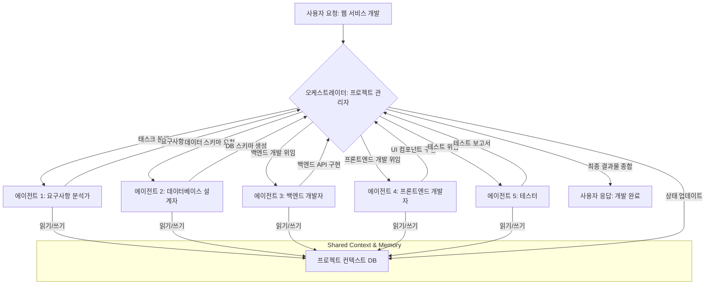

복잡한 비즈니스 문제 해결을 위한 자율 에이전트 시스템은 단일 에이전트의 한계를 넘어 다단계(Multi-Stage) 또는 다중 에이전트(Multi-Agent) 접근 방식으로 발전하고 있습니다. 이러한 시스템은 복잡한 태스크를 여러 전문화된 에이전트에게 분해하고 위임하여, 각 에이전트가 특정 역할을 수행하고 협력하여 최종 목표를 달성하도록 설계됩니다. 이 접근 방식은 개발 효율성을 높이고, 시스템의 확장성 및 유지보수성을 향상시키는 핵심 전략입니다. 특히 2026년 현재, LLM(Large Language Model) 기반의 에이전트들이 복잡한 의사결정과 문제 해결에 필수적인 요소로 자리 잡으면서, 다단계 자율 에이전트 시스템의 중요성은 더욱 부각되고 있습니다.

## 핵심 개념

다단계 자율 에이전트 시스템은 다음과 같은 핵심 원칙들을 기반으로 구축됩니다.

### 1. 계층적 구조 (Hierarchical Structure)
시스템은 일반적으로 상위 수준의 오케스트레이터(Orchestrator) 에이전트와 하위 수준의 워커(Worker) 에이전트로 구성됩니다. 오케스트레이터는 전체 목표를 관리하고, 복잡한 태스크를 하위 태스크로 분해하며, 각 워커 에이전트에게 적절한 태스크를 위임합니다. 워커 에이전트는 특정 도메인 지식이나 도구 사용 능력을 가지고 할당된 하위 태스크를 수행합니다.

### 2. 에이전트 전문화 (Agent Specialization)
각 에이전트는 고유한 역할과 책임, 그리고 해당 역할에 특화된 지식과 도구(Tool) 세트를 가집니다. 예를 들어, 데이터 수집 에이전트는 검색 엔진이나 데이터베이스에 접근하는 도구를, 코드 생성 에이전트는 IDE나 버전 관리 시스템과 상호작용하는 도구를 사용할 수 있습니다. 이러한 전문화는 각 에이전트의 효율성을 극대화하고, 시스템 전체의 성능을 향상시킵니다.

### 3. 통신 및 협업 (Communication and Collaboration)
에이전트 간의 효율적인 통신 프로토콜은 시스템의 성공에 매우 중요합니다. 에이전트들은 공유 메모리, 메시지 큐, 또는 API 호출 등을 통해 정보를 교환하고 협력합니다. 오케스트레이터는 에이전트 간의 정보 흐름을 조정하고, 충돌을 해결하며, 전체 진행 상황을 모니터링합니다.

### 4. 지속적인 컨텍스트 및 기억 (Persistent Context and Memory)
장기 실행 태스크의 경우, 에이전트들이 이전 단계의 결과를 기억하고 이를 현재 태스크에 활용할 수 있어야 합니다. 이는 벡터 데이터베이스, 지식 그래프, 또는 간단한 키-값 저장소 등을 통해 구현될 수 있습니다. 컨텍스트 관리는 에이전트들이 '대화의 흐름'을 유지하고, 복잡한 문제 해결 과정을 추적하는 데 필수적입니다.

## 시스템 설계 및 구현 전략

### 1. 태스크 분해 및 역할 정의 (Task Decomposition and Role Definition)
가장 먼저 복잡한 최종 목표를 달성 가능한 작은 하위 태스크로 분해합니다. 각 하위 태스크에 가장 적합한 에이전트의 역할을 정의하고, 해당 역할에 필요한 스킬셋, 지식, 그리고 도구를 명시합니다. 예를 들어, '새로운 웹 애플리케이션 개발'이라는 목표는 '요구사항 분석', 'UI/UX 설계', '백엔드 API 개발', '프론트엔드 개발', '테스트 및 배포'와 같은 하위 태스크로 분해될 수 있으며, 각 태스크에 맞는 에이전트(예: Architect Agent, Designer Agent, Backend Dev Agent 등)를 할당합니다.

### 2. 오케스트레이션 로직 설계 (Orchestration Logic Design)
오케스트레이터 에이전트는 전체 워크플로우를 정의하고, 각 단계에서 어떤 에이전트가 어떤 태스크를 수행할지 결정합니다. 이는 순차적 실행, 병렬 실행, 조건부 분기 등 다양한 형태로 구현될 수 있습니다. 유한 상태 기계(Finite State Machine)나 행위 트리(Behavior Tree)와 같은 패턴을 활용하여 오케스트레이션 로직의 복잡성을 관리할 수 있습니다.

```python
# 다단계 자율 에이전트 시스템의 오케스트레이션 의사 코드

class SharedContext:
    """ 에이전트 간 공유되는 컨텍스트 및 상태 관리 """
    def __init__(self):
        self.data = {}
        # Thread-safety를 위한 락 (실제 구현 시 고려)
        # self.lock = threading.Lock()

    def update(self, key: str, value: any):
        # with self.lock:
        self.data[key] = value
        print(f"[Context Updated] {key}: {value}")

    def get(self, key: str) -> any:
        # with self.lock:
        return self.data.get(key)

class Agent:
    """ 기본 에이전트 클래스 """
    def __init__(self, name: str, context: SharedContext, tools: dict = None):
        self.name = name
        self.context = context
        self.tools = tools if tools else {}

    def execute(self, task_input: dict) -> dict:
        raise NotImplementedError("모든 에이전트는 execute 메소드를 구현해야 합니다.")

class RequirementAnalysisAgent(Agent):
    def execute(self, problem_statement: str) -> dict:
        print(f"[{self.name}] 요구사항 분석 시작: {problem_statement}")
        # LLM 호출 또는 내부 로직을 통해 요구사항 분석 및 초기 계획 수립
        requirements = f"사용자 요구사항: {problem_statement}. 목표는 다음과 같습니다: [기능 A, 기능 B]"
        plan = ["design_database", "develop_api", "build_frontend"]
        self.context.update("requirements", requirements)
        self.context.update("development_plan", plan)
        return {"status": "success", "message": "요구사항 분석 완료", "next_steps": plan[0]}

class BackendDevelopmentAgent(Agent):
    def execute(self, task_input: dict) -> dict:
        step = task_input.get("step")
        if step != "develop_api":
            return {"status": "skipped", "reason": "이 에이전트의 태스크가 아닙니다."}

        requirements = self.context.get("requirements")
        db_schema = self.context.get("database_schema")
        print(f"[{self.name}] 백엔드 API 개발 시작 (요구사항: {requirements}, DB: {db_schema})")
        # 실제로는 코드 생성, 테스트 실행 등의 도구 사용
        api_code = f"Mock API for {requirements.split(' ')[-1]} with schema {db_schema}"
        self.context.update("backend_api_code", api_code)
        return {"status": "success", "message": "백엔드 API 개발 완료"}

class FrontendDevelopmentAgent(Agent):
    def execute(self, task_input: dict) -> dict:
        step = task_input.get("step")
        if step != "build_frontend":
            return {"status": "skipped", "reason": "이 에이전트의 태스크가 아닙니다."}

        backend_api = self.context.get("backend_api_code")
        print(f"[{self.name}] 프론트엔드 개발 시작 (백엔드 API: {backend_api})")
        # UI 컴포넌트 생성, API 연동 로직 구현 등
        frontend_code = f"Mock UI for {self.context.get('requirements').split(' ')[-1]} using {backend_api}"
        self.context.update("frontend_code", frontend_code)
        return {"status": "success", "message": "프론트엔드 개발 완료"}

class SystemOrchestrator:
    """ 전체 워크플로우를 조정하는 오케스트레이터 """
    def __init__(self, agents: dict, context: SharedContext):
        self.agents = agents
        self.context = context

    def run_project(self, initial_problem: str) -> str:
        print("\n--- 오케스트레이터: 프로젝트 시작 ---")

        # 1단계: 요구사항 분석
        analysis_agent = self.agents["requirement_analysis"]
        analysis_result = analysis_agent.execute(initial_problem)
        print(f"오케스트레이터: {analysis_result['message']}")

        # 개발 계획 가져오기
        plan = self.context.get("development_plan")

        # 2단계: 계획에 따라 각 에이전트 실행 (단순화된 순차 실행)
        for step in plan:
            if step == "design_database":
                print("오케스트레이터: 데이터베이스 설계 (별도 에이전트 또는 내부 로직)")
                self.context.update("database_schema", "Users(id, name), Products(id, name)")
            elif step == "develop_api":
                backend_agent = self.agents["backend_development"]
                backend_result = backend_agent.execute({"step": step})
                print(f"오케스트레이터: {backend_result['message']}")
            elif step == "build_frontend":
                frontend_agent = self.agents["frontend_development"]
                frontend_result = frontend_agent.execute({"step": step})
                print(f"오케스트레이터: {frontend_result['message']}")
            else:
                print(f"오케스트레이터: 알 수 없는 단계: {step}")

        final_report = f"프로젝트 완료. 최종 백엔드 코드: {self.context.get('backend_api_code')}, 프론트엔드 코드: {self.context.get('frontend_code')}"
        self.context.update("final_project_report", final_report)
        return final_report

# 메인 실행 흐름
if __name__ == "__main__":
    project_context = SharedContext()
    all_agents = {
        "requirement_analysis": RequirementAnalysisAgent("ReqAnalyzer", project_context),
        "backend_development": BackendDevelopmentAgent("BackendDev", project_context),
        "frontend_development": FrontendDevelopmentAgent("FrontendDev", project_context),
    }
    main_orchestrator = SystemOrchestrator(all_agents, project_context)

    final_outcome = main_orchestrator.run_project("온라인 쇼핑몰 관리 시스템 개발")
    print("\n--- 최종 결과물 ---")
    print(final_outcome)
```

### 3. 통신 프로토콜 및 공유 컨텍스트 구현 (Communication Protocols and Shared Context)
에이전트들이 정보를 효과적으로 주고받을 수 있도록 명확한 인터페이스와 데이터 구조를 정의합니다. 컨텍스트 관리를 위해 영구적인 저장소(예: RDBMS, NoSQL, Vector DB)를 활용하여 에이전트들이 작업의 진행 상황, 이전 단계의 결과, 중요한 결정 사항 등을 공유하고 참조할 수 있도록 합니다. 이는 각 에이전트의 '장기 기억(Long-Term Memory)' 역할을 수행하며, LLM 기반 에이전트의 경우 컨텍스트 윈도우 한계를 극복하는 데 도움을 줍니다.

### 4. 도구 통합 (Tool Integration)
각 전문 에이전트가 외부 시스템과 상호작용할 수 있도록 도구를 통합합니다. REST API, SDK, CLI 명령어 등을 래핑하여 에이전트가 쉽게 호출할 수 있는 형태로 제공합니다. 도구 사용의 성공/실패 여부를 판단하고, 실패 시 적절히 재시도하거나 대체 전략을 실행하는 견고한 에러 핸들링 로직을 포함해야 합니다.

### 5. 모니터링 및 관측 가능성 (Monitoring and Observability)
다단계 에이전트 시스템은 복잡하므로, 각 에이전트의 행동, 결정, 상태 변화, 도구 사용 로그 등을 추적할 수 있는 강력한 모니터링 시스템이 필수적입니다. 이를 통해 시스템의 병목 현상을 식별하고, 오류를 진단하며, 에이전트의 성능을 최적화할 수 있습니다.

## 다단계 자율 에이전트 워크플로우 예시



## 트레이드오프

다단계 자율 에이전트 시스템을 설계할 때 고려해야 할 주요 트레이드오프는 다음과 같습니다.

*   **복잡성 vs. 유연성**: 시스템이 다단계로 분리될수록 개별 에이전트는 전문화되고 시스템은 유연해지지만, 전체적인 설계 및 디버깅 복잡도가 증가합니다. (언제 좋음: 매우 복잡하고 변화 가능성이 높은 비즈니스 로직 처리. 언제 나쁨: 간단하고 고정적인 태스크 처리)
*   **오버헤드 vs. 견고성**: 여러 에이전트 간의 통신 및 오케스트레이션에는 추가적인 컴퓨팅 리소스와 시간이 소요됩니다. 그러나 이는 시스템의 실패 지점을 분산하고 오류 회복 능력을 높입니다. (언제 좋음: 높은 신뢰성과 자동 복구가 필요한 미션 크리티컬 시스템. 언제 나쁨: 실시간 응답 속도가 중요하고 비용에 민감한 태스크)
*   **개발 속도 vs. 초기 구축 비용**: 초기 다단계 시스템 구축은 단일 에이전트보다 더 많은 시간과 리소스가 필요하지만, 이후 모듈화된 에이전트의 재사용 및 유지보수 측면에서 장점이 있습니다. (언제 좋음: 장기적인 관점에서 확장성과 유지보수가 중요한 프로젝트. 언제 나쁨: POC(Proof of Concept)나 단기 프로젝트로 빠른 프로토타이핑이 필요한 경우)
*   **컨텍스트 일관성 vs. 분산 처리 이점**: 에이전트들이 공유 컨텍스트를 사용할 때 일관성 유지가 중요하지만, 분산 환경에서는 동시성 문제와 데이터 동기화 오버헤드가 발생할 수 있습니다. (언제 좋음: 복잡한 상태를 공유하며 단계별로 정제되는 정보가 필수적인 워크플로우. 언제 나쁨: 각 에이전트가 독립적으로 작동하고 컨텍스트 공유가 최소화될 때)

## 실전 체크리스트

다단계 자율 에이전트 시스템을 프로젝트에 적용할 때 다음 항목들을 검증하세요.

*   [ ] **태스크 분해 명확성**: 최종 목표가 각 에이전트의 전문성을 활용할 수 있는 명확하고 상호 배타적인 하위 태스크로 분해되었는가?
*   [ ] **에이전트 역할 정의**: 각 에이전트의 역할, 책임, 그리고 접근 가능한 도구(Tool) 및 데이터 소스가 명확하게 정의되었는가?
*   [ ] **오케스트레이션 로직의 견고성**: 오케스트레이터가 에이전트의 실패를 감지하고, 재시도하며, 필요한 경우 사람의 개입(Human-in-the-Loop)을 요청하는 로직을 포함하는가?
*   [ ] **컨텍스트 일관성 및 관리**: 에이전트 간 공유되는 컨텍스트(Shared Context)의 데이터 모델이 명확하며, 동시성 및 데이터 무결성 문제가 발생하지 않도록 설계되었는가?
*   [ ] **성능 및 비용 모니터링**: 각 에이전트의 실행 시간, 토큰 사용량, 도구 호출 횟수 등 성능 및 비용 지표를 추적하고 시각화하는 시스템이 구축되었는가?
*   [ ] **인간 개입(HITL) 지점 설계**: 에이전트가 특정 임계값을 넘어서는 문제에 직면했을 때, 또는 중요한 의사결정 단계에서 사람이 개입할 수 있는 명확한 절차와 인터페이스가 마련되었는가?
*   [ ] **보안 및 권한 관리**: 각 에이전트가 접근할 수 있는 데이터와 도구에 대한 최소 권한(Least Privilege) 원칙이 적용되었으며, 에이전트 간의 통신 채널이 안전하게 보호되는가?
