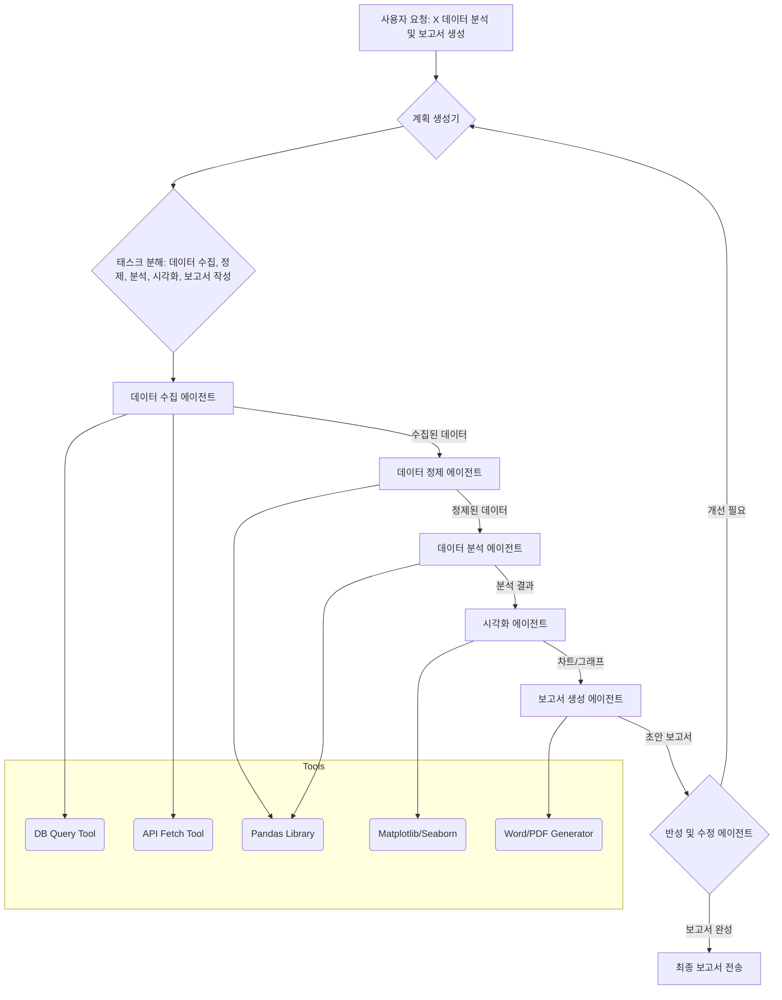

복잡한 비즈니스 문제를 해결하기 위한 AI 에이전트의 진화는 단일 프롬프트-응답 모델을 넘어섰습니다. 오늘날의 AI 에이전트는 장기적인 목표를 달성하기 위해 여러 단계를 거쳐 계획하고, 실행하고, 반성하며, 스스로 수정할 수 있어야 합니다. 이러한 멀티 스텝(Multi-Step) AI 에이전트 패턴은 실질적인 비즈니스 가치를 창출하고 복잡한 태스크를 안정적으로 처리하는 데 필수적입니다. 이 엔트리에서는 멀티 스텝 에이전트의 핵심 설계 원칙과 구현 패턴을 다룹니다.

## 멀티 스텝 에이전트의 필요성

단일 LLM 호출로 해결하기 어려운 문제들은 다음과 같은 특성을 가집니다:

*   **복잡한 논리적 추론 (Complex Logical Reasoning)**: 여러 단계를 거쳐 정보를 조합하고 추론해야 하는 경우.
*   **외부 도구 사용 (External Tool Use)**: 데이터베이스 조회, API 호출, 코드 실행 등 외부 시스템과의 상호작용이 필요한 경우.
*   **불확실성 및 동적 환경 (Uncertainty & Dynamic Environments)**: 예측하기 어려운 결과나 변화하는 환경에 적응하여 계획을 수정해야 하는 경우.
*   **장기적인 목표 (Long-Term Goals)**: 한 번에 달성하기 어려운 큰 목표를 작은 하위 목표로 분해하여 순차적으로 진행해야 하는 경우.

이러한 시나리오에서 멀티 스텝 에이전트는 계획(Planning), 실행(Execution), 반성(Reflection), 도구 활용(Tool Use)과 같은 Agentic Workflow를 통해 문제를 체계적으로 해결합니다.

## 핵심 설계 패턴

### 1. 계획 및 태스크 분해 (Planning & Task Decomposition)

에이전트가 복잡한 문제를 받았을 때, 이를 직접 해결하기보다 더 작고 관리 가능한 하위 태스크(Sub-tasks)로 분해하는 과정입니다. 이 단계에서는 LLM이 현재 목표, 사용 가능한 도구, 기존 지식을 바탕으로 최적의 실행 계획을 수립합니다.

*   **전략적 계획 (Strategic Planning)**: 상위 수준의 목표를 달성하기 위한 전반적인 로드맵을 생성합니다.
*   **동적 계획 (Dynamic Planning)**: 실행 과정에서 발생한 새로운 정보나 실패를 바탕으로 계획을 실시간으로 수정합니다.

### 2. 실행 및 모니터링 (Execution & Monitoring)

계획에 따라 하위 태스크들을 순차적으로 실행하고, 각 단계의 결과를 모니터링합니다. 도구 사용이 이 단계에서 핵심적인 역할을 합니다.

*   **도구 오케스트레이션 (Tool Orchestration)**: 적절한 시점에 필요한 도구를 선택하고 호출하며, 도구의 출력을 해석하여 다음 단계에 활용합니다.
*   **진행 상황 추적 (Progress Tracking)**: 각 태스크의 성공 여부, 소요 시간, 자원 사용량 등을 기록하여 전체 워크플로우의 상태를 관리합니다.

### 3. 반성 및 자기 수정 (Reflection & Self-Correction)

실행 결과를 평가하고, 목표 달성 여부 및 효율성을 분석하여 다음 액션이나 향후 계획에 반영합니다. 실패했을 경우, 실패 원인을 분석하고 새로운 전략을 수립하여 재시도합니다.

*   **오류 분석 (Error Analysis)**: 도구 호출 실패, 잘못된 추론 등 오류의 근본 원인을 파악합니다.
*   **피드백 루프 (Feedback Loop)**: 실행 결과를 바탕으로 내부 상태(Internal State)나 장기 기억(Long-Term Memory)을 업데이트하고, 이를 다음 계획 수립에 활용합니다.

### 4. 기억 관리 (Memory Management)

멀티 스텝 에이전트는 단기 기억(Short-Term Memory)과 장기 기억(Long-Term Memory)을 모두 활용하여 컨텍스트를 유지하고 학습합니다.

*   **단기 기억 (Context Window)**: 현재 진행 중인 태스크의 관련 정보를 컨텍스트 윈도우 내에 유지합니다.
*   **장기 기억 (Vector Database, Knowledge Graph)**: 과거의 경험, 학습된 지식, 성공 및 실패 사례를 저장하고 필요할 때 검색하여 활용합니다.

## 멀티 스텝 에이전트 워크플로우 예시

다음 Mermaid 다이어그램은 복잡한 데이터 분석 태스크를 수행하는 멀티 스텝 AI 에이전트의 일반적인 흐름을 보여줍니다.



## 구현 패턴: Python LangChain 예시

파이썬의 LangChain 같은 프레임워크는 멀티 스텝 에이전트 구현을 위한 다양한 추상화를 제공합니다. 다음은 기본적인 `plan-and-execute` 에이전트의 핵심 로직을 간략히 보여주는 의사 코드입니다.

```python
from langchain.agents import AgentExecutor, OpenAIFunctionsAgent
from langchain_openai import ChatOpenAI
from langchain.chains import LLMChain
from langchain.prompts import PromptTemplate
from langchain_community.tools import tool

# 1. 도구 정의
@tool
def search_web(query: str) -> str:
    """Search the web for information."""
    # 실제 웹 검색 API 호출 로직
    return f"Search results for '{query}'..."

@tool
def analyze_data(data: str) -> str:
    """Analyze given data and return insights."""
    # 실제 데이터 분석 로직 (e.g., pandas)
    return f"Analysis of data: {data} completed. Key insights: ..."

tools = [search_web, analyze_data]

# 2. LLM 초기화
llm = ChatOpenAI(temperature=0, model="gpt-4o-2024-05-13")

# 3. 계획 및 실행 프롬프트 정의
plan_prompt_template = """You are a helpful assistant that plans tasks. Given the user's request: {input}, and available tools: {tool_names}, create a step-by-step plan. Ensure each step is executable using a tool or can be directly answered. Output the plan as a numbered list."""
plan_prompt = PromptTemplate.from_template(plan_prompt_template)
plan_chain = LLMChain(llm=llm, prompt=plan_prompt)

execute_prompt_template = """You are an agent executing a plan. Current plan: {plan}. Current step to execute: {current_step}. Your task: {task}. Available tools: {tool_names}. Use tools as necessary. If the task is completed, respond with 'FINAL ANSWER:' followed by the result."""
execute_prompt = PromptTemplate.from_template(execute_prompt_template)

# 4. 에이전트 정의 및 실행 (개념적)
# LangChain의 agent_executor는 이 내부 로직을 추상화하여 제공합니다.
# 아래 코드는 설명 목적으로 간략화된 형태입니다.
class MultiStepAgent:
    def __init__(self, llm, tools):
        self.llm = llm
        self.tools = tools
        self.tool_names = [tool.name for tool in tools]

    def run(self, input_task):
        print(f"\nUser Request: {input_task}")
        # 1. 계획 생성
        plan = plan_chain.invoke({"input": input_task, "tool_names": self.tool_names})["text"]
        print(f"\nGenerated Plan:\n{plan}")

        steps = plan.split('\n') # 예시: 1. Search X 2. Analyze Y...
        final_result = ""

        for i, step in enumerate(steps):
            if not step.strip(): continue
            print(f"\n--- Executing Step {i+1}: {step} ---")
            # 2. 각 단계 실행 및 도구 사용
            # 실제 AgentExecutor는 더 복잡한 추론 및 도구 호출 로직을 가집니다.
            # 여기서는 개념적으로 LLM이 도구를 선택하고 실행한다고 가정합니다.
            # output = agent_executor.run({"input": step, "intermediate_steps": []})

            # 간략화된 실행 로직 (LLM이 직접 도구 사용 결정)
            execute_response = self.llm.invoke(
                execute_prompt.format(
                    plan=plan, 
                    current_step=step, 
                    task=input_task, 
                    tool_names=self.tool_names
                )
            ).content
            
            if "FINAL ANSWER:" in execute_response:
                final_result = execute_response.replace("FINAL ANSWER:", "").strip()
                break
            else:
                # LLM이 도구 사용을 지시하면 해당 도구 호출 (생략)
                # 결과는 다음 단계의 컨텍스트에 추가될 수 있습니다.
                print(f"Step Result: {execute_response}")
                # 실제 구현에서는 execute_response를 파싱하여 도구 호출 및 결과 반영
                # 여기서는 단순화를 위해 다음 단계로 넘어감

        print(f"\n--- Final Result ---:\n{final_result or 'No final answer found.'}")

# 에이전트 실행
# agent = MultiStepAgent(llm, tools)
# agent.run("Find the latest market trends for AI startups in 2026 and summarize their investment potential.")
```

2026년 트렌드는 이러한 멀티 스텝 에이전트가 더욱 고도화되어, 자율적인 의사결정, 복잡한 코드 생성 및 디버깅, 그리고 인간과의 심층적인 협업에 활용될 것으로 예상됩니다. 특히, `Human-in-the-Loop`(HITL) 설계 패턴을 통해 에이전트의 주요 결정 지점에 인간의 개입을 허용함으로써 안정성과 신뢰성을 높이는 방향으로 발전할 것입니다.

## 트레이드오프

멀티 스텝 AI 에이전트 설계에는 여러 트레이드오프가 존재하며, 이를 이해하는 것은 효과적인 시스템 구축에 필수적입니다.

1.  **복잡성과 제어 (Complexity vs. Control)**
    *   **언제 좋은가**: 복잡한 태스크를 모듈화하여 해결할 수 있어, 단일 LLM으로 불가능한 문제를 해결합니다. 각 단계에서 에이전트의 의사결정 과정을 추적하고 디버깅하기 용이합니다.
    *   **언제 나쁜가**: 시스템의 복잡도가 증가하여 설계, 구현, 유지보수가 어려워집니다. 각 단계의 상호작용이 많아질수록 예상치 못한 오류나 무한 루프에 빠질 위험이 있습니다.

2.  **성능과 정확성 (Performance vs. Accuracy)**
    *   **언제 좋은가**: 여러 단계를 통해 추론하고 도구를 사용함으로써 단일 LLM보다 훨씬 높은 정확성과 신뢰성을 제공할 수 있습니다. 각 단계에서 검증 및 반성을 통해 오류를 최소화합니다.
    *   **언제 나쁜가**: 각 스텝마다 LLM 호출 및 도구 실행이 발생하여 전체 태스크 완료 시간이 길어지고 지연 시간이 증가합니다. 이는 실시간 응답이 중요한 애플리케이션에는 적합하지 않을 수 있습니다.

3.  **비용과 유연성 (Cost vs. Flexibility)**
    *   **언제 좋은가**: 각 단계에서 적절한 크기의 LLM이나 전문화된 도구를 선택적으로 사용하여 비용을 최적화할 수 있습니다. 새로운 도구나 기능을 쉽게 통합하여 에이전트의 능력을 확장할 수 있습니다.
    *   **언제 나쁜가**: LLM 호출 횟수 증가로 인해 전체 운영 비용이 상승할 수 있습니다. 각 스텝의 프롬프트와 로직을 세밀하게 조정해야 하므로 개발 초기 비용과 시간이 많이 소요됩니다.

4.  **견고성과 자율성 (Robustness vs. Autonomy)**
    *   **언제 좋은가**: 실패 지점을 명확히 파악하고 복구 로직을 구현하기 용이하여 시스템의 견고성(robustness)을 높일 수 있습니다. 자율적인 계획 수정 및 재시도 메커니즘을 통해 인간 개입 없이 문제를 해결할 가능성이 높아집니다.
    *   **언제 나쁜가**: 과도한 자율성은 에이전트가 예상치 못한 행동을 하거나 '폭주'할 위험을 내포합니다. 각 스텝 간의 의존성 관리 및 오류 전파 방지가 복잡해지며, 특정 상황에서는 에이전트가 스스로 문제를 해결하지 못하고 막히는 경우가 발생할 수 있습니다.

## 실전 체크리스트

멀티 스텝 AI 에이전트 패턴을 프로젝트에 적용할 때 다음 체크리스트를 활용하여 시스템의 안정성과 효율성을 검증해야 합니다.

- [ ] **태스크 분해 명확성**: 에이전트가 복잡한 문제를 의미 있는 하위 태스크로 명확하게 분해하는지 확인합니다. 각 하위 태스크가 독립적으로 실행 가능한지 검증합니다.
- [ ] **도구 활용 최적화**: 에이전트가 주어진 도구들을 효율적으로, 그리고 오류 없이 호출하는지 테스트합니다. 도구의 입력/출력 형식이 LLM의 예상과 일치하는지 확인합니다.
- [ ] **오류 복구 메커니즘**: 각 단계에서 발생할 수 있는 잠재적 오류 시나리오(예: 도구 오류, LLM 환각, 계획 실패)에 대해 에이전트가 적절히 대응하고 복구 시도를 하는지 검증합니다.
- [ ] **반성 루프 효과성**: 에이전트가 과거의 실패나 불완전한 결과로부터 학습하여 다음 행동이나 계획을 개선하는지 평가합니다. 최소한 3회 이상의 자기 수정 시도에서 진전을 보이는지 확인합니다.
- [ ] **컨텍스트 일관성 유지**: 장기 및 단기 기억을 통해 에이전트가 여러 스텝에 걸쳐 중요한 컨텍스트 정보를 일관되게 유지하고 활용하는지 모니터링합니다. 컨텍스트 누락이나 오염이 없는지 확인합니다.
- [ ] **비용 및 지연 시간 분석**: 에이전트의 전체 워크플로우 실행에 소요되는 LLM 토큰 사용량과 실행 시간을 측정하여 예상 비용 및 지연 시간 임계값 내에 있는지 확인합니다.
- [ ] **Human-in-the-Loop 전략**: 에이전트가 중요한 결정 지점이나 실패 상황에서 인간에게 적절히 개입을 요청하고, 인간의 피드백을 효과적으로 통합하는지 확인하는 인터페이스를 구현합니다.