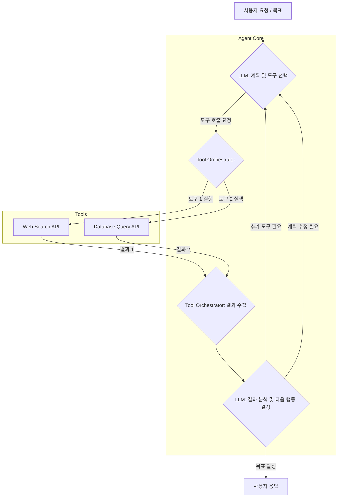

복잡한 비즈니스 프로세스 자동화 및 사용자 인터랙션 개선에 있어 AI 에이전트의 역할은 점점 더 중요해지고 있습니다. 특히, 단일 기능에 국한되지 않고 다양한 외부 도구(Tools)를 활용하여 지능적으로 태스크를 수행하는 다중 도구 AI 에이전트(Multi-Tool AI Agent)는 2026년 이후 AI 시스템의 핵심 동력으로 자리 잡을 것입니다. 이러한 에이전트는 검색 엔진, 데이터베이스, API, 심지어 다른 AI 모델과 같은 다양한 리소스와 상호작용하며 복합적인 문제를 해결할 수 있는 능력을 갖춥니다. 효과적인 다중 도구 AI 에이전트를 구축하기 위한 설계 패턴은 시스템의 확장성, 안정성, 효율성을 결정하는 중요한 요소입니다.

## 핵심 개념: 도구(Tool)와 오케스트레이션(Orchestration)

다중 도구 AI 에이전트는 기본적으로 LLM(Large Language Model)의 추론 능력과 외부 도구의 실행 능력을 결합합니다. 여기서 도구는 특정 기능을 수행하는 모듈화된 인터페이스이며, 오케스트레이션은 LLM이 주어진 목표를 달성하기 위해 어떤 도구를 언제, 어떻게 사용할지 결정하고 조정하는 과정입니다.

### 도구 정의 (Tool Definition)

각 도구는 명확한 기능 설명(description), 입력 스키마(input schema), 그리고 출력 형식을 가집니다. 이는 LLM이 도구의 목적과 사용법을 정확히 이해하고 적절한 인자를 전달할 수 있도록 돕습니다. 예를 들어, `search_web` 도구는 `query`라는 문자열 인자를 받아 웹 검색 결과를 반환하고, `get_weather` 도구는 `city`와 `date` 인자를 받아 기상 정보를 제공할 수 있습니다.

### 도구 오케스트레이션 (Tool Orchestration)

오케스트레이션은 에이전트의 '두뇌' 역할을 합니다. 여기에는 다음 단계가 포함됩니다:

1.  **계획 (Planning)**: 주어진 목표를 달성하기 위한 단계별 전략 수립. 이 과정에서 필요한 도구를 식별합니다.
2.  **선택 (Selection)**: 사용 가능한 도구 중에서 현재 단계에 가장 적합한 도구를 선택합니다.
3.  **실행 (Execution)**: 선택된 도구를 호출하고 필요한 인자를 전달하여 실행합니다.
4.  **관찰 및 반성 (Observation & Reflection)**: 도구 실행 결과를 분석하고, 다음 단계를 계획하거나 초기 계획을 수정합니다.

## 다중 도구 에이전트 설계 패턴

### 1. 순차적 도구 사용 패턴 (Sequential Tool Use)

가장 기본적인 패턴으로, 에이전트가 한 번에 하나의 도구를 사용하며, 이전 도구의 결과가 다음 도구의 입력으로 사용될 수 있습니다. 복잡하지만 선형적인 태스크에 적합합니다.

### 2. 병렬적 도구 사용 패턴 (Parallel Tool Use)

여러 도구를 동시에 실행하고 그 결과를 취합하여 다음 단계로 넘어가는 패턴입니다. 독립적인 정보를 동시에 수집해야 할 때 유용하며, 처리 시간을 단축시킬 수 있습니다.

### 3. 동적 도구 선택 패턴 (Dynamic Tool Selection)

LLM이 현재 컨텍스트와 목표에 따라 동적으로 도구를 선택하는 패턴입니다. 이는 ReAct(Reasoning and Acting) 프레임워크와 같은 접근 방식에서 주로 사용되며, 에이전트의 유연성을 극대화합니다.

```python
import json

# 가상의 도구 정의
def search_web(query: str) -> str:
    """Performs a web search for the given query and returns the top results."""
    print(f"Executing search_web with query: '{query}'")
    if "AI 에이전트" in query:
        return "AI 에이전트란 목표를 달성하기 위해 환경과 상호작용하는 자율 시스템입니다."
    return "No relevant search results found."

def get_weather(city: str) -> str:
    """Fetches the current weather for a specified city."""
    print(f"Executing get_weather for city: '{city}'")
    if city == "Seoul":
        return "Seoul: Sunny, 25°C"
    return f"Weather for {city}: Not available."

class Agent:
    def __init__(self):
        self.tools = {
            "search_web": search_web,
            "get_weather": get_weather
        }

    def invoke_tool(self, tool_name: str, args: dict) -> str:
        if tool_name not in self.tools:
            return f"Error: Tool '{tool_name}' not found."
        try:
            return self.tools[tool_name](**args)
        except TypeError as e:
            return f"Error invoking tool '{tool_name}': {e}"

    def process_query(self, query: str) -> str:
        # 이 부분은 실제 LLM 호출을 시뮬레이션합니다.
        # LLM은 쿼리를 분석하여 적절한 도구 호출을 결정합니다.
        if "AI 에이전트가 뭔가요" in query:
            tool_call = {"tool_name": "search_web", "args": {"query": "AI 에이전트 정의"}}
        elif "서울 날씨 알려줘" in query:
            tool_call = {"tool_name": "get_weather", "args": {"city": "Seoul"}}
        else:
            return f"Understood: {query}. No specific tool call generated."
        
        print(f"Agent decided to call tool: {tool_call['tool_name']} with args: {tool_call['args']}")
        result = self.invoke_tool(tool_call["tool_name"], tool_call["args"])
        return f"Tool result: {result}"

# 에이전트 사용 예시
agent = Agent()
print(agent.process_query("AI 에이전트가 뭔가요?"))
print(agent.process_query("오늘 서울 날씨 알려줘?"))
print(agent.process_query("점심 메뉴 추천해줘"))
```

### 4. 자기 교정 도구 사용 패턴 (Self-Correcting Tool Use)

도구 실행 결과가 기대와 다를 경우, 에이전트가 이를 인지하고 계획을 수정하거나 다른 도구를 시도하는 패턴입니다. 이는 에러 처리 및 강건성(robustness)에 필수적입니다. LLM의 반성(reflection) 능력을 활용하여 도구 사용의 실패 원인을 분석하고, 재시도 전략을 수립하는 방식으로 구현됩니다.

## 2026년 다중 도구 AI 에이전트 트렌드

미래의 다중 도구 AI 에이전트는 단순한 도구 호출을 넘어설 것입니다.

*   **심층적인 맥락 이해 기반 도구 선택**: 더 큰 맥락 윈도우(context window)와 강화된 추론 능력으로, 에이전트는 장기적인 목표와 사용자 선호를 기반으로 도구를 더욱 정교하게 선택할 것입니다.
*   **능동적 도구 발견 및 학습**: 새로운 도구가 등장하거나 기존 도구의 기능이 업데이트될 때, 에이전트가 이를 자율적으로 발견하고 사용법을 학습하여 통합하는 기능이 중요해집니다.
*   **인간-에이전트 협업 강화**: 도구 사용 결정 과정에서 인간의 피드백을 실시간으로 반영하거나, 복잡한 도구 체인을 인간이 쉽게 검토하고 수정할 수 있는 인터페이스가 발전할 것입니다.
*   **멀티모달 도구 상호작용**: 텍스트 기반 도구 외에도 이미지, 오디오, 비디오를 처리하는 멀티모달 도구와의 상호작용이 보편화되어, 더욱 풍부한 태스크 처리가 가능해집니다.



## 트레이드오프

다중 도구 AI 에이전트 설계에는 여러 트레이드오프가 존재하며, 프로젝트의 요구사항에 따라 신중한 선택이 필요합니다.

*   **복잡성과 유연성**: 동적 도구 선택 패턴은 높은 유연성을 제공하지만, 에이전트의 행동을 예측하고 디버깅하기 어렵게 만듭니다. 언제 좋은가: 광범위하고 예측 불가능한 태스크. 언제 나쁜가: 엄격한 제어와 높은 예측 가능성이 요구되는 금융, 의료 시스템.
*   **성능과 정확성**: 병렬 도구 사용은 처리 시간을 단축시키지만, 각 도구의 실행 의존성을 잘못 관리하면 부정확한 결과로 이어질 수 있습니다. 언제 좋은가: 독립적인 데이터 수집이 많은 정보 검색 태스크. 언제 나쁜가: 순서에 민감하거나 각 단계의 출력이 다음 단계의 정확성을 결정하는 태스크.
*   **도구 커버리지와 비용**: 더 많은 도구를 통합할수록 에이전트가 해결할 수 있는 태스크 범위가 넓어지지만, 각 도구의 개발, 유지보수, 그리고 호출 비용이 증가합니다. 언제 좋은가: 다양한 전문 지식이 필요한 복합 문제 해결. 언제 나쁜가: 특정 도메인에 한정된 간단한 태스크.
*   **보안과 기능**: 강력한 도구 접근 제어(guardrails)를 구현하면 보안성은 향상되지만, 에이전트가 필요한 도구에 접근하지 못하게 되어 기능이 제한될 수 있습니다. 언제 좋은가: 민감한 데이터나 시스템 접근이 필요한 엔터프라이즈 환경. 언제 나쁜가: 신속한 프로토타이핑이나 공개 데이터만 다루는 개인 프로젝트.

## 실전 체크리스트

다중 도구 AI 에이전트 프로젝트에 이 지식을 적용할 때 다음 항목들을 검증합니다.

*   [ ] **도구 명세의 명확성**: 모든 도구가 LLM이 이해하기 쉬운 명확한 `description`과 정확한 `input schema` (JSON Schema 권장)를 가지는가?
*   [ ] **에이전트의 추론 능력 검증**: 에이전트가 복잡한 요청에 대해 올바른 도구 사용 계획(Planning)을 수립하고, 적절한 도구를 선택하는지 다양한 시나리오로 테스트했는가?
*   [ ] **에러 핸들링 및 재시도 로직**: 도구 실행 실패 시 에이전트가 이를 인지하고, 재시도, 대체 도구 사용, 또는 사용자에게 상황 보고 등의 적절한 대응을 수행하는가?
*   [ ] **보안 및 접근 제어**: 각 도구가 접근하는 외부 시스템에 대한 인증, 권한 부여, 그리고 Rate Limiting이 적절하게 구현되어 있는가? 특히 민감한 데이터 접근 도구에 대한 가드레일은 충분한가?
*   [ ] **컨텍스트 관리 효율성**: 장기적인 대화 또는 복잡한 태스크에서 에이전트가 도구 호출 기록과 결과를 효율적으로 컨텍스트 윈도우 내에 유지하며, 불필요한 정보는 정리하는가?
*   [ ] **성능 측정 및 최적화**: 에이전트의 도구 오케스트레이션 단계에서 Latency가 발생하는 지점을 식별하고, 병렬 처리나 캐싱 등의 최적화 기법을 적용했는가?
*   [ ] **확장성 고려**: 새로운 도구의 추가나 기존 도구의 기능 변경 시, 에이전트 시스템에 미치는 영향이 최소화되도록 모듈화되고 유연하게 설계되었는가?