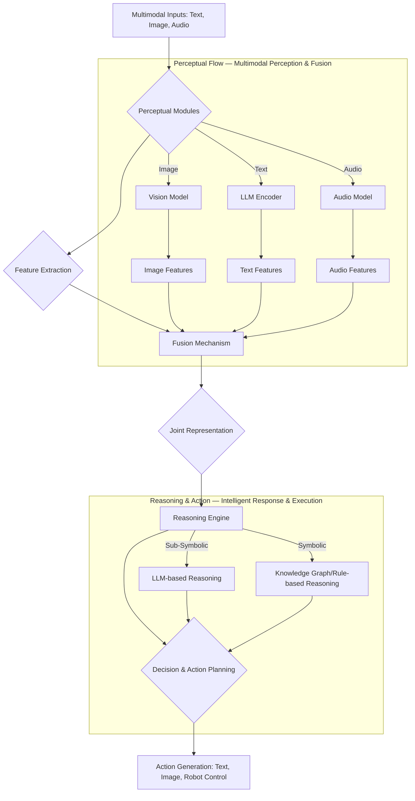

### 멀티모달 에이전트 디자인 패턴: 다양한 인지 능력 통합
멀티모달 에이전트는 텍스트 기반 AI의 한계를 넘어, 이미지, 음성, 비디오 등 다양한 형태의 데이터를 이해하고 상호작용하는 차세대 AI 시스템의 핵심이다. 2026년 현재, 이러한 에이전트의 활용은 복잡한 물리적 환경 이해, 실시간 의사결정, 창의적 콘텐츠 생성 등 폭넓은 분야로 확장되고 있으며, 효과적인 디자인 패턴 학습이 필수적이다. 멀티모달 에이전트는 인간과 유사한 방식으로 세상을 인지하고 반응함으로써, 더욱 자연스럽고 강력한 인공지능 애플리케이션 개발을 가능하게 한다.

### 핵심 개념
멀티모달 에이전트는 여러 모달리티(modality)에서 정보를 수집, 처리, 융합하여 더 풍부한 상황 인식을 구축하고, 이를 기반으로 복잡한 의사결정 및 행동을 수행한다. 주요 구성 요소는 다음과 같다:
*   **Perceptual Modules (인지 모듈)**: 각 모달리티별로 데이터를 처리하고 특징을 추출. (예: Vision Transformer (ViT), Wav2Vec 2.0).
*   **Fusion Mechanism (융합 메커니즘)**: 추출된 모달리티별 특징을 통합하여 종합적인 표현(joint representation)을 생성. (예: Early, Late, Hybrid fusion).
*   **Reasoning Engine (추론 엔진)**: 융합된 표현을 바탕으로 목표 달성을 위한 추론, 계획, 의사결정 수행. (Large Language Model (LLM) 활용).
*   **Action Generation (행동 생성)**: 추론 결과를 바탕으로 외부 환경에 영향을 미치는 행동 생성.

### 주요 디자인 패턴

#### 1. Sensor Fusion Pattern (센서 융합 패턴)
다양한 모달리티 정보를 통합하여 포괄적인 환경 이해를 구축한다.
*   **Early Fusion (초기 융합)**: 원시 데이터 또는 저수준 특징 단계에서 결합. 빠른 처리, 상호작용 학습에 유리하나 노이즈 취약.
*   **Late Fusion (후기 융합)**: 모달리티별 독립 처리 후, 고수준 특징이나 최종 예측 단계에서 통합. 유연성 높으나 미묘한 상호작용 놓칠 수 있음.
*   **Hybrid Fusion (하이브리드 융합)**: 초기 및 후기 융합의 장점 결합. 복잡도가 높지만 균형 잡힌 성능 기대.

#### 2. Adaptive Perception Pattern (적응형 인지 패턴)
에이전트가 상황이나 작업 요구사항에 따라 동적으로 모달리티 활성화 및 처리 깊이를 결정한다. 컴퓨팅 자원을 효율적으로 사용하고 불필요한 정보 처리 지연을 줄인다.

#### 3. Hybrid Reasoning Pattern (하이브리드 추론 패턴)
멀티모달 데이터 해석 및 의사결정에 **sub-symbolic (비상징적)** (LLM)과 **symbolic (상징적)** (규칙, 지식 그래프) 추론 방식을 결합한다. LLM의 유연성과 상징적 시스템의 논리적 정확성을 통해 견고성과 설명 가능성(explainability)을 높인다.



#### 4. Contextual Grounding Pattern (상황 기반 접지 패턴)
에이전트가 모달리티 데이터를 실제 세계의 컨텍스트(context)와 연결하여 이해를 심화한다. RAG (Retrieval Augmented Generation) 패턴을 멀티모달 데이터에 확장 적용하여 환각(hallucination)을 줄이고 현실 기반 응답을 생성한다.

#### 5. Tool-Augmented Multimodal Agent Pattern (도구 증강 멀티모달 에이전트 패턴)
에이전트가 자체 처리 어려운 작업을 위해 외부 도구(tools)를 활용하도록 설계한다. 이미지 분석 도구, 음성 합성 엔진, 비디오 처리 라이브러리 등 다양한 모달리티 처리 도구를 호출하여 능력을 확장한다.

```python
import base64
from io import BytesIO
from PIL import Image

class MultimodalAgent:
    def __init__(self, llm_client, vision_client, audio_client, tool_registry):
        self.llm = llm_client
        self.vision = vision_client
        self.audio = audio_client
        self.tools = tool_registry

    def process_image(self, image_data_b64):
        image_bytes = base64.b64decode(image_data_b64)
        image = Image.open(BytesIO(image_bytes))
        vision_output = self.vision.analyze(image)
        return vision_output

    def process_audio(self, audio_data_b64):
        audio_bytes = base64.b64decode(audio_data_b64)
        audio_transcript = self.audio.transcribe(audio_bytes)
        return audio_transcript

    def decide_action(self, text_input, image_features=None, audio_features=None):
        prompt_parts = [
            {"role": "user", "content": text_input}
        ]
        if image_features:
            prompt_parts.append({"role": "system", "content": f"Image context: {image_features}"})
        if audio_features:
            prompt_parts.append({"role": "system", "content": f"Audio context: {audio_features}"})
        
        response = self.llm.chat.completions.create(
            model="gpt-4o",
            messages=prompt_parts,
            tools=[{"type": "function", "function": {"name": "summarize_document", "description": "Summarizes a given document."}}]
        )
        
        if response.choices[0].message.tool_calls:
            tool_call = response.choices[0].message.tool_calls[0]
            tool_name = tool_call.function.name
            tool_args = tool_call.function.arguments
            if tool_name in self.tools:
                print(f"Calling tool: {tool_name} with args: {tool_args}")
                tool_output = self.tools[tool_name](**eval(tool_args))
                return f"Tool {tool_name} output: {tool_output}"
            else:
                return "Error: Tool not found."
        else:
            return response.choices[0].message.content

# Example usage (simplified mocks)
class MockLLM:
    def chat(self):
        class Completions:
            def create(self, model, messages, tools=None):
                class Choice:
                    class Message:
                        def __init__(self, content=None, tool_calls=None):
                            self.content = content
                            self.tool_calls = tool_calls
                    def __init__(self, message):
                        self.message = message
                user_msg = messages[0]["content"]
                if "summarize a document" in user_msg.lower():
                    tool_calls = [
                        type('obj', (object,), {
                            'function': type('obj', (object,), {
                                'name': 'summarize_document',
                                'arguments': '{"document_text": "This is a sample document to summarize."}'
                            })
                        })()
                    ]
                    return type('obj', (object,), {'choices': [Choice(Choice.Message(tool_calls=tool_calls))]})()
                else:
                    return type('obj', (object,), {'choices': [Choice(Choice.Message(content=f"Processed: {user_msg}"))]})()
        return Completions()

class MockVision:
    def analyze(self, image):
        return "Detected objects: cat, dog"

class MockAudio:
    def transcribe(self, audio_bytes):
        return "User said: Please summarize a document."

def summarize_doc_tool(document_text):
    return f"Summary of '{document_text[:20]}...': This is a brief summary."

mock_llm = MockLLM()
mock_vision = MockVision()
mock_audio = MockAudio()
tool_registry = {"summarize_document": summarize_doc_tool}

agent = MultimodalAgent(mock_llm, mock_vision, mock_audio, tool_registry)

text_query = "What do you see in this image and then summarize a document for me?"
sample_image_b64 = base64.b64encode(b"R0lGODlhAQABAIAAAAAAAP///yH5BAEAAAAALAAAAAABAAEAAAIBRAA7").decode('utf-8')
sample_audio_b64 = base64.b64encode(b"Simulated audio data").decode('utf-8')

vision_features = agent.process_image(sample_image_b64)
audio_transcript = agent.process_audio(sample_audio_b64)

response = agent.decide_action(text_query, vision_features, audio_transcript)
print(response)
```

### ## 트레이드오프

*   **성능 vs. 복잡성**:
    *   **언제 좋은가**: 복잡한 현실 세계 문제 해결이나 인간 유사 상호작용 필요 시 멀티모달 에이전트는 탁월한 성능을 제공. 다양한 모달리티 정보의 상호 보완으로 깊이 있는 이해 가능.
    *   **언제 나쁜가**: 시스템 설계, 개발, 배포, 유지보수가 단일 모달리티 에이전트보다 훨씬 복잡. 각 모달리티 모델 통합, 데이터 융합, 자원 관리, 에러 처리 등이 복잡도를 크게 증가. 간단한 작업에는 과도한 오버헤드.

*   **자원 효율성 vs. 인지 능력**:
    *   **언제 좋은가**: 많은 양의 다양한 정보를 처리함으로써 에이전트의 인지 능력과 상황 이해도가 극대화. 미묘한 뉘앙스 파악이나 예측 불가능한 상황 대응에 필수적.
    *   **언제 나쁜가**: 각 모달리티별 모델과 융합 모듈은 상당한 컴퓨팅 자원(GPU, 메모리)과 에너지 소비 요구. 실시간 처리가 필요한 경우, 높은 인지 능력은 막대한 자원 비용 및 지연 시간(latency) 증가로 이어짐. 제한된 자원 환경(예: 엣지 디바이스)에서는 적용 어려움.

*   **일반화 능력 vs. 특정 도메인 최적화**:
    *   **언제 좋은가**: 다양한 모달리티를 통해 학습된 에이전트는 새로운 환경이나 task에 대한 일반화 능력이 우수. 여러 감각 정보가 학습에 활용되므로, 특정 모달리티 입력 부족 시 다른 모달리티로 보완 가능.
    *   **언제 나쁜가**: 광범위한 멀티모달 데이터 학습은 특정 도메인에 대한 깊이 있는 이해나 최적화된 성능 달성을 어렵게 만들 수 있음. 특정 산업 분야의 정밀한 작업에는 해당 도메인에 특화된 단일 모달리티 에이전트가 더 효율적일 수 있음.

*   **견고성 vs. 데이터 종속성**:
    *   **언제 좋은가**: 한 모달리티에 노이즈나 오류 발생 시 다른 모달리티가 이를 보완하여 시스템의 견고성(robustness) 향상. 실제 세계의 불확실한 환경에서 안정적 작동 기여.
    *   **언제 나쁜가**: 고품질의 레이블링된 멀티모달 데이터셋 구축은 매우 어렵고 비용 소모적. 데이터 불균형이나 품질 문제는 에이전트 성능에 치명적 영향. 모달리티 간 정렬(alignment) 문제 발생 가능성 높음.

### ## 실전 체크리스트

*   **[ ] 모달리티 선정 및 데이터 가용성 확인**: 목표 에이전트 기능에 필요한 모달리티를 정의하고, 각 모달리티에 대한 고품질 학습 및 검증 데이터셋 확보 가능성을 검토했는가?
*   **[ ] 융합 전략 설계**: 에이전트의 응답 속도, 정확성, 설명 가능성 요구사항을 고려하여 Early, Late, Hybrid Fusion 중 적합한 전략을 결정하고 설계했는가? 모달리티 간의 시간적/공간적 정렬(temporal/spatial alignment) 문제를 어떻게 처리할 것인가?
*   **[ ] 추론 엔진 최적화**: LLM 기반 비상징적 추론과 규칙/지식 그래프 기반 상징적 추론의 조합 비중을 결정하고, 각 추론 방식의 장점을 활용할 아키텍처를 설계했는가?
*   **[ ] 도구 연동 및 확장성**: 에이전트 능력 확장을 위해 어떤 외부 도구(Computer Vision 모델, TTS API, 데이터베이스 등)를 연동할지 명확히 하고, 새로운 도구 추가가 용이하도록 모듈화된 인터페이스를 설계했는가?
*   **[ ] 실시간 처리 및 지연 시간(Latency) 관리**: 에이전트의 실시간 처리 능력에 맞춰 각 모달리티 처리 및 융합 단계에서의 지연 시간 최소화를 위한 방안(경량화 모델, 병렬 처리)을 마련했는가?
*   **[ ] 안전성 및 윤리적 고려 사항**: 멀티모달 에이전트가 생성할 수 있는 유해하거나 편향된 출력 방지를 위한 가드레일(guardrails), 필터링, 사용자 피드백 메커니즘을 설계에 포함했는가?
*   **[ ] 모니터링 및 디버깅 도구**: 복잡한 멀티모달 에이전트의 동작 추적 및 문제 원인 파악을 위해, 각 모달리티 처리 단계, 융합 결과, 추론 과정 등을 시각화하고 로그를 기록할 모니터링 및 디버깅 시스템을 구축했는가?