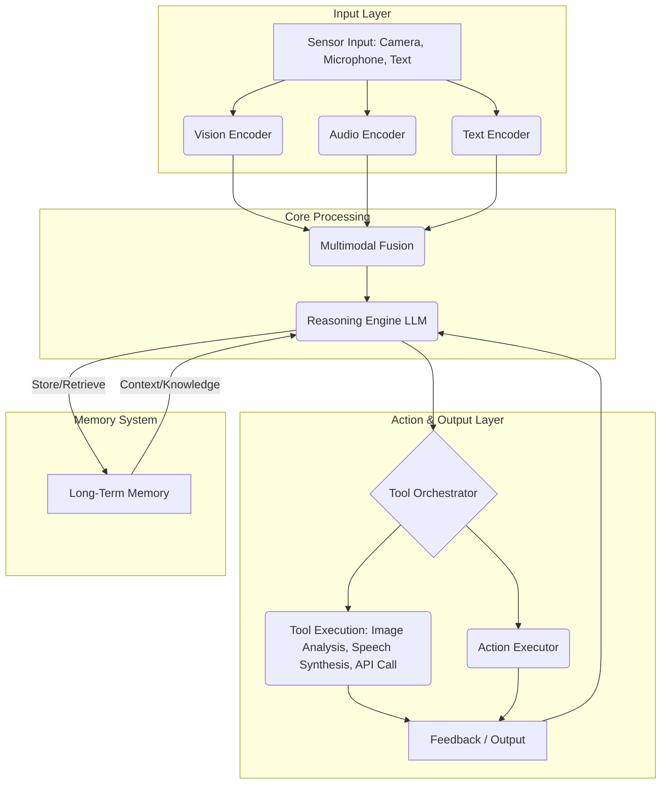

2026년에는 텍스트를 넘어 이미지, 오디오, 비디오 등 다양한 모달리티(modality)의 데이터를 복합적으로 이해하고 처리하는 멀티모달 에이전트(Multimodal Agents)의 중요성이 더욱 부각될 것입니다. 이는 단순한 정보 통합을 넘어, 현실 세계의 복잡한 맥락을 파악하고 더욱 정교한 의사결정과 행동을 가능하게 합니다. 본 문서는 멀티모달 에이전트를 설계하기 위한 핵심 원칙과 실용적인 구현 전략을 다룹니다.

## 멀티모달 에이전트의 필요성

기존의 텍스트 기반 에이전트들은 언어적 추론에 능숙하지만, 시각적 정보나 청각적 신호가 결여된 환경에서는 제한적인 성능을 보입니다. 예를 들어, 웹 페이지의 텍스트를 분석하는 것은 가능하지만, 이미지 속의 밈(meme)을 이해하거나 오디오에서 감정을 감지하는 것은 어렵습니다. 멀티모달 에이전트는 이러한 한계를 극복하고, 인간이 세상을 인지하는 방식과 유사하게 다양한 감각 정보를 통합하여 더 풍부하고 정확한 상황 인식을 제공합니다. 이는 복잡한 대화 시스템, 자율 주행, 의료 진단, 스마트 제조 등 광범위한 분야에서 혁신적인 응용 가능성을 열어줍니다.

## 핵심 설계 원칙

멀티모달 에이전트의 성공적인 설계는 다음 원칙들을 기반으로 합니다.

### 1. 모듈화된 아키텍처 (Modular Architecture)
각 모달리티별 인코더(Encoder), 멀티모달 퓨전(Fusion) 계층, 추론 엔진(Reasoning Engine), 도구 사용(Tool Use) 및 액션(Action) 모듈을 명확히 분리하여 설계합니다. 이는 각 컴포넌트의 독립적인 개발, 테스트, 최적화를 가능하게 하며, 새로운 모달리티나 도구의 추가를 용이하게 합니다.

### 2. 강력한 멀티모달 퓨전 전략 (Robust Multimodal Fusion Strategy)
서로 다른 모달리티에서 추출된 특징(feature)들을 효과적으로 결합하는 것이 핵심입니다. 초기 단계에서 특징을 결합하는 초기 퓨전(Early Fusion), 각 모달리티를 독립적으로 처리한 후 최종 결정 단계에서 결합하는 후기 퓨전(Late Fusion), 또는 LLM 내부에서 직접 다양한 모달리티 토큰을 처리하는 중기 퓨전(Intermediate Fusion) 등 다양한 전략 중 시나리오에 적합한 것을 선택해야 합니다.

### 3. 동적 도구 통합 (Dynamic Tool Integration)
에이전트가 특정 모달리티 데이터를 처리하거나 외부 시스템과 상호작용하기 위해 다양한 도구를 호출할 수 있도록 설계합니다. 예를 들어, 이미지 분석을 위한 컴퓨터 비전 모델, 음성 인식을 위한 STT(Speech-to-Text) 모델, 특정 정보를 검색하기 위한 API 호출 도구 등을 포함합니다. 2026년에는 에이전트가 자체적으로 필요한 도구를 탐색하고 통합하는 능력도 중요해질 것입니다.

### 4. 적응형 추론 및 학습 (Adaptive Reasoning and Learning)
LLM을 핵심 추론 엔진으로 활용하되, 멀티모달 입력에 따라 추론 방식을 유연하게 조정할 수 있어야 합니다. 또한, 에이전트의 행동 결과와 외부 피드백을 통해 지속적으로 학습하고 성능을 개선하는 메커니즘이 필수적입니다.

### 5. 투명성과 설명 가능성 (Transparency and Explainability)
멀티모달 에이전트의 의사결정 과정이 복잡해질수록, 어떤 모달리티 정보가 최종 결정에 가장 큰 영향을 미쳤는지 이해하는 것이 중요합니다. 이는 디버깅, 감사, 사용자 신뢰 확보에 필수적입니다.

## 멀티모달 에이전트 아키텍처 개요

다음 Mermaid 다이어그램은 멀티모달 에이전트의 일반적인 데이터 흐름과 구성 요소를 보여줍니다.



위 다이어그램은 센서 입력이 각 모달리티별 인코더를 통해 처리된 후, Multimodal Fusion 레이어에서 통합되는 과정을 보여줍니다. 통합된 정보는 Reasoning Engine (LLM)으로 전달되어 추론을 수행하며, 필요에 따라 Tool Orchestrator를 통해 외부 도구를 호출하거나 직접 Action Executor를 통해 행동을 실행합니다. 모든 과정은 Feedback/Output을 생성하고, Long-Term Memory 시스템을 통해 지속적으로 학습하고 맥락을 유지합니다.

## 구현 예시 (Python)

아래 Python 코드는 멀티모달 에이전트의 핵심 기능인 다양한 모달리티 입력 처리와 도구 사용을 간략하게 시뮬레이션합니다. 2026년에는 실제 LLM과 통합된 더욱 정교한 도구들이 활용될 것입니다.

```python
import base64
from io import BytesIO
from PIL import Image

class MultimodalAgent:
    def __init__(self, llm_api_client, tool_registry):
        self.llm = llm_api_client
        self.tool_registry = tool_registry
        self.memory = [] # Simplified short-term memory

    def _encode_image(self, image_path):
        """이미지 파일을 Base64 문자열로 인코딩 (LLM 입력용)"""
        if isinstance(image_path, Image.Image):
            buffered = BytesIO()
            image_path.save(buffered, format="PNG")
            return base64.b64encode(buffered.getvalue()).decode("utf-8")
        with open(image_path, "rb") as image_file:
            return base64.b64encode(image_file.read()).decode("utf-8")

    def process_multimodal_input(self, text_input: str, image_input_path=None, audio_input_path=None):
        """
        다중 모달 입력을 처리하고 에이전트의 반응을 생성합니다.
        """
        messages = [{"role": "user", "content": text_input}]

        if image_input_path:
            image_base64 = self._encode_image(image_input_path)
            messages.append({"type": "image_url", "image_url": {"url": f"data:image/png;base64,{image_base64}"}})
            print(f"DEBUG: Image processed from {image_input_path}")

        # (2026 트렌드 반영) 오디오 입력 처리는 STT 모델을 통해 텍스트 변환 후 LLM에 전달.
        if audio_input_path:
            # 실제 구현에서는 STT (Speech-to-Text) 모델을 호출합니다.
            transcribed_text = self.tool_registry.get_tool("speech_to_text").run(audio_input_path)
            messages.append({"role": "user", "content": f"음성 입력: {transcribed_text}"})
            print(f"DEBUG: Audio transcribed to: {transcribed_text}")

        # LLM 호출 (가상의 API 클라이언트)
        print("DEBUG: Calling LLM with multimodal input...")
        llm_response = self.llm.chat_completion(messages)
        print(f"DEBUG: LLM Raw Response: {llm_response}")

        # LLM 응답 파싱 및 도구 사용 결정
        if "tool_calls" in llm_response:
            tool_output = self._execute_tool_calls(llm_response["tool_calls"])
            messages.append({"role": "tool", "tool_output": tool_output})
            # 도구 실행 후 다시 LLM 호출하여 최종 응답 생성
            final_response = self.llm.chat_completion(messages)
            return final_response
        else:
            return llm_response["content"]

    def _execute_tool_calls(self, tool_calls):
        """LLM이 요청한 도구를 실행합니다."""
        results = {}
        for tool_call in tool_calls:
            tool_name = tool_call["name"]
            tool_args = tool_call["arguments"]
            if tool_name in self.tool_registry:
                tool = self.tool_registry.get_tool(tool_name)
                print(f"DEBUG: Executing tool: {tool_name} with args {tool_args}")
                tool_result = tool.run(**tool_args)
                results[tool_name] = tool_result
            else:
                results[tool_name] = f"Error: Tool {tool_name} not found."
        return results

class MockLLMApiClient:
    def chat_completion(self, messages):
        # 메시지에서 텍스트 부분만 추출하여 응답 생성 (간소화)
        # 실제 LLM은 이미지, 오디오 메타데이터를 직접 처리
        text_content = ""
        for msg in messages:
            if isinstance(msg, dict) and "content" in msg:
                text_content += msg["content"] + " "
            elif isinstance(msg, dict) and "image_url" in msg:
                text_content += " (이미지 첨부됨) "
            elif isinstance(msg, dict) and "tool_output" in msg:
                text_content += f" (도구 결과: {msg['tool_output']}) "

        if "날씨" in text_content:
            return {"tool_calls": [{"name": "get_weather", "arguments": {"location": "Seoul"}}]}
        if "요약" in text_content:
            return {"tool_calls": [{"name": "summarize_text", "arguments": {"text": text_content}}]}
        if "음성 입력" in text_content and "사진 내용" in text_content:
            return {"content": "음성으로 질문하신 내용과 사진 내용을 종합하여 처리했습니다."}
        if "사진 내용" in text_content:
            return {"content": "사진 내용을 이해하고 있습니다. 추가 질문이 있으신가요?"}

        return {"content": f"요청을 받았습니다: {text_content}. 멀티모달 처리를 준비 중입니다."}

class MockToolRegistry:
    def __init__(self):
        self.tools = {
            "get_weather": MockWeatherTool(),
            "summarize_text": MockSummarizationTool(),
            "speech_to_text": MockSpeechToTextTool()
        }

    def get_tool(self, name):
        return self.tools.get(name)

    def __contains__(self, name):
        return name in self.tools

class MockWeatherTool:
    def run(self, location):
        return f"{location}의 현재 날씨는 맑고 25도입니다."

class MockSummarizationTool:
    def run(self, text):
        return f"'{text[:50]}...'에 대한 요약입니다."

class MockSpeechToTextTool:
    def run(self, audio_path):
        # 실제 STT 모델 호출 대신 더미 응답
        return f"오디오 파일 '{audio_path}'에서 '사진 내용에 대해 알려주세요'라고 인식했습니다."


# --- 사용 예시 ---
if __name__ == "__main__":
    llm_client = MockLLMApiClient()
    tool_reg = MockToolRegistry()
    agent = MultimodalAgent(llm_client, tool_reg)

    # 1. 텍스트 + 이미지 입력 (가상의 이미지 파일 생성)
    dummy_image = Image.new('RGB', (60, 30), color = 'red')
    dummy_image.save("dummy_image.png")

    print("--- Scenario 1: Text + Image ---")
    response1 = agent.process_multimodal_input(
        text_input="이 사진의 내용을 분석하고 설명해주세요.",
        image_input_path="dummy_image.png"
    )
    print(f"Agent Response (1): {response1}")
    print("\n")

    # 2. 텍스트 입력 + 도구 사용 (날씨 조회)
    print("--- Scenario 2: Text + Tool Call ---")
    response2 = agent.process_multimodal_input(
        text_input="서울의 현재 날씨는 어떤가요?"
    )
    print(f"Agent Response (2): {response2}")
    print("\n")

    # 3. 텍스트 + 오디오 입력 (2026년 트렌드 반영)
    print("--- Scenario 3: Text + Audio (STT via Tool) ---")
    response3 = agent.process_multimodal_input(
        text_input="사진 내용에 대해 궁금합니다.",
        audio_input_path="audio_description.wav" # 가상의 오디오 파일
    )
    print(f"Agent Response (3): {response3}")
    print("\n")
```

위 코드는 `MultimodalAgent` 클래스가 `MockLLMApiClient`와 `MockToolRegistry`를 활용하여 텍스트, 이미지, 오디오 입력을 처리하고, LLM의 판단에 따라 적절한 도구를 호출하는 과정을 보여줍니다. 특히, 오디오 입력은 `speech_to_text` 도구를 통해 텍스트로 변환된 후 LLM에 전달되어 처리되는 2026년의 일반적인 패턴을 반영합니다.

## 트레이드오프

멀티모달 에이전트를 설계할 때 고려해야 할 주요 트레이드오프는 다음과 같습니다.

*   **통합 엔코더 vs. 개별 엔코더**: 
    *   **통합 엔코더 (예: Multi-modal LLM 자체)**: LLM이 직접 다양한 모달리티 토큰을 처리하여 특징 추출과 퓨전을 한 번에 수행합니다. `언제 좋고`: 복잡한 모달리티 간의 미묘한 상호작용을 포착하고 End-to-End 최적화에 유리합니다. `언제 나쁜지`: 특정 모달리티에 특화된 정교한 전처리나 최적화가 어렵고, 모델 크기가 커지며 학습 및 추론 비용이 높습니다.
    *   **개별 엔코더 + 퓨전 레이어**: 각 모달리티별로 최적화된 독립적인 인코더(예: Vision Transformer, Audio Transformer)를 사용하고, 그 특징들을 별도의 퓨전 레이어에서 결합합니다. `언제 좋고`: 각 모달리티별로 최고 성능의 모델을 활용하고 유연하게 교체할 수 있으며, 디버깅이 용이합니다. `언제 나쁜지`: 모달리티 간의 깊은 상호작용 학습이 어려울 수 있고, 퓨전 전략 설계가 복잡합니다.

*   **중앙 집중식 추론 vs. 분산 추론**: 
    *   **중앙 집중식**: 하나의 강력한 LLM이 모든 멀티모달 정보를 통합하여 추론합니다. `언제 좋고`: 아키텍처가 단순하고 일관된 전역적 관점의 추론이 가능합니다. `언제 나쁜지`: 단일 실패 지점(Single Point of Failure)이 될 수 있고, 확장성 및 지연 시간(latency) 문제에 직면할 수 있습니다.
    *   **분산식**: 여러 에이전트 또는 소형 LLM이 특정 모달리티 또는 서브태스크를 전담하여 추론하고 결과를 통합합니다. `언제 좋고`: 높은 확장성과 복원력을 제공하며, 특정 태스크의 추론 속도를 최적화할 수 있습니다. `언제 나쁜지`: 에이전트 간의 통신 오버헤드와 일관성 유지가 어렵고, 전체 시스템의 복잡도가 증가합니다.

*   **실시간 처리 vs. 배치 처리**: 
    *   **실시간 처리**: 낮은 지연 시간으로 즉각적인 반응이 필요한 애플리케이션(예: 자율주행, 실시간 대화). `언제 좋고`: 사용자 경험이 중요하고 즉각적인 응답이 필수적인 경우. `언제 나쁜지`: 높은 컴퓨팅 자원 요구 사항과 복잡한 최적화 기술이 필요하며, 비용이 많이 듭니다.
    *   **배치 처리**: 지연 시간에 비교적 관대한 애플리케이션(예: 보고서 생성, 오프라인 데이터 분석). `언제 좋고`: 대량의 데이터를 효율적으로 처리하고 비용을 절감할 수 있는 경우. `언제 나쁜지`: 실시간 상호작용이 불가능하며, 빠른 의사결정이 필요한 시나리오에는 부적합합니다.

## 실전 체크리스트

멀티모달 에이전트를 프로젝트에 적용할 때 다음 항목들을 검증하세요.

*   [ ] **지원 모달리티 및 도구 명확화**: 에이전트가 처리해야 할 모달리티(텍스트, 이미지, 오디오 등)와 각 모달리티별로 필요한 외부 도구(예: STT, OCR, 이미지 분류 API) 목록이 명확히 정의되었는가?
*   [ ] **데이터 정규화 및 정렬 전략 수립**: 각기 다른 모달리티의 데이터가 공통된 형식으로 정규화되고 시간적으로 정확히 정렬되어 퓨전 레이어로 전달되는 파이프라인이 구축되었는가?
*   [ ] **멀티모달 퓨전 방식 선택 및 검증**: 초기, 중기, 후기 퓨전 전략 중 애플리케이션의 목표와 데이터 특성에 가장 적합한 방식이 선택되었고, 충분한 실험을 통해 성능이 검증되었는가?
*   [ ] **LLM 프롬프트 디자인 최적화**: 멀티모달 정보를 효과적으로 활용하여 LLM이 정확하고 일관된 추론을 수행할 수 있도록 프롬프트 엔지니어링이 최적화되었는가?
*   [ ] **에이전트 제어 및 안전 장치 구현**: 잘못된 멀티모달 해석이나 부적절한 도구 사용으로 인한 오작동을 방지하기 위한 가드레일(Guardrails) 및 오류 복구 메커니즘이 설계되었는가?
*   [ ] **성능 및 지연 시간 측정**: 멀티모달 에이전트의 엔드-투-엔드(End-to-End) 지연 시간과 추론 정확도가 정의된 SLA(Service Level Agreement)를 만족하는지 지속적으로 측정하고 있는가?
*   [ ] **확장성 아키텍처 준비**: 향후 데이터 볼륨 증가 및 새로운 모달리티 추가에 대비하여 에이전트 시스템이 수평적/수직적 확장이 가능하도록 설계되었는가?