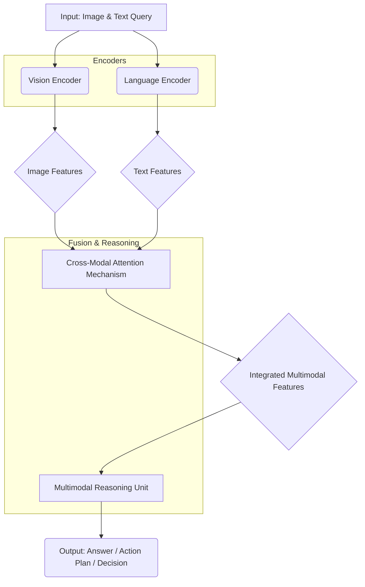

멀티모달 에이전트(Multimodal Agents)는 시각(Vision) 및 언어(Language) 데이터를 동시에 처리하여 환경을 이해하고 복합적인 추론(Reasoning)을 수행하는 데 필수적인 요소로 부상하고 있습니다. 기존의 단일 모달리티(modality) 에이전트와 달리, 멀티모달 에이전트는 이미지, 비디오, 텍스트 등 다양한 형태의 정보를 통합하여 보다 풍부하고 정확한 상황 인식을 가능하게 합니다. 2026년 현재, Large Multimodal Models (LMMs)의 발전과 함께, 이러한 비전-언어 통합 추론 패턴의 설계는 에이전트의 성능과 적용 범위를 결정짓는 핵심 과제가 되고 있습니다.

## 비전-언어 통합 추론의 핵심 패턴

멀티모달 에이전트가 시각 및 언어 정보를 통합하는 방식은 크게 세 가지 주요 패턴으로 분류할 수 있습니다. 각 패턴은 정보 융합(Fusion) 시점과 방식에 따라 장단점을 가집니다.

### 1. 초기 융합 (Early Fusion)

초기 융합은 시각 및 언어 입력의 원시(Raw) 또는 저수준(Low-level) 특징을 모델 입력 단계에서 즉시 결합하는 방식입니다. 예를 들어, 이미지의 픽셀 데이터와 텍스트의 임베딩을 단순히 연결(concatenation)하여 단일 입력으로 사용하는 것입니다. 이 방식은 모달리티 간의 초기 상호작용을 포착하는 데 유리하지만, 각 모달리티의 고유한 특징이 희석되거나 노이즈에 취약할 수 있습니다.

### 2. 후기 융합 (Late Fusion)

후기 융합은 각 모달리티를 독립적으로 처리하여 고수준(High-level) 특징이나 예측(Prediction)을 도출한 후, 이들을 최종 단계에서 결합하여 추론하는 방식입니다. 예를 들어, Vision Encoder가 이미지 특징을 추출하고 Language Encoder가 텍스트 특징을 추출한 뒤, 이 두 특징을 통합하여 최종 의사결정을 내립니다. 이 패턴은 각 모달리티의 강점을 최대한 활용하고 개별 모달리티 모델의 유연성을 높일 수 있지만, 초기 단계의 미묘한 모달리티 간 상호작용을 놓칠 수 있습니다.

### 3. 하이브리드 및 교차-모달 어텐션 (Hybrid & Cross-Modal Attention)

가장 강력하고 널리 사용되는 접근 방식 중 하나는 초기 융합과 후기 융합의 장점을 결합한 하이브리드 패턴 또는 교차-모달 어텐션 메커니즘을 사용하는 것입니다. LMMs의 대부분이 이 방식을 따릅니다. 이 패턴은 Vision Encoder가 이미지 특징을 추출하고, Language Encoder가 텍스트 특징을 추출한 후, Multi-head Attention 메커니즘을 통해 서로 다른 모달리티 특징 간의 관계를 명시적으로 학습합니다. 이를 통해 특정 시각 영역과 특정 언어 토큰 간의 연관성을 깊이 이해하고, 이를 바탕으로 복합적인 추론을 수행합니다. 예를 들어, 텍스트 쿼리(e.g., "이 사진에서 가장 키 큰 사람은 누구인가?")와 이미지 정보를 동시에 분석하여, 텍스트의 키워드에 해당하는 시각적 영역에 집중(Attend)하여 정확한 답변을 생성하는 방식입니다.

```python
import torch
from PIL import Image
from transformers import AutoProcessor, LlavaForConditionalGeneration # Hypothetical LMM library

class MultimodalAgentReasoning:
    def __init__(self, model_name="llava-hf/llava-1.5-7b-hf"):
        self.processor = AutoProcessor.from_pretrained(model_name)
        self.model = LlavaForConditionalGeneration.from_pretrained(model_name)
        self.device = "cuda" if torch.cuda.is_available() else "cpu"
        self.model.to(self.device)

    def cross_modal_attention_reasoning(self, image_path: str, text_query: str) -> str:
        """
        Cross-modal attention 기반의 비전-언어 통합 추론 패턴을 시뮬레이션합니다.
        이미지와 텍스트 쿼리를 입력받아 LMM을 통해 추론을 수행합니다.
        """
        image = Image.open(image_path).convert("RGB")

        # Prepare inputs for LMM (vision + language)
        prompt = f"USER: <image>\n{text_query} ASSISTANT:"
        inputs = self.processor(text=prompt, images=image, return_tensors="pt").to(self.device)

        # Generate response using the LMM
        with torch.no_grad():
            output = self.model.generate(**inputs, max_new_tokens=200)

        response = self.processor.decode(output[0], skip_special_tokens=True)
        return response.split("ASSISTANT:")[-1].strip()

    def perform_action(self, image_path: str, goal: str) -> str:
        """
        추론 결과를 바탕으로 에이전트가 특정 액션을 제안하는 예시.
        """
        reasoning_result = self.cross_modal_attention_reasoning(image_path, f"이 상황에서 다음으로 해야 할 일은 무엇인가요? 목표는 {goal} 입니다.")
        print(f"Reasoning: {reasoning_result}")
        # 실제 액션 로직 (e.g., API 호출, 로봇 제어 등)이 추가될 수 있음
        return f"Action suggested based on reasoning: {reasoning_result}"

# Example Usage (replace with actual image path)
# agent = MultimodalAgentReasoning()
# image_file = "path/to/your/image.jpg"
# query = "이 사진 속 인물이 하고 있는 행동은 무엇이며, 어떤 감정으로 보이는가?"
# result = agent.cross_modal_attention_reasoning(image_file, query)
# print(f"LMM Inference Result: {result}")
# action_plan = agent.perform_action(image_file, "주변 환경을 파악하여 위험 요소 식별")
# print(action_plan)
```

### Mermaid Diagram: 하이브리드 비전-언어 통합 추론 플로우



## 2026년 최신 트렌드 반영

최근 몇 년간 GPT-4V, Gemini, LLaVA와 같은 Large Multimodal Models (LMMs)의 등장은 비전-언어 통합 추론의 패러다임을 변화시켰습니다. 이들 모델은 대규모 데이터를 기반으로 학습되어 복잡한 시각적 개념과 언어적 지식을 통합하여 추론하는 능력을 보여줍니다. 특히, 다음과 같은 트렌드가 중요합니다.

*   **Embodied AI**: 로봇 공학과 같은 실제 물리적 환경에서 에이전트가 시각, 청각, 촉각 등 다양한 감각 정보를 통합하여 실시간으로 의사결정하고 행동하는 연구가 활발합니다.
*   **실시간 처리 및 효율성**: 자율주행, AR/VR과 같은 응용 분야에서는 실시간으로 멀티모달 정보를 처리하고 즉각적인 추론 결과를 도출해야 합니다. 이를 위해 경량화된 LMM 및 효율적인 융합 패턴 설계가 중요합니다.
*   **심층 교차-모달 이해 (Deep Cross-Modal Understanding)**: 단순한 객체 인식 및 캡셔닝을 넘어, 시각적 스토리텔링, 감정 분석, 복잡한 시각적 질문 응답(Visual Question Answering, VQA) 등 인간 수준의 추론 능력을 목표로 합니다.
*   **강화 학습(Reinforcement Learning)과의 결합**: 멀티모달 에이전트가 환경과 상호작용하며 학습하는 과정에서 시각 및 언어 피드백을 통합하여 더욱 효과적인 정책(Policy)을 학습합니다.

## 트레이드오프

멀티모달 에이전트의 비전-언어 통합 추론 패턴 설계에는 다음과 같은 트레이드오프가 존재합니다.

*   **복잡성 vs. 성능**: 초기 융합은 모델 구조가 비교적 간단하지만, 섬세한 모달리티 상호작용을 놓쳐 성능이 제한될 수 있습니다. 반면, 하이브리드 또는 교차-모달 어텐션 패턴은 높은 성능을 제공하지만, 모델 복잡성(Computation Complexity)과 학습 데이터 요구 사항이 크게 증가합니다. 이는 소규모 프로젝트에서는 리소스 제약으로 인해 구현하기 어려울 수 있습니다.
    *   **언제 좋은가**: 단순하고 빠르게 PoC를 만들거나 데이터가 적은 경우 초기 융합이 적합합니다. 최고 수준의 성능과 깊은 이해가 필요한 경우 하이브리드/교차-모달 어텐션이 필요합니다.
    *   **언제 나쁜가**: 초기 융합은 미묘한 상황 인식이 필요한 경우 부적합합니다. 하이브리드/교차-모달 어텐션은 리소스가 부족하거나, 실시간 응답 지연이 허용되지 않는 경우 비효율적입니다.
*   **데이터 요구량 vs. 일반화 능력**: 더 복잡한 융합 패턴, 특히 교차-모달 어텐션을 사용하는 LMM은 대규모의 정제된 멀티모달 학습 데이터를 요구합니다. 데이터의 양과 질이 부족하면 모델의 일반화 능력(Generalization Capability)이 떨어지거나 과적합(Overfitting)될 위험이 있습니다. 이는 특정 도메인에 특화된 에이전트 개발 시 어려움이 될 수 있습니다.
    *   **언제 좋은가**: 대규모 멀티모달 데이터셋(e.g., CC3M, LAION)에 접근 가능하고 광범위한 시나리오에 적용할 에이전트를 개발할 때 좋습니다.
    *   **언제 나쁜가**: 고품질 멀티모달 데이터 구축이 어렵거나 도메인 특화된 소규모 데이터셋만 있는 경우, 복잡한 패턴은 오히려 학습을 방해할 수 있습니다.
*   **추론 지연 시간(Latency) vs. 정확도**: 모델이 더 복잡한 추론 패턴을 가질수록 일반적으로 더 높은 정확도를 얻을 수 있지만, 추론에 필요한 계산량이 많아져 지연 시간이 증가합니다. 이는 실시간 상호작용이 필요한 응용(e.g., 자율주행 차량, 로봇 제어)에서는 치명적인 단점이 될 수 있습니다.
    *   **언제 좋은가**: 높은 정확도가 최우선이며, 추론 지연에 대한 허용 범위가 넓은 경우(e.g., 오프라인 분석, 콘텐츠 생성)에 적합합니다.
    *   **언제 나쁜가**: 사용자와의 실시간 상호작용이나 즉각적인 환경 반응이 필수적인 시스템에서는 높은 지연 시간이 사용자 경험(User Experience)을 저해합니다.

## 실전 체크리스트

멀티모달 에이전트의 비전-언어 통합 추론 패턴을 프로젝트에 적용하기 위한 실전 체크리스트입니다.

- [ ] **데이터셋 적합성 검토**: 사용 가능한 시각 및 언어 데이터셋이 에이전트의 목표와 추론 패턴에 충분한 양과 품질을 제공하는지 확인하고, 데이터 증강(Data Augmentation) 전략을 수립했는가?
- [ ] **모달리티 융합 시점 결정**: 프로젝트의 성능 요구사항(Latency, Accuracy)과 리소스 제약(Computational Resources)을 고려하여 초기/후기/하이브리드 융합 중 최적의 패턴을 선택했는가?
- [ ] **LMM 선정 및 최적화**: 최신 Large Multimodal Model (LMM)의 성능, 라이선스, 배포 용이성을 평가하여 적절한 모델을 선정하고, Fine-tuning 또는 Prompt Engineering 전략을 계획했는가?
- [ ] **교차-모달 어텐션 구현 검증**: Cross-Modal Attention 메커니즘이 시각 및 언어 특징 간의 의미론적(Semantic) 관계를 효과적으로 학습하고 있는지 어텐션 맵(Attention Map) 시각화 등을 통해 검증했는가?
- [ ] **추론 성능 지표 정의 및 측정**: 멀티모달 추론의 정확도(Accuracy), 정밀도(Precision), 재현율(Recall) 등 핵심 지표를 명확히 정의하고, 실제 배포 환경(Production Environment)에서 측정 및 모니터링 계획을 수립했는가?
- [ ] **실시간 처리 및 지연 시간 최적화**: 실시간 응용을 위해 모델 경량화(Model Quantization), 분산 추론(Distributed Inference) 또는 엣지 컴퓨팅(Edge Computing) 적용을 고려하여 지연 시간(Latency)을 최소화하는 전략을 마련했는가?
- [ ] **에이전트 행동 및 의사결정 로직 연동**: 멀티모달 추론 결과가 에이전트의 다음 행동(Action) 또는 의사결정(Decision-making) 로직과 어떻게 연동되는지 명확히 설계하고 테스트했는가?