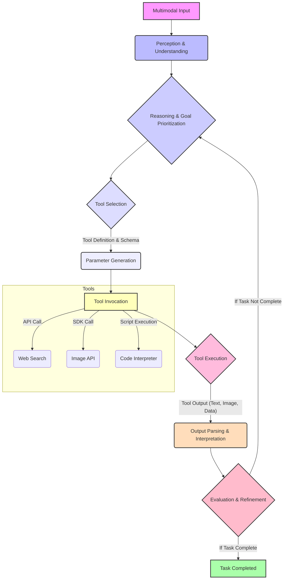

멀티모달 AI 에이전트(Multimodal AI Agent)는 텍스트, 이미지, 오디오 등 다양한 형태의 정보를 이해하고 추론할 수 있는 능력을 갖추고 있습니다. 2026년 현재, 이러한 에이전트가 복잡하고 현실적인 태스크를 성공적으로 수행하기 위해서는 외부 툴(External Tools)을 효과적으로 활용하는 전략이 필수적입니다. 단순히 정보를 처리하는 것을 넘어, 실제 세상에 개입하고 변화를 일으키기 위한 ‘행동’의 주체로서 툴 사용 능력이 핵심 역량으로 부상하고 있습니다.

## 핵심 개념: 멀티모달 에이전트의 툴 사용 원리

멀티모달 에이전트의 툴 사용은 고도화된 인식(Perception)과 추론(Reasoning) 능력을 바탕으로 외부 환경과 상호작용하는 과정을 포함합니다. 이 과정은 다음과 같은 원리들을 따릅니다.

### 1. Perception-Action Loop (인식-행동 루프)

에이전트는 다양한 센서(가상 또는 실제)를 통해 멀티모달 입력(예: 웹페이지의 텍스트와 이미지, 비디오 프레임, 음성 명령)을 수신하고, 이를 통합적으로 분석하여 현재 상황을 이해합니다. 이 이해를 바탕으로 어떤 툴이 필요하며, 어떻게 사용해야 할지 추론합니다. 툴의 실행 결과는 다시 에이전트의 입력으로 돌아와 다음 행동을 결정하는 데 사용되는 순환 구조를 가집니다.

### 2. Contextual Tool Selection (맥락적 툴 선택)

단순히 사용 가능한 툴 목록에서 키워드 매칭으로 툴을 선택하는 것을 넘어, 멀티모달 컨텍스트(Multimodal Context)는 에이전트가 보다 정교하게 툴을 선택하고 파라미터를 생성할 수 있도록 돕습니다. 예를 들어, 웹페이지 이미지에서 특정 UI 요소를 인식한 후 해당 요소에 대한 클릭 또는 입력 툴을 호출하는 방식입니다. 이미지에 보이는 버튼의 텍스트나 아이콘이 툴 선택의 중요한 맥락이 될 수 있습니다.

### 3. Tool Orchestration (툴 오케스트레이션)

복잡한 태스크는 단일 툴 호출로 해결되지 않는 경우가 많습니다. 에이전트는 여러 툴을 순차적, 병렬적, 조건부로 조합하여 사용하는 오케스트레이션 능력을 요구합니다. 툴 호출 간의 의존성 관리, 실패 처리, 중간 결과 저장 및 활용 등이 중요한 요소입니다.

## 설계 패턴: 효과적인 툴 통합 전략

멀티모달 에이전트가 외부 툴을 효과적으로 사용하기 위한 몇 가지 설계 패턴을 소개합니다.

### 1. Adaptive Tool Adapters (적응형 툴 어댑터)

다양한 형태와 인터페이스를 가진 외부 툴을 에이전트가 일관된 방식으로 사용할 수 있도록 표준화된 어댑터 계층을 두는 패턴입니다. 각 툴은 특정 스키마(예: Pydantic model)를 준수하는 입력과 출력을 가지도록 래핑됩니다. 이를 통해 에이전트의 핵심 로직은 툴의 구현 세부 사항으로부터 분리됩니다.

### 2. Structured Tool Invocation (구조화된 툴 호출)

에이전트가 툴을 호출할 때 필요한 파라미터는 명확하고 구조화된 형식으로 전달되어야 합니다. Large Language Model (LLM) 기반의 에이전트의 경우, Function Calling API를 활용하거나 JSON 스키마를 통해 툴 인자를 명시하는 방식이 일반적입니다. 멀티모달 입력에서 추출된 정보는 이 구조화된 파라미터에 매핑됩니다.

```python
from pydantic import BaseModel, Field
from typing import Literal

class WebSearchTool(BaseModel):
    """
    Performs a web search based on a query.
    """
    query: str = Field(description="The search query.")
    num_results: int = Field(default=5, description="Number of search results to retrieve.")

class ImageAnalysisTool(BaseModel):
    """
    Analyzes an image to identify objects and their attributes.
    """
    image_url: str = Field(description="URL of the image to analyze.")
    analysis_type: Literal["object_detection", "ocr", "captioning"] = Field(
        description="Type of analysis to perform."
    )

class MultimodalAgent:
    def __init__(self, tools):
        self.tools = {tool.__name__: tool for tool in tools}

    def perceive_and_act(self, multimodal_input: dict):
        # Simulate multimodal perception
        visual_data = multimodal_input.get("image_description")
        text_data = multimodal_input.get("text_content")
        
        print(f"Agent perceives: Visual='{visual_data}', Text='{text_data}'")

        if "identify object" in text_data and visual_data:
            print("Agent decides to use ImageAnalysisTool.")
            # Assume visual_data contains an image URL or similar identifier
            # In a real scenario, this would involve more complex reasoning
            image_url_from_input = "http://example.com/image.jpg" # Placeholder
            
            tool_args = ImageAnalysisTool(image_url=image_url_from_input, analysis_type="object_detection")
            # In a real agent, this would be passed to an LLM for function calling,
            # or directly executed if conditions are met.
            print(f"Calling ImageAnalysisTool with args: {tool_args.model_dump()}")
            return "ImageAnalysisTool called successfully."

        elif "search for" in text_data:
            search_query = text_data.split("search for", 1)[1].strip()
            print(f"Agent decides to use WebSearchTool for '{search_query}'.")
            tool_args = WebSearchTool(query=search_query)
            print(f"Calling WebSearchTool with args: {tool_args.model_dump()}")
            return "WebSearchTool called successfully."
        else:
            print("No suitable tool found for the perceived input.")
            return "No action."

# Example Usage
agent = MultimodalAgent(tools=[WebSearchTool, ImageAnalysisTool])

# Scenario 1: Text-driven search
agent.perceive_and_act({"text_content": "search for latest AI trends in 2026"})

print("-" * 30)

# Scenario 2: Multimodal-driven analysis
# Here, 'image_description' is a proxy for actual visual understanding
agent.perceive_and_act({
    "text_content": "Please identify object in this image.",
    "image_description": "A picture of a red car on a street."
})
```

### 3. Feedback Loop Integration (피드백 루프 통합)

툴 실행 결과는 단순한 최종 출력이 아니라, 에이전트의 다음 추론을 위한 중요한 입력으로 다시 활용됩니다. 멀티모달 에이전트는 툴이 생성한 텍스트, 이미지, 데이터 등을 재해석하여 태스크의 진행 상황을 평가하고, 필요하다면 툴 사용 전략을 수정하거나 새로운 툴을 호출합니다. 이 피드백 루프는 에이전트의 자율성과 적응성을 향상시킵니다.

## 멀티모달 에이전트 툴 사용 워크플로우



## 트레이드오프

멀티모달 에이전트의 툴 사용 전략을 설계할 때 고려해야 할 주요 트레이드오프는 다음과 같습니다.

*   **복잡도 증가(Increased Complexity) vs. 기능 확장(Enhanced Capability)**
    *   **언제 좋음:** 에이전트가 현실 세계의 복잡한 문제(예: 웹 자동화, 데이터 분석, 물리적 환경 조작)를 해결해야 할 때, 다양한 툴 통합은 에이전트의 기능과 적용 범위를 비약적으로 확장시킵니다.
    *   **언제 나쁨:** 단순 반복 작업이나 고립된 환경의 태스크에서는 툴 통합으로 인한 시스템의 복잡도가 불필요하게 증가하고 유지보수 비용이 높아질 수 있습니다.

*   **실행 지연(Runtime Latency) vs. 태스크 정확성(Task Accuracy)**
    *   **언제 좋음:** 정확성이 최우선이며 실시간성이 덜 중요한 태스크(예: 보고서 작성, 심층 연구)에서는 여러 툴을 신중하게 호출하고 결과를 검증하는 과정이 태스크의 최종 품질을 보장합니다.
    *   **언제 나쁨:** 빠른 응답 시간이 중요한 인터랙티브 애플리케이션이나 실시간 제어 시스템에서는 잦은 툴 호출과 복잡한 오케스트레이션이 사용자 경험을 저해하거나 시스템 안정성을 떨어뜨릴 수 있습니다.

*   **툴 의존성(Tool Dependence) vs. 자율성(Autonomy)**
    *   **언제 좋음:** 에이전트가 특정 분야의 전문 지식이나 실시간 데이터에 접근해야 할 때, 잘 정의된 외부 툴은 에이전트의 지식 한계를 보완하고 정확한 행동을 유도합니다.
    *   **언제 나쁨:** 툴에 과도하게 의존할 경우, 툴의 가용성, 성능, 정확성에 에이전트의 전반적인 기능이 영향을 받게 됩니다. 툴이 없는 상황이나 툴이 오작동할 때 에이전트의 강건성(Robustness)이 저하될 수 있습니다.

*   **개발 노력(Development Effort) vs. 범용성(Versatility)**
    *   **언제 좋음:** 다양한 도메인과 시나리오에 걸쳐 유연하게 적용될 수 있는 범용적인 에이전트를 목표로 할 때, 확장 가능한 툴 통합 아키텍처는 초기 개발 노력이 크더라도 장기적인 재활용성과 유연성을 제공합니다.
    *   **언제 나쁨:** 특정 목적을 가진 고정된 태스크만을 수행하는 에이전트의 경우, 과도한 툴 통합 설계는 불필요한 개발 시간과 리소스를 소모하게 만들 수 있습니다.

## 실전 체크리스트

멀티모달 AI 에이전트의 효과적인 툴 사용을 프로젝트에 적용할 때 다음 항목들을 검증하십시오.

*   [ ] **툴 레지스트리 정의:** 사용 가능한 모든 외부 툴에 대한 명확한 정의(기능, 입력 스키마, 출력 스키마, 사용 제약 사항)가 중앙화된 레지스트리에 문서화되어 있는가?
*   [ ] **멀티모달 입력 파싱:** 에이전트가 멀티모달 입력(이미지, 텍스트, 음성 등)에서 툴 호출에 필요한 핵심 엔티티와 파라미터를 정확하게 추출하고 구조화할 수 있는가?
*   [ ] **툴 호출 오류 처리:** 외부 툴 호출 시 발생할 수 있는 네트워크 오류, API 제한, 비정상적인 응답 등에 대한 견고한 오류 처리(재시도 로직, 대체 툴 사용, 에이전트 재계획) 메커니즘이 구현되어 있는가?
*   [ ] **피드백 루프 유효성 검증:** 툴 실행 결과를 에이전트의 컨텍스트에 재통합하고 다음 의사결정에 반영하는 피드백 루프가 효과적으로 작동하며, 결과의 유효성을 검증하는 로직이 포함되어 있는가?
*   [ ] **보안 및 접근 제어:** 외부 툴(특히 민감한 데이터나 시스템에 접근하는 툴)에 대한 에이전트의 접근 권한이 최소 원칙(Least Privilege)에 따라 관리되고, 보안 감사(Audit Trail) 메커니즘이 마련되어 있는가?
*   [ ] **성능 및 확장성 모니터링:** 툴 호출의 빈도, 응답 시간, 실패율 등 성능 지표를 지속적으로 모니터링하고 있으며, 에이전트와 툴 서비스 간의 확장성 병목 현상을 식별하고 해결할 수 있는가?
*   [ ] **툴 사용 의도 정렬:** 에이전트가 툴을 사용하는 방식이 사용자의 궁극적인 의도와 일치하는지 지속적으로 평가하고, 의도하지 않은 행동(Drift)을 방지하기 위한 가드레일(Guardrails)이 설계되어 있는가?