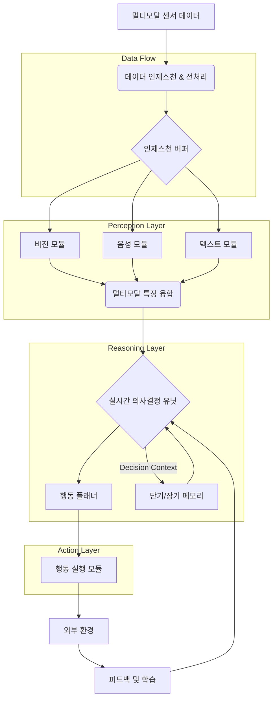

## 멀티모달 AI 에이전트의 실시간 의사결정 로직 구현

멀티모달 AI 에이전트는 텍스트, 이미지 등 다양한 데이터를 동시에 처리하여 복합적인 환경에서 지능적인 행동을 수행하는 시스템입니다. 특히 자율 주행, 로봇 공학 등 즉각적인 반응이 필요한 시나리오에서 실시간 의사결정 능력은 에이전트의 효율성과 안정성에 직결되는 핵심 기술입니다. 다양한 데이터를 빠르게 통합하고 상황을 인지하여, 지연 없이 적절한 행동을 결정하는 것이 중요합니다.

### 실시간 의사결정의 핵심 구성 요소

실시간 의사결정을 위해서는 다음 요소들이 유기적으로 결합되어야 합니다.

1.  **고속 데이터 인제스천 및 전처리**: 멀티모달 데이터를 낮은 지연 시간으로 수집하고, 모델이 처리할 수 있는 형태로 빠르게 변환하는 과정이 필수적입니다.
2.  **경량화된 멀티모달 모델**: 엣지 디바이스에 맞게 대규모 모델을 경량화(양자화, 지식 증류 등)하거나, 특정 태스크에 최적화된 작은 모델들을 조합합니다.
3.  **효율적인 추론 엔진**: 최적화된 하드웨어(GPU, NPU) 및 소프트웨어(TensorRT, OpenVINO) 스택을 통해 모델 추론 속도를 극대화합니다.
4.  **강건한 의사결정 로직**: 수집된 정보를 바탕으로 현재 상태를 평가하고 최적의 행동을 선택하는 로직입니다. 규칙 기반, 강화 학습, 계층적 계획 등이 활용됩니다.
5.  **피드백 루프**: 행동 결과를 모니터링하고 다음 의사결정에 반영하여 에이전트 성능을 지속적으로 개선합니다.

### 아키텍처 패턴

멀티모달 AI 에이전트의 실시간 의사결정 아키텍처는 센서 데이터 처리, 인지(Perception), 추론(Reasoning), 행동(Action) 모듈로 구성됩니다.



### 구현 방법론 및 2026년 트렌드

#### 1. 이벤트 기반 스트리밍 및 엣지 컴퓨팅
Apache Kafka 같은 메시지 큐로 센서 데이터를 실시간 수집하고, 엣지 디바이스에서 AI 모델을 실행하여 지연을 최소화합니다. 2026년에는 NPU 탑재 엣지 디바이스와 Gemini Nano 같은 경량 모델이 온디바이스 추론 성능을 크게 향상시킬 것입니다.

#### 2. 효율적인 멀티모달 융합 및 동적 툴 사용
Early Fusion, Late Fusion 등 데이터 특성에 맞는 융합 전략을 선택합니다. 온톨로지 기반 지식 그래프와 `agents/llm-agent-dynamic-tool-selection-optimization` 에서 다루는 동적 툴 사용으로 상황 인식을 정교화하고 추론을 가속화합니다.

#### 3. 최적화된 프롬프트 엔지니어링 및 강화 학습 (RL)
LLM 기반 에이전트의 경우, 짧고 명확한 In-context Learning 프롬프트 디자인이 실시간성을 확보하는 데 필수적입니다. 시뮬레이션 환경에서의 강화 학습은 에이전트가 최적의 정책을 학습하고 유연하게 대처하도록 훈련하는 데 중요합니다.

### 코드 예시: 실시간 멀티모달 의사결정 함수

다음 Python 코드는 텍스트와 이미지 입력 기반의 실시간 의사결정 로직을 간략하게 보여줍니다. 에이전트의 `agent_memory`를 활용하여 이전 상태를 고려합니다.

```python
import time

def real_time_multimodal_decision(text_input, image_input, agent_memory):
    """
    Simulates a real-time decision based on multimodal inputs.
    text_input: str, e.g., "urgent anomaly detected"
    image_input: str, e.g., "image_stream_containing_fire"
    agent_memory: dict for persistent state.
    """
    text_features = {"sentiment": "negative" if "anomaly" in text_input.lower() else "neutral"}
    image_features = {"hazard": "fire" if "fire" in image_input.lower() else "none"}

    fused_context = {
        "text_sentiment": text_features["sentiment"],
        "image_hazard": image_features["hazard"],
        "last_alert_time": agent_memory.get("last_alert_time", 0)
    }

    decision = "monitor"
    if fused_context["text_sentiment"] == "negative" and fused_context["image_hazard"] == "fire":
        if time.time() - fused_context["last_alert_time"] > 60: # Cooldown for 1 minute
            decision = "trigger_emergency_alert"
            agent_memory["last_alert_time"] = time.time()
        else:
            decision = "alert_already_sent_monitor_status"
    elif fused_context["text_sentiment"] == "negative":
        decision = "investigate_text_anomaly"
    elif fused_context["image_hazard"] == "fire":
        decision = "investigate_image_hazard"
    
    return {"action": decision, "updated_memory": agent_memory}
```

## 트레이드오프

멀티모달 AI 에이전트의 실시간 의사결정 로직 구현 시 고려할 트레이드오프는 다음과 같습니다.

*   **정확도 vs 지연 시간 (Accuracy vs. Latency)**: 미션 크리티컬 실시간 시스템은 지연 시간 최소화가, 비실시간 분석은 높은 정확도가 우선됩니다.
*   **자원 효율성 vs 모델 복잡성 (Resource Efficiency vs. Model Complexity)**: 엣지 디바이스는 경량 모델이 필수적이며, 클라우드는 복잡한 모델로 더 넓은 문제 해결이 가능합니다.
*   **데이터 융합 깊이 vs 처리 복잡성 (Fusion Depth vs. Processing Complexity)**: Early Fusion은 풍부한 상황 인식 제공하나, 처리 복잡성이 높습니다. 단순 태스크는 Late Fusion이 효율적입니다.
*   **규칙 기반 결정 vs 학습 기반 결정 (Rule-based vs. Learning-based Decision)**: 안전 민감 영역은 규칙 기반이 안정적이고, 동적 환경은 학습 기반이 유연합니다(훈련 및 해석 난이도 높음).
*   **모델 유연성 vs 배포 용이성 (Model Flexibility vs. Deployment Ease)**: 범용 대규모 모델은 유연하나 배포 어렵고 비효율적일 수 있습니다. 특화된 소형 모델은 배포 용이성 및 실시간 성능이 우수하나 유연성이 떨어집니다.

## 실전 체크리스트

멀티모달 AI 에이전트의 실시간 의사결정 로직을 프로젝트에 적용할 때 검증할 항목들입니다.

*   [ ] **데이터 인제스천 지연 시간 검증**: 센서에서 의사결정 모듈까지의 엔드 투 엔드 지연 시간이 목표치(예: < 100ms)를 만족하는지 측정하고 병목 지점을 식별합니다.
*   [ ] **멀티모달 데이터 동기화 전략 유효성 확인**: 서로 다른 주기 데이터를 타임스탬프 기반 동기화, 보간법 등으로 정확히 정렬하고 융합하는 전략이 효과적인지 검증합니다.
*   [ ] **모델 경량화 및 엣지 배포 성능 벤치마킹**: 엣지 디바이스에서 모델 추론 속도와 리소스 사용량을 벤치마킹하고, 최적화가 목표 성능을 달성하는지 확인합니다.
*   [ ] **실시간 추론 엔진 최적화 적용 여부**: 하드웨어 가속 추론 엔진(TensorRT, OpenVINO 등) 활용, 비동기 추론 및 배치 처리 전략 적용으로 추론 속도 극대화 여부를 점검합니다.
*   [ ] **의사결정 로직의 불확실성 처리 및 폴백 메커니즘**: 입력 노이즈/모델 불확실성 처리 방식, 불확실성 시 안전 모드/사용자 개입 요청 등의 폴백 메커니즘 구현 여부를 확인합니다.
*   [ ] **피드백 루프 및 자가 학습 메커니즘 설계**: 행동 결과 모니터링 및 의사결정 로직/모델 개선에 활용할 피드백 루프, 자가 학습(강화 학습) 메커니즘 설계 여부를 검토합니다.
*   [ ] **내결함성 및 복구 전략 구현 확인**: 센서 오류, 네트워크 지연 등 실패 상황에 대비한 내결함성 및 복구 전략(재시도, 롤백, 헬스 체크) 구현으로 시스템 안정적 동작 여부를 검토합니다.