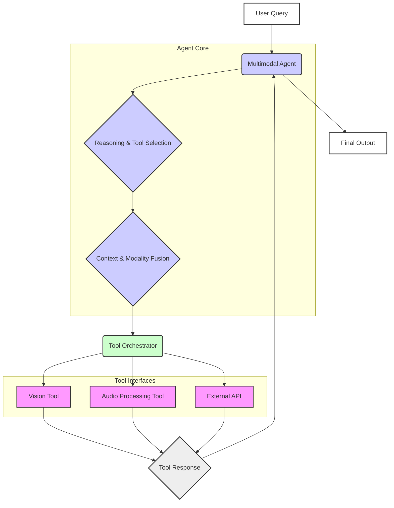

점점 더 복잡해지는 AI 에이전트, 특히 멀티모달 에이전트는 다양한 외부 도구를 효과적으로 활용하여 역량을 확장합니다. 텍스트, 이미지, 오디오, 비디오 등 여러 모달리티에서 정보를 처리하고 생성할 수 있는 이 에이전트들은 외부 툴의 효과적인 활용을 통해 상당한 능력을 발휘합니다. 이 문서는 멀티모달 AI 에이전트의 툴 사용을 설계하는 구조화된 접근 방식을 설명하며, 견고한 통합, 동적 선택, 그리고 상황 인지적 실행에 중점을 둡니다.

## 핵심 개념
멀티모달 AI 에이전트는 전통적인 텍스트 전용 상호작용을 넘어, 더 풍부한 세상의 표현을 인지하고 행동합니다.

*   **Multimodality (멀티모달리티)**: 자연어, 이미지, 오디오, 때로는 비디오 또는 센서 데이터와 같은 여러 데이터 형식으로 콘텐츠를 처리하고 생성하는 능력.
*   **Tools (툴)**: AI 에이전트가 핵심 추론 모델을 넘어 자신의 역량을 확장하기 위해 호출할 수 있는 외부 함수, API 또는 서비스. 예를 들어 검색 엔진, 이미지 생성 API, 데이터베이스 쿼리 도구, 코드 인터프리터 또는 전문 데이터 분석 스크립트 등이 있습니다.
*   **Tool Usage Design (툴 사용 설계)**: 에이전트가 이러한 다양한 툴의 결과를 상황에 맞게 지능적으로 식별, 선택, 호출 및 해석하도록 돕는 방법론.

## 설계 원칙
멀티모달 에이전트의 효과적인 툴 사용은 여러 가지 핵심 설계 원칙에 기반합니다.

### Modular Toolkits (모듈형 툴킷)
툴은 명확한 입출력 사양을 가진 모듈형 단위로 캡슐화되어야 합니다. 이를 통해 에이전트의 핵심 로직에 영향을 주지 않고 툴을 쉽게 추가, 제거 및 업데이트할 수 있습니다. 각 툴은 JSON Schema 또는 OpenAPI 정의와 같은 스키마를 사용하여 자신의 기능, 필요한 매개변수 및 예상 출력 형식을 선언해야 합니다.

### Dynamic Tool Selection (동적 툴 선택)
에이전트는 현재 목표, 사용 가능한 컨텍스트 및 멀티모달 입력을 기반으로 주어진 작업에 가장 적합한 툴을 동적으로 선택할 수 있는 추론 능력을 갖추어야 합니다. 이는 종종 에이전트의 기본 LLM(Large Language Model)이 프롬프트와 내부 상태를 분석하여 어떤 툴을 어떤 인수로 호출할지 결정하는 것을 포함합니다. 고급 방법에는 전문화된 툴 선택 모델 또는 다단계 추론 프로세스가 포함될 수 있습니다.

### Context-Aware Tool Invocation (상황 인지적 툴 호출)
에이전트는 멀티모달 컨텍스트가 툴 매개변수 및 해석에 어떻게 영향을 미치는지 이해해야 합니다. 예를 들어, 이미지 분석 툴은 텍스트 설명에서 식별된 특정 관심 영역이 필요할 수 있으며, 오디오 전사 툴은 이전 대화에서 언어 컨텍스트가 필요할 수 있습니다. 에이전트는 다양한 인지 입력에서 관련 정보를 합성하여 최적의 툴 호출을 구성해야 합니다.

### Multimodal Input/Output Handling (멀티모달 입출력 처리)
멀티모달 에이전트를 위해 설계된 툴은 멀티모달 데이터를 수락하고 반환할 수 있어야 합니다. 비전 툴은 이미지 URL을 받아 감지된 객체(텍스트)와 바운딩 박스 좌표(구조화된 데이터)를 반환할 수 있습니다. 에이전트의 오케스트레이터는 이러한 다양한 데이터 유형을 원활하게 처리하고, 후속 처리 또는 사용자 프레젠테이션을 위해 변환할 수 있어야 합니다.

### Feedback Loops for Tool Efficacy (툴 효능을 위한 피드백 루프)
툴 호출의 성공 또는 실패를 평가하고 이러한 경험으로부터 학습하기 위한 메커니즘을 구현합니다. 이는 간단한 오류 처리 및 재시도 로직부터, 에이전트가 시간이 지남에 따라 툴 선택 또는 매개변수 생성 전략을 개선하는 더욱 정교한 자가 수정 및 적응에 이르기까지 다양합니다.

## 아키텍처 패턴

### Orchestrator-Agent-Tool Model (오케스트레이터-에이전트-툴 모델)
중앙 오케스트레이터 구성요소를 포함하는 일반적인 아키텍처입니다. 이 오케스트레이터는 작업을 수신하고, 멀티모달 에이전트(종종 LLM)와 상담하며, 에이전트가 선택한 툴 작업을 실행합니다. 툴 호출의 수명 주기를 관리하고, 출력을 처리하며, 추가 추론을 위해 에이전트에게 다시 전달하거나 사용자에게 전달합니다.



### Tool Descriptors (툴 디스크립터)
구조화된 디스크립터를 사용하여 툴을 정의합니다. 예를 들어, JSON 스키마는 입력 매개변수와 예상 출력을 설명하여 에이전트가 툴을 프로그래밍 방식으로 이해하고 상호작용할 수 있도록 합니다.

```json
{
  "name": "analyze_image_for_objects",
  "description": "Performs object detection on an image and returns a list of detected objects with their bounding boxes and confidence scores.",
  "parameters": {
    "type": "object",
    "properties": {
      "image_url": {
        "type": "string",
        "description": "URL of the image to analyze."
      },
      "confidence_threshold": {
        "type": "number",
        "format": "float",
        "default": 0.5,
        "description": "Minimum confidence score for detected objects to be returned."
      }
    },
    "required": ["image_url"]
  },
  "returns": {
    "type": "array",
    "items": {
      "type": "object",
      "properties": {
        "object_name": { "type": "string" },
        "confidence": { "type": "number" },
        "bbox": {
          "type": "array",
          "items": { "type": "number" },
          "minItems": 4,
          "maxItems": 4,
          "description": "[x_min, y_min, x_max, y_max]"
        }
      }
    }
  }
}
```

### Adapters for Diverse Tool Interfaces (다양한 툴 인터페이스를 위한 어댑터)
툴은 종종 다양한 API(REST, gRPC, SDK)를 가지고 있으므로, 어댑터 패턴을 사용하여 에이전트에게 통일된 인터페이스를 제공합니다. 이는 기본 통신 복잡성을 추상화하여 에이전트가 다른 툴과 일관되게 상호작용할 수 있도록 합니다.

## 코드 예제: 툴을 사용하는 멀티모달 에이전트 (Python)

이 예제는 이미지를 분석하고 시각적 입력을 기반으로 텍스트 응답을 생성하기 위해 "비전 툴"을 활용할 수 있는 멀티모달 에이전트의 단순화된 Python 클래스를 보여줍니다.

```python
import json

class ToolSchema:
    def __init__(self, name: str, description: str, parameters: dict, returns: dict):
        self.name = name
        self.description = description
        self.parameters = parameters
        self.returns = returns

    def to_json(self):
        return json.dumps({
            "name": self.name,
            "description": self.description,
            "parameters": self.parameters,
            "returns": self.returns
        }, indent=2)

class VisionTool:
    def __init__(self):
        self.schema = ToolSchema(
            name="analyze_image_for_objects",
            description="Performs object detection on an image and returns a list of detected objects.",
            parameters={
                "type": "object",
                "properties": {
                    "image_url": {"type": "string", "description": "URL of the image."},
                    "confidence_threshold": {"type": "number", "default": 0.7}
                },
                "required": ["image_url"]
            },
            returns={
                "type": "array",
                "items": {
                    "type": "object",
                    "properties": {
                        "object_name": {"type": "string"},
                        "confidence": {"type": "number"}
                    }
                }
            }
        )

    def invoke(self, image_url: str, confidence_threshold: float = 0.7):
        """Simulates an image analysis API call."""
        print(f"DEBUG: Invoking VisionTool for {image_url} with threshold {confidence_threshold}")
        # In a real scenario, this would call an external vision API
        if "cat" in image_url.lower():
            return [
                {"object_name": "Cat", "confidence": 0.95},
                {"object_name": "Chair", "confidence": 0.8}
            ]
        elif "dog" in image_url.lower():
            return [
                {"object_name": "Dog", "confidence": 0.92},
                {"object_name": "Ball", "confidence": 0.75}
            ]
        return []

class MultimodalAgent:
    def __init__(self, llm_model, tools: dict):
        self.llm = llm_model # A placeholder for an actual LLM client
        self.tools = {tool.schema.name: tool for tool in tools}

    def _call_llm_for_tool_selection(self, prompt: str, available_tools_schemas: list):
        """
        Simulates LLM's decision-making for tool selection and parameter generation.
        In reality, this involves complex prompt engineering and parsing LLM output.
        """
        print(f"DEBUG: LLM considering tool for prompt: '{prompt}'")
        if "analyze the image" in prompt.lower() and "http" in prompt.lower():
            image_url_match = next((word for word in prompt.split() if word.startswith("http")), None)
            if image_url_match:
                return {
                    "tool_name": "analyze_image_for_objects",
                    "parameters": {"image_url": image_url_match, "confidence_threshold": 0.8}
                }
        return None

    def _call_llm_for_response_generation(self, prompt: str, tool_results: dict = None):
        """Simulates LLM's text generation."""
        context = f"User prompt: {prompt}"
        if tool_results:
            context += f"\nTool results: {json.dumps(tool_results)}"
        
        # Simple rule-based generation for demonstration
        if "cat" in str(tool_results) and "image" in prompt.lower():
            return "Based on the image analysis, I detected a cat and possibly a chair. It seems like a cozy indoor scene."
        if "dog" in str(tool_results) and "image" in prompt.lower():
            return "The image analysis indicates a dog and a ball. Looks like playtime!"
        
        return f"I processed your request: '{prompt}'. No specific tool output to report or generate a detailed response."

    def execute_task(self, prompt: str):
        # 1. LLM decides if a tool is needed
        available_schemas = [tool.schema for tool in self.tools.values()]
        tool_call_info = self._call_llm_for_tool_selection(prompt, available_schemas)

        tool_results = None
        if tool_call_info:
            tool_name = tool_call_info["tool_name"]
            parameters = tool_call_info["parameters"]
            
            if tool_name in self.tools:
                print(f"DEBUG: Executing tool '{tool_name}' with parameters: {parameters}")
                tool_results = self.tools[tool_name].invoke(**parameters)
                print(f"DEBUG: Tool '{tool_name}' returned: {tool_results}")
            else:
                print(f"ERROR: Tool '{tool_name}' not found.")

        # 2. LLM generates final response using tool results if available
        final_response = self._call_llm_for_response_generation(prompt, tool_results)
        return final_response

# --- Example Usage ---
# Placeholder for an actual LLM client (e.g., from OpenAI, Anthropic)
class MockLLM:
    def generate(self, *args, **kwargs):
        pass # Not used directly in this simplified example

mock_llm = MockLLM()
vision_tool = VisionTool()
agent = MultimodalAgent(llm_model=mock_llm, tools=[vision_tool])

print("--- Scenario 1: Image analysis with cat ---")
response1 = agent.execute_task("Please analyze the image at http://example.com/cat-pic.jpg for objects.")
print(f"Agent's final response: {response1}\n")

print("--- Scenario 2: Image analysis with dog ---")
response2 = agent.execute_task("What do you see in this photo: http://example.com/dog-playing.png?")
print(f"Agent's final response: {response2}\n")

print("---> Scenario 3: General text query (no tool needed) ---")
response3 = agent.execute_task("Tell me a fun fact about AI agents.")
print(f"Agent's final response: {response3}\n")
```

## 트레이드오프

멀티모달 AI 에이전트의 툴 사용 설계 시 고려해야 할 주요 트레이드오프는 다음과 같습니다.

*   **중앙 집중식 오케스트레이션 vs. 분산형 툴링 (Centralized Orchestration vs. Decentralized Tooling)**
    *   **중앙 집중식 오케스트레이션**: 모든 툴 호출 및 결과 처리를 단일 에이전트 또는 오케스트레이터가 관리합니다.
        *   **언제 좋음**: 복잡한 작업 흐름, 엄격한 일관성 및 제어가 필요할 때, 디버깅 및 모니터링이 용이할 때 유리합니다. 툴 간의 의존성이 높고 순서가 중요한 시나리오에 적합합니다.
        *   **언제 나쁨**: 단일 실패 지점(Single Point of Failure)이 될 수 있으며, 시스템의 확장성과 유연성이 저하될 수 있습니다. 툴의 수가 매우 많거나 이질적인 환경에서는 병목 현상이 발생할 수 있습니다.
    *   **분산형 툴링**: 각 에이전트가 자체적으로 툴을 관리하고 호출하거나, 툴 자체에 에이전트적 특성을 부여하여 독립적으로 동작하게 합니다.
        *   **언제 좋음**: 대규모 분산 시스템, 높은 확장성과 내결함성이 요구될 때, 각 에이전트가 독립적인 작업 범위를 가질 때 효과적입니다. 새로운 툴 추가 및 제거가 유연합니다.
        *   **언제 나쁨**: 툴 간의 복잡한 상호작용 및 전역 상태 관리가 어려워질 수 있습니다. 디버깅 및 전체 시스템의 동작 추적이 복잡해집니다.

*   **범용 툴 vs. 특화 툴 (Generic Tools vs. Specialized Tools)**
    *   **범용 툴**: 다양한 시나리오에 적용할 수 있는 광범위한 기능을 제공하는 툴 (예: 일반 검색 엔진, 범용 이미지 캡셔닝).
        *   **언제 좋음**: 개발 및 유지보수 비용이 낮고, 넓은 범위의 문제에 대해 기본적인 해결책을 제공할 수 있습니다. 초기 프로토타이핑에 적합합니다.
        *   **언제 나쁨**: 특정 도메인이나 복잡한 요구사항에 대한 성능이 떨어지거나 정확도가 낮을 수 있습니다. 미묘한 맥락을 처리하지 못할 수 있습니다.
    *   **특화 툴**: 특정 도메인이나 작업에 최적화된 기능을 제공하는 툴 (예: 특정 산업 분야 데이터베이스 쿼리, 의료 영상 분석 툴).
        *   **언제 좋음**: 특정 작업에서 높은 정확도와 효율성을 달성할 수 있으며, 복잡하고 미묘한 요구사항을 충족시킬 수 있습니다.
        *   **언제 나쁨**: 개발 비용이 높고 유지보수가 복잡하며, 다른 도메인에 재사용하기 어렵습니다. 툴 생태계가 파편화될 수 있습니다.

*   **동기적 툴 호출 vs. 비동기적 툴 호출 (Synchronous vs. Asynchronous Tool Calls)**
    *   **동기적 호출**: 에이전트가 툴 호출 결과를 기다린 후 다음 작업을 진행합니다.
        *   **언제 좋음**: 작업의 순서가 중요하고 이전 툴의 결과가 다음 단계의 입력으로 직접 사용될 때 논리 흐름이 명확합니다. 구현이 비교적 간단합니다.
        *   **언제 나쁨**: 툴 호출 지연이 전체 에이전트 응답 시간에 직접적인 영향을 미쳐 사용자 경험을 저해할 수 있습니다. 병렬 처리가 필요한 시나리오에 부적합합니다.
    *   **비동기적 호출**: 에이전트가 툴을 호출한 후 결과를 기다리지 않고 다른 작업을 수행하거나, 여러 툴을 동시에 호출합니다.
        *   **언제 좋음**: 사용자 응답성을 높이고, 여러 툴 호출을 병렬로 처리하여 전체 작업 시간을 단축할 수 있습니다. 장시간 실행되는 툴에 적합합니다.
        *   **언제 나쁨**: 상태 관리 및 결과 동기화가 복잡해지며, Race Condition과 같은 동시성 문제가 발생할 수 있습니다. 디버깅이 어려울 수 있습니다.

*   **정적 툴 디스커버리 vs. 동적 툴 디스커버리 (Static Tool Discovery vs. Dynamic Tool Discovery)**
    *   **정적 디스커버리**: 에이전트가 사용할 수 있는 툴 목록이 사전에 고정되어 있거나, 배포 시점에 정의됩니다.
        *   **언제 좋음**: 시스템의 예측 가능성이 높고, 보안 및 안정성 제어가 용이합니다. 간단한 에이전트 시스템에 적합합니다.
        *   **언제 나쁨**: 새로운 툴 추가나 기존 툴 변경 시 시스템 재배포가 필요할 수 있으며, 유연성이 떨어집니다.
    *   **동적 디스커버리**: 에이전트가 런타임에 사용 가능한 툴을 탐색하고 등록하거나, 외부 레지스트리에서 가져올 수 있습니다.
        *   **언제 좋음**: 시스템의 유연성과 적응성이 극대화됩니다. 새로운 툴이 자주 추가되거나 툴 환경이 동적으로 변하는 시나리오에 이상적입니다.
        *   **언제 나쁨**: 툴의 유효성 검사, 보안 취약성, 호환성 문제가 발생할 수 있으며, 툴 레지스트리 관리 및 에이전트의 툴 학습 부담이 증가합니다.

## 실전 체크리스트

멀티모달 AI 에이전트의 툴 사용을 프로젝트에 적용할 때 다음 체크리스트를 활용하여 견고성을 확보하세요.

*   [ ] **툴 스키마 정의 및 유효성 검사**: 모든 툴에 대해 명확한 JSON Schema 또는 OpenAPI 스펙을 정의하고, 에이전트가 툴을 호출하기 전에 입력 파라미터의 유효성을 자동으로 검사하는 로직이 구현되었는지 확인합니다.
*   [ ] **오류 처리 및 복구 전략**: 툴 호출 실패 시 (네트워크 오류, API 제한, 잘못된 파라미터 등) 에이전트가 오류를 감지하고, 재시도, 대체 툴 사용, 사용자에게 상황 보고 등 적절한 복구 전략을 수행하는지 검증합니다.
*   [ ] **다중 모달리티 데이터 변환 및 매핑**: 툴이 요구하는 입력 모달리티(예: 텍스트 -> 이미지 URL)와 툴이 반환하는 출력 모달리티(예: 이미지 분석 결과 -> JSON) 간의 데이터 변환 및 매핑 로직이 견고하게 작동하는지 테스트합니다.
*   [ ] **보안 및 접근 제어**: 각 툴이 필요한 최소한의 권한(Least Privilege)으로 호출되며, API 키, 민감 데이터 등이 안전하게 관리되고 접근 제어가 제대로 구현되었는지 정기적으로 보안 감사를 수행합니다.
*   [ ] **성능 및 지연 시간 모니터링**: 각 툴 호출의 응답 시간(Latency)을 측정하고, 임계값을 초과하는 툴에 대한 알림 및 최적화 계획이 수립되어 있는지 확인합니다. 전체 에이전트의 처리량(Throughput) 목표를 달성하는지 검토합니다.
*   [ ] **툴 사용 의사 결정 로직 평가**: 에이전트의 툴 선택 로직이 다양한 시나리오와 모달리티 입력에 대해 얼마나 정확하고 효율적으로 작동하는지, 오용되거나 불필요한 툴이 호출되지 않는지 정량적으로 평가하는 지표를 수립합니다.
*   [ ] **확장성 및 유지보수성**: 새로운 툴을 쉽게 추가하거나 기존 툴을 업데이트할 수 있는 아키텍처를 갖추었는지, 툴 코드가 모듈화되어 있고 문서화가 잘 되어 있어 유지보수가 용이한지 검토합니다.