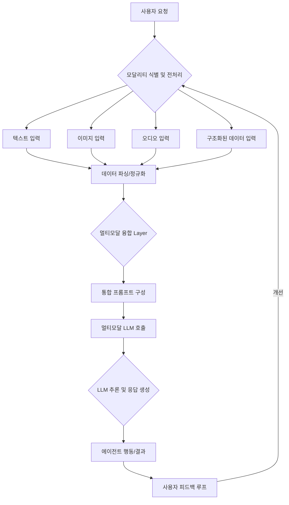

복잡한 문제 해결을 위해 설계된 AI 에이전트의 성능은 입력 데이터의 품질과 다양성에 크게 좌우됩니다. 기존의 텍스트 기반 프롬프트는 특정 유형의 정보에 국한되어 에이전트의 추론 깊이와 정확성에 한계를 가질 수 있습니다. 이를 극복하고 에이전트의 추론 능력을 극대화하기 위해 멀티모달(Multimodal) 프롬프트 디자인 패턴이 핵심적인 방법론으로 부상하고 있습니다.

## 멀티모달 프롬프트의 중요성

에이전트가 현실 세계의 복잡한 태스크를 처리하려면 텍스트 정보만으로는 부족한 경우가 많습니다. 예를 들어, 사용자의 감정 상태를 파악하거나, 소프트웨어 버그를 시각적으로 진단하고, 금융 시장의 추이를 실시간 그래프로 분석하는 등의 작업은 이미지, 오디오, 비디오, 구조화된 데이터 등 다양한 모달리티의 통합적 이해를 요구합니다. 멀티모달 프롬프트는 에이전트에게 이러한 다차원적인 맥락을 제공하여, 단순한 정보 검색을 넘어선 심층적인 추론과 의사결정을 가능하게 합니다. 2026년에는 멀티모달 AI 모델의 발전과 함께 에이전트가 이러한 다양한 정보를 실시간으로 처리하고 융합하는 능력이 더욱 중요해지고 있습니다.

## 핵심 멀티모달 프롬프트 디자인 패턴

### 1. Visual Context Integration (시각적 맥락 통합)

텍스트 설명과 함께 관련 이미지를 제공하여 에이전트의 이해도를 높이는 패턴입니다. 특히 디자인 검토, 버그 보고, 제품 설명 등 시각적 정보가 필수적인 시나리오에서 강력합니다. 에이전트는 이미지에서 객체, 레이아웃, 색상, 텍스트 등을 추출하고 이를 텍스트 프롬프트와 결합하여 보다 정확한 분석을 수행할 수 있습니다.

*   **예시**: UI/UX 에이전트에게 웹 페이지 스크린샷과 함께 “이 버튼의 색상이 브랜드 가이드라인에 맞는지 확인하고, 사용자 클릭률을 높일 수 있는 개선안을 제시해줘.”와 같은 프롬프트를 제공.

### 2. Audio/Speech Analysis for Intent and Emotion (의도 및 감정 분석을 위한 오디오/음성 분석)

사용자의 음성 메시지나 대화 녹취록을 텍스트로 변환하는 것을 넘어, 음조(tone), 속도, 어조(intonation) 등의 오디오 특성을 분석하여 화자의 감정이나 의도를 추론하는 패턴입니다. 고객 서비스, 헬스케어, 개인 비서 에이전트 등에서 사용자 경험을 크게 개선할 수 있습니다.

*   **예시**: 콜센터 에이전트에게 고객의 음성 통화 기록(.wav 파일)과 “이 고객이 겪는 문제의 핵심을 파악하고, 불만 수준과 감정 상태를 분석하여 다음 단계를 제안해줘.” 프롬프트 제공.

### 3. Structured Data Overlay (구조화된 데이터 오버레이)

텍스트와 함께 JSON, CSV, 데이터베이스 쿼리 결과 등의 구조화된 데이터를 제공하여 에이전트가 정확한 사실 정보를 기반으로 추론하도록 돕습니다. 특히 재무 분석, 데이터베이스 관리, 복잡한 비즈니스 로직 처리 등에서 에이전트의 환각(hallucination)을 줄이고 정량적 추론 능력을 강화합니다.

*   **예시**: 재고 관리 에이전트에게 제품 재고 현황 데이터(JSON)와 “이 데이터를 바탕으로 현재 재고 수준이 낮은 상위 5개 제품과 예상되는 재고 소진 시점을 알려줘.” 프롬프트 제공.

### 4. Time-Series Data Fusion (시계열 데이터 융합)

주가 그래프, 서버 로그, 센서 데이터와 같은 시계열 데이터를 이미지 또는 원시 데이터 형태로 제공하고, 이를 텍스트 설명과 결합하여 추세 분석, 이상 감지, 예측 등의 작업을 수행합니다. 금융 트레이딩, 시스템 모니터링, IoT 환경에서 유용합니다.

*   **예시**: 시스템 모니터링 에이전트에게 서버 CPU 사용량 그래프(PNG)와 최근 로그(텍스트)를 함께 주며 “지난 24시간 동안의 CPU 사용량 추이를 분석하고, 비정상적인 패턴이 감지되면 원인을 추정하고 해결책을 제시해줘.” 프롬프트 제공.

## 구현 예제 (Python)

아래 코드는 멀티모달 LLM API를 활용하여 시각적 컨텍스트와 텍스트 프롬프트를 결합하는 간단한 예시입니다. (실제 API 호출은 사용 모델에 따라 달라질 수 있습니다.)

```python
import base64
import requests

def encode_image(image_path):
    with open(image_path, "rb") as image_file:
        return base64.b64encode(image_file.read()).decode('utf-8')

def multimodal_prompt_agent(text_prompt, image_path=None, audio_data=None, structured_data=None):
    messages = [
        {
            "role": "user",
            "content": [
                {"type": "text", "text": text_prompt}
            ]
        }
    ]

    if image_path:
        base64_image = encode_image(image_path)
        messages[0]["content"].append({
            "type": "image_url",
            "image_url": {"url": f"data:image/jpeg;base64,{base64_image}"}
        })
    
    if audio_data: # Hypothetical audio handling
        messages[0]["content"].append({
            "type": "audio_data",
            "audio_data": audio_data # Raw audio bytes or transcription
        })

    if structured_data: # Hypothetical structured data handling
        messages[0]["content"].append({
            "type": "json_data",
            "json_data": structured_data
        })

    # Replace with actual LLM API endpoint and key
    headers = {
        "Content-Type": "application/json",
        "Authorization": f"Bearer YOUR_LLM_API_KEY"
    }
    payload = {
        "model": "gpt-4o", # Example: or 'gemini-1.5-pro-latest'
        "messages": messages,
        "max_tokens": 2000
    }

    try:
        response = requests.post("https://api.openai.com/v1/chat/completions", headers=headers, json=payload)
        response.raise_for_status()
        return response.json()["choices"][0]["message"]["content"]
    except requests.exceptions.RequestException as e:
        print(f"API request failed: {e}")
        return None

# Example Usage
# Assume you have 'bug_screenshot.jpg' and 'customer_audio.wav'
# image_path = "./bug_screenshot.jpg"
# structured_inventory_data = {"product_id": "A123", "stock": 10, "min_stock": 20}

# text_response = multimodal_prompt_agent(
#    text_prompt="이 스크린샷에 표시된 버그의 원인을 분석하고, 예상되는 해결책을 제안해줘.",
#    image_path=image_path
# )
# print(text_response)

# text_response_with_structured = multimodal_prompt_agent(
#    text_prompt="이 재고 데이터를 검토하고, 재고가 부족한 제품에 대한 주문 제안을 해줘.",
#    structured_data=structured_inventory_data
# )
# print(text_response_with_structured)
```

## 멀티모달 에이전트 워크플로우

멀티모달 프롬프트가 에이전트의 추론 과정에 어떻게 통합되는지 시각적으로 표현합니다.



## 트레이드오프

멀티모달 프롬프트 디자인 패턴은 강력하지만, 항상 최적의 솔루션은 아닙니다. 장단점을 고려하여 적용 여부를 결정해야 합니다.

*   **정확성 및 추론 깊이 향상 vs. 복잡성 및 비용 증가**: 멀티모달 프롬프트는 에이전트의 상황 이해를 심화시켜 추론 정확도를 높이지만, 여러 모달리티의 데이터를 수집, 전처리, 융합하는 과정에서 시스템 복잡성이 크게 증가합니다. 또한, 멀티모달 모델 사용은 텍스트 전용 모델보다 API 호출 비용이 높아질 수 있습니다.
    *   **언제 좋고**: 복잡하고 섬세한 상황 이해가 필수적인 금융 분석, 의료 진단, 자율 주행 등 오류 비용이 높은 애플리케이션에 적합합니다.
    *   **언제 나쁜지**: 단순 질의응답, 텍스트 요약 등 순수 텍스트 기반으로도 충분히 높은 성능을 낼 수 있는 태스크에는 과도한 오버헤드입니다.

*   **사용자 경험 개선 vs. 응답 지연(Latency)**: 풍부한 맥락으로 에이전트의 응답 품질이 향상되어 사용자 만족도가 높아지지만, 다양한 모달리티 데이터를 처리하고 융합하는 데 시간이 소요되어 응답 지연이 발생할 수 있습니다.
    *   **언제 좋고**: 실시간 상호작용보다 결과의 정확성과 풍부함이 더 중요한 콘텐츠 생성, 보고서 작성, 심층 분석 등에 유용합니다.
    *   **언제 나쁜지**: 챗봇, 음성 비서 등 즉각적인 반응이 필수적인 대화형 시스템에서는 사용자 경험을 저해할 수 있습니다.

*   **강력한 맥락 이해 vs. 데이터 프라이버시 및 보안 위험**: 민감한 시각, 음성, 구조화된 데이터를 활용하여 심층적인 이해를 제공하지만, 이 과정에서 개인 정보 유출이나 보안 위협에 노출될 위험이 커집니다. 특히 의료, 금융 분야에서는 규제 준수가 더욱 중요합니다.
    *   **언제 좋고**: 내부 시스템, 비공개 데이터셋 등 데이터 접근 제어가 확실한 환경에서 고도의 분석이 필요할 때 효과적입니다.
    *   **언제 나쁜지**: 공개된 플랫폼이나 민감한 사용자 데이터를 다루는 경우, 데이터 익명화, 마스킹, 온디바이스 처리 등 추가적인 보안 조치 없이는 위험할 수 있습니다.

*   **범용성 증대 vs. 데이터 수집 및 정제 난이도**: 다양한 유형의 데이터로부터 학습하고 추론하는 능력은 에이전트의 범용성을 높이지만, 고품질의 멀티모달 데이터를 대규모로 수집하고 정제하는 것은 텍스트 데이터보다 훨씬 어렵고 비용이 많이 듭니다.
    *   **언제 좋고**: 이미 풍부한 멀티모달 데이터셋이 존재하거나, 데이터 수집 및 라벨링을 위한 충분한 자원과 인프라가 갖춰진 경우에 유리합니다.
    *   **언제 나쁜지**: 초기 프로젝트 단계나 데이터 수집 역량이 부족한 경우, 데이터 부족으로 인한 성능 저하를 겪을 수 있습니다.

## 실전 체크리스트

멀티모달 프롬프트 디자인 패턴을 프로젝트에 적용하기 전에 다음 체크리스트를 검토하여 성공적인 구현을 보장하세요.

- [ ] **필요 모달리티 식별**: 에이전트가 해결하려는 태스크에 가장 핵심적인 정보가 어떤 모달리티(텍스트, 이미지, 오디오, 구조화된 데이터 등)에 있는지 정확히 식별했는가?
- [ ] **데이터 수집 및 전처리 파이프라인 구축**: 식별된 각 모달리티의 데이터를 안정적으로 수집하고, LLM이 처리할 수 있는 형식으로 변환(예: 이미지 인코딩, 오디오 STT, 데이터 정규화)하는 파이프라인이 준비되었는가?
- [ ] **멀티모달 모델 선택 및 연동**: 태스크에 적합한 멀티모달 LLM(예: GPT-4o, Gemini 1.5 Pro)을 선정하고, 해당 API 또는 온프레미스 모델과의 안정적인 연동이 구현되었는가?
- [ ] **프롬프트 구성 전략 수립**: 각 모달리티의 정보를 텍스트 프롬프트와 어떻게 조합하여 LLM에 전달할 것인지 구체적인 프롬프트 구성 전략(예: 시각적 설명 후 이미지 삽입, 감정 분석 결과 요약 후 음성 데이터 링크)을 수립했는가?
- [ ] **성능 및 비용 모니터링 계획**: 멀티모달 프롬프트 적용 후 에이전트의 추론 정확도, 응답 시간, API 비용 변화를 측정하고 모니터링할 계획이 있는가?
- [ ] **오류 처리 및 폴백 전략**: 특정 모달리티 데이터의 전처리 실패 또는 모델의 멀티모달 처리 오류 발생 시, 에이전트가 어떻게 대응(예: 텍스트 기반으로 폴백, 사용자에게 추가 정보 요청)할 것인지에 대한 전략을 마련했는가?
- [ ] **데이터 프라이버시 및 보안 검토**: 사용되는 멀티모달 데이터에 민감 정보가 포함되어 있는지 확인하고, 관련 법규(GDPR, HIPAA 등) 및 내부 보안 정책에 따라 데이터 처리 및 저장 방식을 설계했는가?