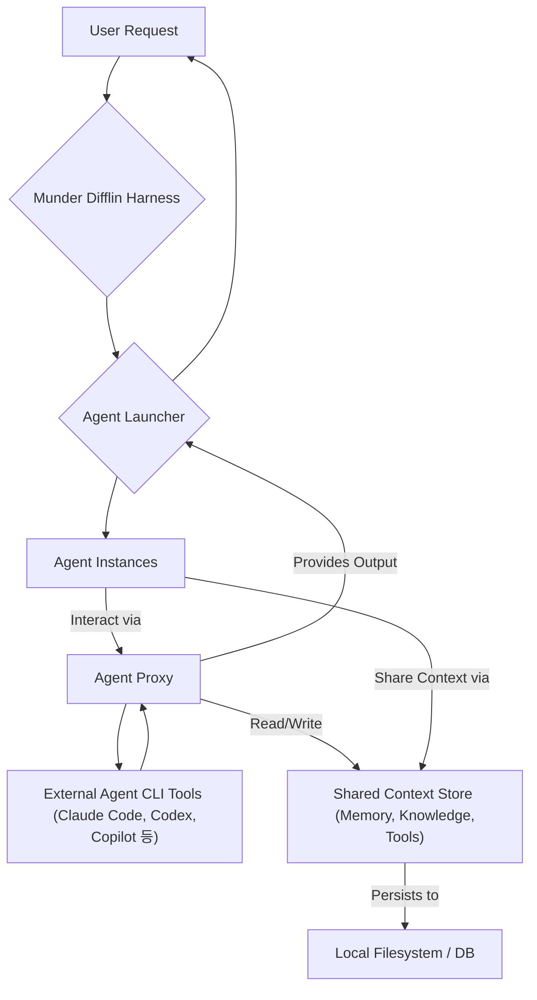

Munder Difflin은 기존 에이전트 CLI를 활용하여 사용자의 업무 방식, 도구, 지식을 공유하는 복제 에이전트를 로컬에서 실행하는 오픈소스 하네스입니다. 이 아키텍처는 에이전트 복제, 도구 공유, 지속적인 기억 및 맥락 관리를 통해 Claude Code, Codex, Copilot 등 다양한 에이전트 CLI의 활용도를 극대화합니다.

## Architecture Overview
Munder Difflin 하네스는 각 에이전트 인스턴스가 독립적으로 동작하면서도 중앙화된 컨텍스트 저장소를 통해 정보를 공유하는 분산 에이전트 시스템 패턴을 구현합니다.
*   **에이전트 런처**: 에이전트 시작 및 관리.
*   **에이전트 프록시**: 외부 CLI 호출 중개, 입출력 가로채기, 컨텍스트 동기화.
*   **공유 컨텍스트 저장소**: 사용자 선호도, 과거 대화, 작업 이력, 도구 사용 로그 등을 포함하는 영속적 메모리.
에이전트는 프록시를 통해 현재 작업 맥락과 컨텍스트 저장소의 정보를 주입받아 CLI를 실행하고, 그 결과는 컨텍스트에 업데이트됩니다.



## Context Management Patterns
Munder Difflin의 컨텍스트 관리는 에이전트 효율성 및 일관성의 핵심입니다.
*   **영속적 기억**: 과거 상호작용, 학습된 지식 등을 로컬 스토리지에 저장하여 장기 맥락 유지.
*   **세션 기반 컨텍스트**: 현재 작업 세션에 한정된 단기 컨텍스트 (태스크 세부 정보, 임시 파일).
*   **도구 사용 맥락**: 도구 사용 기록 추적, 효율적 도구 선택 전략 구축 지원.
*   **작업 지식 그래프**: 사용자 작업 방식, 코드베이스 구조 등을 구조화하여 에이전트 추론 강화.

## Simplified Code Example (Python)
Munder Difflin의 컨텍스트 연동 원리를 보여주는 간소화된 Python 예제입니다. 외부 에이전트(`run_external_agent`로 시뮬레이션)와 JSON 기반 컨텍스트 저장소를 활용합니다.

```python
import json
import os

CONTEXT_FILE = "agent_context.json"

def load_context():
    if os.path.exists(CONTEXT_FILE):
        with open(CONTEXT_FILE, 'r', encoding='utf-8') as f:
            return json.load(f)
    return {"history": [], "tools_used": {}}

def save_context(context):
    with open(CONTEXT_FILE, 'w', encoding='utf-8') as f:
        json.dump(context, f, indent=2, ensure_ascii=False)

def run_external_agent(command, context_data):
    # Simulates an external CLI agent call
    # A real harness would build a prompt including context_data.
    print(f"--- Calling external agent with command: '{command}' ---")
    print(f"--- Relevant context: {context_data.get('history', [])[-1:] if context_data.get('history') else 'None'} ---")
    simulated_output = f"Agent processed '{command}'. Action completed. (tool_A_used detected)"
    return simulated_output

def munder_difflin_workflow(task_description):
    context = load_context()
    context["history"].append({"role": "user", "content": task_description})

    cli_response = run_external_agent(task_description, context)
    
    context["history"].append({"role": "agent", "content": cli_response})
    if "tool_A_used" in cli_response: # Simple detection
        context["tools_used"]["tool_A"] = context["tools_used"].get("tool_A", 0) + 1
    
    save_context(context)
    return cli_response

if __name__ == "__main__":
    if os.path.exists(CONTEXT_FILE):
        os.remove(CONTEXT_FILE)
        
    print("Task 1: Initial action")
    response1 = munder_difflin_workflow("Review code for performance bottlenecks.")
    print(f"Agent Output 1: {response1}\n")

    print("Task 2: Context-aware follow-up")
    response2 = munder_difflin_workflow("Suggest optimizations based on the previous review.")
    print(f"Agent Output 2: {response2}\n")
```

## 트레이드오프
Munder Difflin 아키텍처는 다음 트레이드오프를 가집니다.

*   **다양한 에이전트 활용 vs 통합 복잡성**: 여러 CLI 에이전트 통합으로 유연한 워크플로우를 얻지만, 각 에이전트의 상이한 API 및 에러 처리 방식 통합 비용이 높습니다.
*   **일관된 컨텍스트 유지 vs 컨텍스트 오염 위험**: 영속적 메모리로 장기 맥락 유지가 가능하나, 잘못되거나 오래된 정보가 쌓이면 에이전트 판단 오류(컨텍스트 드리프트)를 유발할 수 있습니다.
*   **에이전트 복제/병렬 처리 vs 리소스 오버헤드**: 여러 에이전트 동시 처리로 작업 시간 단축 및 처리량 증대가 가능하나, 각 인스턴스 리소스 소비로 로컬 시스템 과부하 위험이 있습니다.
*   **지식/도구 공유 vs 보안/프라이버시**: 사용자 지식 및 도구 공유로 맞춤형 자동화를 제공하나, 민감 정보 유출 위험이 있어 강력한 보안 조치가 필수입니다.

## 실전 체크리스트
Munder Difflin 아키텍처를 `playbook` Claude Code 하네스에 적용 시 다음 항목을 확인합니다.

*   [ ] **다중 에이전트 CLI 통합 확인**: 최소 3개 외부 에이전트 CLI(예: Claude Code, Copilot)가 하네스에 성공적으로 연결 및 호출되는지 검증합니다.
*   [ ] **영속적 컨텍스트 저장소 기능 검증**: 작업 이력, 학습된 지식, 사용자 선호도가 로컬 스토리지에 안정적으로 저장/로드되는지 확인합니다. (`agents/ai-agent-persistent-memory-automated-context-management` 패턴 적용)
*   [ ] **컨텍스트 유효성 관리 정책 수립**: 오래되거나 잘못된 컨텍스트가 에이전트 작업에 부정적 영향을 미치지 않도록, 컨텍스트 갱신/삭제 정책이 정의되고 자동화되었는지 확인합니다.
*   [ ] **도구 사용 및 지식 공유 메커니즘 확인**: 에이전트가 공유 도구를 효율적으로 활용하며, 사용 이력이 컨텍스트에 기록되어 다른 에이전트에 활용되는지 검증합니다. (`agents/llm-agent-tool-integration-patterns` 참조)
*   [ ] **리소스 할당 및 모니터링 체계 구축**: 병렬 에이전트 인스턴스의 CPU, 메모리 사용량을 모니터링하고, 로컬 시스템 과부하 방지 리소스 제한 전략이 적용되었는지 확인합니다.
*   [ ] **보안 및 데이터 프라이버시 조치 검토**: 컨텍스트 저장소 민감 정보에 대한 접근 제어, 암호화, 감사 로깅 등 보호 조치가 충분한지 확인합니다.
*   [ ] **재현성 및 일관성 테스트**: 동일한 초기 상태와 태스크에 대해 에이전트가 일관되고 예측 가능한 결과를 산출하는지 주기적으로 테스트합니다.