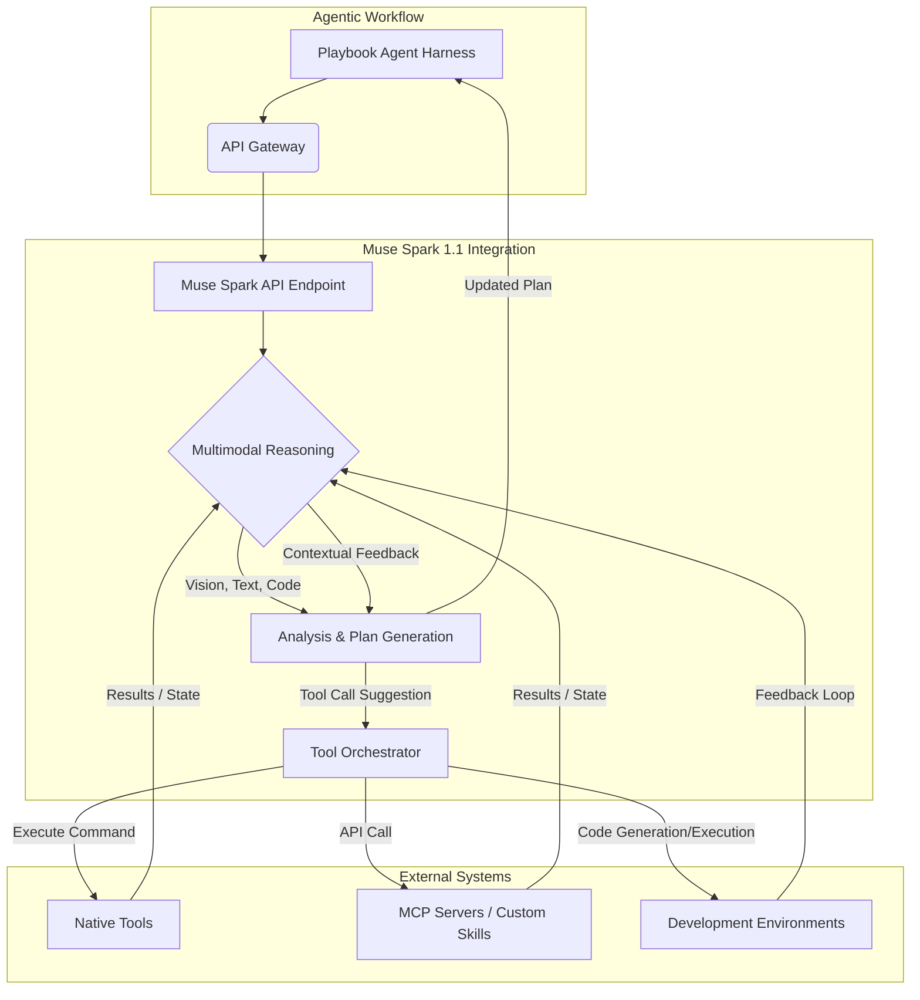

Muse Spark 1.1은 Meta Superintelligence Labs가 에이전트 작업을 위해 공개한 최신 멀티모달 추론 모델입니다. 이 모델은 도구 및 컴퓨터 사용, 코딩, 그리고 복합적인 멀티모달 이해 능력을 전작 대비 대폭 강화하여, 기존의 에이전트 하네스(harness)에 통합될 때 복잡한 워크플로우 자동화 및 지능형 의사결정의 새로운 지평을 열 수 있습니다. 특히 `playbook` 에이전트 하네스에 Muse Spark 1.1의 기능을 이식하는 것은 에이전트의 인지 및 실행 능력을 혁신적으로 향상시킬 수 있는 핵심 전략입니다.

## Muse Spark 1.1 핵심 기능과 에이전트 통합의 중요성
Muse Spark 1.1의 가장 두드러진 특징은 향상된 멀티모달 추론 능력입니다. 텍스트뿐만 아니라 이미지, 비디오, 오디오 등 다양한 형태의 데이터를 동시에 이해하고 추론할 수 있어, 에이전트가 현실 세계의 복잡한 정보를 더욱 정교하게 파악하고 대응할 수 있게 됩니다. 이는 단순히 정보 처리의 범위를 넓히는 것을 넘어, 다음과 같은 방식으로 에이전트 워크플로우를 고도화합니다:

### 1. 멀티모달 이해 기반의 상황 인식 강화
Muse Spark 1.1은 시각적 정보(예: UI 스크린샷, 다이어그램, 문서 이미지)와 텍스트 지시사항을 결합하여 복잡한 태스크를 해석할 수 있습니다. 예를 들어, 웹 페이지의 UI를 분석하고 특정 요소와 상호작용하는 스크립트를 생성하거나, 아키텍처 다이어그램을 이해하여 개선점을 제안하는 등의 작업이 가능해집니다. 이는 에이전트가 더 풍부한 컨텍스트(context)를 기반으로 의사결정을 내리도록 돕습니다.

### 2. 고도화된 도구 및 컴퓨터 사용 능력
이 모델은 외부 애플리케이션 및 서비스 전반에 걸친 계획 및 오케스트레이션(orchestration) 능력이 강화되었습니다. 이는 `native tools`, `MCP servers`, `custom skills` 등 다양한 도구 인터페이스에 대한 통합 및 활용을 의미합니다. 에이전트는 Muse Spark 1.1을 통해 더 복잡한 도구 체이닝(tool chaining)과 상황에 맞는 도구 선택을 수행하여, 인간의 개입 없이도 광범위한 디지털 환경에서 작업을 완료할 수 있습니다.

### 3. 자율적인 코딩 및 문제 해결
Muse Spark 1.1의 코딩 능력 강화는 에이전트가 새로운 도구를 개발하거나 기존 스크립트를 디버깅하고 개선하는 데 핵심적인 역할을 합니다. 이는 에이전트가 환경 변화에 따라 스스로 진화하고 적응할 수 있는 `self-improving agent` 패러다임을 가능하게 합니다. 예를 들어, 특정 API가 변경되었을 때, 에이전트가 스스로 해당 API를 사용하는 코드를 업데이트하거나 새로운 기능을 위한 코드를 생성할 수 있습니다.

## `playbook` 에이전트 하네스 통합 전략
`playbook` 하네스에 Muse Spark 1.1을 통합하는 과정은 단순히 API를 연결하는 것을 넘어, 멀티모달 입력 처리, 도구 호출 오케스트레이션, 그리고 에이전트의 의사결정 로직 재설계가 포함됩니다.

### 통합 워크플로우 다이어그램


위 다이어그램은 `Playbook Agent Harness`가 `Muse Spark API Endpoint`를 통해 멀티모달 추론을 요청하고, 그 결과를 바탕으로 `Tool Orchestrator`를 통해 `Native Tools`, `MCP Servers`, `Custom Skills`, `Development Environments` 등 외부 시스템과 상호작용하는 과정을 보여줍니다. 이 과정에서 Muse Spark 1.1은 복잡한 입력을 분석하여 실행 가능한 계획과 도구 호출을 제안하는 핵심적인 역할을 수행합니다.

### 코드 예제: Muse Spark 1.1 멀티모달 API 호출
다음은 Go 언어를 사용하여 `playbook` 에이전트가 Muse Spark 1.1의 멀티모달 API를 호출하는 간략한 예제입니다. 이 예제는 에이전트가 이미지 URL과 텍스트 프롬프트(prompt)를 함께 전송하여 아키텍처 다이어그램을 분석하고 개선 방안을 요청하는 시나리오를 가정합니다.

```go
package main

import (
	"bytes"
	"encoding/json"
	"fmt"
	"io/ioutil"
	"net/http"
	"time"
)

// MuseSparkRequest defines the structure for a Muse Spark API request
type MuseSparkRequest struct {
	Model     string `json:"model"`
	Messages  []Message `json:"messages"`
	Multimodal bool `json:"multimodal,omitempty"` // Explicitly enable multimodal capabilities
	MaxTokens int `json:"max_tokens,omitempty"`
}

// Message represents a single message in the conversation
type Message struct {
	Role    string `json:"role"`
	Content []ContentPart `json:"content"`
}

// ContentPart can be text or an image
type ContentPart struct {
	Type     string `json:"type"`
	Text     string `json:"text,omitempty"`
	ImageURL *ImageURL `json:"image_url,omitempty"`
}

// ImageURL specifies the URL of an image
type ImageURL struct {
	URL string `json:"url"`
}

// MuseSparkResponse defines the structure for a Muse Spark API response
type MuseSparkResponse struct {
	ID      string `json:"id"`
	Object  string `json:"object"`
	Created int64  `json:"created"`
	Model   string `json:"model"`
	Choices []Choice `json:"choices"`	
	Usage   Usage  `json:"usage"`
}

// Choice represents a possible response from the model
type Choice struct {
	Index        int `json:"index"`
	Message      Message `json:"message"`
	FinishReason string `json:"finish_reason"`
}

// Usage provides token usage statistics
type Usage struct {
	PromptTokens     int `json:"prompt_tokens"`
	CompletionTokens int `json:"completion_tokens"`	
	TotalTokens      int `json:"total_tokens"`
}

func main() {
	apiKey := "YOUR_MUSE_SPARK_API_KEY" // 실제 API 키로 교체
	apiURL := "https://api.muse-spark.meta/v1/chat/completions" // Muse Spark API 엔드포인트

	// 예제: 이미지와 텍스트를 포함하는 멀티모달 요청
	requestBody := MuseSparkRequest{
		Model: "muse-spark-1.1-multimodal", // 멀티모달 모델 지정
		Messages: []Message{
			{
				Role: "user",
				Content: []ContentPart{
					{
						Type: "text",
						Text: "이 아키텍처 다이어그램을 분석하여 주요 구성 요소와 잠재적 병목 지점을 식별해줘. 그리고 개선 방안을 제안하고, 이 제안을 기반으로 태스크 목록을 생성할 수 있는지를 알려줘.",
					},
					{
						Type: "image_url",
						ImageURL: &ImageURL{
							URL: "https://example.com/architecture-diagram.png", // 실제 이미지 URL로 교체
						},
					},
				},
			},
		},
		Multimodal: true, // 멀티모달 처리 활성화
		MaxTokens:  1024,
	}

	jsonBody, err := json.Marshal(requestBody)
	if err != nil {
		fmt.Printf("Error marshalling request: %v\n", err)
		return
	}

	client := &http.Client{Timeout: 30 * time.Second}
	req, err := http.NewRequest("POST", apiURL, bytes.NewBuffer(jsonBody))
	if err != nil {
		fmt.Printf("Error creating request: %v\n", err)
		return
	}

	req.Header.Set("Content-Type", "application/json")
	req.Header.Set("Authorization", "Bearer "+apiKey) // API 키 설정

	resp, err := client.Do(req)
	if err != nil {
		fmt.Printf("Error sending request: %v\n", err)
		return
	}
	defer resp.Body.Close()

	bodyBytes, err := ioutil.ReadAll(resp.Body)
	if err != nil {
		fmt.Printf("Error reading response body: %v\n", err)
		return
	}

	if resp.StatusCode != http.StatusOK {
		fmt.Printf("API request failed with status code %d: %s\n", resp.StatusCode, string(bodyBytes))
		return
	}

	var museSparkResponse MuseSparkResponse
	err = json.Unmarshal(bodyBytes, &museSparkResponse)
	if err != nil {
		fmt.Printf("Error unmarshalling response: %v\n", err)
		return
	}

	fmt.Printf("Muse Spark Response:\n")
	for _, choice := range museSparkResponse.Choices {
		fmt.Printf("Role: %s\n", choice.Message.Role)
		for _, part := range choice.Message.Content {
			if part.Type == "text" {
				fmt.Printf("Content: %s\n", part.Text)
			}
		}
	}
	fmt.Printf("Total Tokens Used: %d\n", museSparkResponse.Usage.TotalTokens)
}
```

이 예제에서 `Playbook Agent Harness`는 API 응답의 `Content` 필드를 파싱하여 Muse Spark 1.1이 제안한 분석 결과, 개선 방안 및 태스크 생성 가능 여부를 확인합니다. 에이전트는 이 정보를 바탕으로 후속 도구 호출(예: 프로젝트 관리 시스템에 태스크 생성)을 오케스트레이션합니다.

## 트레이드오프
Muse Spark 1.1과 같은 고성능 멀티모달 모델을 에이전트 하네스에 통합하는 것은 상당한 이점을 제공하지만, 고려해야 할 트레이드오프(trade-off)도 존재합니다.

*   **복잡성 증가 vs. 기능 확장**: 멀티모달 모델 통합은 에이전트 시스템의 아키텍처 및 구현 복잡성을 증가시킵니다. 언제 좋은가: 에이전트가 처리해야 할 정보의 종류가 다양하고 복합적인 추론이 필수적인 경우. 언제 나쁜가: 단순 반복 작업이 주를 이루거나, 기존 단일 모달 모델로 충분한 경우 불필요한 오버헤드를 발생시킬 수 있습니다.
*   **성능 오버헤드 vs. 추론 품질**: 멀티모달 모델은 단일 모달 모델보다 더 많은 연산 자원과 시간을 요구하여 응답 지연이 발생할 수 있습니다. 언제 좋은가: 높은 정확도와 깊이 있는 이해가 필요한 미션 크리티컬(mission-critical)한 에이전트 작업에 유리합니다. 언제 나쁜가: 실시간 응답 속도가 중요한 태스크(예: UI 자동화의 즉각적인 반응)에는 부적합할 수 있습니다.
*   **데이터 프라이버시/보안 vs. 외부 서비스 연동**: 외부 API를 통해 민감한 멀티모달 데이터를 전송하거나 외부 도구를 연동할 때 데이터 유출 및 보안 취약점의 위험이 증가합니다. 언제 좋은가: 사내망 내에서 통제된 환경이나 비민감 데이터를 처리하는 경우, 또는 강력한 보안 메커니즘이 구축된 경우에 유용합니다. 언제 나쁜가: 엄격한 데이터 규제나 높은 수준의 기밀성이 요구되는 환경에서는 신중한 접근이 필요하며, 추가적인 보안 계층 구축 비용이 발생합니다.
*   **개발 및 유지보수 비용 vs. 자동화 이점**: 통합 및 커스터마이징(customizing) 과정에서 전문 인력과 시간, 컴퓨팅 자원이 필요하며, 모델 업데이트에 따른 지속적인 유지보수도 필수적입니다. 언제 좋은가: 반복적이고 복잡한 수작업을 대규모로 자동화하여 장기적인 운영 효율을 극대화할 수 있을 때 투자 가치가 높습니다. 언제 나쁜가: 자동화로 인한 이득이 통합 및 유지보수 비용보다 크지 않다면 비효율적입니다.

## 실전 체크리스트
Muse Spark 1.1을 `playbook` 에이전트 하네스에 성공적으로 통합하기 위한 실전 체크리스트입니다.

*   [ ] **API 연동 및 인증 전략**: Muse Spark 1.1 API 키 관리, 요청/응답 형식 일관성 유지, 에러 처리 메커니즘을 정의합니다.
*   [ ] **멀티모달 입력 전처리 파이프라인**: 이미지/비디오/오디오 데이터를 API 요구사항에 맞춰 인코딩 및 전처리하는 파이프라인을 구축하고, 대용량 데이터 전송 효율성을 최적화합니다.
*   [ ] **도구 호출 라우팅 및 관리**: Muse Spark 1.1의 도구 사용 제안을 `playbook` 하네스 내의 기존 도구 관리 시스템과 연동하여, 동적으로 도구를 선택하고 호출할 수 있도록 라우팅 로직을 구현합니다.
*   [ ] **에이전트 워크플로우 재설계**: 멀티모달 정보와 도구 사용 능력을 최대한 활용하도록 기존 에이전트의 의사결정 트리 및 작업 흐름을 재설계하고, 복합적인 상황 판단 로직을 추가합니다.
*   [ ] **성능 및 비용 모니터링**: API 호출 지연, 토큰 사용량, GPU 활용률 등 성능 지표와 비용을 실시간으로 모니터링하고, 이상 감지 시 알림 시스템을 구축합니다.
*   [ ] **안전 장치 및 오류 처리**: 모델의 오작동(hallucination), 도구 호출 실패, 외부 서비스 응답 없음 등 다양한 실패 시나리오에 대비한 `fallback` 로직과 `human-in-the-loop` 검증 포인트를 설계합니다.
*   [ ] **피드백 루프 구축**: 에이전트의 실행 결과와 사용자 피드백을 수집하여 Muse Spark 1.1의 프롬프트(prompt)를 개선하거나, 하네스의 도구 사용 전략을 최적화하는 지속적인 학습 및 개선 메커니즘을 마련합니다.