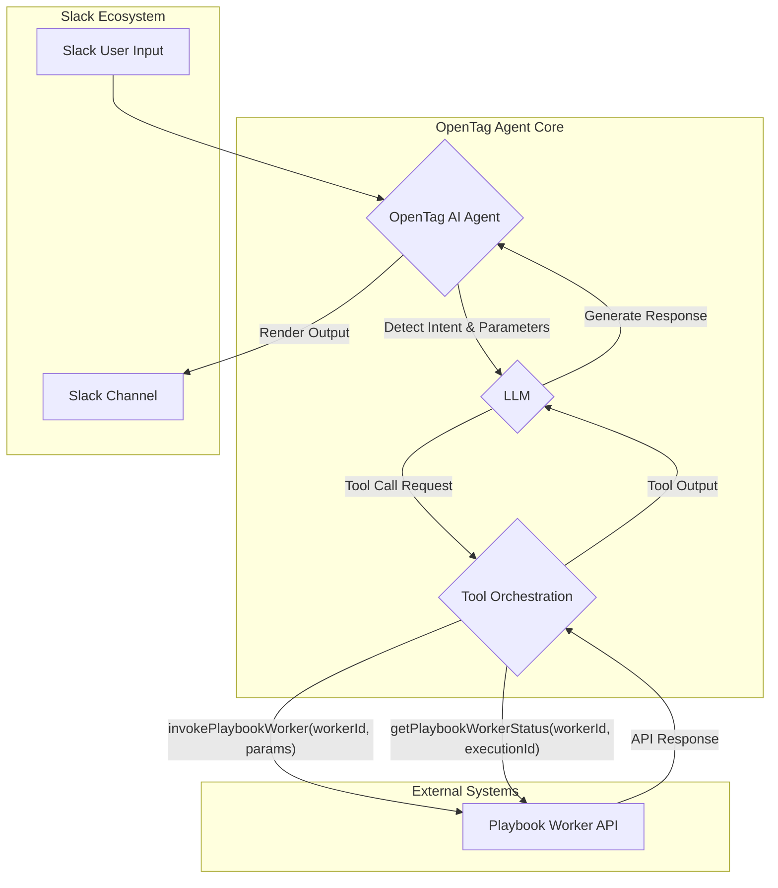

## OpenTag 기반 Slack AI 에이전트 연동의 필요성

Slack은 팀 협업의 핵심 도구이며, AI 에이전트를 통해 워크플로우를 자동화하고 생산성을 높이는 것은 현대 기업의 중요한 과제입니다. 특히, 자체적으로 구축된 Playbook 워커(worker)와 같은 핵심 비즈니스 로직을 Slack 환경에서 AI 에이전트를 통해 직접 호출하고 상태를 조회하는 능력은 운영 효율성을 극대화합니다. 기존의 상용 AI 에이전트 솔루션들은 벤더 종속성(vendor lock-in)과 제한적인 커스터마이징 옵션을 제공하는 경우가 많습니다. OpenTag는 CopilotKit 기반의 오픈소스 셀프 호스팅(self-hosted) AI 에이전트로서, 이러한 한계를 극복하고 기업 내부 시스템과의 유연한 연동을 가능하게 합니다. 런타임을 직접 소유하며 원하는 LLM을 연동하고, 커스텀 도구(tool)를 자유롭게 정의하여 기존의 Playbook을 AI 에이전트의 능력으로 확장할 수 있습니다. 이는 특정 클라우드 벤더나 모델에 얽매이지 않고, 기업의 고유한 보안 및 운영 정책을 준수하면서 AI 자동화 솔루션을 구축할 수 있게 합니다.

### OpenTag & CopilotKit 아키텍처 개요

OpenTag는 `@copilotkit/bot` SDK 위에 구축되어, 동일한 코드를 Slack, 웹 등 다양한 플랫폼에서 활용할 수 있도록 설계되었습니다. 이 아키텍처의 핵심은 다음과 같습니다:

*   **셀프 호스팅(Self-Hosting)**: 기업의 인프라 내에서 직접 에이전트를 배포하고 운영하여 데이터 주권(data sovereignty)과 보안을 확보합니다.
*   **런타임 소유(Runtime Ownership)**: 에이전트의 실행 환경을 완전히 통제할 수 있어, 커스텀 로직 추가 및 성능 최적화가 용이합니다.
*   **플러그형 LLM 지원(Pluggable LLM Support)**: 특정 LLM에 종속되지 않고, 조직의 필요에 따라 OpenAI, Anthropic Claude, 또는 온프레미스(on-premise) 모델 등 다양한 LLM을 유연하게 연동할 수 있습니다.
*   **도구 연동(Tool Integration)**: CopilotKit의 `createTool` 기능을 사용하여 내부 API, 데이터베이스, Playbook 워커 등 다양한 외부 시스템을 AI 에이전트의 능력으로 정의하고 활용할 수 있습니다.

## Playbook 워커 연동 PoC 구현 전략

Slack AI 에이전트가 Playbook 워커를 호출하고 상태를 조회하는 PoC는 다음과 같은 단계로 진행될 수 있습니다.

### 1. OpenTag 환경 구축 및 Slack 앱 연동

*   OpenTag를 Docker 또는 Kubernetes 환경에 배포하여 자체적인 AI 에이전트 런타임을 확보합니다.
*   Slack API를 통해 새로운 Slack 앱을 생성하고, 메시지 구독(event subscriptions), 봇 토큰(bot token) 등 필요한 권한을 설정합니다. OpenTag가 Slack 채널에서 메시지를 수신하고 응답할 수 있도록 설정합니다.

### 2. Playbook 워커 호출 및 상태 조회 툴 정의

CopilotKit SDK를 활용하여 Playbook 워커를 호출하고 상태를 조회하는 두 가지 핵심 도구를 정의합니다. 이 도구들은 에이전트가 사용자의 자연어 요청을 이해하고 Playbook 시스템과 상호작용하는 인터페이스 역할을 합니다.

```typescript
import { createAgent, createTool } from '@copilotkit/runtime'; // CopilotKit SDK 예시

// Playbook 워커 호출 툴 정의
const invokePlaybookWorkerTool = createTool({
  name: 'invokePlaybookWorker',
  description: '주어진 Playbook 워커를 실행하고 그 결과를 반환합니다.',
  parameters: [
    {
      name: 'workerId',
      type: 'string',
      description: '실행할 Playbook 워커의 고유 ID',
      required: true
    },
    {
      name: 'parameters',
      type: 'object',
      description: '워커에 전달할 JSON 형식의 입력 파라미터',
      required: false
    }
  ],
  async call({ workerId, parameters }) {
    // 실제 Playbook API 호출 로직
    console.log(`Invoking playbook worker: ${workerId} with params:`, parameters);
    const response = await fetch(`https://your-playbook-api.com/workers/${workerId}/invoke`, {
      method: 'POST',
      headers: {
        'Content-Type': 'application/json',
        'Authorization': 'Bearer YOUR_API_KEY' // 보안 강화 필요
      },
      body: JSON.stringify(parameters)
    });
    if (!response.ok) {
      throw new Error(`Failed to invoke worker: ${response.statusText}`);
    }
    const result = await response.json();
    return `Playbook worker ${workerId} 실행 완료. 결과: ${JSON.stringify(result)}`;
  }
});

// Playbook 워커 상태 조회 툴 정의
const getPlaybookWorkerStatusTool = createTool({
  name: 'getPlaybookWorkerStatus',
  description: '특정 Playbook 워커의 현재 실행 상태를 조회합니다.',
  parameters: [
    {
      name: 'workerId',
      type: 'string',
      description: '상태를 조회할 Playbook 워커의 고유 ID',
      required: true
    },
    {
      name: 'executionId',
      type: 'string',
      description: '특정 실행에 대한 ID (선택 사항)',
      required: false
    }
  ],
  async call({ workerId, executionId }) {
    // 실제 Playbook API 호출 로직
    console.log(`Getting status for worker: ${workerId}, execution: ${executionId}`);
    const query = executionId ? `?executionId=${executionId}` : '';
    const response = await fetch(`https://your-playbook-api.com/workers/${workerId}/status${query}`, {
      headers: {
        'Authorization': 'Bearer YOUR_API_KEY' // 보안 강화 필요
      }
    });
    if (!response.ok) {
      throw new Error(`Failed to get worker status: ${response.statusText}`);
    }
    const status = await response.json();
    return `Playbook worker ${workerId}의 상태: ${JSON.stringify(status)}`;
  }
});

// 에이전트 생성 및 툴 등록
const slackPlaybookAgent = createAgent({
  tools: [invokePlaybookWorkerTool, getPlaybookWorkerStatusTool],
  // 여기에 사용할 LLM, 프롬프트(prompt) 및 기타 에이전트 설정을 추가합니다.
  // 예: model: new OpenAIStream(), identity: "You are a helpful assistant for managing playbooks."
});
```

### 3. Slack AI 에이전트 워크플로우

사용자가 Slack에서 에이전트에게 요청을 보내면, OpenTag는 이 메시지를 수신하여 LLM이 정의된 도구 중 어떤 것을 사용해야 할지 결정합니다. 예를 들어, 사용자가 "[워커ID] 워커를 [파라미터]로 실행해줘" 또는 "[워커ID] 워커의 상태를 알려줘"와 같이 요청하면, LLM은 `invokePlaybookWorker` 또는 `getPlaybookWorkerStatus` 도구를 호출하고 필요한 파라미터를 추출하여 전달합니다. 도구의 실행 결과는 다시 Slack 채널로 렌더링되어 사용자에게 피드백됩니다.



## 2026년 최신 트렌드 반영

이 PoC는 2026년 AI 에이전트 트렌드를 적극적으로 반영합니다. 첫째, **에이전트 오케스트레이션(Agent Orchestration)**의 중요성입니다. 단일 에이전트가 아닌, Playbook이라는 외부 시스템과 연동하여 복잡한 비즈니스 로직을 수행하는 방식은 멀티 에이전트 시스템(Multi-Agent System)의 기반이 됩니다. 둘째, **도구 통합(Tool Integration)**의 범용성입니다. CopilotKit과 OpenTag를 통해 어떤 LLM에도 구애받지 않고 사내 시스템과 연동하는 유연성은 기업의 AI 전략에서 핵심적인 요소입니다. 셋째, **벤더 종속성 회피(Vendor Lock-in Avoidance)** 및 **데이터 주권(Data Sovereignty)** 확보입니다. 셀프 호스팅 에이전트는 기업이 데이터 보안과 규제 준수를 직접 통제할 수 있게 하여, 민감 정보 처리에 대한 우려를 줄입니다. 이는 특히 엔터프라이즈 환경에서 AI 도입의 장벽을 낮추는 중요한 요소입니다.

## 트레이드오프

### 1. 완전한 제어 및 커스터마이징 (Complete Control & Customization)
*   **언제 좋은가**: 특정 LLM 벤더에 종속되지 않고, 기업의 고유한 보안 정책 및 규제 준수 요구사항이 있을 때, 또는 기존의 복잡한 내부 시스템과 AI 에이전트를 긴밀하게 연동해야 할 때 매우 유리합니다.
*   **언제 나쁜가**: AI 에이전트 개발 및 운영에 대한 전문 지식과 리소스가 부족한 초기 단계 스타트업이나 소규모 팀에게는 초기 설정 및 유지보수 비용이 큰 부담이 될 수 있습니다.

### 2. 보안 및 데이터 프라이버시 (Security & Data Privacy)
*   **언제 좋은가**: 민감한 기업 데이터가 외부 클라우드 서비스로 유출되는 것을 최소화해야 할 때, 또는 내부 감사 및 규제 준수 요구사항이 엄격할 때 이점을 가집니다. 데이터를 온프레미스(on-premise) 또는 자체 관리형 클라우드 환경에 유지할 수 있습니다.
*   **언제 나쁜가**: 자체 인프라를 안전하게 운영하고 유지보수할 수 있는 전문 보안 팀이 없거나, 인프라 보안에 대한 투자를 꺼리는 경우 잠재적인 보안 취약점에 노출될 위험이 있습니다.

### 3. 유연한 모델 및 도구 연동 (Flexible Model & Tool Integration)
*   **언제 좋은가**: 다양한 LLM 모델을 평가하고 가장 적합한 모델을 선택하거나, 여러 모델을 조합하여 사용하는 전략(multi-LLM strategy)을 추진할 때 유연성을 제공합니다. 또한, 기존에 구축된 수많은 내부 API 및 서비스와 AI 에이전트를 쉽게 연결하여 활용도를 극대화할 수 있습니다.
*   **언제 나쁜가**: 통합할 LLM이나 도구가 명확하게 정해져 있고, 단순하고 빠른 구현이 최우선 목표일 경우, OpenTag의 유연성이 오히려 불필요한 복잡성으로 작용하여 개발 시간을 늘릴 수 있습니다.

### 4. 확장성 관리 (Scalability Management)
*   **언제 좋은가**: 특정 워크로드 패턴에 맞춰 최적화된 확장 전략을 수립하고, 비용 효율적인 리소스 관리가 필요할 때 자체적으로 확장 메커니즘을 설계할 수 있습니다.
*   **언제 나쁜가**: 트래픽의 변동성이 매우 크고 예측하기 어려울 때, 자체적인 확장성 관리 시스템을 구축하고 유지하는 것이 매우 어렵고 많은 엔지니어링 리소스를 소모할 수 있습니다.

## 실전 체크리스트

이 PoC를 실제 프로젝트에 적용하기 위한 검증 항목입니다.

*   [ ] OpenTag 인스턴스의 안정적인 배포 및 모니터링 시스템 (예: Prometheus, Grafana) 구축 여부를 확인했는가?
*   [ ] Slack 앱 권한이 Playbook 워커 호출 및 상태 조회에 필요한 최소 범위로 설정되었으며, 불필요한 권한은 없는지 검토했는가?
*   [ ] Playbook 워커 호출 시 입력 유효성 검사 (input validation) 및 오류 처리 로직이 충분히 구현되어 예외 상황에 강건하게 대응하는지 확인했는가?
*   [ ] Slack 대화에서 에이전트의 응답 지연 시간 (latency) 목표치를 설정하고, 실제 환경에서 이를 측정하여 사용성을 저해하지 않는지 검증했는가?
*   [ ] 에이전트가 호출할 Playbook 워커의 API 엔드포인트에 대한 인증(authentication) 및 인가(authorization) 메커니즘이 안전하게 구현되었는지 검토했는가?
*   [ ] 장기적인 에이전트의 대화 컨텍스트(context)를 유지하기 위한 전략 (예: 데이터베이스 저장, 세션 관리)이 수립되었는가?
*   [ ] Playbook 워커의 실행 결과가 Slack에 사용자 친화적이고 가독성 높은 형식으로 렌더링되는지 (예: 마크다운, 버튼) 검증했는가?