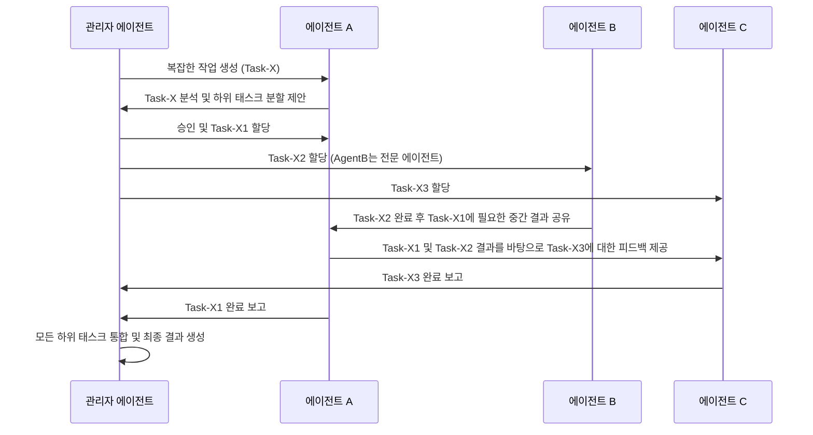

## 다중 에이전트 시스템의 상호작용 및 협업 최적화

현대 인공지능(AI) 분야에서 복잡한 문제를 해결하기 위해서는 단일 에이전트의 역량을 넘어선 다중 에이전트 시스템(Multi-Agent Systems, MAS)의 효율적인 상호작용과 협업이 필수적입니다. 빠르게 발전하는 에이전트 기술 환경, 특히 Large Language Models (LLMs) 기반의 에이전트 시대에서는 이러한 협업 전략이 실무 역량의 핵심으로 부상하고 있습니다. 에이전트 간의 정보 교환, 작업 분배, 갈등 해결 등 최적화된 상호작용은 시스템 전체의 성능과 견고성을 좌우합니다.

### 핵심 개념 및 중요성

다중 에이전트 시스템은 개별적으로 자율적인 에이전트들이 특정 목표를 달성하기 위해 함께 작동하는 분산형 AI 시스템입니다. 여기서 '상호작용(Interaction)'은 에이전트들이 정보를 교환하고 서로의 행동에 영향을 미치는 과정이며, '협업(Collaboration)'은 공통의 목표를 달성하기 위해 에이전트들이 공동으로 노력하는 것을 의미합니다. 효율적인 상호작용 및 협업은 다음과 같은 이점을 제공합니다:

*   **복잡성 관리**: 단일 에이전트가 처리하기 어려운 복잡한 문제를 여러 에이전트가 분할하여 해결할 수 있습니다.
*   **견고성 및 탄력성(Robustness & Resilience)**: 일부 에이전트에 오류가 발생하더라도 다른 에이전트들이 작업을 이어받아 시스템 전체의 기능성을 유지할 수 있습니다.
*   **병렬 처리 및 확장성(Scalability)**: 작업을 병렬로 처리하여 처리 속도를 높이고, 필요한 경우 에이전트를 추가하여 시스템을 확장할 수 있습니다.
*   **유연성 및 적응성(Flexibility & Adaptability)**: 동적으로 환경 변화에 적응하고, 새로운 요구사항에 맞춰 에이전트들의 역할을 조정할 수 있습니다.

### 상호작용 및 협업 최적화 전략

2026년 현재, LLM 기반 에이전트의 발전과 함께 더욱 정교하고 동적인 협업 전략이 요구됩니다. 주요 전략은 다음과 같습니다.

#### 1. 명확한 통신 프로토콜 (Communication Protocols)

에이전트 간의 효율적인 정보 교환을 위해 표준화된 통신 프로토콜이 중요합니다. FIPA ACL (Foundation for Intelligent Physical Agents Agent Communication Language)과 같은 언어는 메시지 유형(inform, request, propose 등)과 의미론을 정의하여 오해를 줄이고 상호작용의 예측 가능성을 높입니다.

#### 2. 동적 역할 분담 및 태스크 할당 (Dynamic Role Assignment & Task Allocation)

에이전트의 역량과 현재 시스템 상태에 따라 역할을 동적으로 할당하고 태스크를 분배하는 것은 시스템의 효율성을 극대화합니다. 이는 경매 메커니즘, 시장 기반 접근 방식, 혹은 중앙 집중식 스케줄러를 통해 구현될 수 있습니다. 특히 LLM 에이전트의 경우, 태스크의 복잡도를 이해하고 자신의 전문성에 맞춰 자율적으로 태스크를 수락하거나 위임하는 형태가 발전하고 있습니다.

#### 3. 조정 메커니즘 (Coordination Mechanisms)

에이전트들이 서로의 행동을 조정하여 충돌을 피하고 시너지를 창출하는 메커니즘입니다. 블랙보드 시스템(Blackboard Systems), 공유 메모리(Shared Memory), 메시지 큐(Message Queues) 등이 일반적입니다. 2026년에는 'CoT (Chain-of-Thought) for Collaboration'과 같이 에이전트들이 각자의 추론 과정을 공유하여 공동의 문제 해결 능력을 향상시키는 접근법도 주목받고 있습니다.

#### 4. 갈등 해결 및 합의 도출 (Conflict Resolution & Consensus)

자율적인 에이전트 간에는 자원 경쟁, 목표 충돌 등으로 인해 갈등이 발생할 수 있습니다. 협상(Negotiation), 중재(Arbitration), 투표(Voting)와 같은 메커니즘을 통해 갈등을 해결하고 합의된 결정을 도출하는 것이 중요합니다. 이는 시스템의 안정성과 신뢰성을 높이는 데 기여합니다.

#### 5. 학습 및 적응 (Learning & Adaptation)

강화 학습(Reinforcement Learning)이나 진화 알고리즘(Evolutionary Algorithms)을 활용하여 에이전트들이 상호작용 전략을 학습하고 환경 변화에 따라 적응하도록 할 수 있습니다. 이를 통해 시스템은 시간이 지남에 따라 스스로 최적화될 수 있습니다.

### 협업 프로세스 시각화: 동적 태스크 할당



### 코드 예제: 간단한 메시지 큐 기반 협업

아래 Python 코드는 `queue` 모듈을 사용하여 두 에이전트가 메시지 큐를 통해 상호작용하고 협업하는 간단한 예시입니다. `TaskProducerAgent`는 작업을 생성하고, `TaskConsumerAgent`는 작업을 처리하며 결과를 다시 큐에 넣습니다.

```python
import queue
import threading
import time

class BaseAgent(threading.Thread):
    def __init__(self, name, inbound_queue, outbound_queue):
        super().__init__()
        self.name = name
        self.inbound_queue = inbound_queue
        self.outbound_queue = outbound_queue
        self._running = True
        print(f"{self.name} 에이전트 초기화.")

    def stop(self):
        self._running = False

class TaskProducerAgent(BaseAgent):
    def run(self):
        task_id = 0
        while self._running and task_id < 3:
            task = f"Task-{task_id}"
            print(f"[{self.name}] 작업 '{task}' 생성 및 전송.")
            self.outbound_queue.put({'sender': self.name, 'type': 'task', 'payload': task})
            task_id += 1
            time.sleep(1) # simulate work
        self.outbound_queue.put({'sender': self.name, 'type': 'shutdown'}) # Signal completion
        print(f"[{self.name}] 작업 생성 완료 및 종료 신호.")

class TaskConsumerAgent(BaseAgent):
    def run(self):
        while self._running:
            if not self.inbound_queue.empty():
                message = self.inbound_queue.get()
                sender = message.get('sender')
                msg_type = message.get('type')
                payload = message.get('payload')

                if msg_type == 'task':
                    print(f"[{self.name}] '{sender}'로부터 작업 '{payload}' 수신, 처리 중...")
                    time.sleep(1.5) # simulate processing
                    result = f"Result of {payload}"
                    print(f"[{self.name}] 작업 '{payload}' 처리 완료. 결과 전송.")
                    self.outbound_queue.put({'sender': self.name, 'type': 'result', 'payload': result})
                elif msg_type == 'shutdown':
                    print(f"[{self.name}] '{sender}'로부터 종료 신호 수신. 자체 종료.")
                    self.stop()
            time.sleep(0.1)

# Main execution
if __name__ == "__main__":
    producer_to_consumer_q = queue.Queue()
    consumer_to_producer_q = queue.Queue()

    producer = TaskProducerAgent("ProducerAgent", consumer_to_producer_q, producer_to_consumer_q)
    consumer = TaskConsumerAgent("ConsumerAgent", producer_to_consumer_q, consumer_to_producer_q)

    producer.start()
    consumer.start()

    producer.join()
    consumer.join()

    print("모든 에이전트 실행 완료.")

    # Optionally process any remaining results from consumer
    while not consumer_to_producer_q.empty():
        result_message = consumer_to_producer_q.get()
        print(f"최종 결과 수집: (result_message.get('payload'))")
```

이 예제는 간단한 동기식 메시지 교환을 보여주지만, 실제 다중 에이전트 시스템에서는 비동기 통신, 이벤트 기반 아키텍처, 분산 메시징 시스템(Kafka, RabbitMQ) 등을 활용하여 확장성을 확보합니다.

## 트레이드오프

다중 에이전트 시스템의 상호작용 및 협업 최적화에는 다양한 트레이드오프가 존재하며, 시스템의 특정 요구사항에 따라 적절한 균형점을 찾아야 합니다.

*   **중앙 집중식 vs. 분산식 제어 (Centralized vs. Decentralized Control)**
    *   **언제 좋고**: 초기 개발이 빠르고, 시스템 전체의 일관성 및 최적화가 용이합니다. 제한된 자원과 명확한 목표를 가진 소규모 시스템에 적합합니다.
    *   **언제 나쁜지**: 단일 장애점(Single Point of Failure)이 될 수 있고, 대규모 시스템에서는 병목 현상이 발생하며, 확장성(Scalability)이 제한됩니다.
*   **명시적 vs. 암묵적 통신 (Explicit vs. Implicit Communication)**
    *   **언제 좋고**: 명시적 통신(예: 메시지 전달)은 에이전트 간의 의도를 명확히 하고 디버깅을 용이하게 합니다. 암묵적 통신(예: 공유 환경 변화)은 오버헤드가 적고 동적인 환경 변화에 빠르게 반응할 수 있습니다.
    *   **언제 나쁜지**: 명시적 통신은 통신 오버헤드를 증가시키고 설계 복잡도를 높일 수 있습니다. 암묵적 통신은 에이전트 간의 의도 파악이 어렵고 예상치 못한 부작용을 초래할 수 있습니다.
*   **에이전트 전문화 vs. 일반화 (Specialization vs. Generalization)**
    *   **언제 좋고**: 전문화된 에이전트는 특정 태스크를 매우 효율적으로 수행하며, 성능이 높습니다. 일반화된 에이전트는 다양한 태스크를 처리할 수 있어 시스템의 유연성을 높입니다.
    *   **언제 나쁜지**: 전문화된 에이전트는 시스템의 유연성을 떨어뜨리고, 새로운 태스크에 대한 적응이 어렵습니다. 일반화된 에이전트는 특정 태스크에서 전문 에이전트보다 성능이 떨어질 수 있습니다.
*   **사전 계획 vs. 반응형 조정 (Proactive vs. Reactive Coordination)**
    *   **언제 좋고**: 사전 계획(Proactive planning)은 복잡하고 예측 가능한 환경에서 전체 시스템의 최적 경로를 찾을 수 있습니다. 반응형 조정(Reactive coordination)은 동적이고 예측 불가능한 환경에서 변화에 빠르게 대처할 수 있습니다.
    *   **언제 나쁜지**: 사전 계획은 환경 변화에 취약하고, 계획 수립에 많은 연산 자원이 소모될 수 있습니다. 반응형 조정은 전역 최적화에 도달하기 어렵고, 단기적인 최적화에 머무를 수 있습니다.

## 실전 체크리스트

다중 에이전트 시스템의 상호작용 및 협업 최적화 전략을 실제 프로젝트에 적용할 때 다음 항목들을 검증해야 합니다.

*   [ ] **통신 프로토콜 정의**: 에이전트 간 메시지 형식, 내용, 전송 방식이 명확하게 정의되어 있으며, LLM 에이전트의 경우 프롬프트 엔지니어링을 통해 상호 이해도를 높였는가?
*   [ ] **동적 태스크 할당 메커니즘**: 에이전트의 현재 부하, 역량, 가용성을 고려하여 태스크가 동적으로 할당되는가? 할당 로직의 공정성과 효율성을 측정할 수 있는가?
*   [ ] **갈등 해결 전략 구현**: 에이전트 간 자원 경합 또는 목표 충돌 발생 시, 이를 감지하고 해결하기 위한 협상 또는 중재 메커니즘이 효과적으로 작동하는가?
*   [ ] **시스템 모니터링 및 로깅**: 에이전트 간의 모든 상호작용과 태스크 처리 과정을 추적하고 분석할 수 있는 중앙 집중식 모니터링 및 로깅 시스템이 구축되어 있는가?
*   [ ] **성능 벤치마크**: 다양한 부하 조건에서 시스템의 처리량, 응답 시간, 자원 사용량 등 핵심 성능 지표(KPI)를 측정하고, 최적화 전후를 비교하여 개선 효과를 입증했는가?
*   [ ] **장애 복구 및 견고성 테스트**: 특정 에이전트의 실패 시 다른 에이전트가 작업을 인계받거나 시스템이 정상적으로 기능할 수 있는지 장애 복구 시나리오 테스트를 수행했는가?
*   [ ] **보안 및 접근 제어**: 에이전트 간 통신 채널이 안전하게 보호되며, 각 에이전트가 필요한 정보에만 접근할 수 있도록 권한 관리가 이루어지고 있는가?
