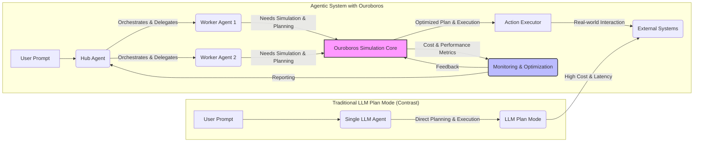

복잡한 모델링 및 시뮬레이션 환경에서 AI 에이전트의 성능과 비용 효율성을 최적화하는 것은 2026년 AI 개발의 핵심 과제 중 하나입니다. 기존 LLM의 내장된 플랜 모드(Plan Mode)는 강력하지만, 특정 시뮬레이션 시나리오에서는 예측 불가능한 성능과 높은 비용을 야기할 수 있습니다. 이러한 한계를 극복하기 위해 오픈소스 Ouroboros 프레임워크가 등장했으며, 특히 이산 이벤트 시뮬레이션(Discrete-Event Simulation) 벤치마크에서 Claude Plan Mode를 능가하는 결과를 보여주며 주목받고 있습니다.

## Ouroboros의 핵심 가치: 시뮬레이션 성능 및 비용 효율성

Ouroboros는 LLM 기반 에이전트가 복잡한 시뮬레이션 환경에서 더 효율적으로 계획하고 실행할 수 있도록 설계된 오픈소스 프레임워크입니다. 이 프로젝트의 핵심은 에이전트의 의사 결정 과정을 최적화하여, 기존 LLM의 내장된 플래닝 기능보다 더 정확하고 효율적인 시뮬레이션 모델링 및 예측을 가능하게 하는 데 있습니다. 특히, 동시성 처리 및 리소스 관리 측면에서 뛰어난 성능을 보이며, 이는 곧 전체 AI 워크플로의 실행 시간 단축과 API 호출 비용 절감으로 이어집니다. ‘허브-워커 복리 자동화’와 같은 다중 에이전트 시스템에서는 각 워커 에이전트의 독립적인 시뮬레이션 및 계획 수립에 Ouroboros를 적용하여 전체 시스템의 처리량을 극대화하고 비용을 통제할 수 있습니다.

## Ouroboros 아키텍처 및 동작 원리

Ouroboros는 일반적으로 다음과 같은 방식으로 에이전트의 시뮬레이션 및 계획을 개선합니다.

### 1. 최적화된 시뮬레이션 환경 구성

Ouroboros는 이산 이벤트 시뮬레이션에 특화된 환경 구성을 지원합니다. 이는 에이전트가 복잡한 상태 변화와 이벤트 순서를 정확하게 모델링하고 예측하는 데 필수적입니다. 경량화된 시뮬레이션 엔진을 통해 LLM이 직접 처리하기 어려운 미세한 시뮬레이션 로직을 효율적으로 실행합니다.

### 2. 동적 플래닝 및 실행 최적화

Ouroboros는 LLM의 추론 결과를 바탕으로 동적으로 실행 계획을 수립하고, 시뮬레이션 환경 내에서 이 계획을 효율적으로 검증하고 수정합니다. 이는 LLM이 잘못된 계획을 수립했을 때 발생하는 비효율적인 반복과 불필요한 API 호출을 줄여줍니다. 특히, 자체적인 피드백 루프를 통해 시뮬레이션 결과를 바탕으로 LLM의 다음 액션을 가이드하여 전체적인 Goal Achievement Rate를 향상시킵니다.

### 3. 리소스 및 비용 관리 계층

프레임워크는 LLM API 호출 빈도, 토큰 사용량 등을 모니터링하고 제어하는 계층을 포함합니다. 이를 통해 시뮬레이션 과정에서 발생하는 비용을 예측하고 최적화하여, 고비용의 LLM 모델 사용을 최소화하면서도 고품질의 결과를 도출할 수 있습니다.


*그림 1: Ouroboros 통합 에이전트 시스템 워크플로*

## Ouroboros 통합을 통한 허브-워커 복리 자동화 시나리오

'허브-워커 복리 자동화' 시나리오는 중앙 허브 에이전트가 복잡한 작업을 여러 워커 에이전트에게 분배하고, 각 워커가 독립적으로 부분 작업을 수행한 후 결과를 다시 허브에 보고하는 패턴입니다. 여기에 Ouroboros를 통합하면 각 워커 에이전트의 시뮬레이션 및 계획 수립 단계를 효율적으로 최적화할 수 있습니다.

```python
import openai
import json

# Ouroboros 라이브러리가 있다고 가정 (예시 코드)
class OuroborosSimulationCore:
    def __init__(self, simulation_config):
        self.config = simulation_config

    def run_simulation(self, current_state, proposed_action, steps=5):
        # Simulate the action and predict the next state and outcomes
        print(f"Simulating action {proposed_action} from state {current_state}...")
        # In a real scenario, this would involve complex logic
        # For example, a discrete event simulation engine
        predicted_next_state = self._simulate_logic(current_state, proposed_action, steps)
        predicted_cost = len(proposed_action.split()) * 0.001 # Mock cost
        predicted_performance = 1.0 / (len(proposed_action.split()) + 1) # Mock performance
        return {
            "next_state": predicted_next_state,
            "cost": predicted_cost,
            "performance": predicted_performance
        }

    def _simulate_logic(self, current_state, action, steps):
        # Simplified simulation logic for demonstration
        if "update_db" in action:
            return f"DB updated with {action.split()[-1]}"
        elif "fetch_data" in action:
            return f"Data fetched for {action.split()[-1]}"
        return f"State after '{action}': {current_state} (simulated)"


class WorkerAgent:
    def __init__(self, id, ouroboros_core):
        self.id = id
        self.ouroboros_core = ouroboros_core
        self.current_state = f"Worker {self.id} initial state: idle"

    def plan_and_execute(self, task_description):
        print(f"\nWorker {self.id} received task: {task_description}")

        # Step 1: LLM generates potential actions
        response = openai.chat.completions.create(
            model="gpt-4-turbo", # Or any suitable LLM
            messages=[
                {"role": "system", "content": "You are a helpful assistant."},
                {"role": "user", "content": f"Given the current state '{self.current_state}' and task '{task_description}', suggest 3 distinct actions in JSON format. Each action should have a 'name' and 'description'."}
            ],
            response_format={"type": "json_object"}
        )
        try:
            actions_json = response.choices[0].message.content
            potential_actions = json.loads(actions_json).get("actions", [])
        except (json.JSONDecodeError, AttributeError):
            print("Failed to parse LLM suggested actions.")
            potential_actions = []

        best_action = None
        min_cost = float('inf')

        # Step 2: Ouroboros simulates each action for optimal choice
        for action in potential_actions:
            sim_result = self.ouroboros_core.run_simulation(
                self.current_state, action.get("description", "")
            )
            if sim_result["cost"] < min_cost:
                min_cost = sim_result["cost"]
                best_action = action

        if best_action:
            print(f"Worker {self.id} selected action: {best_action['name']} (Cost: {min_cost:.4f})")
            # Execute the best action (simplified)
            self.current_state = self.ouroboros_core._simulate_logic(self.current_state, best_action['description'], 1)
            return f"Worker {self.id} completed '{best_action['name']}' with result: {self.current_state}"
        else:
            return f"Worker {self.id} could not find an optimal plan for task: {task_description}"


# Example Usage:
# Initialize Ouroboros Simulation Core
ouroboros_config = {"env_type": "discrete_event", "complexity": "high"}
ouroboros = OuroborosSimulationCore(ouroboros_config)

# Initialize Worker Agents with Ouroboros
worker1 = WorkerAgent(id=1, ouroboros_core=ouroboros)
worker2 = WorkerAgent(id=2, ouroboros_core=ouroboros)

# Hub Agent (simplified orchestration)
tasks = [
    "fetch user profile data from the database",
    "update product inventory count to 150 for product ID P-123",
    "generate a summary report for Q3 sales"
]

results = []
results.append(worker1.plan_and_execute(tasks[0]))
results.append(worker2.plan_and_execute(tasks[1]))

for res in results:
    print(res)

```
*코드 1: Ouroboros를 활용한 워커 에이전트의 시뮬레이션 기반 플래닝 예시*

위 예시에서 `OuroborosSimulationCore`는 각 워커 에이전트가 LLM으로부터 제안받은 여러 잠재적 액션들을 실제 시뮬레이션 환경에서 미리 실행해보고, 비용과 성능을 기준으로 최적의 액션을 선택할 수 있도록 돕습니다. 이는 LLM의 추론 오류를 최소화하고, 불필요한 API 호출을 줄여 비용을 절감하는 동시에 시뮬레이션 정확도를 높입니다.

## 트레이드오프

### 1. 성능 및 비용 효율성 (Performance & Cost Efficiency)
*   **좋은 경우**: 복잡한 시뮬레이션, 다중 에이전트 시스템, 높은 비용의 LLM API 의존성이 있는 경우. Ouroboros의 최적화된 시뮬레이션과 계획은 LLM 호출 횟수를 줄여 비용을 절감하고, 전반적인 처리 속도를 향상시킵니다.
*   **나쁜 경우**: 단순한 태스크나 예측 가능한 환경에서는 추가적인 Ouroboros 계층 도입의 이득이 미미하거나, 오히려 오버헤드로 작용할 수 있습니다.

### 2. 개발 및 통합 복잡성 (Development & Integration Complexity)
*   **좋은 경우**: 기존의 LLM Plan Mode가 요구사항을 충족하지 못하거나, 특정 시뮬레이션 로직에 대한 세밀한 제어가 필요한 경우. Ouroboros는 커스터마이징 가능한 시뮬레이션 환경을 제공하여 유연성을 높입니다.
*   **나쁜 경우**: Ouroboros는 오픈소스이며 별도의 학습 및 통합 노력이 필요합니다. 숙련된 개발 팀이 없거나 빠른 프로토타이핑이 중요한 초기 단계 프로젝트에서는 진입 장벽이 될 수 있습니다.

### 3. 유지보수 및 커뮤니티 지원 (Maintenance & Community Support)
*   **좋은 경우**: 활발한 오픈소스 커뮤니티와 지속적인 개발이 이루어질 경우, 최신 AI 트렌드와 기술 변화에 빠르게 대응할 수 있으며, 버그 수정 및 기능 개선에 대한 지원을 받을 수 있습니다.
*   **나쁜 경우**: 신생 오픈소스 프로젝트의 경우, 안정성, 문서화, 커뮤니티 지원이 부족할 수 있습니다. 이는 장기적인 유지보수 비용과 리스크를 증가시킬 수 있습니다.

### 4. 제어 및 투명성 (Control & Transparency)
*   **좋은 경우**: LLM의 블랙박스 같은 플래닝 방식에 대한 대안으로, Ouroboros는 시뮬레이션 과정을 명확히 보여주고 개발자가 직접 개입하여 조정할 수 있는 투명성을 제공합니다.
*   **나쁜 경우**: LLM의 자체적인 플래닝 능력이 충분히 강력하고, 개발자가 시뮬레이션 로직을 직접 구현하거나 관리하는 오버헤드를 원하지 않을 때에는 이점이 적습니다.

## 실전 체크리스트

Ouroboros를 프로젝트에 통합하기 전에 다음 항목들을 검토해야 합니다.

- [ ] **성능 벤치마킹:** Ouroboros 통합 전후의 에이전트 Goal Achievement Rate, Latency, Throughput을 측정하고 개선 효과가 유의미한지 확인한다.
- [ ] **비용 분석:** Ouroboros를 통한 LLM API 호출 횟수 감소 및 토큰 사용량 절감 효과를 정량적으로 분석하여 ROI를 평가한다.
- [ ] **통합 용이성 평가:** 기존 에이전트 프레임워크 또는 워크플로에 Ouroboros를 통합하는 데 필요한 개발 노력과 복잡성을 사전 평가한다.
- [ ] **시뮬레이션 모델링 정확도:** Ouroboros 기반 시뮬레이션이 실제 환경을 얼마나 정확하게 반영하며, 예측 결과의 신뢰도가 충분한지 검증한다.
- [ ] **개발팀 숙련도:** Ouroboros의 아키텍처 및 이산 이벤트 시뮬레이션 개념에 대한 개발팀의 이해도와 숙련도를 확인하여 온보딩 계획을 수립한다.
- [ ] **유지보수 전략:** 오픈소스 라이브러리의 업데이트 주기, 커뮤니티 지원 수준을 고려하여 장기적인 유지보수 및 보안 업데이트 전략을 수립한다.
- [ ] **확장성 검토:** 다수의 에이전트 또는 복잡한 시뮬레이션 시나리오로 확장될 경우 Ouroboros가 제공하는 확장성이 현재 및 미래 요구사항을 충족하는지 검토한다.