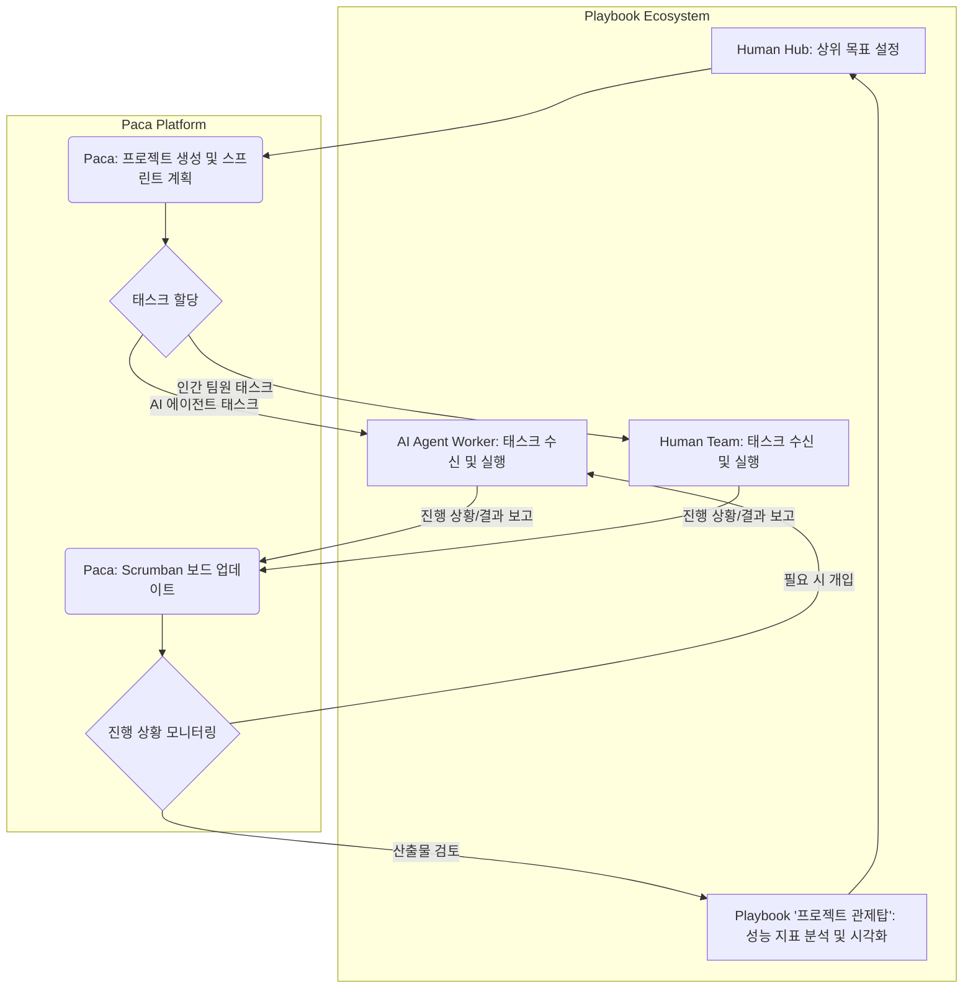

Paca는 인간과 AI 에이전트의 협업을 위한 오픈소스 프로젝트 관리 플랫폼으로, 기존의 Jira, Trello 등과 같은 도구들이 제공하는 기능 위에 AI 에이전트를 스크럼 팀의 동등한 구성원으로 통합하는 독특한 접근 방식을 제공한다. 이는 단순히 챗봇 애드온을 추가하는 것을 넘어, 에이전트가 스프린트에 배정되고 통합 Scrumban 보드에서 인간 팀원과 함께 작업을 수행하며 진척도를 추적할 수 있도록 설계되었다. Playbook의 '프로젝트 관제탑' 비전은 현재 수동으로 관리되는 에이전트 작업 배정 및 추적 과정을 자동화하고 통합하는 것을 목표로 하며, Paca는 이러한 비전을 실현할 수 있는 유력한 솔루션으로 검토될 수 있다.

## Paca의 핵심 아키텍처 및 에이전트 통합 모델

Paca의 가장 큰 특징은 AI 에이전트를 시스템의 중심에 두는 'AI 네이티브' 설계다. 이는 에이전트가 단순한 자동화 스크립트가 아니라, 특정 목표를 달성하기 위해 자율적으로 계획하고 실행하며 필요한 경우 인간의 개입을 요청할 수 있는 주체로 인식됨을 의미한다. Paca는 에이전트의 작업 할당, 진행 상황 추적, 그리고 완료된 작업의 검증까지 전반적인 라이프사이클을 관리하기 위한 구조를 갖춘다.

### 에이전트 워크로드 관리

Paca는 에이전트를 특정 스프린트나 태스크에 배정하고, 이들의 실행 로그와 결과물을 중앙에서 관리할 수 있는 기능을 제공한다. 이는 playbook의 허브-워커 복리 자동화 패턴과 긴밀하게 연계될 수 있다. 허브는 상위 레벨의 목표를 설정하고 워커(AI 에이전트)에게 특정 태스크를 위임하는데, Paca는 이 위임된 태스크를 체계적으로 관리하고 모니터링하는 인터페이스 역할을 수행한다.

예를 들어, 워커 에이전트가 특정 코드 리팩토링 작업을 수행해야 할 경우, Paca는 해당 작업을 스크럼 보드에 카드 형태로 등록하고, 에이전트가 작업을 시작하고 완료하는 과정을 실시간으로 업데이트하며, 생성된 코드나 문서 등의 산출물을 연결할 수 있다.

```json
{
  "task_id": "PRJ-001-REF-005",
  "title": "ModuleX 리팩토링: 의존성 주입 최적화",
  "assigned_to": "agent:code-refactor-bot",
  "status": "In Progress",
  "priority": "High",
  "sprint": "Sprint 3",
  "description": "ModuleX의 비즈니스 로직에서 하드코딩된 의존성을 제거하고, DI 패턴을 적용하여 테스트 용이성 및 유지보수성을 향상. 변경 사항은 코드 리뷰를 거쳐야 함.",
  "subtasks": [
    {"title": "현재 의존성 구조 분석", "assigned_to": "agent:code-analysis-bot", "status": "Done"},
    {"title": "DI 컨테이너 구현 또는 통합", "assigned_to": "agent:code-refactor-bot", "status": "In Progress"},
    {"title": "기존 코드 DI 패턴으로 전환", "assigned_to": "agent:code-refactor-bot", "status": "To Do"},
    {"title": "테스트 케이스 업데이트 및 추가", "assigned_to": "human:dev-lead", "status": "To Do"}
  ],
  "dependencies": ["PRJ-001-ARCH-002"],
  "due_date": "2026-07-15"
}
```

이와 같은 구조를 통해, 인간 팀원은 Paca 대시보드에서 AI 에이전트가 어떤 작업을 수행하고 있는지, 진척도는 어느 정도인지 직관적으로 파악할 수 있으며, 필요한 경우 직접 개입하여 에이전트의 작업을 조정하거나 새로운 지시를 내릴 수 있다. 이는 현재 playbook 내에서 `agents/ai-agent-remote-management-ux-persistent-web-terminals` 와 같은 방식으로 수동으로 진행되는 과정을 UI와 백엔드 레벨에서 통합하여 효율성을 극대화하는 방안으로 활용될 수 있다.

### 통합된 작업 관제 및 추적

Paca는 Scrumban 보드를 통해 인간과 AI 에이전트의 작업을 통합적으로 보여준다. 이는 전체 프로젝트의 진행 상황을 한눈에 파악하고 병목 현상을 식별하는 데 도움을 준다. playbook의 '프로젝트 관제탑'은 이 데이터를 활용하여 에이전트의 성능 지표, 비용 효율성, 그리고 목표 달성률 등을 실시간으로 모니터링하고 시각화할 수 있다.



Mermaid 다이어그램은 Paca가 Playbook 생태계 내에서 '프로젝트 관제탑' 역할을 어떻게 수행할 수 있는지 시각적으로 보여준다. Human Hub가 상위 목표를 Paca에 전달하면, Paca는 이 목표를 바탕으로 프로젝트와 스프린트를 계획하고 태스크를 인간 팀원 또는 AI 에이전트 워커에게 할당한다. 에이전트와 인간 팀원은 할당된 태스크를 수행하고 Paca에 진행 상황과 결과물을 보고하며, Paca는 Scrumban 보드를 통해 이를 통합 관리한다. 최종적으로, '프로젝트 관제탑'은 Paca의 데이터를 기반으로 성능 지표를 분석하고 시각화하여 다시 Human Hub로 피드백을 제공하는 순환 구조를 이룬다.

## 트레이드오프

### 1. AI 에이전트 작업 가시성 및 제어 향상
*   **언제 좋음**: 복잡한 멀티 에이전트 시스템에서 에이전트별 작업 할당, 진행 상황, 결과물을 중앙에서 관리하고 추적해야 할 때. 에이전트의 자율성이 높아질수록 예상치 못한 동작이나 비효율을 빠르게 감지하고 제어하는 데 필수적이다.
*   **언제 나쁨**: 매우 단순하고 반복적인 단일 에이전트 작업으로, 별도의 프로젝트 관리 도구 없이도 직접 스크립트나 API 호출로 충분히 관리될 수 있는 경우. 과도한 오버헤드가 발생할 수 있다.

### 2. 인간-AI 협업 워크플로우 통합
*   **언제 좋음**: 인간 팀원과 AI 에이전트가 동일한 프로젝트 목표 아래 긴밀하게 협력하며, 서로의 작업 진행 상황을 공유하고 의존성을 관리해야 하는 경우. 특히 Scrum이나 Scrumban과 같은 애자일 방법론을 AI 에이전트에도 적용하고자 할 때 효과적이다.
*   **언제 나쁨**: AI 에이전트가 주로 독립적인 백그라운드 프로세스나 오프라인 배치 작업만을 수행하며, 인간과의 실시간 상호작용이나 워크플로우 공유가 거의 없는 경우. 통합의 이점이 크지 않을 수 있다.

### 3. 오픈소스 기반의 유연성 및 커스터마이징 가능성
*   **언제 좋음**: 특정 조직의 독자적인 AI 에이전트 아키텍처나 기존 시스템과의 연동을 위해 고도의 커스터마이징이 필요할 때. 자체 호스팅을 통해 데이터 주권 및 보안 요구사항을 충족시킬 수 있다.
*   **언제 나쁨**: 즉각적인 도입과 운영이 중요하며, 유지보수 및 커스터마이징에 투입할 내부 개발 리소스가 부족한 경우. 초기 설정 및 관리에 대한 부담이 발생할 수 있다.

### 4. 에이전트 동등성 부여의 장점과 위험
*   **언제 좋음**: AI 에이전트를 단순한 도구가 아닌, 능동적인 문제 해결자로 간주하고 이들의 자율성과 기여를 극대화하고자 할 때. 에이전트가 스스로 태스크를 제안하고, 백로그에서 작업을 가져와 수행하는 시나리오에 적합하다.
*   **언제 나쁨**: 에이전트의 자율성이 아직 검증되지 않았거나, 예측 불가능한 행동으로 인한 위험이 커서 인간의 엄격한 감독과 제어가 우선시되어야 하는 경우. 에이전트의 '동등성'이 오히려 관리 복잡성을 높일 수 있다.

## 실전 체크리스트

Paca를 Playbook '프로젝트 관제탑' 비전에 맞춰 도입하기 위한 실전 체크리스트는 다음과 같다.

- [ ] 현재 운영 중인 에이전트 작업 배정 및 추적 메커니즘을 문서화하고, Paca 도입 시 개선될 수 있는 구체적인 비효율 지점을 식별했는가? (정량적 지표 포함)
- [ ] Paca의 API 및 데이터 모델이 playbook의 허브-워커 아키텍처와 연동 가능한지 검토하고, 필요한 통합 지점 및 데이터 매핑 전략을 수립했는가?
- [ ] Paca가 제공하는 Scrumban 보드 및 태스크 관리 UI가 현재 팀의 애자일 워크플로우와 호환되는지, 그리고 AI 에이전트 작업 표시 방식이 명확하고 직관적인지 평가했는가?
- [ ] Paca를 자체 호스팅할 경우 필요한 인프라 리소스 (서버, DB, 네트워크)를 예측하고, 운영 및 유지보수 인력/프로세스 계획을 수립했는가?
- [ ] AI 에이전트가 Paca에 작업을 보고하고 상태를 업데이트하는 자동화 파이프라인 (예: 웹훅, API 호출)을 설계하고 PoC(Proof of Concept)를 통해 동작을 검증했는가?
- [ ] 에이전트의 작업 실행 결과물 (코드, 문서, 로그 등)을 Paca 태스크에 첨부하거나 연결하여, 인간 팀원이 쉽게 접근하고 검토할 수 있는 방안을 마련했는가?
- [ ] Paca 도입 후 에이전트 작업 할당 시간, 추적 정확도, 인간 팀원과의 협업 효율성 등 핵심 성과 지표(KPI)를 정의하고, 측정 가능한 목표치를 설정했는가?