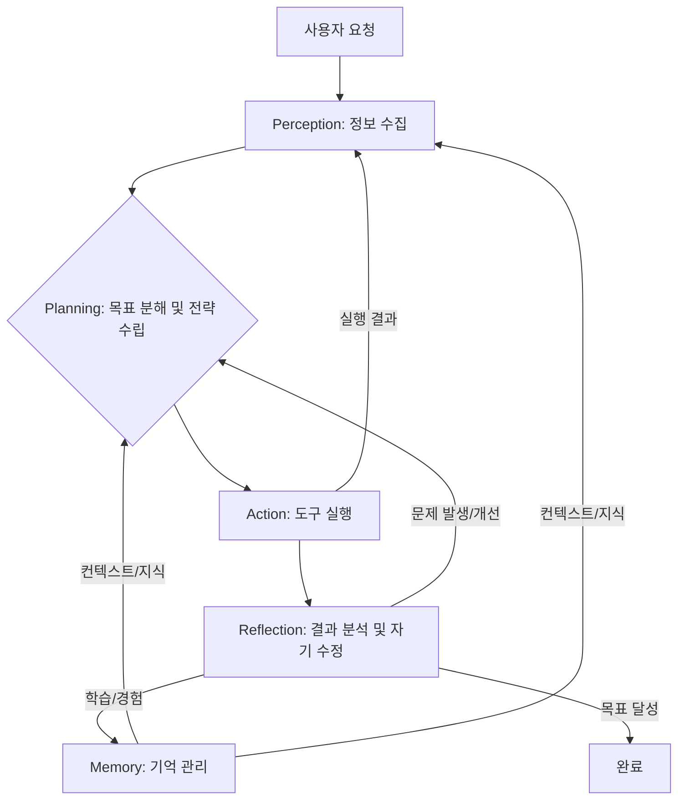

LLM 기반 자율 에이전트(Autonomous Agent) 아키텍처는 단순한 프롬프트 호출을 넘어, 장기 목표 달성, 예측 불가 상황 대응, 비용 효율성을 고려한 시스템 설계가 필수적입니다. 2026년 현재, 이는 복잡한 비즈니스 요구와 운영 제약을 동시에 만족해야 합니다.

## LLM 기반 자율 에이전트 핵심 컴포넌트

실용적인 자율 에이전트는 다음 핵심 컴포넌트들로 구성됩니다.

### 1. 지각(Perception) 모듈
에이전트가 외부 환경 정보를 수집합니다. 사용자 입력, 웹 검색, API 호출 등을 통해 정보를 획득하고 내부 상태로 변환합니다. RAG(Retrieval Augmented Generation)로 할루시네이션(Hallucination)을 줄이고, 도구(Tools) 실행 결과 분석으로 다음 행동을 결정합니다.

### 2. 계획(Planning) 모듈
목표(Goal)를 하위 태스크(Sub-tasks)로 분해하고, 실행 전략을 수립합니다. 현재 상황에 따라 동적으로 계획을 조정하며, CoT(Chain-of-Thought) 같은 LLM 추론 기법으로 최적의 다음 행동을 결정하고, 실패 시 대체 경로를 탐색합니다.

### 3. 행동(Action) 모듈
계획에 따라 실제 행동을 실행합니다. 외부 도구(APIs, CLI) 호출, 코드 실행, 데이터 생성/수정 등이 포함됩니다. Tool Orchestration을 통해 다양한 도구를 효율적으로 선택하고 입출력을 관리합니다.

### 4. 기억(Memory) 모듈
학습 및 장기 지식 보존, 과거 상호작용 맥락 유지를 담당합니다. 단기 기억(Short-Term Memory)은 LLM 컨텍스트 윈도우로 현재 세션 정보를, 장기 기억(Long-Term Memory)은 벡터/그래프 데이터베이스로 과거 경험과 지식을 저장합니다. 자기 성찰(Self-reflection)을 통해 기억을 업데이트하고 RAG로 검색하여 활용합니다.

### 5. 성찰 및 자기 수정(Reflection & Self-Correction) 모듈
실행 과정과 결과 모니터링, 오류/비효율 감지 시 스스로 수정하거나 개선 방안을 학습합니다. 도구 실행 실패, LLM 응답 오류 발생 시 복구 로직을 실행하며, 성공/실패 사례 분석으로 계획 및 행동 전략을 개선하는 피드백 루프(Feedback Loop)를 포함합니다. Human-in-the-Loop도 중요합니다.

## 아키텍처 시각화: 에이전트 워크플로우

다음 Mermaid 다이어그램은 자율 에이전트 컴포넌트들의 상호작용 워크플로우를 보여줍니다.



## 실용적인 LLM 에이전트 설계 패턴 (Python 예시)

다음은 기본적인 자율 에이전트 동작 루프를 시뮬레이션하는 Python 예제입니다.

```python
import json
from typing import List, Dict, Any

class Tool:
    def __init__(self, name: str, description: str, func):
        self.name, self.desc, self.func = name, description, func
        self.params_schema = {"type": "object", "properties": {}, "required": []}
    def get_definition(self): return {"type": "function", "function": {"name": self.name, "description": self.desc, "parameters": self.params_schema}}
    def execute(self, **kwargs): return self.func(**kwargs)

def search_web(query: str):
    return {"result": "LLM agent architectures in 2026 prioritize modularity, persistent memory, robust error handling, multi-agent collaboration, and guardrails."} if "LLM agent architecture" in query else {"result": "No detailed results."}
def write_file(filename: str, content: str):
    return {"status": "success", "message": f"File '{filename}' created."}

tools_list = [
    Tool("search_web", "Search the web.", search_web),
    Tool("write_file", "Write content to a file.", write_file),
]
tools_list[0].params_schema = {"type": "object", "properties": {"query": {"type": "string"}}, "required": ["query"]}
tools_list[1].params_schema = {"type": "object", "properties": {"filename": {"type": "string"}, "content": {"type": "string"}}, "required": ["filename", "content"]}

class AutonomousAgent:
    def __init__(self, initial_goal: str, max_steps: int = 5):
        self.goal = initial_goal
        self.memory: List[Dict[str, Any]] = [{"role": "user", "content": initial_goal}]
        self.available_tools = {t.name: t for t in tools_list}
        self.steps = 0

    def _simulate_llm_response(self, messages: List[Dict[str, Any]]):
        history_str = json.dumps(messages)
        if "search_web" not in history_str:
            return {"role": "assistant", "tool_calls": [{"id": "call_1", "function": {"name": "search_web", "arguments": '{"query": "LLM agent architecture 2026 trends"}'}}]}
        elif "LLM agent architectures in 2026 prioritize" in history_str and "write_file" not in history_str:
            search_res_msg = next(m["content"] for m in messages if m.get("role") == "tool" and "LLM agent architectures in 2026 prioritize" in m["content"])
            search_result = json.loads(search_res_msg)["result"]
            return {"role": "assistant", "tool_calls": [{"id": "call_2", "function": {"name": "write_file", "arguments": f'{{"filename": "agent_architecture_report.txt", "content": "{search_result}"}}'}}]}
        else: return {"role": "assistant", "content": "Task completed: Report on LLM agent architecture generated."}

    def run(self):
        while self.steps < self.max_steps:
            self.steps += 1
            llm_response = self._simulate_llm_response(self.memory)
            self.memory.append(llm_response)
            if llm_response.get("tool_calls"):
                tool_outputs = []
                for tc in llm_response["tool_calls"]:
                    tool = self.available_tools.get(tc["function"]["name"])
                    if tool:
                        args = json.loads(tc["function"]["arguments"])
                        output = tool.execute(**args)
                        tool_outputs.append({"tool_call_id": tc["id"], "role": "tool", "name": tool.name, "content": json.dumps(output)})
                self.memory.extend(tool_outputs)
            elif llm_response.get("content") and "Task completed" in llm_response["content"]: return
```

## 트레이드오프

LLM 기반 자율 에이전트 아키텍처 설계 시 주요 트레이드오프는 다음과 같습니다.

*   **자율성(Autonomy) vs. 제어(Control)**
    *   **좋은 경우**: 복잡/예측 불가능한 태스크에 유연 대응 및 혁신적 해결책 모색.
    *   **나쁜 경우**: 예상치 못한 행동, 비용 초과, 안전 문제 발생 가능. 규제 환경에선 정교한 제어 필수.

*   **복잡성(Complexity) vs. 견고성(Robustness)**
    *   **좋은 경우**: 다단계 계획, 고급 메모리, 멀티 에이전트 협업은 넓은 문제 범위에 견고하고 신뢰성 높은 성능 제공.
    *   **나쁜 경우**: 개발, 디버깅, 유지보수 어려움, 실패 지점 증가. 오버 엔지니어링은 불필요한 비용/지연 초래.

*   **실시간 처리(Real-time Processing) vs. 비용 효율성(Cost-Efficiency)**
    *   **좋은 경우**: 실시간 피드백 및 빠른 의사결정은 사용자 경험이나 시간이 중요한 태스크에 필수.
    *   **나쁜 경우**: LLM API 호출 비용 발생. 모든 단계 실시간 LLM 추론은 높은 운영 비용 초래. 캐싱, 배치, 경량 모델 활용으로 최적화 필요.

*   **범용성(Generalization) vs. 특수화(Specialization)**
    *   **좋은 경우**: 다양한 도메인/태스크 적용 가능, 개발 비용 절감, 유연성 제공.
    *   **나쁜 경우**: 특정 도메인/반복 태스크에서는 특수화된 에이전트가 더 높은 성능/효율성 보임. 범용 에이전트는 깊은 지식/최적화 행동 부족 가능.

## 실전 체크리스트

LLM 기반 자율 에이전트 아키텍처를 프로젝트에 적용할 때 다음 항목들을 검증합니다.

*   [ ] **명확한 목표 및 성공 지표 정의**: 에이전트의 비즈니스 문제와 측정 가능한 목표(KPI)를 명확히 정의했는가?
*   [ ] **견고한 오류 처리 및 복구 메커니즘 구현**: LLM 응답 실패, 도구 실행 오류 등 예상치 못한 상황 처리 및 복구 전략을 설계했는가?
*   [ ] **안전 및 비용 제어를 위한 가드레일(Guardrails) 구축**: 에이전트 행동 제한, 비용 지출 방지, 안전 요구사항 충족 메커니즘을 구현했는가?
*   [ ] **종합적인 관측 가능성(Observability) 및 로깅 시스템 구축**: 에이전트의 의사결정 과정, 도구 호출, 실행 결과, 메모리 상태 등을 추적하고 디버깅 가능한 시스템을 갖추었는가?
*   [ ] **지속적인 학습 및 장기 기억 전략 설계**: 에이전트가 과거 경험 학습, 중요 지식을 장기 기억에 효과적으로 저장/검색하는 시스템을 구축했는가?
*   [ ] **멀티 에이전트 협업 패턴 고려**: 복잡한 태스크의 경우, 여러 에이전트가 협업하는 아키텍처 패턴을 검토했는가?
*   [ ] **성능 및 비용 최적화 주기적 감사**: 에이전트의 성능(응답 시간, 성공률)과 운영 비용을 주기적으로 측정하고, 최적화 방안을 적용하는 프로세스를 확립했는가?