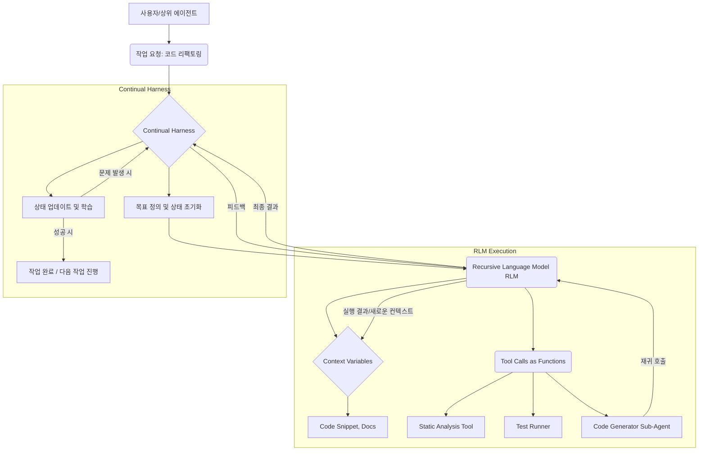

Prime Agent는 복잡한 코딩 및 장기 자율 작업을 위해 설계된 혁신적인 AI 에이전트 아키텍처로, Recursive Language Model (RLM)과 Continual Harness라는 두 가지 핵심 추상화를 통해 기존 에이전트의 한계를 뛰어넘는다. 이 접근 방식은 playbook 에이전트의 고도화에 중요한 통찰을 제공하며, 특히 동적인 컨텍스트 관리와 지속적인 자율 학습에 초점을 맞춘다.

## Recursive Language Model (RLM): 컨텍스트를 변수처럼, 도구를 함수처럼

RLM의 핵심 아이디어는 "프롬프트를 변수처럼(prompt-as-a-variable)" 다루고, 재귀적인 서브 에이전트나 외부 도구를 "함수 호출처럼" 활용하는 것이다. 이는 전통적인 선형 프롬프트 체이닝 방식과는 달리, 에이전트가 상황에 따라 동적으로 새로운 프롬프트 환경을 구성하고, 필요한 도구를 유연하게 호출하며, 결과를 다시 컨텍스트에 반영하는 REPL(Read-Eval-Print Loop)과 유사한 상호작용을 가능하게 한다.

### 동적 컨텍스트 구성 및 REPL 패턴

RLM에서 컨텍스트는 정적 명령문이 아니라 동적으로 변경되고 재사용될 수 있는 데이터 구조로 간주된다. 에이전트는 특정 하위 작업을 수행하기 위해 새로운 "컨텍스트 변수"를 정의하고, 이 변수에 필요한 정보(코드 조각, 데이터, 이전 실행 결과)를 할당할 수 있다. 이는 복잡한 문제를 작은 단위로 분해하고, 각 단위에 최적화된 실행 환경을 제공하여 전체 작업의 효율성과 정확도를 높인다.

예를 들어, 코드베이스 리팩토링 작업을 수행하는 에이전트는 특정 함수를 분석하기 위해 해당 함수의 코드와 관련 문서를 컨텍스트 변수에 로드한 후, "이 함수를 최적화하라"는 명령을 전달할 수 있다. 이때 최적화 에이전트는 다시 내부적으로 더 작은 RLM을 호출하여 코드 분석 도구, 테스트 실행 도구 등을 함수처럼 사용하여 결과를 반환한다.

## Continual Harness: 장기 자율 작업을 위한 지속적 통합

Continual Harness는 Prime Agent가 장기적인 자율 작업을 수행하고 시간이 지남에 따라 학습 및 개선될 수 있도록 지원하는 프레임워크다. 이는 에이전트의 실행 상태, 진행 상황, 목표 달성 여부, 그리고 발생한 오류 및 그에 대한 수정 조치 등을 지속적으로 추적하고 기록한다.

### 상태 관리 및 자기 개선 루프

하네스는 에이전트의 '메모리' 역할을 수행하며, 과거의 성공적인 실행 경로, 실패 사례 및 해결책, 그리고 새로운 지식 등을 체계적으로 저장한다. 이를 통해 에이전트는 특정 작업이 중단되거나 재개될 때 이전 상태를 복원하고, 과거의 경험을 바탕으로 미래의 의사결정을 개선할 수 있다. 마치 CI/CD 파이프라인이 코드의 지속적인 통합과 배포를 관리하듯, Continual Harness는 에이전트의 지식과 행동의 지속적인 통합 및 개선을 관리한다.

Mermaid Diagram for RLM and Continual Harness interaction:



## Playbook 에이전트 아키텍처 고도화 방안

Prime Agent의 RLM과 Continual Harness는 playbook 기반 AI 에이전트의 한계를 극복하고 다음과 같은 방식으로 고도화를 가능하게 한다.

### 1. 동적이고 유연한 플레이북 실행

RLM은 기존의 고정된 스텝 기반 플레이북을 훨씬 더 동적이고 상황 적응적으로 만든다. "컨텍스트를 변수처럼" 다루는 방식을 프롬프트 엔지니어링에 적용하면, 플레이북의 각 단계에서 생성된 정보를 다음 단계의 입력으로 유연하게 활용하고, 특정 조건에 따라 동적으로 새로운 도구나 서브 플레이북을 호출할 수 있다. 이는 복잡한 의사결정 트리를 직접 코딩하는 대신, 에이전트가 실행 중 상황에 맞춰 경로를 탐색하고 최적의 도구를 선택하도록 돕는다.

### 2. 장기 실행 작업 관리 및 복원력 강화

Continual Harness는 장기 실행되는 플레이북 작업의 안정성과 복원력을 혁신적으로 향상시킨다. 플레이북 실행 중 발생하는 모든 중간 상태, 의사결정, 외부 도구 호출 결과 등을 기록하여, 실패 시 특정 지점부터 작업을 재개하거나 문제의 근본 원인을 분석하여 다음 실행에 반영할 수 있다. 이는 특히 코드베이스 탐색, 복잡한 시스템 마이그레이션과 같이 수 시간 또는 수일에 걸쳐 진행될 수 있는 작업에 필수적이다.

### 3. 지속적인 자기 개선 및 학습

하네스는 플레이북 에이전트가 "학습"하는 기반을 제공한다. 성공적인 플레이북 실행 패턴, 효율적인 도구 사용법, 그리고 특정 문제 해결을 위한 최적의 전략 등을 지속적으로 기록하고, 이를 통해 에이전트가 스스로 플레이북을 개선하고 새로운 지식을 습득할 수 있도록 돕는다. 2026년 트렌드는 이러한 자기 개선 루프를 통해 에이전트가 정적인 스크립트 실행기를 넘어 진정한 자율성을 갖는 방향으로 발전하고 있음을 보여준다.

## 코드 예제: RLM 스타일의 Playbook 실행 추상화 (Python)

아래는 RLM의 "도구를 함수처럼" 사용하는 개념을 Playbook 에이전트가 어떻게 추상화할 수 있는지 보여주는 예제다. 실제 에이전트는 LLM을 통해 이러한 함수 호출을 동적으로 생성하고 해석할 것이다.

```python
import json

class ToolRegistry:
    def __init__(self):
        self.tools = {}

    def register_tool(self, name, func):
        self.tools[name] = func

    def execute_tool(self, tool_name, *args, **kwargs):
        if tool_name not in self.tools:
            raise ValueError(f"Tool {tool_name} not found.")
        print(f"Executing tool: {tool_name}(args={args}, kwargs={kwargs})")
        return self.tools[tool_name](*args, **kwargs)

class PlaybookAgent:
    def __init__(self, tool_registry):
        self.tool_registry = tool_registry
        self.context = {} # RLM의 Context Variables

    def run_step(self, instruction):
        print(f"Agent executing instruction: {instruction}")
        # LLM이 instruction을 해석하여 tool_call을 생성한다고 가정
        # 실제로는 LLM 호출 및 파싱 로직이 필요
        if "analyze_code" in instruction:
            code = self.context.get("current_code", "")
            result = self.tool_registry.execute_tool("code_analyzer", code)
            self.context["analysis_result"] = result
            return f"Code analysis complete: {json.dumps(result)}"
        elif "refactor_function" in instruction:
            func_name = instruction.split(":")[1].strip()
            analysis = self.context.get("analysis_result", {})
            refactored_code = self.tool_registry.execute_tool("code_refactorer", func_name, analysis)
            self.context["current_code"] = refactored_code # 컨텍스트 업데이트
            return f"Function '{func_name}' refactored."
        else:
            return "Unknown instruction."

# 툴 정의
def mock_code_analyzer(code_str):
    if "some_legacy_pattern" in code_str:
        return {"issues": ["legacy_pattern_detected"], "severity": "high"}
    return {"issues": [], "severity": "none"}

def mock_code_refactorer(func_name, analysis_result):
    print(f"Refactoring {func_name} based on: {analysis_result}")
    # 가상의 리팩토링 로직
    return f"def {func_name}_new(...):\n    # refactored logic\n    pass"

# 시스템 초기화
tool_reg = ToolRegistry()
tool_reg.register_tool("code_analyzer", mock_code_analyzer)
tool_reg.register_tool("code_refactorer", mock_code_refactorer)

agent = PlaybookAgent(tool_reg)

# RLM 스타일의 동적 컨텍스트 및 도구 사용
agent.context["current_code"] = "def old_func():\n    return some_legacy_pattern"
print(agent.run_step("Analyze the current_code"))
print(agent.run_step("Refactor_function: old_func"))

print("\n--- Agent Context ---")
print(agent.context)
```

## 트레이드오프

*   **복잡성 증가 (Increased Complexity) — 언제 좋은가**: 고도의 유연성과 자율성을 요구하는 복잡한 장기 실행 작업에 적합하다. 동적으로 컨텍스트를 구성하고 도구를 호출함으로써 예측 불가능한 상황에 효과적으로 대응할 수 있다. **언제 나쁜가**: 단순하고 반복적인 작업에 적용할 경우 과도한 설계 및 디버깅 오버헤드를 발생시키며, 시스템의 이해도를 저하시킬 수 있다.
*   **컨텍스트 관리 오버헤드 (Context Management Overhead) — 언제 좋은가**: 매우 큰 컨텍스트 윈도우를 가진 LLM에서도 특정 정보만 집중적으로 활용하여 토큰 비용을 최적화하고 관련성을 높일 때 유용하다. **언제 나쁜가**: 컨텍스트 변수화 및 재귀 호출의 깊이가 너무 깊어지면 컨텍스트를 추적하고 일관성을 유지하는 데 어려움이 생기며, 예상치 못한 상태 오류로 이어질 수 있다.
*   **안정성 및 재현성 (Stability & Reproducibility) — 언제 좋은가**: 에이전트가 스스로 학습하고 개선하여 시간이 지남에 따라 더 나은 성능을 보이는 시나리오, 특히 인간의 개입 없이 지속적으로 진화해야 하는 자율 시스템에 매우 강력하다. **언제 나쁜가**: 높은 수준의 예측 가능성과 엄격한 재현성이 요구되는 규제 환경이나 미션 크리티컬 시스템에서는 에이전트의 자율성이 오히려 위험 요소로 작용할 수 있으며, 디버깅과 검증이 극도로 어려워진다.
*   **초기 개발 비용 (Initial Development Cost) — 언제 좋은가**: 장기적으로 에이전트의 확장성, 적응성, 그리고 자기 개선 능력을 확보하고자 할 때 초기 투자의 가치가 크다. **언제 나쁜가**: PoC(개념 증명) 단계나 단기간 내에 결과를 도출해야 하는 프로젝트에서는 RLM과 Continual Harness의 아키텍처 구현 및 안정화에 필요한 시간과 자원이 부담이 될 수 있다.

## 실전 체크리스트

*   [ ] **RLM 기반 프롬프트 변수화 설계**: 플레이북의 각 단계에서 LLM에 전달되는 컨텍스트가 고정된 템플릿이 아닌, 이전 단계의 결과와 현재 상태에 따라 동적으로 구성되는지 검증한다.
*   [ ] **Continual Harness 상태 저장 및 복원 메커니즘**: 장기 실행 플레이북의 중간 상태, 의사결정 경로, 외부 도구 호출 결과 등이 영속적으로 저장되고, 재시작 시 해당 상태에서 작업을 정확히 복원할 수 있는지 확인한다.
*   [ ] **재귀적 도구 호출 및 서브 에이전트 관리**: 에이전트가 필요한 경우 스스로 하위 목표를 설정하고, 등록된 도구(또는 서브 에이전트)를 함수처럼 호출하며, 그 결과를 상위 컨텍스트에 통합하는 메커니즘이 구현되었는지 확인한다.
*   [ ] **피드백 루프 및 자기 개선 파이프라인**: 플레이북 실행 중 성공/실패 사례, 예상치 못한 결과 등을 자동으로 기록하고, 이 데이터를 바탕으로 에이전트의 행동(예: 프롬프트 템플릿, 도구 선택 로직)을 개선하는 학습 파이프라인이 존재하는지 검토한다.
*   [ ] **토큰 및 비용 모니터링 체계**: RLM의 동적 컨텍스트 구성 및 재귀 호출이 과도한 토큰 사용으로 이어지지 않도록, 각 실행 단계별 토큰 사용량과 API 호출 비용을 실시간으로 모니터링하고 최적화하는 시스템을 구축한다.
*   [ ] **에이전트 행동 투명성 및 디버깅 도구**: 에이전트가 내린 의사결정, 호출한 도구, 업데이트된 컨텍스트 변수 등을 추적하고 시각화할 수 있는 로깅 및 디버깅 도구가 충분히 제공되어, 자율 에이전트의 블랙박스 문제를 완화할 수 있는지 평가한다.
*   [ ] **외부 시스템 연동 안정성**: Continual Harness가 외부 시스템(데이터베이스, VCS, CI/CD 등)과 연동하여 상태를 저장하고 도구를 실행할 때, 연결 실패, 타임아웃 등 다양한 예외 상황에 대한 견고한 에러 처리 및 재시도 로직이 포함되었는지 확인한다.