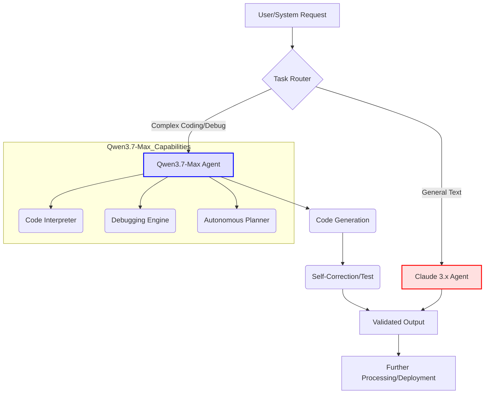

Qwen3.7-Max는 코딩, 디버깅, 사무 자동화 및 수백~수천 단계의 자율 실행을 목표로 하는 에이전트 중심의 독점 LLM이다. Terminal Bench 2.0에서 69.7점, GPQA Diamond에서 92.4점을 기록하며 강력한 에이전트 역량을 입증했다. 본 엔트리는 Qwen3.7-Max의 핵심 성능을 평가하고, 기존 Claude Code 하네스 또는 신규 자동화 워크플로우에 통합하는 전략을 다룬다.

## 핵심 역량 및 벤치마크
Qwen3.7-Max는 소프트웨어 개발 라이프사이클 전반에 걸쳐 뛰어난 **코딩 및 디버깅** 능력을 제공한다. **자율 실행 및 심층 추론** 능력은 장기적인 목표 설정과 비구조화된 문제 해결에 필수적이며, GPQA Diamond 벤치마크로 이를 입증했다. 또한, 복잡한 문서 처리와 데이터 분석 등 **사무 자동화** 시나리오와 **다국어 지원**에서도 강점을 보인다. 이 모델은 고도로 자동화된 에이전트 시스템 구축의 핵심 동력으로 작용할 수 있다.

## 통합 전략
Qwen3.7-Max를 기존 AI 워크플로우에 도입하는 방법은 크게 두 가지이다. 첫째, **기존 Claude Code 하네스 보조 또는 대체**이다. 고도의 복잡성이나 장기 실행이 필요한 코딩/디버깅 태스크에 Qwen3.7-Max를 라우팅하여 Claude Code의 한계를 보완할 수 있다. `harness-engineering/multi-llm-routing-design-patterns-cost-performance`에서 제시된 것처럼, 각 LLM의 강점을 활용한 멀티 LLM 오케스트레이션이 효과적이다. 둘째, Qwen3.7-Max의 강력한 자율 실행 능력을 활용하여 **새로운 엔드-투-엔드(end-to-end) 자동화 워크플로우**를 구축하는 것이다. 이는 개발 환경 설정부터 코드 작성, 테스트, 배포까지 일련의 과정을 자율적으로 처리하는 에이전트 시스템을 가능하게 한다.

## 코드 예시: 에이전트 기반 개발 워크플로우
Qwen3.7-Max 에이전트의 개발 태스크 수행 방식을 개념적으로 보여준다.
```python
import os
from qwen_api_client import QwenClient # Hypothetical client

def initialize_qwen_dev_agent(api_key: str):
    # Qwen3.7-Max 에이전트 인스턴스 초기화
    client = QwenClient(api_key=api_key)
    return client.agent(model="qwen3.7-max", capabilities=["coding", "debugging", "planning"])

if __name__ == "__main__":
    qwen_api_key = os.getenv("QWEN_API_KEY")
    if qwen_api_key:
        dev_agent = initialize_qwen_dev_agent(qwen_api_key)
        feature_task = {
            "description": "Implement a user authentication module with JWT.",
            "context": "Existing FastAPI project with database setup."
        }
        # 에이전트가 자율적으로 계획, 코드 생성, 테스트, 디버깅을 수행
        print(f"Starting agent task: {feature_task['description']}")
        result = dev_agent.execute(task=feature_task)
        print(f"Agent final output: {result.final_report}")
    else:
        print("Error: QWEN_API_KEY not set.")
```

## Mermaid 다이어그램: Qwen3.7-Max 통합 아키텍처


## 트레이드오프
*   **자율성 vs. 제어**: 높은 자율성은 복잡한 문제 해결에 유리하나, 시스템의 예측 불가능성을 높여 미션 크리티컬 환경에서 세밀한 제어가 어려워질 수 있다. 언제 좋나: 비정형적이고 복잡한 문제 해결 및 생산성 극대화가 필요한 경우. 언제 나쁜가: 높은 신뢰성, 일관된 결과, 엄격한 규제가 요구되는 시스템.
*   **최첨단 성능 vs. 벤더 종속성**: 경쟁 모델 대비 우수한 성능으로 경쟁 우위 확보 가능하나, 독점 모델이므로 장기 비용 예측이 어렵고 공급업체 정책 변화에 취약하다. 언제 좋나: 최신 기술을 빠르게 도입하여 단일 모델로 최고 성능을 추구할 때. 언제 나쁜가: 장기적인 비용 예측, 유연성, 오픈 소스 대안이 중요한 환경.
*   **광범위한 적용 vs. 통합 복잡성**: 다양한 자동화 기회 제공하지만, 기존 시스템 통합 및 최적화에 상당한 초기 노력과 비용(overhead)이 발생할 수 있다. 언제 좋나: 기존 파편화된 자동화를 통합하고 새로운 에이전트 기회를 창출할 때. 언제 나쁜가: 빠른 POC, 간단한 태스크 자동화, 또는 낮은 통합 비용이 우선일 때.

## 실전 체크리스트
*   - [ ] Qwen3.7-Max API 연동 및 인증 메커니즘의 보안 통합 검증 완료 여부
*   - [ ] 특정 코딩/추론 태스크에서 Qwen3.7-Max의 성능 개선율(예: 15% 이상)에 대한 A/B 테스트 지표 확보 여부
*   - [ ] 에이전트 생성 코드의 품질, 보안, 호환성을 평가하는 자동화된 검증 파이프라인(`evaluation/claude-code-generation-validation-pipeline-extension`) 구축 여부
*   - [ ] Qwen3.7-Max 에이전트의 자율 실행 중 오류/예외 처리 및 인간 개입(`harness-engineering/fail-loud-partial-adoption-escape-hatch-trap`) 메커니즘 설계 완료 여부
*   - [ ] Qwen3.7-Max 도입에 따른 비용 예측 및 `multi-llm-routing` 전략을 통한 비용 효율성 최적화 계획 수립 여부
*   - [ ] Qwen3.7-Max 응답의 할루시네이션 탐지 및 완화 시스템(`evaluation/generative-ai-hallucination-automated-detection-evaluation`) 적용 여부
*   - [ ] 장기 실행 에이전트 워크플로우를 위한 `agents/autonomous-agent-long-term-memory-management` 전략 구현 여부