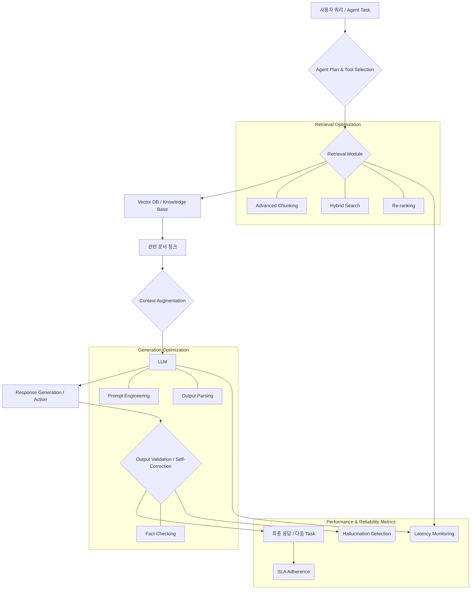

대규모 언어 모델(LLM) 기반 AI 에이전트의 발전은 다양한 자동화와 문제 해결 가능성을 열었지만, LLM의 내재적인 한계인 환각(hallucination)과 최신 정보 부족은 실제 적용에 있어 주요 장애물로 작용합니다. RAG(Retrieval-Augmented Generation)는 이러한 한계를 극복하기 위한 핵심 기술로, 외부 지식 소스에서 관련 정보를 검색하여 LLM의 응답을 보강합니다. 특히 AI 에이전트 맥락에서 RAG는 에이전트의 의사결정, 계획, 툴 사용의 정확성과 신뢰성을 크게 향상시키는 데 기여합니다. 따라서 RAG 기반 AI 에이전트의 성능과 신뢰성을 최적화하는 것은 실제 프로덕션 환경에서 성공적인 에이전트 배포를 위해 필수적입니다.

## RAG 에이전트 아키텍처 이해

RAG는 기본적으로 `Retrieval`, `Augmentation`, `Generation`의 세 단계를 거칩니다. 에이전트 시스템에서 이 RAG 플로우는 단순히 질의응답을 넘어 에이전트의 복잡한 추론 과정에 통합됩니다. 에이전트는 특정 태스크를 수행하기 위해 계획을 세우고, 적절한 툴을 선택하며, 필요할 때 RAG 모듈을 호출하여 외부 지식을 활용합니다. 이 과정에서 RAG는 에이전트의 의사결정 컨텍스트를 풍부하게 하고, 사실 기반의 응답을 생성하도록 돕습니다.

아래 Mermaid 다이어그램은 RAG 기반 AI 에이전트의 일반적인 워크플로우와 주요 최적화 영역을 시각화합니다.



## 핵심 최적화 영역

### 검색 (Retrieval) 품질 향상

검색 품질은 RAG 에이전트 성능의 가장 중요한 요소입니다. 관련성 높은 정보를 정확하고 효율적으로 찾아내는 것이 핵심입니다.

*   **데이터 전처리 및 청킹(Chunking)**: 원본 문서를 LLM의 컨텍스트 윈도우에 적합한 크기로 나누는 청킹 전략은 매우 중요합니다. 단순히 고정된 크기로 자르기보다, 문서의 구조(헤딩, 단락 등)와 의미론적 경계를 고려한 **Adaptive Chunking** 또는 **Semantic Chunking**이 2026년의 주요 트렌드입니다. 또한, 각 청크에 출처, 날짜, 작성자 등의 메타데이터를 풍부하게 추가하여 검색 시 필터링 및 랭킹에 활용합니다.
*   **임베딩 모델 선택 및 관리**: 텍스트를 벡터 공간으로 매핑하는 임베딩 모델의 성능은 검색의 정확도에 직접적인 영향을 미칩니다. E5-multilingual, OpenAI의 최신 임베딩 모델 등 고품질의 모델을 선택하고, 특정 도메인에 특화된 데이터로 임베딩 모델을 Fine-tuning하는 전략도 고려할 수 있습니다. 임베딩 벡터의 최신성을 유지하기 위한 주기적인 업데이트 파이프라인(`data-engineering/rag-embedding-update-pipeline-realtime-strategies`)도 중요합니다.
*   **Vector Database 최적화**: 벡터 데이터베이스(Vector DB)의 효율적인 인덱싱 전략은 검색 속도를 결정합니다. HNSW (Hierarchical Navigable Small World), IVF (Inverted File Index) 등 적절한 인덱스를 선택하고, **Hybrid Search** (키워드 검색과 벡터 검색의 결합)를 통해 정밀도(precision)와 재현율(recall)을 동시에 높입니다. 메타데이터 필터링을 활용하여 검색 범위를 좁히는 것도 효과적입니다.
*   **Contextual Compression 및 Re-ranking**: 초기 검색에서 많은 문서를 가져온 후, LLM 또는 다른 경량 모델을 사용하여 검색된 문서들의 관련성을 다시 평가하고 순위를 재조정(Re-ranking)하는 과정은 LLM에 전달되는 컨텍스트의 품질을 극대화합니다. Cohere Reranker와 같은 전용 Re-ranking 모델이나, 간단한 프롬프트를 통해 LLM 스스로 관련성을 판단하게 하는 **LLM Reranker** 접근법이 활용됩니다.

### 생성 (Generation) 품질 향상 및 신뢰성 확보

검색된 정보를 바탕으로 LLM이 정확하고 일관성 있는 응답을 생성하도록 최적화하는 단계입니다.

*   **프롬프트 엔지니어링**: RAG 에이전트의 프롬프트는 검색된 컨텍스트를 명확하게 제시하고, LLM이 컨텍스트 내에서만 응답하도록 유도하며, 필요한 경우 Chain-of-Thought(CoT) 추론을 지시해야 합니다(`prompt-engineering/rag-prompt-optimization-retrieval-augmented-generation`). 출력 형식(JSON, Markdown 등)을 명시하여 후처리 용이성을 높이는 것도 중요합니다.
*   **LLM 선택 및 조정**: 에이전트의 복잡성과 요구되는 추론 능력에 따라 적합한 LLM을 선택합니다. 특정 태스크에 특화된 경량 LLM을 사용하거나, 더 강력한 추론 능력을 가진 모델을 활용할 수 있습니다. 필요한 경우, RAG 파이프라인의 특정 단계에 특화된 작은 LLM을 fine-tuning하여 성능을 높이는 **RAG-aware LLM fine-tuning**도 2026년의 새로운 시도입니다.
*   **출력 파싱 및 검증**: LLM의 응답은 항상 완벽하지 않을 수 있습니다. 생성된 응답에 대한 사실 검증(fact-checking), 형식 유효성 검사, 그리고 안전성(safety) 가이드라인 준수 여부를 확인하는 후처리 단계를 구현해야 합니다. 에이전트가 생성한 응답이 외부 시스템에 영향을 미칠 경우, 엄격한 **Guardrails**(`agents/ai-agent-safety-constraint-control-design-patterns`)를 적용하여 잘못된 동작을 방지합니다.

### 에이전트 통합 및 워크플로우 최적화

RAG를 에이전트의 전체 워크플로우에 효과적으로 통합하는 전략입니다.

*   **동적 툴 선택(Dynamic Tool Selection)**: 에이전트가 RAG 모듈 외에도 다양한 툴(API 호출, 코드 실행 등)을 활용할 때, RAG를 통해 얻은 정보를 바탕으로 가장 적절한 툴을 동적으로 선택하는 능력을 강화합니다. RAG 모듈 자체를 툴로 간주하여 에이전트가 필요할 때만 호출하도록 설계할 수 있습니다.
*   **자가 수정 및 피드백 루프**: 에이전트가 RAG 결과를 바탕으로 생성한 응답이 불충분하거나 잘못되었을 경우, 이를 스스로 감지하고 다시 RAG 프로세스를 수행하거나 다른 툴을 시도하는 **Self-correction** 메커니즘을 구현합니다. Human-in-the-Loop 시스템을 통해 사용자의 피드백을 RAG 에이전트의 개선에 반영하는 지속적인 학습 루프를 구축하는 것도 중요합니다.
*   **지속적인 컨텍스트 관리**: 장기 실행되는 에이전트 태스크에서 RAG는 과거 대화 기록이나 이전 태스크 수행 결과를 바탕으로 필요한 지식을 검색하여 에이전트의 **Persistent Context Management**에 기여합니다(`agents/ai-agent-persistent-memory-automated-context-management`).

## 코드 예제: RAG 에이전트의 단순화된 검색-생성 루프

다음은 RAG 에이전트의 핵심인 검색 및 생성 플로우를 파이썬으로 단순화한 예제입니다. 실제 구현에서는 `langchain`, `LlamaIndex`와 같은 프레임워크와 `FAISS`, `ChromaDB` 같은 벡터 DB가 활용됩니다.

```python
from typing import List

class Document:
    def __init__(self, text: str, metadata: dict = None):
        self.text = text
        self.metadata = metadata if metadata is not None else {}

    def __repr__(self):
        return f"Document(text='{self.text[:50]}...', metadata={self.metadata})"

class MockVectorDB:
    def __init__(self, documents: List[Document]):
        self.documents = documents
        # In a real scenario, documents would be embedded and indexed

    def retrieve(self, query: str, top_k: int = 3) -> List[Document]:
        print(f"`[MockVectorDB]` 검색 쿼리: '{query}'")
        # Simulate relevance by checking keyword presence
        relevant_docs = []
        for doc in self.documents:
            if query.lower() in doc.text.lower():
                relevant_docs.append(doc)
        # For simplicity, just return the first top_k matching documents
        return relevant_docs[:top_k]

class MockLLM:
    def generate(self, prompt: str) -> str:
        print(f"`[MockLLM]` 생성 프롬프트:
---
{prompt}
---")
        # Simulate LLM response
        if "AI 에이전트의 RAG" in prompt and "성능 최적화" in prompt:
            return "AI 에이전트의 RAG 성능은 검색된 정보의 품질과 LLM의 추론 능력에 따라 달라집니다. 데이터 전처리, 임베딩 모델, 프롬프트 엔지니어링이 중요합니다."
        elif "RAG의 트레이드오프" in prompt:
            return "RAG는 검색 지연 시간, 임베딩 업데이트 비용, 컨텍스트 윈도우 크기 등 여러 트레이드오프를 가집니다."
        else:
            return "요청하신 내용에 대한 응답을 생성했습니다. 더 자세한 정보가 필요하시면 질문해주세요."

class RAGAgent:
    def __init__(self, vector_db: MockVectorDB, llm: MockLLM):
        self.vector_db = vector_db
        self.llm = llm

    def run(self, query: str) -> str:
        # 1. Retrieval: Retrieve relevant documents
        retrieved_docs = self.vector_db.retrieve(query)

        # 2. Augmentation: Prepare context for LLM
        context = ""
        if retrieved_docs:
            context = "다음 정보를 참고하여 질문에 답하세요:\n" + "\n".join([doc.text for doc in retrieved_docs])
        else:
            context = "관련 정보를 찾지 못했습니다."
        
        # 3. Generation: Formulate prompt and generate response
        prompt = f"{context}\n\n질문: {query}\n답변:"
        response = self.llm.generate(prompt)
        return response

# Sample Usage
documents = [
    Document("RAG 시스템은 외부 지식을 활용하여 LLM의 응답 정확도를 높입니다."),
    Document("AI 에이전트의 성능 최적화에는 RAG, 툴 사용, 자가 수정 메커니즘이 중요합니다."),
    Document("데이터 청킹 전략은 RAG 검색 품질에 큰 영향을 미칩니다."),
    Document("임베딩 모델은 문서의 의미를 벡터로 변환하여 벡터 DB에 저장합니다.")
]

mock_db = MockVectorDB(documents)
mock_llm = MockLLM()
rag_agent = RAGAgent(mock_db, mock_llm)

print("\n--- RAG Agent 실행 1 --- ")
response1 = rag_agent.run("AI 에이전트의 RAG 성능 최적화 방법은 무엇인가요?")
print(f"최종 응답: {response1}")

print("\n--- RAG Agent 실행 2 --- ")
response2 = rag_agent.run("RAG의 트레이드오프는 무엇인가요?")
print(f"최종 응답: {response2}")
```

## 2026년 트렌드: 진화하는 RAG 에이전트

2026년에는 RAG 기반 AI 에이전트가 더욱 고도화될 것으로 예상됩니다.

*   **멀티모달 RAG (Multimodal RAG)**: 텍스트뿐만 아니라 이미지, 비디오, 오디오 등 다양한 모달리티의 정보를 검색하고 LLM에 제공하여 멀티모달 추론 능력을 강화합니다.
*   **적응형 RAG (Adaptive RAG)**: 쿼리 유형, 사용자 컨텍스트, 에이전트의 현재 상태에 따라 동적으로 청킹 전략, 임베딩 모델, 검색 방식(Dense, Sparse, Hybrid)을 조절하여 최적의 성능을 추구합니다.
*   **자가 진화형 지식 베이스 (Self-evolving Knowledge Bases)**: 에이전트가 학습하고 새로운 정보를 발견함에 따라 자동으로 지식 베이스를 업데이트하고 재구성하여, 지속적인 학습과 최신성 유지가 가능해집니다.
*   **RAG-aware LLM Fine-tuning**: LLM을 RAG 파이프라인의 특정 역할(예: 관련성 평가, 응답 요약, 환각 감지)에 맞게 미세 조정하여 전체 시스템의 성능을 향상시킵니다.

## 트레이드오프

RAG 기반 AI 에이전트의 성능 및 신뢰성을 최적화하는 과정에서는 다양한 트레이드오프를 고려해야 합니다.

*   **검색 지연 시간(Retrieval Latency) vs. 재현율(Recall)**
    *   **언제 좋고**: 높은 재현율(더 많은 관련 문서 검색)은 LLM이 더 풍부한 정보를 바탕으로 응답할 수 있게 하여 정확도를 높입니다. 복잡하고 광범위한 질문에 유리합니다.
    *   **언제 나쁜지**: 더 많은 문서를 검색하고 처리하는 것은 검색 지연 시간을 증가시키고, 불필요한 컨텍스트로 인해 LLM의 처리 비용이 증가하며, 'Lost in the middle' 현상으로 정확도가 떨어질 수도 있습니다. 실시간 응답이 중요한 애플리케이션에는 불리합니다.
*   **임베딩 업데이트 빈도(Refresh Frequency) vs. 비용 및 복잡성**
    *   **언제 좋고**: 지식 베이스의 빈번한 업데이트는 에이전트가 항상 최신 정보를 활용하도록 보장합니다. 빠르게 변화하는 정보(예: 주식 시장 데이터, 뉴스)를 다루는 경우에 필수적입니다.
    *   **언제 나쁜지**: 임베딩 업데이트는 컴퓨팅 자원(GPU)과 시간이 소모되는 과정이며, 데이터 파이프라인의 복잡성을 증가시킵니다. 정적인 지식을 다루는 경우에는 과도한 오버헤드가 될 수 있습니다.
*   **컨텍스트 윈도우 크기(Context Window Size) vs. 생성 비용 및 집중력**
    *   **언제 좋고**: LLM의 컨텍스트 윈도우를 크게 설정하면 더 많은 정보를 한 번에 처리할 수 있어, 복잡한 추론이나 요약에 유리합니다.
    *   **언제 나쁜지**: 컨텍스트 윈도우가 커질수록 LLM 호출 비용이 비례하여 증가하며, LLM이 컨텍스트 내의 핵심 정보에 집중하는 능력이 떨어질 수 있습니다. 특히 관련성 낮은 정보가 많을 경우 성능 저하를 야기합니다.
*   **엄격한 가드레일(Strict Guardrails) vs. 에이전트 자율성**
    *   **언제 좋고**: LLM의 응답에 대한 엄격한 검증 및 제어 메커니즘(Guardrails)은 안전하고 예측 가능한 동작을 보장하여, 금융, 의료 등 민감한 도메인에서 필수적입니다.
    *   **언제 나쁜지**: 과도하게 엄격한 가드레일은 에이전트의 자율적인 문제 해결 능력과 창의성을 제한하고, 에이전트가 유효한 해결책을 찾았음에도 불구하고 거부될 수 있는 'False Positive' 상황을 초래할 수 있습니다.

## 실전 체크리스트

RAG 기반 AI 에이전트 프로젝트에 다음 체크리스트를 적용하여 성능과 신뢰성을 확보하세요.

*   [ ] 문서 청킹 전략이 다양한 쿼리 유형(예: 사실 질문, 요약, 추론)에 대해 최적화되었는가? (Adaptive/Semantic Chunking 구현 여부 확인)
*   [ ] 검색된 문서의 관련성 지표(예: MRR, NDCG)가 정기적으로 측정 및 모니터링되는가? (평가 파이프라인 구축 확인)
*   [ ] 리랭킹(re-ranking) 모델이 통합되어 검색 결과의 순서 품질을 향상시키는가? (A/B 테스트를 통한 효과 검증)
*   [ ] LLM 생성 응답에 대한 사실 검증(fact-checking) 및 형식 유효성 검사 로직이 구현되었는가? (자동화된 검증 시스템 존재 여부)
*   [ ] RAG 에이전트의 종단 간(end-to-end) 지연 시간(latency)이 SLA를 준수하는지 지속적으로 모니터링되는가? (지연 시간 메트릭 및 알림 시스템 확인)
*   [ ] 시스템의 환각(hallucination) 발생률에 대한 기준선이 설정되어 있고, 이를 줄이기 위한 전략(예: 프롬프트 개선, Guardrails 강화)이 가동되는가? (환각 탐지 평가 및 개선 로드맵)
*   [ ] 임베딩 모델 업데이트 파이프라인이 자동화되어 있고, 새로운 모델 적용 시 A/B 테스트를 통해 성능 검증을 수행하는가? (파이프라인 자동화 및 검증 프로세스 확인)
*   [ ] 에이전트의 실패 사례가 정기적으로 분석되고, 이를 RAG 및 LLM 최적화에 반영하는 피드백 루프가 존재하는가? (실패 분석 및 개선 주기 확인)