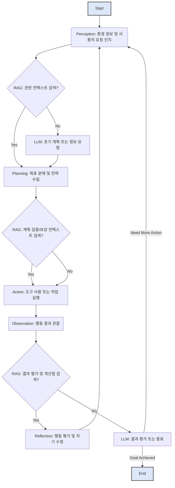

RAG(Retrieval Augmented Generation) 기반 자율 에이전트에서 의사결정 로직은 에이전트의 지능과 효율성을 결정하는 핵심 요소입니다. LLM(Large Language Model)의 내재된 한계(예: 환각, 최신 정보 부족)를 RAG가 보완하며, 에이전트가 실시간의 외부 지식을 활용하여 더욱 정확하고 상황에 맞는 판단을 내릴 수 있도록 돕습니다. 복잡한 목표를 달성하고, 동적인 환경에 적응하며, 예상치 못한 상황에 대처하기 위해서는 체계적인 의사결정 프레임워크가 필수적입니다.

## 핵심 의사결정 컴포넌트
자율 에이전트의 의사결정 과정은 일반적으로 다음과 같은 핵심 컴포넌트들을 포함하며, RAG는 이 과정 전반에 걸쳐 중요한 역할을 합니다.

### Perception (인지)
에이전트가 환경으로부터 데이터를 수집하고, 이를 바탕으로 현재 상황을 이해하는 단계입니다. RAG는 수집된 데이터를 바탕으로 필요한 추가 컨텍스트를 검색하거나, 불명확한 정보에 대한 보강 설명을 제공하여 에이전트의 인지 능력을 향상합니다.

### Planning (계획)
목표 달성을 위한 단계별 전략과 행동 시퀀스를 수립하는 단계입니다. RAG는 과거의 성공/실패 사례, 모범 사례, 관련 도메인 지식 등을 검색하여 에이전트가 더욱 효과적인 계획을 세울 수 있도록 지원합니다.

### Action (행동)
수립된 계획에 따라 외부 도구(Tool)를 사용하거나 특정 작업을 수행하는 단계입니다. RAG는 도구의 사용법, 예상되는 출력 형식, 과거 도구 사용 결과 등을 제공하여 에이전트가 도구를 올바르게 선택하고 실행하며 결과를 해석하는 데 도움을 줍니다.

### Reflection (반성)
수행된 행동의 결과를 평가하고, 목표 달성 여부 및 개선점을 분석하는 단계입니다. RAG는 평가 기준, 과거 학습 데이터, 문제 해결 가이드라인 등을 검색하여 에이전트가 스스로의 성능을 객관적으로 분석하고 다음 계획에 반영할 수 있도록 돕습니다.

### Memory (기억)
RAG 시스템 자체가 에이전트의 장기 및 단기 기억 역할을 수행합니다. 벡터 데이터베이스에 저장된 지식 조각들은 에이전트의 경험, 학습 내용, 외부 문서 등을 나타내며, 필요할 때마다 검색되어 의사결정의 근거로 활용됩니다.

## 의사결정 로직 디자인 패턴

### 계층적 계획 (Hierarchical Planning)
복잡하고 장기적인 목표를 달성하기 위해 큰 목표를 여러 개의 작은 하위 목표로 분해하고, 각 하위 목표를 순차적으로 혹은 병렬적으로 해결하는 패턴입니다. RAG는 각 계층에서 필요한 구체적인 정보(예: 특정 도메인 지식, 과거 유사 문제 해결법)를 제공하여 에이전트가 각 단계에서 올바른 의사결정을 내릴 수 있도록 돕습니다.

### 상태 머신 기반 흐름 (State-Machine Based Flow)
에이전트의 행동을 미리 정의된 유한한 상태(State)와 상태 간의 전이(Transition) 규칙으로 모델링하는 패턴입니다. 각 상태는 특정 작업 또는 의사결정 지점을 나타내며, RAG는 다음 상태로의 전이 조건을 판단하는 데 필요한 근거(예: 특정 정보 검색 여부, 사용자 피드백)를 제공합니다. 이는 에이전트의 행동을 예측 가능하고 제어 가능하게 만듭니다.

### 반성 및 자기 수정 루프 (Reflection & Self-Correction Loop)
에이전트가 행동을 수행한 후, 그 결과를 분석하고 개선 방안을 스스로 탐색하여 다음 행동에 반영하는 순환 패턴입니다. RAG는 과거의 실패 기록, 성공적인 문제 해결 패턴, 전문가의 피드백 등을 검색하여 에이전트가 효과적으로 자기 수정을 할 수 있도록 학습과 지침을 제공합니다.

### 도구 사용 오케스트레이션 (Tool Use Orchestration)
에이전트가 다양한 외부 도구를 언제, 어떤 목적으로, 어떻게 사용할지 동적으로 결정하는 패턴입니다. RAG는 도구의 기능 설명, 사용 예시, 예상되는 출력 형식, 그리고 주어진 태스크에 가장 적합한 도구 선택 가이드라인 등 도구 관련 정보를 제공하여 에이전트의 효율적인 도구 선택과 사용을 지원합니다.

## 코드 예시: RAG 기반 의사결정 시뮬레이션
다음 Python 코드는 RAG를 활용한 에이전트의 간단한 의사결정 흐름을 시뮬레이션합니다.

```python
import random

# 가상의 RAG 시스템
class RAGSystem:
    def __init__(self, knowledge_base):
        self.knowledge_base = knowledge_base

    def retrieve_context(self, query, top_k=1):
        # 실제 RAG에서는 임베딩 검색 및 유사도 계산을 수행합니다.
        results = [k for k in self.knowledge_base if query.lower() in k.lower()]
        return results[:top_k]

# 에이전트의 의사결정 로직
class AutonomousAgent:
    def __init__(self, name, rag_system):
        self.name = name
        self.rag = rag_system
        self.current_goal = None

    def set_goal(self, goal):
        self.current_goal = goal
        print(f"{self.name}: 목표 설정 - {self.current_goal}")

    def decide_action(self, current_state):
        print(f"{self.name}: 현재 상태 - {current_state}")
        
        # 1. RAG를 통해 관련 컨텍스트 검색
        context_query = f"How to {self.current_goal} from {current_state}? Relevant tools or past experiences."
        retrieved_contexts = self.rag.retrieve_context(context_query, top_k=2)
        print(f"{self.name}: RAG 검색 결과 - {retrieved_contexts}")

        # 2. LLM이 컨텍스트를 기반으로 의사결정 (여기서는 단순화된 로직)
        if "error" in current_state.lower() and "error handling" in str(retrieved_contexts).lower():
            action = "Apply error recovery strategy based on retrieved context."
        elif "data collection" in self.current_goal.lower() and "web scraping tool" in str(retrieved_contexts).lower():
            action = "Use web scraping tool as suggested."
        elif "analyze data" in self.current_goal.lower() and "data analysis method" in str(retrieved_contexts).lower():
            action = "Perform data analysis using retrieved method."
        else:
            possible_actions = ["Explore options", "Request more information", "Execute predefined task"]
            action = random.choice(possible_actions)
            
        return action, retrieved_contexts

    def run(self, initial_state):
        state = initial_state
        for step in range(3):
            action, context = self.decide_action(state)
            print(f"{self.name}: 결정된 행동 - {action}")
            # 실제 구현에서는 행동 실행 및 상태 변화 로직이 들어갑니다.
            if "error recovery" in action:
                state = "Error resolved. Proceeding."
            elif "web scraping tool" in action:
                state = "Data collected. Ready for analysis."
            elif "data analysis" in action:
                state = "Analysis complete. Generating report."
            else:
                state = f"State after {action}. (Simulated step {step+1})"
            print(f"{self.name}: 다음 상태 - {state}\n")
            if "complete" in state.lower():
                break

# 지식 베이스 예시
knowledge_base = [
    "Error handling: Check logs, retry with backoff, notify user.",
    "Web scraping tool: Use Selenium for dynamic content, BeautifulSoup for static.",
    "Data analysis method: Apply statistical modeling, visualize trends.",
    "Previous successful project: Implemented data collection with Selenium."
]

# RAG 시스템 및 에이전트 인스턴스 생성
rag_system = RAGSystem(knowledge_base)
agent = AutonomousAgent("ResearchAgent", rag_system)

agent.set_goal("Collect and analyze market trends data.")
agent.run("Initial state: Need market data.")
```

## RAG 기반 자율 에이전트 의사결정 흐름



## 2026년 최신 트렌드 반영

1.  **동적 컨텍스트 최적화 (Dynamic Context Optimization)**: RAG가 제공하는 컨텍스트의 양과 질을 에이전트의 현재 의사결정 단계와 목표에 따라 실시간으로 조절합니다. 예를 들어, 초기 계획 단계에서는 넓은 범위의 지식을, 특정 도구 사용 단계에서는 해당 도구의 API 문서와 같은 상세한 정보를 제공합니다.
2.  **하이브리드 추론 (Hybrid Reasoning)**: LLM의 강력한 생성 능력과 RAG의 사실 기반 지식, 그리고 전통적인 symbolic logic (규칙 기반 시스템, 온톨로지)을 결합하여 더욱 견고하고 설명 가능한 의사결정 체계를 구축합니다. 이는 복잡한 도메인 지식이나 엄격한 비즈니스 규칙이 요구되는 환경에서 특히 중요합니다.
3.  **비용 효율적 RAG 활용 (Cost-Efficient RAG)**: 대규모 RAG 시스템 운영 비용을 절감하기 위한 전략이 중요해지고 있습니다. 불필요한 검색 최소화, 캐싱 전략, 컨텍스트 압축, 더 가벼운 랭킹 모델 활용, 그리고 에이전트의 의사결정 중요도에 따른 RAG 호출 빈도 조절 등이 핵심 트렌드입니다.

## 트레이드오프

*   **복잡성 vs. 개발 속도**: 정교한 의사결정 로직과 다단계 RAG 통합은 에이전트의 기능을 풍부하게 하지만, 개발 복잡도를 높이고 초기 개발 속도를 저해할 수 있습니다. 이는 MVP(Minimum Viable Product)를 빠르게 출시해야 할 때 좋지 않으며, 장기적으로 안정적이고 지능적인 에이전트를 구축할 때 유용합니다.
*   **정확성/신뢰성 vs. 지연 시간 (Latency)**: RAG를 통한 심층적인 정보 검색은 의사결정의 정확성과 신뢰성을 높이지만, 검색 과정에서 추가적인 지연 시간을 발생시킵니다. 실시간 응답이 필수적인 애플리케이션(예: 대화형 챗봇)에서는 지연 시간이 치명적일 수 있으며, 높은 정확도가 더 중요한 분석/보고 에이전트에서 강점을 가집니다.
*   **자율성 vs. 통제 가능성**: 에이전트의 의사결정 로직에 자율성과 유연성을 부여할수록 다양한 상황에 대처하는 능력은 향상되지만, 때로는 예측 불가능한 행동이나 의도하지 않은 결과를 초래할 수 있습니다. 이는 탐색적인 작업이나 창의성이 요구될 때 좋고, 규제 준수나 안전이 중요한 시스템에서는 세심한 통제 메커니즘이 필요합니다.
*   **컨텍스트 양 vs. 비용 효율성**: RAG를 통해 많은 양의 컨텍스트를 제공하면 에이전트의 의사결정이 더욱 풍부해지지만, LLM 프롬프트 토큰 사용량 증가로 비용이 비례하여 증가합니다. 비용이 제한적이거나 간단한 의사결정에는 적은 컨텍스트가 유리하며, 고품질의 복잡한 의사결정이 필요할 때 더 많은 컨텍스트가 효과적입니다.

## 실전 체크리스트

프로젝트에 RAG 기반 자율 에이전트의 의사결정 로직을 적용할 때 다음 항목들을 확인합니다.

*   [ ] RAG 시스템의 검색 관련성(relevance) 및 지연 시간(latency)이 에이전트의 의사결정 요구사항을 충족하는지 측정하고 검증합니다.
*   [ ] 에이전트의 주요 의사결정 지점별로 로깅(logging) 및 감사 추적(audit trail) 기능을 구현하여, 의사결정 과정을 투명하게 확인할 수 있도록 합니다.
*   [ ] 비즈니스 크리티컬(critical) 경로에 해당하는 의사결정 로직에 대해 Human-in-the-Loop 또는 Oversight 메커니즘을 설계하고 적용합니다.
*   [ ] 의사결정 패턴이 처리하지 못하는 엣지 케이스(edge case) 목록을 식별하고, 각 케이스에 대한 예외 처리 또는 대응 전략을 정의합니다.
*   [ ] RAG 컨텍스트의 신선도(staleness)를 주기적으로 검증하고, 필요한 경우 자동으로 업데이트하는 데이터 파이프라인을 구축합니다.
*   [ ] 에이전트의 의사결정 실패율(failure rate)을 모니터링하고, 실패 원인을 자동으로 분석하여 개선 방안을 제시하는 시스템을 구축합니다.
*   [ ] 다양한 시나리오와 조건에서 A/B 테스트를 수행하여 의사결정 로직의 견고성(robustness)과 성능을 객관적으로 검증합니다.
*   [ ] 의사결정에 사용되는 RAG 컨텍스트와 LLM의 응답이 일관성을 유지하며, 환각(hallucination) 발생 위험을 최소화하는 전략을 구현합니다.