자율 에이전트, 특히 대규모 언어 모델(LLM) 기반 에이전트는 동적이고 예측 불가능한 환경에서 운영될 때 최적의 성능을 유지하기 위해 지속적인 적응과 개선이 필수적입니다. 실시간 피드백 루프는 에이전트가 자신의 행동에서 학습하고, 예상치 못한 상황에 대처하며, 목표 달성 전략을 동적으로 조정할 수 있도록 하는 핵심적인 메커니즘입니다. 2026년의 에이전트 시스템은 정적 프롬프트 엔지니어링을 넘어, 자체 경험을 통해 진화하는 자율성을 요구합니다. 이 엔트리는 실시간 피드백 루프를 활용하여 에이전트의 성능을 최적화하는 방법론을 제시합니다.

## 실시간 피드백 루프의 핵심 개념

에이전트의 실시간 피드백 루프는 일반적으로 MAPE-K (Monitor, Analyze, Plan, Execute, Knowledge) 모델을 기반으로 합니다.

*   **Monitor (모니터링)**: 에이전트의 행동, 환경 상태, 작업 진행 상황, 리소스 사용량, 성공/실패 신호 등 모든 관련 데이터를 실시간으로 수집합니다.
*   **Analyze (분석)**: 모니터링된 데이터를 분석하여 에이전트의 성능 저하, 오류, 목표와의 편차 등을 식별합니다. 이는 사전 정의된 규칙, 통계 모델, 또는 학습된 예측 모델을 통해 이루어질 수 있습니다.
*   **Plan (계획)**: 분석 결과를 바탕으로 에이전트의 행동을 수정하거나 최적화하기 위한 새로운 계획 또는 전략을 수립합니다. 이는 새로운 도구 호출, 목표 재정의, 혹은 내부 상태 변경을 포함할 수 있습니다.
*   **Execute (실행)**: 수립된 계획에 따라 에이전트가 실제 행동을 수행합니다.
*   **Knowledge (지식)**: 모든 단계에서 생성되는 데이터와 학습된 인사이트는 에이전트의 장기 기억 또는 지식 베이스에 저장되어, 향후 의사결정의 기반이 됩니다.

실시간 피드백은 행동과 결과 사이의 지연 시간(latency)을 최소화하여, 에이전트가 빠르게 오류를 수정하고 변화에 적응할 수 있게 합니다. 이는 비용 폭주 방지, 안전 제약 준수, 급변하는 환경에 대한 민첩한 대응, 그리고 에이전트의 스킬 습득 가속화에 결정적인 역할을 합니다.

## 구현 전략

1.  **고급 관측성(Observability) 및 텔레메트리**: 모든 에이전트의 행동, 도구 호출, LLM 상호작용, 상태 변화에 대한 세분화된 로깅, 분산 추적(Distributed Tracing), 메트릭 수집 시스템을 구축합니다. 이를 통해 '모니터링' 단계에 필요한 풍부한 데이터를 확보할 수 있습니다.
2.  **오류 감지 및 자가 교정(Self-Correction)**: 도구 실패, LLM 환각(hallucination), 논리적 불일치 등 다양한 오류 상황을 명시적으로 감지하는 메커니즘을 설계합니다. 전용 자가 교정 모듈이나 메타 에이전트가 오류를 분석하고, 재시도, 대체 도구 사용, 상위 에이전트에게 에스컬레이션 등의 복구 프로토콜을 트리거합니다.
3.  **적응형 학습 및 성찰(Reflection)**: 에이전트가 과거의 성공과 실패 경험을 성찰하고, 이를 통해 내부 추론 규칙, 프롬프트 템플릿, 또는 전문화된 소형 모델을 업데이트하는 메커니즘을 포함합니다. 장기 기억(Long-Term Memory) 시스템은 이러한 학습과 성찰의 핵심 기반이 됩니다.
4.  **비용 최적화 피드백**: 토큰 사용량, API 호출 횟수, 컴퓨팅 리소스 사용량을 실시간으로 모니터링하여, 비정상적인 비용 증가가 감지되면 비용 효율적인 계획으로 전환하거나 작업 범위를 조정하는 피드백 루프를 작동시킵니다.

## 실시간 피드백 루프 예제 (Python)

아래는 자율 에이전트의 간단한 실시간 피드백 루프를 시뮬레이션하는 Python 코드 예제입니다.

```python
import time
import random

class AgentMonitor:
    def __init__(self):
        self.metrics = {"cost": 0, "errors": 0, "progress": 0}
        self.logs = []

    def record_action(self, action_name, result_status, cost_impact=1, error_detail=None):
        self.metrics["cost"] += cost_impact
        if result_status == "error":
            self.metrics["errors"] += 1
            self.logs.append(f"ERROR: {action_name} failed - {error_detail}")
        else:
            self.metrics["progress"] += 10 # Simulate progress
            self.logs.append(f"SUCCESS: {action_name}")
        return self.metrics

class AgentAnalyzer:
    def analyze_feedback(self, current_metrics, last_action_result):
        feedback = {"type": "none"}
        if current_metrics["errors"] > 0: # Check for any errors
            feedback = {"type": "critical_error", "reason": "Previous action failed."}
        elif current_metrics["cost"] > 50 and current_metrics["progress"] < 30:
            feedback = {"type": "cost_alert", "reason": "High cost, low progress."}
        return feedback

class AgentPlanner:
    def plan_next_action(self, feedback, current_metrics):
        if feedback["type"] == "critical_error":
            print("  -> Planning: Retry or debug.")
            return {"action": "retry_last_failed_step", "params": {}}
        elif feedback["type"] == "cost_alert":
            print("  -> Planning: Optimize cost, simplify scope.")
            return {"action": "simplify_task_scope", "params": {"new_scope": "reduced"}}
        else:
            if current_metrics["progress"] < 100:
                print("  -> Planning: Continue main task.")
                return {"action": "continue_main_task", "params": {"step": current_metrics["progress"] // 10 + 1}}
            print("  -> Planning: Task completed.")
            return {"action": "task_completed", "params": {}}

# Simplified Agent Loop Simulation
monitor = AgentMonitor()
analyzer = AgentAnalyzer()
planner = AgentPlanner()

print("--- Real-time Feedback Loop Simulation ---")

for i in range(5): # Simulate 5 loop iterations
    print(f"\nIteration {i+1}:")
    # Simulate agent action and monitor its result
    action_status = "error" if i == 2 else "success" # Force an error on the 3rd iteration
    current_metrics = monitor.record_action(
        f"Execute step {monitor.metrics['progress'] // 10 + 1}",
        action_status,
        cost_impact=random.randint(5,15)
    )

    # Analyze the monitored data
    feedback = analyzer.analyze_feedback(current_metrics, {"status": action_status})

    # Plan the next action based on feedback
    next_plan = planner.plan_next_action(feedback, current_metrics)

    print(f"  Current Metrics: {current_metrics}")
    print(f"  Detected Feedback Type: {feedback['type']}")
    print(f"  Planned Next Action: {next_plan['action']}")

    if next_plan["action"] == "task_completed":
        print("Simulation: Task completed!")
        break
    time.sleep(0.1) # Simulate real-time delay
```

## 실시간 피드백 루프 아키텍처

```mermaid
graph TD
    A[Agent Action] --> B{Monitor State & Output};
    B --> C{Analyze Feedback};
    C -- Error/Deviation Detected --> D[Generate/Select Corrective Plan];
    C -- Optimal Performance --> E[Continue Current Plan];
    D --> F[Update Agent State/Knowledge];
    E --> A;
    F --> A;
    subgraph Knowledge["Knowledge Base"]
        G[Long-Term Memory]
        H[Heuristics/Policies]
    end
    C --> G;
    G --> C;
    D --> H;
    H --> D;
    B --> I[Observability/Telemetry Stream];
```



## 트레이드오프

*   **복잡성 vs. 적응성**: 환경이 동적이고 예측 불가능하며, 에이전트가 다양한 상황에 유연하게 대처해야 할 때 탁월합니다. 시스템의 견고성과 자율성을 크게 향상시킵니다. 반면, 환경이 정적이고 작업이 단순하며, 에이전트의 동작이 미리 정의된 규칙으로 충분할 때는 오버헤드가 커집니다. 복잡한 피드백 루프 설계 및 유지보수에 불필요한 리소스가 소모될 수 있습니다.
*   **성능 오버헤드 vs. 안정성/정확도**: 미묘한 오류나 성능 저하를 즉시 감지하고 수정하여 에이전트의 안정성과 결과의 정확도를 높일 수 있습니다. 특히 고위험 작업이나 비용에 민감한 작업에서 중요합니다. 그러나 실시간 모니터링, 분석, 재계획 과정에서 상당한 연산 리소스와 지연(latency)이 발생할 수 있습니다. 초고속 응답이 필수적인 애플리케이션에서는 피드백 루프 자체의 처리 시간이 병목이 될 수 있습니다.
*   **빠른 적응 vs. 진동/과잉 반응**: 환경 변화에 빠르게 반응하고, 새로운 정보를 즉각적으로 통합하여 에이전트의 최신성을 유지할 수 있습니다. 하지만 너무 민감한 피드백 메커니즘은 시스템이 사소한 노이즈나 일시적인 변동에 과잉 반응하여 불필요한 동작 변경(oscillation)을 유발할 수 있습니다. 이는 에이전트의 일관성을 저해하고 비효율성을 초래할 수 있으므로, 노이즈 필터링 및 안정화 메커니즘이 필수적입니다.

## 실전 체크리스트

*   - [ ] 에이전트의 모든 주요 동작과 외부 시스템 호출에 대한 **세분화된 로깅(Granular Logging)** 및 **분산 추적(Distributed Tracing)** 시스템이 구축되어 있는가?
*   - [ ] 에이전트의 목표 달성도, 리소스 사용량 (토큰, CPU/GPU), 에러 발생률을 실시간으로 **측정하는 핵심 지표(Key Metrics)**가 정의되어 있으며, 대시보드를 통해 시각화되고 있는가?
*   - [ ] 비정상적인 행동 (예: 무한 루프, 비정상적인 비용 증가, 연속적인 도구 실패)을 **자동으로 감지하고 경고하는 메커니즘**이 구현되어 있는가? (`agents/ai-agent-runaway-cost-prevention-control-systems` 참고)
*   - [ ] 에이전트가 특정 오류나 성능 저하 상황에 직면했을 때, **사전 정의된 복구 전략** (예: 재시도, 다른 도구 사용, 상위 에이전트에게 에스컬레이션)을 자동으로 실행하는 로직이 있는가? (`agents/llm-agent-self-correction-error-recovery` 참고)
*   - [ ] 에이전트가 완료한 태스크의 성공/실패 여부 및 그 원인에 대한 **정기적인 성찰(Reflection) 프로세스**가 존재하며, 이를 통해 에이전트의 내부 지식 베이스나 행동 정책이 업데이트되는가? (`agents/llm-agent-planning-reflection-autonomous-problem-solving` 참고)
*   - [ ] 피드백 루프의 각 단계 (모니터링, 분석, 계획, 실행)의 **지연 시간(Latency) 및 처리량(Throughput)**이 측정되고 있으며, 시스템 성능 목표를 충족하는가?
*   - [ ] 피드백 루프가 과도하게 민감하여 **불필요한 동작 변경(Oscillation)**을 유발하지 않도록, 노이즈 필터링 또는 안정화(Stabilization) 메커니즘이 적용되어 있는가?