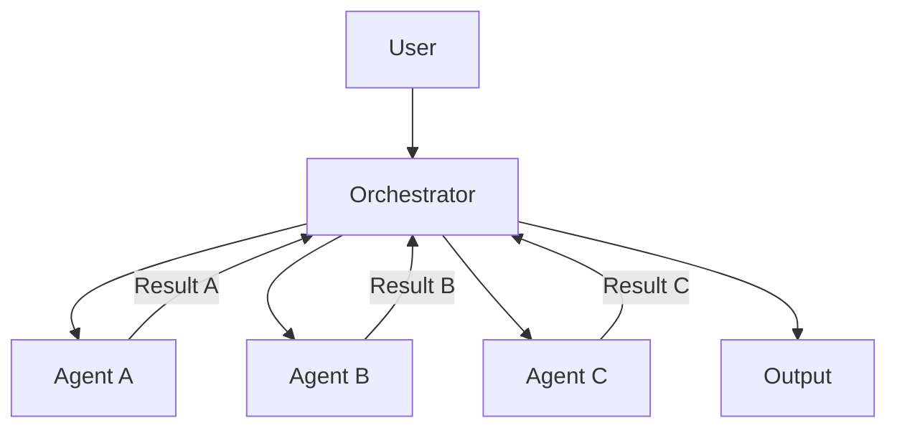

Multi-agent systems (MAS) are becoming indispensable for tackling complex, dynamic problems across various domains. By 2026, the demand for highly reliable and efficient MAS will surge, necessitating robust design patterns for agent collaboration and coordination. This entry explores key architectural patterns that ensure stability, fault tolerance, and effective collective intelligence in such systems.

## 핵심 개념 및 중요성

강건한 멀티 에이전트 시스템(Robust Multi-Agent Systems)은 개별 에이전트의 실패나 환경 변화에도 불구하고 전체 시스템이 목표를 달성할 수 있도록 설계된 시스템을 의미합니다. 이는 복잡한 작업 분해, 자원 관리, 충돌 해결, 그리고 불확실한 상황에서의 의사결정 과정에서 에이전트 간의 효율적인 협업(Collaboration)과 조정(Coordination)을 필요로 합니다. 2026년에는 AI 에이전트의 자율성과 상호작용이 더욱 증대됨에 따라, 이러한 시스템의 신뢰성과 예측 가능성을 보장하는 디자인 패턴이 핵심 경쟁력이 될 것입니다.

## 주요 협업 및 조정 디자인 패턴

### 1. 브로커/오케스트레이터 패턴 (Broker/Orchestrator Pattern)

중앙 집중식 조정자로 브로커 또는 오케스트레이터 에이전트가 모든 에이전트의 통신과 태스크 분배를 관리합니다. 이는 시스템의 복잡성을 줄이고, 에이전트 간 직접적인 의존성을 최소화하여 관리 용이성을 높입니다.

**장점**:
*   간결한 구조와 제어 흐름.
*   쉬운 모니터링 및 디버깅.
*   글로벌 최적화 가능성.

**단점**:
*   단일 실패 지점(Single Point of Failure).
*   확장성(Scalability) 제약.
*   브로커 에이전트의 병목 현상(Bottleneck).



### 2. 블랙보드 패턴 (Blackboard Pattern)

공유 메모리 구조인 '블랙보드'를 통해 에이전트들이 정보를 공유하고 상호작용하는 패턴입니다. 각 에이전트는 블랙보드의 특정 영역을 모니터링하고, 자신의 지식 기반(Knowledge Base)과 추론 엔진(Inference Engine)을 사용하여 문제 해결에 기여합니다.

**장점**:
*   높은 유연성과 모듈성(Modularity).
*   비동기적(Asynchronous) 협업 가능.
*   다양한 종류의 에이전트 통합 용이.

**단점**:
*   블랙보드의 동시성(Concurrency) 및 일관성(Consistency) 관리 복잡성.
*   정보 오버로드(Information Overload) 가능성.
*   글로벌 최적화가 어려움.

### 3. 컨트랙트 넷 프로토콜 (Contract Net Protocol)

분산형 태스크 할당을 위한 협상 기반 프로토콜입니다. 태스크를 가진 에이전트(Manager)가 작업을 공고(Announce)하면, 다른 에이전트(Bidders)들이 자신의 능력에 따라 입찰(Bid)하고, Manager가 가장 적합한 에이전트를 선정하여 계약(Award)합니다.

**장점**:
*   높은 분산성(Decentralization) 및 유연한 자원 할당.
*   에이전트 추가/제거 용이.
*   시스템의 강건성 향상.

**단점**:
*   커뮤니케이션 오버헤드(Communication Overhead).
*   입찰 과정의 복잡성 및 효율성 문제.
*   악의적인 에이전트(Malicious Agents)에 대한 취약성.

### 4. 리더-팔로워 및 피어-투-피어 패턴 (Leader-Follower & Peer-to-Peer Patterns)

**리더-팔로워(Leader-Follower)**: 하나의 리더 에이전트가 주된 의사결정과 조정을 담당하고, 팔로워 에이전트들은 리더의 지시를 따르며 작업을 수행합니다. 리더 실패 시 다른 팔로워가 리더 역할을 인계받는 메커니즘을 통해 강건성을 확보합니다.

**피어-투-피어(Peer-to-Peer)**: 모든 에이전트가 동등한 권한을 가지며, 직접적인 상호작용을 통해 협업합니다. 중앙 집중식 제어 없이 자율적으로 문제를 해결하여 단일 실패 지점을 제거합니다.

**장점**:
*   리더-팔로워: 명확한 역할 분담, 관리 용이. 피어-투-피어: 높은 분산성, 단일 실패 지점 없음.
*   장애 내구성(Fault Tolerance) 향상 (리더-팔로워의 경우 리더 선출 메커니즘 필요).

**단점**:
*   리더-팔로워: 리더의 병목 현상, 리더 선출 복잡성. 피어-투-피어: 일관성 유지의 어려움, 전역 상태(Global State) 파악 어려움.

## 코드 예제: 간단한 태스크 분배 (Python 유사 코드)

아래는 브로커/오케스트레이터 패턴에서 태스크를 분배하고 결과를 수집하는 간단한 예시입니다.

```python
# orchestrator.py
class Task:
    def __init__(self, id, description):
        self.id = id
        self.description = description
        self.assigned_agent = None
        self.status = "PENDING"
        self.result = None

class Orchestrator:
    def __init__(self):
        self.agents = {} # {agent_id: agent_instance}
        self.tasks = []
        self.next_agent_id = 1

    def register_agent(self, agent):
        agent_id = f"Agent-{self.next_agent_id}"
        self.agents[agent_id] = agent
        agent.set_id(agent_id)
        print(f"{agent_id} registered.")
        self.next_agent_id += 1
        return agent_id

    def add_task(self, description):
        task_id = len(self.tasks) + 1
        new_task = Task(task_id, description)
        self.tasks.append(new_task)
        print(f"Task {task_id} '{description}' added.")
        self.distribute_task(new_task)

    def distribute_task(self, task):
        # Simple round-robin distribution for demonstration
        if not self.agents:
            print("No agents available to distribute tasks.")
            return

        available_agent_ids = list(self.agents.keys())
        if not available_agent_ids:
            print("No agents available.")
            return

        # Simple load balancing strategy
        assigned_agent_id = available_agent_ids[task.id % len(available_agent_ids)]
        agent = self.agents[assigned_agent_id]
        
        task.assigned_agent = assigned_agent_id
        task.status = "ASSIGNED"
        agent.receive_task(task)
        print(f"Task {task.id} assigned to {assigned_agent_id}.")

    def report_task_completion(self, agent_id, task_id, result):
        for task in self.tasks:
            if task.id == task_id and task.assigned_agent == agent_id:
                task.status = "COMPLETED"
                task.result = result
                print(f"Task {task.id} completed by {agent_id} with result: {result}")
                return
        print(f"Error: Task {task.id} not found or not assigned to {agent_id}.")

# agent.py
class Agent:
    def __init__(self, orchestrator, skill):
        self.id = None
        self.orchestrator = orchestrator
        self.skill = skill

    def set_id(self, agent_id):
        self.id = agent_id

    def receive_task(self, task):
        print(f"{self.id} received task {task.id}: '{task.description}'. Processing...")
        # Simulate work based on skill
        import time
        time.sleep(1) # Simulate computation
        processed_result = f"Processed '{task.description}' using {self.skill}"
        self.orchestrator.report_task_completion(self.id, task.id, processed_result)

# main.py
if __name__ == "__main__":
    orchestrator = Orchestrator()

    agent1 = Agent(orchestrator, "Data Analysis")
    agent2 = Agent(orchestrator, "Report Generation")
    agent3 = Agent(orchestrator, "Summarization")

    orchestrator.register_agent(agent1)
    orchestrator.register_agent(agent2)
    orchestrator.register_agent(agent3)

    orchestrator.add_task("Analyze Q1 sales data")
    orchestrator.add_task("Generate marketing report")
    orchestrator.add_task("Summarize customer feedback")
    orchestrator.add_task("Perform market trend analysis")

    # In a real system, you'd have a continuous loop or event-driven system
    # For this example, we just wait for the simulated sleeps to finish.
    print("All tasks distributed. Waiting for completion reports...")
    import time
    time.sleep(5) # Wait for agents to report back
    print("--- Final Task Status ---")
    for task in orchestrator.tasks:
        print(f"Task {task.id}: {task.description} - Status: {task.status} - Result: {task.result}")

```

## 2026년 트렌드 반영

2026년에는 멀티 에이전트 시스템의 강건성을 높이기 위해 다음과 같은 트렌드가 더욱 중요해질 것입니다.

*   **적응형 조정(Adaptive Coordination)**: 정적인 규칙 대신, 실시간으로 변화하는 환경과 에이전트 상태에 따라 조정 전략을 동적으로 변경하는 능력. 강화 학습(Reinforcement Learning)이나 메타-러닝(Meta-learning) 기술을 활용하여 에이전트가 최적의 협업 방식을 학습하도록 합니다.
*   **자율 복구 및 자가 치유(Autonomous Recovery & Self-healing)**: 개별 에이전트의 실패를 감지하고, 시스템 전체에 미치는 영향을 최소화하며, 자동으로 복구하는 메커니즘이 내재화됩니다. 이는 Fault Injection Testing과 같은 고급 테스트 기법과 결합하여 시스템의 회복탄력성(Resilience)을 극대화합니다.
*   **인간-에이전트 협업 강화(Enhanced Human-Agent Collaboration)**: 복잡한 문제 해결 과정에서 인간의 전문 지식과 에이전트의 처리 능력을 효과적으로 결합하는 패턴이 부상합니다. 에이전트가 인간의 의도를 이해하고, 적절한 시점에 개입하거나 정보를 제공하여 협업의 효율성을 높입니다.

## 트레이드오프 (Trade-offs)

### 1. 중앙 집중식 vs 분산식 조정 (Centralized vs. Decentralized Coordination)

*   **언제 좋은가**: 중앙 집중식(예: 브로커/오케스트레이터)은 소규모 시스템에서 빠른 개발과 쉬운 제어가 필요할 때 좋습니다. 초기 프로토타이핑이나 특정 에이전트의 엄격한 제어가 필요한 경우에 효과적입니다.
*   **언제 나쁜가**: 대규모 분산 시스템에서는 단일 실패 지점과 확장성 문제가 발생할 수 있습니다. 높은 처리량과 장애 내구성이 필수적인 환경에서는 성능 저하와 병목 현상을 초래할 수 있습니다.

### 2. 통신 오버헤드 vs 정보 일관성 (Communication Overhead vs. Information Consistency)

*   **언제 좋은가**: 정보 일관성을 높이기 위해 모든 에이전트가 최신 정보를 공유하거나 합의(Consensus) 과정을 거치는 것은 금융 거래, 블록체인과 같이 데이터 무결성이 최우선인 시스템에서 중요합니다.
*   **언제 나쁜가**: 과도한 통신은 시스템의 전체적인 지연 시간(Latency)을 증가시키고, 리소스 소비를 높여 비효율적일 수 있습니다. 실시간 반응이 중요한 게임 AI나 로봇 제어 시스템에서는 치명적인 단점이 될 수 있습니다.

### 3. 복잡성 vs 유연성 (Complexity vs. Flexibility)

*   **언제 좋은가**: 블랙보드 패턴과 같이 높은 유연성을 제공하는 패턴은 다양한 에이전트 유형과 동적으로 변화하는 문제 해결 전략을 통합해야 할 때 유리합니다. 새로운 에이전트나 지식 소스를 쉽게 추가할 수 있습니다.
*   **언제 나쁜가**: 유연한 시스템은 설계 및 구현 복잡성이 높고, 디버깅이 어려울 수 있습니다. 시스템의 행동을 예측하기 어렵게 만들어 관리 및 유지보수 비용이 증가할 수 있습니다.

### 4. 자율성 vs 제어 가능성 (Autonomy vs. Controllability)

*   **언제 좋은가**: 에이전트의 자율성을 극대화하는 피어-투-피어 방식은 에이전트 스스로 최적의 행동을 학습하고 환경에 적응해야 하는 탐험 로봇이나 분산 센서 네트워크에 적합합니다.
*   **언제 나쁜가**: 고도의 자율성은 예상치 못한 행동이나 시스템의 목표와 일치하지 않는 결과를 초래할 위험이 있습니다. 안전(Safety)과 보안(Security)이 중요한 시스템(예: 자율 주행 차량, 의료 시스템)에서는 엄격한 제어와 예측 가능성이 필수적입니다.

## 실전 체크리스트 (Practical Checklist)

프로젝트에 강건한 멀티 에이전트 시스템의 협업 및 조정 디자인 패턴을 적용할 때 다음 항목들을 검토하십시오.

*   [ ] **에이전트 역할 및 책임 명확화**: 각 에이전트의 스킬(Skill), 목표(Goal), 그리고 다른 에이전트와의 인터페이스를 명확하게 정의했는가?
*   [ ] **통신 프로토콜 표준화**: 에이전트 간 메시지 형식, 전달 방식, 오류 처리 메커니즘이 일관되게 정의되고 문서화되었는가? (예: FIPA ACL, RESTful API)
*   [ ] **장애 감지 및 복구 메커니즘 설계**: 에이전트 실패, 통신 장애, 외부 시스템 오류 발생 시 이를 감지하고 시스템 전체의 안정성을 유지하기 위한 전략(재시도, 대체 에이전트 활성화)이 있는가?
*   [ ] **확장성 고려**: 시스템에 에이전트가 추가되거나 태스크 부하가 증가할 때, 성능 저하 없이 시스템이 확장될 수 있는 아키텍처를 채택했는가? (예: 동적 에이전트 스케일링, 로드 밸런싱)
*   [ ] **보안 및 접근 제어**: 에이전트 간 통신 및 공유 자원 접근에 대한 인증(Authentication) 및 권한 부여(Authorization) 메커니즘이 구현되었는가?
*   [ ] **모니터링 및 로깅 시스템 구축**: 에이전트의 상태, 태스크 진행 상황, 통신 로그 등을 실시간으로 모니터링하고 분석할 수 있는 시스템이 갖춰져 있는가?
*   [ ] **합의 및 일관성 전략 선택**: 시스템의 중요도에 따라 데이터 일관성 요구 사항을 충족하는 적절한 합의 알고리즘(분산 락, 버전 관리) 또는 약한 일관성(Eventual Consistency) 모델을 선택했는가?