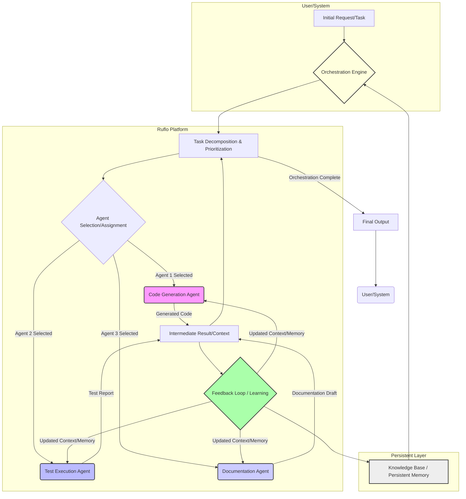

Ruflo 플랫폼은 Claude Code 기반 멀티 에이전트 시스템을 위한 강력한 오케스트레이션 엔진으로, 100개 이상의 특화 에이전트를 효율적으로 조율한다. 기존 Claude Flow에서 리브랜딩된 Ruflo는 에이전트의 자기 조직화(self-organization), 작업별 학습(task-specific learning), 세션 간 기억 유지(persistent memory) 기능을 강화하여 복잡한 자동화 워크플로우 및 동적 문제 해결 시나리오에서의 에이전트 자율성과 효율성을 극대화한다. 현재 playbook의 에이전트 워크플로에 Ruflo를 적용함으로써 시스템 성능과 안정성을 향상시킬 수 있다.

### Ruflo의 핵심 기능과 Claude Code 연동

Ruflo는 `npx ruvflo init` 명령으로 에이전트 스웜(swarm)을 초기화하며, 에이전트들은 자율적으로 자기 조직화하여 목표를 달성한다.

1.  **자기 조직화 (Self-Organization):** Ruflo 에이전트는 고정된 워크플로우 대신, 문제에 가장 적합한 에이전트를 동적으로 선택하고 협력한다. 이는 예상치 못한 상황에 유연하게 대응하고 복잡한 태스크를 효율적으로 해결한다.
2.  **작업별 학습 (Task-Specific Learning):** 각 에이전트는 작업 성공 및 실패 경험을 통해 지속적으로 학습한다. 이 메커니즘은 장기적으로 의사결정 품질을 높이고 반복 오류를 줄인다.
3.  **세션 간 기억 유지 (Persistent Memory):** Ruflo는 에이전트가 세션 간 학습된 지식과 컨텍스트를 유지하도록 지원한다. Claude Code 하네스와 연동 시, 이는 에이전트가 긴 개발 주기와 복잡한 프로젝트 컨텍스트를 관리하는 데 필수적이다.

Ruflo를 playbook 에이전트 워크플로우에 도입하는 것은 아키텍처적 개선을 의미한다. 코드 생성, 테스트, 디버깅, 문서화 등 복잡한 개발 워크플로우에서 Ruflo의 멀티 에이전트 오케스트레이션은 각 단계의 전문 에이전트들이 유기적으로 협력하도록 돕는다.

### 코드 예제: Ruflo 기반 에이전트 오케스트레이션 개념

아래는 Ruflo와 유사한 개념으로 멀티 에이전트 워크플로우를 구성하는 Python 예시이다. Ruflo의 실제 구현은 CLI 명령으로 시작되지만, 내부적으로는 이와 같은 에이전트 간의 메시지 전달 및 상태 관리를 기반으로 한다.

```python
import json
from typing import Dict, Any, List, Optional

# Ruflo Agent의 기본 개념 추상화
class RufloAgent:
    def __init__(self, name: str, role: str, skills: List[str]):
        self.name = name
        self.role = role
        self.skills = skills
        self.persistent_memory: List[str] = [] # 세션 간 유지되는 기억

    def execute_task(self, task_description: str, context: Dict[str, Any]) -> Dict[str, Any]:
        """주어진 태스크를 실행하고 결과를 반환."""
        if "code_generation" in self.skills and "code" in task_description.lower():
            self.persistent_memory.append(f"Learned to generate code for '{task_description}'")
            return {"status": "success", "output": f"Code generated for '{task_description}'"}
        elif "testing" in self.skills and "test" in task_description.lower():
            self.persistent_memory.append(f"Learned to test '{task_description}'")
            return {"status": "success", "output": f"Tests passed for '{task_description}'"}
        else:
            return {"status": "failure", "output": "No suitable skill."}

# Ruflo Orchestration Engine 개념적 표현
class RufloOrchestrationEngine:
    def __init__(self, agents: List[RufloAgent]):
        self.agents = {agent.name: agent for agent in agents}
        self.global_context: Dict[str, Any] = {} # 전체 워크플로우 컨텍스트

    def orchestrate_workflow(self, workflow_tasks: List[str]) -> List[Dict[str, Any]]:
        """멀티 에이전트 워크플로우를 오케스트레이션."""
        results = []
        for task_desc in workflow_tasks:
            assigned_agent = self._select_agent(task_desc)
            if assigned_agent:
                task_result = assigned_agent.execute_task(task_desc, self.global_context)
                results.append({"task": task_desc, "agent": assigned_agent.name, "result": task_result})
                self.global_context[f"last_result_for_{task_desc}"] = task_result["output"]
            else:
                results.append({"task": task_desc, "agent": "None", "result": {"status": "failure", "output": "No agent found."}})
        return results

    def _select_agent(self, task_description: str) -> Optional[RufloAgent]:
        """태스크에 가장 적합한 에이전트를 동적으로 선택."""
        for agent in self.agents.values():
            if ("code" in task_description.lower() and "code_generation" in agent.skills) or \
               ("test" in task_description.lower() and "testing" in agent.skills) or \
               ("review" in task_description.lower() and "review" in agent.skills):
                return agent
        return None
```

### Mermaid Diagram: Ruflo 기반 멀티 에이전트 오케스트레이션 플로우


## 트레이드오프

### 복잡성 증가 vs. 자율성 및 확장성
*   **언제 좋은가?** 복잡하고 다단계적인 태스크 처리, 예측 불가능한 시나리오에 유연하게 대응해야 할 때 Ruflo의 멀티 에이전트 오케스트레이션은 뛰어난 자율성과 확장성을 제공한다. 에이전트의 자기 조직화 능력은 개발 및 유지보수 비용을 절감할 수 있다.
*   **언제 나쁜가?** 단순하고 반복적인 태스크에는 과도한 복잡성을 추가할 수 있다. 초기 설정 및 디버깅에 더 많은 노력이 필요하며, 에이전트 간의 상호작용 문제를 진단하기 어려울 수 있다.

### 자율 학습 vs. 예측 가능성 및 제어
*   **언제 좋은가?** 에이전트가 작업 경험을 통해 지속적으로 학습하고 개선되는 환경에서는 장기적으로 더 높은 성능과 효율성을 기대할 수 있다. 특히 빠르게 변화하는 요구사항이나 도메인 지식이 필요한 경우 유리하다.
*   **언제 나쁜가?** 시스템의 행동이 항상 예측 가능해야 하거나, 엄격한 규제 및 감사 요건이 있는 환경에서는 에이전트의 자율 학습이 의도치 않은 결과를 초래할 수 있다. 학습 모델의 편향(bias)이나 잘못된 지식 습득을 제어하기 위한 추가적인 메커니즘이 필요하다.

### 세션 간 기억 유지 vs. 리소스 오버헤드 및 컨텍스트 드리프트
*   **언제 좋은가?** 긴 개발 주기나 복잡한 프로젝트에서 에이전트가 이전의 결정과 컨텍스트를 기억하여 일관성 있고 맥락에 맞는 작업을 수행할 수 있게 한다. 이는 사용자 경험을 향상시키고 반복적인 정보 제공의 필요성을 줄인다.
*   **언제 나쁜가?** 모든 세션의 데이터를 저장하고 관리하는 데 상당한 리소스(메모리, 스토리지)가 소모될 수 있다. 또한, 시간이 지남에 따라 불필요하거나 오래된 컨텍스트가 에이전트의 의사결정을 방해하는 컨텍스트 드리프트(context drift) 현상이 발생할 위험이 있다.

## 실전 체크리스트

*   [ ] Ruflo 플랫폼을 현재 Claude Code 하네스 환경에 성공적으로 연동했는가? (`npx ruvflo init` 및 설정 파일 검증)
*   [ ] 기존 playbook 워크플로우를 Ruflo의 멀티 에이전트 구조에 맞게 재설계하고, 각 에이전트의 역할과 스킬셋을 명확히 정의했는가?
*   [ ] 에이전트의 자기 조직화 및 태스크 위임 로직이 기대한 대로 작동하는지, 다양한 엣지 케이스 시나리오에서 테스트했는가?
*   [ ] 에이전트의 작업별 학습(task-specific learning) 메커니즘이 실제로 에이전트 성능 개선에 기여하는지 정량적으로 평가할 수 있는 지표를 마련했는가?
*   [ ] 세션 간 기억 유지(persistent memory) 기능이 올바르게 구현되었으며, 이전 세션의 컨텍스트가 다음 세션에 유효하게 전달되는지 검증했는가?
*   [ ] Ruflo 기반 멀티 에이전트 시스템의 전반적인 성능(latency, throughput)과 리소스 사용량(CPU, Memory)을 모니터링하고 최적화 방안을 수립했는가?
*   [ ] 에이전트 간의 통신 실패, 오케스트레이션 오류 등 잠재적 문제 상황에 대한 로깅 및 에러 핸들링 전략을 구축했는가?