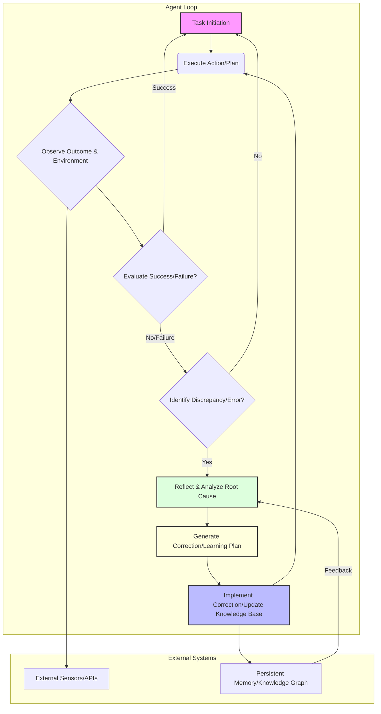

자율 에이전트의 자기 수정 및 학습 루프는 2026년까지 에이전트 기술의 핵심 역량으로 부상하며, 복잡하고 변화무쌍한 환경에서 안정적이고 지능적인 동작을 보장하는 데 필수적입니다. 단순히 작업을 수행하는 것을 넘어, 에이전트가 자신의 오류를 인지하고 분석하며, 나아가 미래의 성능 향상을 위해 지식을 통합하는 능력은 진정한 자율성의 기반이 됩니다. 이는 특히 예측 불가능한 상황에서 에이전트의 견고성(robustness)과 적응성(adaptability)을 극대화하는 데 중요합니다.

## 자기 수정 및 학습 루프의 핵심 원리

자율 에이전트의 자기 수정 및 학습 루프는 다음과 같은 주요 단계를 포함합니다.

### 1. 관찰 및 모니터링 (Observation & Monitoring)
에이전트는 자신의 행동, 환경 변화, 그리고 그 결과에 대한 데이터를 지속적으로 수집해야 합니다. 이는 센서 데이터, 실행 로그, API 응답, 사용자 피드백 등 다양한 형태로 이루어질 수 있습니다. 효과적인 모니터링 시스템은 에이전트의 현재 상태와 목표 달성 진행 상황을 명확하게 파악하는 데 필수적입니다.

### 2. 평가 및 이상 감지 (Evaluation & Anomaly Detection)
수집된 데이터를 기반으로 에이전트는 자신의 성능을 평가하고, 기대치에서 벗어나는 행동이나 오류를 감지합니다. 이 단계에서는 미리 정의된 성능 지표, 휴리스틱 규칙, 또는 머신러닝 기반의 이상 감지 모델이 활용될 수 있습니다. 중요한 것은 단순히 '실패'를 넘어 '왜 실패했는지'를 분석하기 위한 단서들을 식별하는 것입니다.

### 3. 반성 및 원인 분석 (Reflection & Root Cause Analysis)
오류나 성능 저하가 감지되면, 에이전트는 자체적인 반성(self-reflection) 메커니즘을 통해 문제의 근본 원인을 파악하려고 시도합니다. 대규모 언어 모델(LLM)은 이 과정에서 복잡한 상황을 해석하고, 인과 관계를 추론하며, 가능한 해결책을 제안하는 데 강력한 도구가 될 수 있습니다. 이는 에이전트의 내부 모델, 사용된 도구, 또는 계획의 결함을 식별하는 과정입니다.

### 4. 학습 및 적응 (Learning & Adaptation)
원인 분석을 통해 얻은 통찰력은 에이전트의 지식 기반을 업데이트하고, 미래 행동을 개선하는 데 사용됩니다. 이는 새로운 규칙 추가, 기존 지식 그래프 수정, 도구 사용 전략 최적화, 또는 심층 강화 학습(Reinforcement Learning)을 통한 정책 업데이트 등 다양한 형태로 나타날 수 있습니다. 학습된 지식은 장기 메모리(long-term memory)에 저장되어 지속적인 성능 향상을 가능하게 합니다.

### 5. 계획 수정 및 재실행 (Plan Modification & Re-execution)
학습된 내용을 바탕으로 에이전트는 현재의 계획을 수정하거나 새로운 계획을 수립하고, 이를 다시 실행하여 개선된 성능을 검증합니다. 이 과정은 실패가 성공으로 전환될 때까지 반복될 수 있습니다.

## 자기 수정 학습 루프 아키텍처

다음 Mermaid 다이어그램은 자율 에이전트의 자기 수정 및 학습 루프의 일반적인 흐름을 보여줍니다.



## Python을 이용한 간단한 자기 수정 에이전트 구현 예제

다음은 Python에서 간단한 자기 수정 루프를 시뮬레이션하는 예제입니다. 이 예제에서는 에이전트가 특정 목표(예: `target_value`에 도달)를 가지고 행동하며, 목표 달성 여부를 평가하고, 실패 시 '반성'을 통해 다음 행동을 수정합니다.

```python
import time

class AutonomousAgent:
    def __init__(self, name, initial_value=0, target_value=10):
        self.name = name
        self.current_value = initial_value
        self.target_value = target_value
        self.history = []
        self.last_action_effect = 0
        print(f"{self.name} initialized with value {self.current_value}")

    def observe(self):
        print(f"[Observe] Current value: {self.current_value}")
        return self.current_value

    def evaluate(self, observed_value):
        if observed_value == self.target_value:
            print(f"[Evaluate] Target {self.target_value} reached! Success.")
            return True, "success"
        elif observed_value < self.target_value:
            print(f"[Evaluate] Value {observed_value} < Target {self.target_value}. Still need to increase.")
            return False, "under"
        else:
            print(f"[Evaluate] Value {observed_value} > Target {self.target_value}. Overstepped.")
            return False, "over"

    def reflect_and_plan(self, status):
        if status == "under":
            print("[Reflect] Need to increase value. Proposing action: +2")
            self.last_action_effect = 2
            return 2 # Plan to add 2
        elif status == "over":
            print("[Reflect] Overstepped. Proposing action: -1")
            self.last_action_effect = -1
            return -1 # Plan to subtract 1
        elif status == "success":
            print("[Reflect] Target reached. No further action needed.")
            return 0
        else:
            print("[Reflect] Unknown status, defaulting to +1.")
            self.last_action_effect = 1
            return 1

    def execute_action(self, action_value):
        print(f"[Execute] Performing action: {action_value}")
        self.current_value += action_value
        self.history.append((self.current_value, action_value))
        time.sleep(0.1) # Simulate some work

    def run(self):
        while True:
            observed_value = self.observe()
            is_success, status = self.evaluate(observed_value)

            if is_success:
                break

            action_plan = self.reflect_and_plan(status)
            self.execute_action(action_plan)
            print("---------------------------------")

        print(f"{self.name} finished. History: {self.history}")

# Run the agent
agent = AutonomousAgent("SimpleCorrector", initial_value=5, target_value=8)
agent.run()
```

이 예제는 `reflect_and_plan` 메서드를 통해 에이전트가 `evaluate` 단계의 결과에 따라 다음 행동을 동적으로 변경하는 방법을 보여줍니다. 실제 자율 에이전트에서는 이 `reflect_and_plan` 부분이 LLM 호출, 지식 그래프 쿼리, 또는 복잡한 추론 엔진으로 대체되어 더욱 정교한 자기 수정 로직을 구현하게 됩니다.

## 트레이드오프

자율 에이전트의 자기 수정 및 학습 루프를 구현할 때는 다음과 같은 트레이드오프를 고려해야 합니다.

*   **복잡성 vs. 성능 (Complexity vs. Performance)**:
    *   **언제 좋은가**: 환경이 매우 동적이고 예측 불가능할 때, 에이전트가 복잡한 자기 수정 로직을 통해 적응력을 높여 전반적인 성능과 신뢰성을 향상시킬 수 있습니다.
    *   **언제 나쁜가**: 환경이 단순하고 고정적이거나, 실시간 응답 속도가 critical한 시스템에서는 복잡한 루프가 불필요한 오버헤드를 발생시켜 성능 저하를 초래할 수 있습니다. LLM 기반의 반성(reflection)은 지연 시간과 비용을 증가시킵니다.

*   **탐색 vs. 활용 (Exploration vs. Exploitation)**:
    *   **언제 좋은가**: 초기 개발 단계나 새로운 환경에 배포될 때, 에이전트가 새로운 전략을 탐색하고 학습하는 능력이 중요합니다. 이를 통해 최적의 행동 패턴을 발견할 수 있습니다.
    *   **언제 나쁜가**: 안정적인 프로덕션 환경에서는 검증된 행동을 '활용'하는 것이 중요하며, 과도한 탐색은 예측 불가능한 행동이나 위험을 증가시킬 수 있습니다. 학습 루프가 충분히 수렴되었다면 탐색의 비중을 줄여야 합니다.

*   **자율성 vs. 제어 가능성 (Autonomy vs. Controllability)**:
    *   **언제 좋은가**: 인간의 개입 없이 스스로 문제를 해결하고 발전해야 하는 장기적인 목표를 가진 에이전트에게는 높은 자율성이 유리합니다. 이는 운영 비용을 절감하고 확장성을 높일 수 있습니다.
    *   **언제 나쁜가**: 안전이 최우선이거나, 규제 준수가 중요한 영역(예: 의료, 금융)에서는 에이전트의 행동에 대한 투명성과 인간의 제어 가능성이 확보되어야 합니다. 과도한 자율성은 의도치 않은 결과를 초래할 위험이 있습니다.

*   **학습 비용 vs. 오류 비용 (Learning Cost vs. Error Cost)**:
    *   **언제 좋은가**: 치명적인 오류의 발생 가능성이 높거나, 오류 수정에 드는 비용이 매우 높은 시스템에서 에이전트의 학습 및 자기 수정 비용을 투자하는 것은 장기적으로 더 경제적입니다.
    *   **언제 나쁜가**: 오류의 영향이 미미하거나, 매우 빠르게 복구할 수 있는 시스템에서는 복잡한 학습 루프를 유지하는 비용이 오류 발생 비용보다 높을 수 있습니다.

## 실전 체크리스트

자율 에이전트의 자기 수정 및 학습 루프를 프로젝트에 적용할 때 다음 항목들을 확인해야 합니다.

- [ ] **성능 지표(Metrics) 정의**: 에이전트의 성공과 실패를 객관적으로 측정할 수 있는 명확한 성능 지표를 정의했는가?
- [ ] **오류 감지 메커니즘**: 에이전트가 자신의 행동에서 발생하는 오류나 이상 징후를 실시간으로 감지할 수 있는 견고한 메커니즘을 구현했는가?
- [ ] **반성(Reflection) 시스템의 설계**: 오류 발생 시 에이전트가 원인을 분석하고 해결책을 모색하는 `reflect_and_plan` 로직이 충분히 정교하고 확장 가능한가? (LLM 연동 여부 포함)
- [ ] **지식 기반 업데이트 정책**: 에이전트가 학습한 내용을 장기 메모리(예: 지식 그래프, RAG 데이터셋)에 효과적으로 통합하고 업데이트하는 정책이 명확하게 수립되었는가?
- [ ] **인간-에이전트 협업(Human-in-the-Loop)**: 에이전트가 해결할 수 없는 복잡한 문제나 안전에 민감한 상황에서 인간의 개입 및 피드백을 받을 수 있는 메커니즘이 설계되었는가?
- [ ] **학습 루프의 수렴 및 안정성**: 에이전트의 학습 루프가 시간이 지남에 따라 안정적으로 성능을 향상시키고 수렴하는지 지속적으로 모니터링하고 평가하는 체계가 있는가?
- [ ] **비용 및 자원 효율성**: 자기 수정 및 학습 루프가 추가적인 컴퓨팅 자원(LLM 토큰, GPU 시간 등)을 얼마나 사용하는지 측정하고, 예산 내에서 효율적으로 운영되는지 확인했는가?
