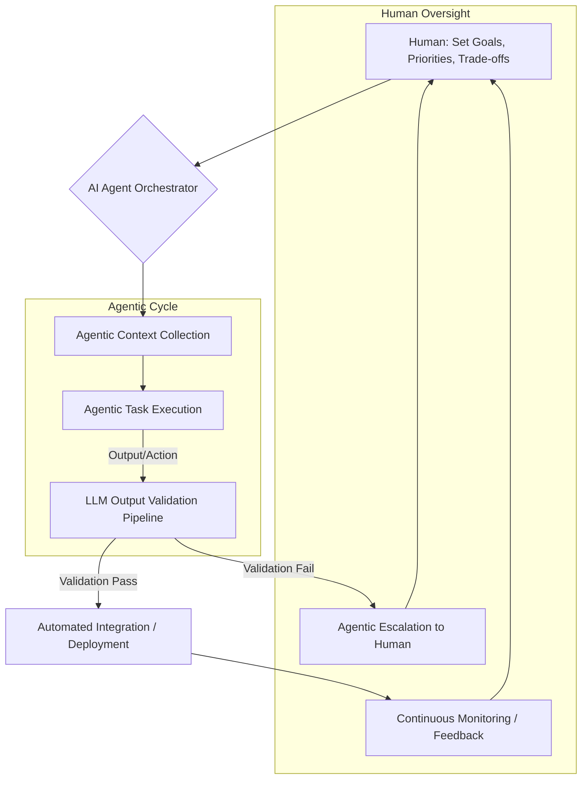

Replit의 '자율주행 기업(The Self-Driving Company)' 모델은 인간의 지능적 감독과 AI 에이전트의 자율적 실행을 결합하여 조직의 운영 효율성을 극대화하는 강력한 패러다임을 제시한다. 이 모델은 playbook의 '프로젝트 관제탑(Project Control Tower)'과 'AI 에이전트 하네스(AI Agent Harness)'의 핵심 운영 모델로 통합되어, '허브-워커 복리 자동화(Hub-Worker Compounding Automation)'의 고도화를 목표로 한다. 본 위키 엔트리는 이 개념을 적용하여 AI 에이전트 워크플로우를 재정의하는 방안을 설명한다.

## 자율주행 기업 모델의 핵심 원칙

자율주행 기업은 단순히 AI 에이전트가 작업을 수행하는 것을 넘어, 다음과 같은 명확한 역할 분담과 워크플로우를 특징으로 한다.

### 1. 인간의 역할: 목표, 우선순위, 트레이드오프 설정
인간은 시스템의 최종 목표, 전략적 우선순위, 그리고 상충하는 요구사항 간의 트레이드오프를 명확하게 정의하는 역할을 담당한다. 이는 AI 에이전트가 복잡한 문제 공간 내에서 올바른 방향으로 나아가도록 하는 나침반 역할을 한다. 예를 들어, "다음 스프린트까지 특정 기능의 MVP를 출시하되, 보안 취약점은 절대 용납하지 않는다"와 같은 지침을 제공할 수 있다.

### 2. AI 에이전트의 역할: 컨텍스트 수집, 실행, 검증, 에스컬레이션
인간이 설정한 목표 아래, AI 에이전트는 자율적으로 다음 단계를 수행한다.

*   **컨텍스트 수집 (Context Collection):** 필요한 정보 (코드베이스, 문서, 외부 API 응답, 사용자 피드백 등)를 능동적으로 수집하여 현재 작업에 필요한 모든 맥락을 구성한다. 이는 'AI Agent Context Window Optimization' 및 'AI Agent Persistent Memory' 패턴과 연관된다.
*   **작업 실행 (Task Execution):** 수집된 컨텍스트를 기반으로 실제 작업을 수행한다. 코드 작성, 문서 업데이트, 시스템 설정 변경 등 다양한 형태가 될 수 있다. 이 단계에서는 'Advanced AI Agent Tool Use Patterns'가 핵심적으로 활용된다.
*   **검증 (Validation):** 생성된 결과물이나 수행된 작업이 사전에 정의된 기준과 일치하는지 자동으로 검증한다. 이는 'LLM 출력 검증 파이프라인(LLM Output Validation Pipeline)'을 통해 이루어지며, 코드 품질, 논리적 일관성, 보안 정책 준수 등을 확인한다.
*   **에스컬레이션 (Escalation):** 검증에 실패하거나, 해결할 수 없는 복잡한 문제, 또는 인간의 개입이 반드시 필요한 상황이 발생할 경우, AI 에이전트는 해당 상황을 인간에게 명확히 보고하고 추가 지침을 요청한다. 이는 'Autonomous Agent LLM Error Handling & Recovery Patterns'과 연결된다.

## AI 에이전트 워크플로우 재정의

기존 playbook의 AI 에이전트 워크플로우는 이 '자율주행 기업' 모델을 중심으로 재편된다.



위 다이어그램은 인간이 상위 수준의 목표를 설정하면, AI 에이전트 오케스트레이터가 전체 워크플로우를 관리하는 과정을 보여준다. AI 에이전트들은 컨텍스트를 수집하고 작업을 실행하며, 중요한 'LLM Output Validation Pipeline'을 거쳐 검증된다. 실패 시에는 인간에게 에스컬레이션되고, 성공 시에는 자동화된 다음 단계로 진행되며, 지속적인 모니터링을 통해 피드백이 인간에게 다시 전달된다.

### 코드 예제: 간단한 에이전트 워크플로우 오케스트레이터 (Python)

다음은 '자율주행 기업' 모델에 기반한 간소화된 Python 오케스트레이터의 개념적 코드이다. 이는 에이전트가 목표를 받아 컨텍스트를 수집하고, 작업을 실행하며, 검증 후 필요시 에스컬레이션하는 과정을 추상화한다.

```python
import logging
from typing import Dict, Any, List

logging.basicConfig(level=logging.INFO, format='%(asctime)s - %(levelname)s - %(message)s')

class AgentTask:
    def __init__(self, name: str, description: str, tools: List[str]):
        self.name = name
        self.description = description
        self.tools = tools
        self.context: Dict[str, Any] = {}
        self.output: Any = None
        self.status = "PENDING"

    def collect_context(self, shared_context: Dict[str, Any]):
        logging.info(f"Agent '{self.name}': Collecting context...")
        # Simulate context collection using various tools/sources
        self.context.update(shared_context)
        self.context["relevant_docs"] = ["doc1.md", "doc2.md"]
        self.context["code_snippets"] = ["def func(): pass"]
        logging.info(f"Agent '{self.name}': Context collected: {list(self.context.keys())})")
        return True

    def execute(self) -> Any:
        logging.info(f"Agent '{self.name}': Executing task based on context: {self.context}")
        # Simulate LLM call and tool use for task execution
        # Example: Generate code, update config, analyze data
        if "generate_code" in self.tools:
            generated_code = f"// Generated by {self.name}\nprint('Hello, Self-Driving Company!')"
            self.output = {"code": generated_code}
            self.status = "EXECUTED"
            logging.info(f"Agent '{self.name}': Code generated.")
            return True
        self.output = {"result": f"Task '{self.name}' completed with generic output."}
        self.status = "EXECUTED"
        return True

    def validate(self) -> bool:
        logging.info(f"Agent '{self.name}': Validating output: {self.output}")
        # Simulate LLM Output Validation Pipeline logic
        if self.output and "code" in self.output:
            # Simple validation: check for specific keyword
            if "Self-Driving Company" in self.output["code"]:
                logging.info(f"Agent '{self.name}': Output validated successfully.")
                self.status = "VALIDATED"
                return True
            else:
                logging.warning(f"Agent '{self.name}': Validation failed: Keyword missing.")
                self.status = "VALIDATION_FAILED"
                return False
        logging.warning(f"Agent '{self.name}': No specific validation for this output type.")
        self.status = "VALIDATED_SKIPPED" # Or FAILED if strict
        return True

    def escalate(self, reason: str):
        logging.error(f"Agent '{self.name}': Escalating to human. Reason: {reason}. Output: {self.output}")
        self.status = "ESCALATED"
        # In a real system, this would trigger an alert, create a ticket, etc.

class SelfDrivingOrchestrator:
    def __init__(self, human_goals: List[str]):
        self.human_goals = human_goals
        self.tasks: List[AgentTask] = []
        self.shared_context: Dict[str, Any] = {"project_name": "PlaybookWiki"}

    def add_task(self, task: AgentTask):
        self.tasks.append(task)

    def run_workflow(self):
        logging.info(f"Orchestrator: Starting workflow with human goals: {self.human_goals}")
        for task in self.tasks:
            logging.info(f"Orchestrator: Processing task: {task.name}")
            if not task.collect_context(self.shared_context):
                task.escalate("Failed to collect context")
                continue

            if not task.execute():
                task.escalate("Failed to execute task")
                continue

            if not task.validate():
                task.escalate("Output validation failed")
                continue
            
            logging.info(f"Orchestrator: Task '{task.name}' completed and validated. Status: {task.status}")
            # Potentially update shared_context with task.output for subsequent tasks
            self.shared_context[task.name + "_output"] = task.output

        logging.info("Orchestrator: Workflow finished.")
        self.report_status()

    def report_status(self):
        logging.info("--- Workflow Summary ---")
        for task in self.tasks:
            logging.info(f"Task: {task.name}, Status: {task.status}, Output Sample: {str(task.output)[:50]}...")

# Example Usage:
orchestrator = SelfDrivingOrchestrator(
    human_goals=["Implement new feature X", "Ensure zero critical bugs", "Optimize performance by 10%"]
)

code_gen_task = AgentTask("CodeGenerationAgent", "Generate a new feature module", ["generate_code", "read_docs"])
config_update_task = AgentTask("ConfigUpdateAgent", "Update deployment configurations", ["read_config", "write_config"])

orchestrator.add_task(code_gen_task)
orchestrator.add_task(config_update_task)

orchestrator.run_workflow()
```

## 트레이드오프

'자율주행 기업' 모델과 AI 에이전트 워크플로우 재정의는 상당한 이점을 제공하지만, 동시에 고려해야 할 트레이드오프가 존재한다.

*   **자율성 (Autonomy) vs. 통제 (Control):**
    *   **언제 좋은가 (When good):** 에이전트의 자율성이 높으면 반복적이고 예측 가능한 작업을 빠르게 처리하고, 인간의 개입 없이 복잡한 문제의 초기 단계를 탐색하여 생산성을 크게 향상시킬 수 있다.
    *   **언제 나쁜가 (When bad):** 자율성이 과도하면 예상치 못한 행동이나 오류 발생 시 시스템 전체에 부정적인 영향을 미칠 수 있으며, 디버깅 및 책임 소재 파악이 어려워진다. 특히 중요한 시스템이나 규제 환경에서는 정밀한 통제와 투명성이 요구된다.

*   **초기 설정 비용 (Initial Setup Cost) vs. 장기적 효율성 (Long-term Efficiency):**
    *   **언제 좋은가:** 강력한 검증 파이프라인, 에스컬레이션 메커니즘, 컨텍스트 관리 시스템 등을 구축하는 초기 비용과 시간 투자는 장기적으로 인간 감독의 부담을 줄이고, 오류율을 낮추며, 운영 비용을 절감하여 복리 효과를 가져온다.
    *   **언제 나쁜가:** 초기 인프라 및 워크플로우 설계에 필요한 전문 지식과 리소스가 부족할 경우, 시스템 구축 자체가 지연되거나 불완전하게 구현되어 기대 효과를 얻지 못하고 추가적인 기술 부채를 유발할 수 있다.

*   **확장성 (Scalability) vs. 복잡성 (Complexity):**
    *   **언제 좋은가:** 잘 정의된 에이전트 워크플로우는 병렬 처리와 분산 시스템 설계를 통해 대규모 작업 부하를 효율적으로 처리하고, 조직의 성장에 따라 자동화 범위를 유연하게 확장할 수 있다.
    *   **언제 나쁜가:** 다수의 에이전트, 복잡한 상호작용, 동적 컨텍스트 관리는 시스템 설계 및 유지보수의 복잡성을 급증시킨다. 이는 'Multi-Agent Collaboration Complex Problem Solving'에서 흔히 발생하는 문제로, 시스템 이해도를 저하시키고 예상치 못한 버그를 유발할 수 있다.

*   **컨텍스트 관리 오버헤드 (Context Management Overhead) vs. 작업 정확도 (Task Accuracy):**
    *   **언제 좋은가:** 에이전트가 풍부하고 정확한 컨텍스트를 사용할 수록 작업 실행의 정확성과 품질이 비약적으로 향상된다. 특히 복잡한 코드 수정이나 심층적인 분석이 필요한 경우 필수적이다.
    *   **언제 나쁜가:** 필요한 모든 컨텍스트를 수집, 저장, 관리, 그리고 에이전트에게 효율적으로 제공하는 과정 자체가 상당한 컴퓨팅 자원과 스토리지, 그리고 정교한 'Agentic Context Compaction Trigger Heuristics' 같은 기술을 요구한다. 이는 시스템의 지연 시간과 운영 비용을 증가시킬 수 있다.

*   **검증 지연 (Validation Latency) vs. 신뢰성 (Reliability):**
    *   **언제 좋은가:** 엄격하고 다단계적인 검증 파이프라인은 AI 에이전트가 생성한 결과물의 신뢰성을 극대화하여, 실제 프로덕션 환경에 배포될 준비가 되었음을 보장한다. 특히 보안, 규제 준수, 핵심 비즈니스 로직과 관련된 작업에서 매우 중요하다.
    *   **언제 나쁜가:** 검증 과정이 너무 복잡하거나 시간이 오래 걸리면, 전체 워크플로우의 처리 속도가 저하되어 민첩한 개발 및 배포 사이클을 방해할 수 있다. 'LLM Output Validation Operational Discipline Enhancement'와 같이 검증 프로세스의 효율성을 최적화하는 노력이 필요하다.

## 실전 체크리스트

'자율주행 기업' 모델을 프로젝트에 성공적으로 적용하기 위한 실전 체크리스트는 다음과 같다.

*   [ ] **인간 정의 목표 및 가드레일 명확화:** AI 에이전트가 수행할 작업의 최종 목표, 우선순위, 허용 가능한 리스크 범위, 절대 위반해서는 안 되는 제약 조건(가드레일)을 문서화하고 모든 이해관계자가 동의했는지 확인한다.
*   [ ] **강력한 컨텍스트 수집 메커니즘 구현:** 에이전트가 작업을 수행하는 데 필요한 모든 관련 데이터(코드베이스, 문서, 로그, API 명세 등)를 실시간 또는 근실시간으로 접근하고 통합할 수 있는 시스템이 구축되었는지 검증한다. 'Agentic Context Compaction Trigger Heuristics' 등의 패턴을 고려한다.
*   [ ] **`LLM Output Validation Pipeline` 설계 및 배포:** 에이전트의 모든 출력(코드, 텍스트, 설정 변경 등)을 자동으로 검증할 수 있는 파이프라인이 구현되었는지 확인한다. 여기에는 정적 분석, 단위 테스트, 통합 테스트, 시맨틱 검증, 보안 검사 등이 포함되어야 한다.
*   [ ] **명시적 에스컬레이션 경로 정의:** 에이전트가 검증에 실패하거나, 문제 해결 능력을 초과하는 상황이 발생했을 때, 어떤 채널(Slack, Jira, 이메일 등)로, 어떤 정보와 함께 누구에게 에스컬레이션할지 명확한 프로토콜을 설정한다.
*   [ ] **에이전트 성능 및 비용 실시간 모니터링:** 에이전트의 작업 성공률, 오류율, 지연 시간, API 토큰 사용량, 컴퓨팅 자원 사용량 등 핵심 지표를 실시간으로 모니터링하고, 이상 감지 시 즉각 알림을 받을 수 있는 시스템을 구축한다. 'AI Agent Runaway Cost Prevention Control Systems'를 참고한다.
*   [ ] **에이전트 행동 감사 가능성 및 설명 가능성 확보:** 에이전트가 어떤 결정을 내렸고, 왜 그러한 행동을 했는지 추적하고 설명할 수 있는 로그 및 감사 기능을 구현한다. 이는 문제 발생 시 원인 분석과 신뢰성 확보에 필수적이다.
*   [ ] **에이전트 툴 사용 및 워크플로우 반복적 개선:** 에이전트의 툴 사용 패턴과 전체 워크플로우의 효율성을 주기적으로 분석하고, 새로운 툴 통합, 프롬프트 최적화, 워크플로우 단계 재구성 등을 통해 지속적으로 개선해 나간다. 'LLM Agent Dynamic Tool Selection Optimization'을 활용한다.