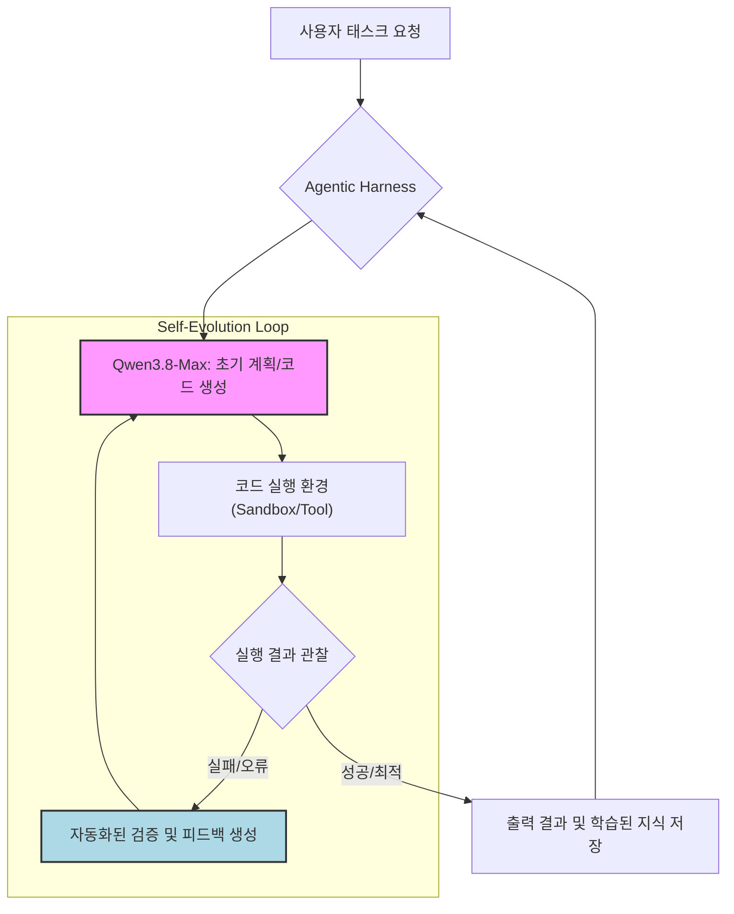

대규모 언어 모델(LLM) 기반 에이전트 시스템은 복잡한 태스크를 자율적으로 수행하며 빠르게 진화하고 있습니다. 특히, '실행 결과를 다음 시도에 반영하는 자기 진화' 능력을 가진 LLM은 에이전트 하네스의 안정성과 효율성을 한 단계 끌어올릴 잠재력을 지닙니다. 최근 공개된 Qwen3.8-Max는 이러한 자기 진화(self-evolution) 패러다임을 에이전트 워크플로우에 통합하는 중요한 이정표를 제시합니다. 본 엔트리에서는 Qwen3.8-Max의 자기 진화 능력을 활용하여 에이전트 하네스를 어떻게 고도화할 수 있는지 탐구합니다.

## 자기 진화 LLM의 핵심 원리

Qwen3.8-Max와 같은 자기 진화 LLM은 단순한 지시 수행을 넘어, 자신이 생성한 코드나 계획의 실행 결과를 스스로 평가하고 개선하는 반복적인 학습 루프를 내장합니다. 이 과정은 크게 세 단계로 나뉩니다:

1.  **계획(Planning)**: LLM이 주어진 태스크를 해결하기 위한 초기 계획 또는 코드를 생성합니다.
2.  **실행(Execution)**: 생성된 계획이나 코드를 외부 환경(예: 샌드박스, 실제 시스템)에서 실행합니다.
3.  **반성 및 개선(Reflection & Refinement)**: 실행 결과를 관찰하고, 예상과 다른 점이나 오류를 분석하여 다음 시도에 반영할 새로운 지식이나 개선된 계획을 수립합니다.

이러한 루프를 통해 에이전트는 시행착오를 통해 학습하며, 초기에는 실패했던 복잡한 문제도 점진적으로 해결해 나갈 수 있습니다. 이는 특히 에이전트의 출력 검증(output validation) 및 반복 학습(iterative learning) 파이프라인에서 강력한 이점을 제공합니다.

### 에이전트 하네스 통합 전략

Qwen3.8-Max를 에이전트 하네스에 통합하는 것은 LLM 출력의 신뢰성을 높이고, 에이전트의 자율적 문제 해결 능력을 강화하는 데 중점을 둡니다. 핵심은 LLM이 생성한 결과물을 즉시 검증하고, 검증 실패 시 LLM에게 명확한 피드백을 주어 스스로 수정할 기회를 제공하는 것입니다.



위 다이어그램은 Qwen3.8-Max 기반의 자기 진화 에이전트 하네스 흐름을 보여줍니다. LLM은 초기 계획을 생성하고, 하네스는 이를 실행 환경에 전달합니다. 실행 결과를 바탕으로 자동화된 검증 로직이 동작하며, 실패 시 Qwen3.8-Max는 이 피드백을 기반으로 계획을 수정하여 재시도합니다. 이 과정을 통해 LLM은 더욱 견고하고 정확한 결과물을 생성하도록 스스로 학습합니다.

### 실제 동작 코드 예제 (Python)

다음은 Qwen3.8-Max의 자기 진화 특성을 활용한 에이전트 루프의 간소화된 Python 의사 코드입니다. `llm_model` 객체는 Qwen3.8-Max API를 래핑하며, `generate_plan`과 `reflect_and_replan` 메서드를 제공합니다.

```python
import json

class QwenAgentHarness:
    def __init__(self, llm_model, max_attempts=5):
        self.llm = llm_model
        self.max_attempts = max_attempts
        self.history = []

    def execute_plan(self, plan_json_str):
        # 실제 환경에서 계획을 실행하고 결과를 반환하는 시뮬레이션 함수
        # 예: 샌드박스에서 코드 실행, API 호출 등
        try:
            plan = json.loads(plan_json_str)
            action = plan.get("action")
            params = plan.get("params", {})
            
            if action == "read_file":
                filepath = params.get("path")
                if filepath == "important_data.txt":
                    return {"status": "success", "output": "file_content_mock"}
                else:
                    return {"status": "error", "message": f"File not found: {filepath}"}
            elif action == "analyze_data":
                data = params.get("data")
                if "error" in data:
                    return {"status": "error", "message": "Analysis failed due to data error"}
                return {"status": "success", "output": f"Analysis complete for {data}"}
            else:
                return {"status": "error", "message": f"Unknown action: {action}"}
        except json.JSONDecodeError:
            return {"status": "error", "message": "Invalid JSON plan format"}

    def validate_output(self, execution_result):
        # 실행 결과를 검증하고, 성공 여부 및 피드백을 반환하는 함수
        if execution_result.get("status") == "success":
            return {"is_successful": True, "message": "Task completed successfully."}
        else:
            return {"is_successful": False, "message": execution_result.get("message", "Unknown error.")}

    def run_task(self, task_description):
        self.history = []
        initial_prompt = f"Given the task: '{task_description}', generate a JSON plan to achieve it. The plan should have an 'action' and 'params' field."
        
        current_plan_output = self.llm.generate_plan(initial_prompt)
        self.history.append({"type": "initial_plan", "content": current_plan_output})

        for attempt in range(self.max_attempts):
            print(f"Attempt {attempt + 1}:")
            print(f"  Generated Plan: {current_plan_output}")

            execution_result = self.execute_plan(current_plan_output)
            print(f"  Execution Result: {execution_result}")

            validation_feedback = self.validate_output(execution_result)
            print(f"  Validation Feedback: {validation_feedback}")
            
            if validation_feedback["is_successful"]:
                print("Task completed successfully.")
                return execution_result
            else:
                reflection_prompt = (
                    f"Previous plan: {current_plan_output}\n"
                    f"Execution result: {execution_result}\n"
                    f"Feedback: {validation_feedback['message']}\n"
                    "Reflect on the failure and refine the JSON plan. Ensure the plan can be executed by the provided `execute_plan` function."
                )
                current_plan_output = self.llm.reflect_and_replan(reflection_prompt)
                self.history.append({"type": "replan", "attempt": attempt + 1, "content": current_plan_output})
                self.history.append({"type": "execution_result", "attempt": attempt + 1, "content": execution_result})
                self.history.append({"type": "feedback", "attempt": attempt + 1, "content": validation_feedback})
        
        print(f"Failed to complete task after {self.max_attempts} attempts.")
        return {"status": "failure", "message": "Max attempts reached."}

# --- Mock LLM (replace with actual Qwen3.8-Max API integration) ---
class MockQwenLLM:
    def generate_plan(self, prompt):
        # Simulate initial plan generation
        if "read a file" in prompt:
            return '{"action": "read_file", "params": {"path": "non_existent.txt"}}'
        return '{"action": "default_action", "params": {"input": "initial_data"}}'

    def reflect_and_replan(self, prompt):
        # Simulate reflection and replanning based on feedback
        if "File not found: non_existent.txt" in prompt:
            return '{"action": "read_file", "params": {"path": "important_data.txt"}}'
        elif "Analysis failed due to data error" in prompt:
            return '{"action": "analyze_data", "params": {"data": "clean_data"}}'
        return '{"action": "fallback_action", "params": {"reason": "could not refine"}}'

# Usage example:
# llm_instance = MockQwenLLM() # Replace with actual Qwen3.8-Max API client
# harness = QwenAgentHarness(llm_instance)
# harness.run_task("Read an important data file and analyze it.")
```

이 예제는 Qwen3.8-Max가 `reflect_and_replan`을 통해 `File not found` 피드백을 받아 `non_existent.txt` 대신 `important_data.txt`로 계획을 수정하는 시나리오를 보여줍니다. 실제 Qwen3.8-Max는 훨씬 더 복잡한 추론과 코드 생성, 디버깅 능력을 발휘할 수 있습니다.

## 트레이드오프

Qwen3.8-Max와 같은 자기 진화 LLM을 에이전트 하네스에 통합하는 것은 강력한 이점을 제공하지만, 몇 가지 중요한 트레이드오프를 수반합니다.

*   **계산 비용 및 지연 시간 (Computational Cost & Latency)**
    *   **좋은 경우:** 복잡하고 실패율이 높은 태스크의 경우, 초기에 여러 번의 LLM 호출을 통해 최종적으로 성공적인 결과를 얻어 전체적인 개발 및 디버깅 시간을 단축할 수 있습니다.
    *   **나쁜 경우:** 단순하고 예측 가능한 태스크에 자기 진화 루프를 적용하면, 불필요한 LLM 호출 증가로 인해 비용이 상승하고 응답 시간이 길어질 수 있습니다. 각 반복마다 상당한 토큰을 소비하고 GPU 리소스를 사용합니다.

*   **안정성 및 예측 가능성 (Stability & Predictability)**
    *   **좋은 경우:** 에이전트가 예상치 못한 환경 변화나 오류에 직면했을 때, 스스로 적응하고 수정하여 더 견고한 시스템을 구축할 수 있습니다. 시스템의 전반적인 탄력성(resilience)이 향상됩니다.
    *   **나쁜 경우:** LLM의 자기 수정 로직이 복잡하거나 예측 불가능한 경로로 이어질 수 있습니다. 무한 루프나 원치 않는 부작용을 발생시킬 위험이 있으며, 디버깅이 어렵습니다.

*   **시스템 복잡성 (System Complexity)**
    *   **좋은 경우:** 단일 LLM이 다양한 실패 모드에 대응하는 로직을 스스로 학습하므로, 개발자가 모든 예외 처리를 명시적으로 코딩할 필요가 줄어듭니다.
    *   **나쁜 경우:** 피드백 루프, 실행 환경, 검증 로직, 그리고 LLM의 상태(history) 관리 등 전체 시스템의 아키텍처가 훨씬 복잡해집니다. 각 컴포넌트 간의 인터페이스 및 데이터 흐름 설계가 중요합니다.

*   **수렴 속도 및 초기 성능 (Convergence Speed & Initial Performance)**
    *   **좋은 경우:** 장기적으로는 시스템이 스스로 학습하며 성능이 지속적으로 개선됩니다. 특히 새로운 유형의 문제에 대한 적응력이 높습니다.
    *   **나쁜 경우:** 초기 단계에서는 여러 번의 시도와 실패를 거쳐야 하므로, 빠른 응답이나 일관된 성능이 요구되는 애플리케이션에는 적합하지 않을 수 있습니다. '웜업' 기간이 필요합니다.

*   **데이터 거버넌스 및 보안 (Data Governance & Security)**
    *   **좋은 경우:** Qwen3.8-Max와 같은 자체 호스팅 가능한 모델은 데이터가 외부 API로 전송될 필요가 없어 데이터 주권을 강화하고 보안 규정 준수(compliance)에 유리합니다.
    *   **나쁜 경우:** 에이전트가 실행 환경에서 민감한 정보에 접근하고 이를 자기 학습 과정에 사용할 경우, 데이터 유출이나 오용의 위험이 증가할 수 있습니다. 샌드박싱과 엄격한 접근 제어가 필수적입니다.

## 실전 체크리스트

Qwen3.8-Max의 자기 진화 능력을 에이전트 하네스에 성공적으로 통합하기 위한 실전 체크리스트입니다.

*   [ ] **자기 진화 루프 제어 메커니즘 구축:** 최대 반복 횟수(`max_attempts`) 및 타임아웃 제한을 명확히 설정하고, 에이전트가 무한 루프에 빠지는 것을 방지하는 가드레일을 구현합니다.
*   [ ] **정교한 피드백 루프 설계:** LLM의 실행 결과에 대한 자동화된 검증 도구(validator)를 구현하고, 실패 시 LLM이 이해하기 쉬운 구체적이고 구조화된 피드백을 제공하도록 설계합니다.
*   [ ] **Qwen3.8-Max 통합 및 모니터링:** Qwen3.8-Max 모델을 하네스에 안정적으로 통합하고, 각 반복 단계의 입력/출력, LLM 토큰 사용량, API 응답 시간 등 핵심 지표를 로깅하고 모니터링하는 시스템을 구축합니다.
*   [ ] **재사용 가능한 학습 패턴 저장소:** 에이전트의 자기 수정 과정을 통해 성공적으로 해결된 문제 패턴과 실패 사례를 분석하여 재사용 가능한 '지식 저장소'를 구축하고, 이를 다음 태스크 수행에 활용할 수 있는 메커니즘을 마련합니다.
*   [ ] **비용 및 성능 최적화 전략 수립:** 자기 진화 루프의 계산 비용을 실시간으로 모니터링하고, 특정 임계치 초과 시 알림, 중단, 또는 더 저렴한 LLM으로 전환하는 등의 비용 최적화 전략을 구현합니다.
*   [ ] **샌드박스 환경 및 보안 강화:** LLM이 생성한 코드를 안전하게 실행할 수 있는 격리된 샌드박스 환경을 구축하고, 민감한 데이터 접근 및 시스템 자원 사용에 대한 엄격한 보안 정책을 적용합니다.
*   [ ] **테스트 및 검증 시나리오 확장:** 단순 성공/실패를 넘어, '부분 성공', '예측 불가능한 결과', '엣지 케이스' 등 다양한 시나리오에 대한 테스트 케이스를 작성하여 자기 진화 에이전트의 견고성을 철저히 검증합니다.