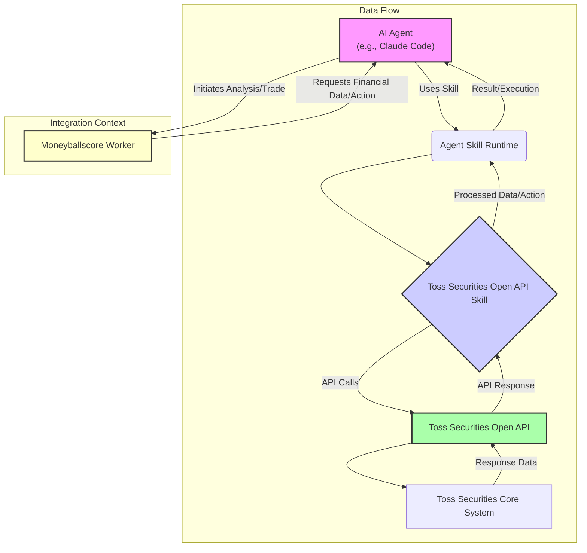

AI 에이전트 환경에서 외부 금융 서비스 API를 통합하는 것은 단순한 데이터 연동을 넘어선 전략적 가치를 제공합니다. 토스증권 Open API용 Agent Skill 통합은 에이전트가 실시간 금융 데이터에 접근하고, 복잡한 금융 분석을 수행하며, 자동화된 투자 결정을 내릴 수 있는 기반을 마련합니다. 이는 특히 Claude Code와 같은 코드 생성 및 실행 능력을 갖춘 에이전트에게 강력한 역량을 부여하며, `moneyballscore`와 같은 데이터 분석 워커에서 새로운 모듈 개발의 가능성을 열어줍니다.

## Agent Skill의 이해와 토스증권 Open API 통합
Agent Skill은 AI 에이전트가 특정 도메인의 작업을 수행하기 위해 필요한 사전 정의된 능력 셋입니다. 이는 에이전트의 '도구(tool)' 역할을 하며, 복잡한 API 호출 로직을 추상화하여 에이전트가 고수준의 목표 달성에 집중할 수 있도록 돕습니다. 토스증권 Open API Skill은 주식 시세 조회, 계좌 정보 접근, 주문 실행 등 토스증권이 제공하는 다양한 기능을 에이전트가 직접 활용할 수 있게 합니다.

Skill의 설치는 매우 간단합니다. `npx skills` CLI를 사용하여 특정 스킬 저장소에서 스킬을 추가할 수 있습니다.
```bash
npx skills add BEOKS/tossinvest-skill
```
이 명령어는 `BEOKS/tossinvest-skill` 저장소에 있는 토스증권 스킬을 현재 에이전트 개발 환경에 통합합니다. 특정 에이전트 하네스에만 지정하여 설치할 수도 있습니다. 예를 들어, Claude Code 기반의 에이전트 하네스에 이 스킬을 추가함으로써, 에이전트는 토스증권의 금융 데이터를 활용한 분석 및 자동화 워크플로우를 구축할 수 있습니다.

### Claude Code 하네스 내에서의 활용
Claude Code와 같은 대규모 언어 모델(LLM) 기반 에이전트는 자연어 지시를 해석하여 코드를 생성하고 실행하는 능력을 가지고 있습니다. 토스증권 스킬이 통합되면, 에이전트는 사용자 또는 상위 에이전트의 지시에 따라 다음과 같은 작업을 수행할 수 있습니다.

1.  **실시간 시세 조회 및 분석**: 특정 종목의 현재가, 호가 정보, 차트 데이터 등을 조회하여 시장 동향을 분석합니다.
2.  **계좌 정보 접근**: 보유 종목, 평가 손익, 예수금 등의 정보를 조회하여 포트폴리오를 관리합니다.
3.  **조건부 주문 실행**: 에이전트가 분석한 데이터나 외부 트리거에 따라 특정 종목의 매수/매도 주문을 자동으로 실행합니다.

```python
# 예시: Claude Code 에이전트가 tossinvest-skill을 활용하는 시나리오 (의사 코드)

from agent_harness import AgentHarness
from tossinvest_skill import TossInvestSkill

# 에이전트 초기화 및 스킬 로드
agent = AgentHarness(name="FinancialAnalystAgent")
agent.load_skill(TossInvestSkill)

def analyze_and_execute_trade(symbol: str, target_price: float):
    """
    특정 종목의 시세를 모니터링하고, 목표 가격 도달 시 매수 주문을 실행합니다.
    """
    current_price = agent.skills.tossinvest.get_current_price(symbol=symbol)
    print(f"현재 {symbol} 가격: {current_price}")

    if current_price < target_price:
        print(f"목표 가격 {target_price} 도달. {symbol} 매수 주문 실행.")
        order_result = agent.skills.tossinvest.place_buy_order(
            symbol=symbol,
            price=current_price,
            quantity=10
        )
        print(f"주문 결과: {order_result}")
    else:
        print(f"아직 목표 가격 미달. 현재 가격: {current_price}")

# 에이전트 실행 예시
analyze_and_execute_trade(symbol="005930", target_price=70000.0) # 삼성전자 예시
```

### Moneyballscore 워커에서의 활용 가능성
`moneyballscore`와 같은 데이터 분석 워커는 대량의 금융 데이터를 처리하고 인사이트를 도출하는 데 특화되어 있습니다. 토스증권 Open API Skill은 이러한 워커에 실시간 데이터 스트림을 제공함으로써, 다음과 같은 새로운 분석 모듈 개발에 기여할 수 있습니다.

*   **알고리즘 트레이딩 백테스팅**: 과거 데이터와 실시간 데이터를 결합하여 새로운 트레이딩 전략의 유효성을 검증합니다.
*   **이상 거래 감지**: 평소와 다른 거래 패턴이나 시장 움직임을 실시간으로 감지하여 경고를 발생시킵니다.
*   **포트폴리오 최적화**: 시장 상황 변화에 따라 포트폴리오의 리밸런싱을 제안하거나 자동 실행합니다.

이러한 통합은 에이전트가 단순히 정보를 검색하는 것을 넘어, 능동적으로 금융 시장에 개입하고, 복잡한 전략을 실행하는 진정한 자율 에이전트(autonomous agent)로 발전할 수 있는 중요한 단계를 의미합니다.

### 시스템 아키텍처 다이어그램



## 트레이드오프

*   **개발 효율성 vs. 보안 복잡성**:
    *   **언제 좋은가**: Agent Skill을 통해 복잡한 API 연동 로직을 추상화하여 에이전트 개발 속도를 대폭 향상시킬 수 있습니다. 에이전트 개발자는 금융 도메인 지식 없이도 고수준의 전략 구현에 집중할 수 있습니다.
    *   **언제 나쁜가**: 금융 API는 민감한 정보를 다루므로, API 키 관리, 권한 제어, 트랜잭션 검증 등 보안 측면에서 높은 수준의 복잡성을 요구합니다. 에이전트가 잘못된 명령을 실행하거나, 권한을 탈취당할 경우 심각한 금융 손실로 이어질 수 있습니다.

*   **자동화된 의사결정 vs. 제어 및 책임 소재**:
    *   **언제 좋은가**: 실시간 데이터를 기반으로 빠른 의사결정과 자동화된 거래 실행이 가능하여 시장 기회를 놓치지 않고, 인간의 감정적 개입을 배제할 수 있습니다.
    *   **언제 나쁜가**: 에이전트의 자율적인 의사결정이 예상치 못한 결과를 초래할 수 있으며, 특히 금융 거래에서는 그 책임 소재가 모호해질 수 있습니다. 에이전트의 판단 오류나 시스템 오작동 시 복구 및 손실 보상에 대한 명확한 정책이 필요합니다.

*   **확장성 vs. 외부 의존성**:
    *   **언제 좋은가**: 스킬 형태로 구현하면 다양한 에이전트 및 워커에서 재사용 가능하며, 다른 금융 기관의 API나 추가 분석 도구와의 연동을 통해 시스템의 기능을 쉽게 확장할 수 있습니다.
    *   **언제 나쁜가**: 토스증권 Open API의 정책 변경, 서비스 중단, 장애 발생 시 에이전트의 기능 전체에 영향을 미칠 수 있습니다. 단일 공급자에 대한 의존성이 높아지므로, 다중 공급자 전략이나 폴백(fallback) 메커니즘을 고려해야 합니다.

*   **심층 분석 능력 vs. 데이터 접근 제한**:
    *   **언제 좋은가**: 에이전트가 방대한 금융 데이터를 실시간으로 활용하여 고도화된 패턴 인식, 리스크 분석, 예측 모델링 등을 수행할 수 있습니다. 이는 기존 수동 분석으로는 어려운 깊이 있는 인사이트를 제공합니다.
    *   **언제 나쁜가**: Open API가 제공하는 데이터의 범위나 호출 빈도에 제한이 있을 수 있으며, 모든 금융 정보(예: 내부 고급 분석 데이터)에 접근할 수 없을 수 있습니다. 이는 에이전트의 분석 능력에 한계를 부여할 수 있습니다.

## 실전 체크리스트

프로젝트에 토스증권 Open API Agent Skill을 통합할 때 다음 사항들을 반드시 검증해야 합니다.

- [ ] **API 키 및 인증 정보 보안**: 토스증권 API 키와 개인 인증 정보가 에이전트 환경에서 안전하게 관리되고 암호화되어 저장되는지 확인합니다. (예: HashiCorp Vault, AWS Secrets Manager 등)
- [ ] **거래 실행 권한 최소화**: 에이전트에게 부여되는 금융 거래 실행 권한이 최소한의 범위 내에서만 허용되는지, 그리고 특정 조건을 만족할 때만 활성화되는지 검증합니다.
- [ ] **에이전트 의사결정 로직 검증**: 금융 거래와 관련된 에이전트의 모든 의사결정 로직이 충분히 테스트되고, 예상치 못한 상황(엣지 케이스)에서도 안전하게 동작하는지 확인합니다.
- [ ] **오류 처리 및 폴백(Fallback) 전략**: API 호출 실패, 네트워크 장애 등 예외 상황 발생 시 에이전트가 어떻게 오류를 처리하고, 어떤 폴백 전략을 따를지 명확하게 정의하고 구현합니다.
- [ ] **로깅 및 모니터링 시스템 구축**: 에이전트의 모든 금융 API 호출, 거래 실행, 중요한 의사결정 과정을 상세하게 로깅하고, 실시간 모니터링을 통해 이상 징후를 즉시 감지할 수 있는 시스템을 구축합니다.
- [ ] **데이터 프라이버시 및 규제 준수**: 금융 데이터를 처리하고 저장하는 과정이 관련 데이터 프라이버시 법규(예: 개인정보보호법) 및 금융 규제(예: 자본시장법)를 준수하는지 법률 전문가와 검토합니다.
- [ ] **비용 관리 및 API 사용량 제한**: 에이전트의 API 사용량이 과도해지지 않도록 호출 빈도를 제한하고, 예산 설정을 통해 불필요한 비용 발생을 방지하는 메커니즘을 구현합니다.