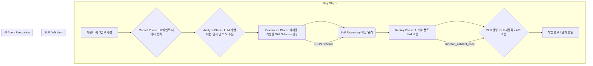

사용자 워크플로 기반의 AI Skill 자동 생성 메커니즘인 Record & Replay (R&R) 패턴은 복잡한 디지털 작업을 AI 에이전트가 쉽게 학습하고 자동화할 수 있도록 돕는 핵심 기술입니다. 기존의 프롬프트 엔지니어링이나 수동적인 툴 정의 방식의 한계를 넘어, 실제 사용자 행동을 관찰하여 즉시 재사용 가능한 Skill로 변환함으로써 자동화의 문턱을 크게 낮춥니다. 특히 반복적이거나 사용자의 미묘한 선호와 규칙이 중요한 작업, 혹은 텍스트 프롬프트로 설명하기 어려운 시각적/GUI 기반의 상호작용에 강력한 이점을 제공합니다. 2026년 AI 에이전트의 실용화가 가속화됨에 따라, 이러한 사용자 중심의 Skill 생성 방식은 에이전트 시스템의 유연성과 적응성을 극대화하는 중요한 요소로 부상하고 있습니다.

## 핵심 개념: Record & Replay 작동 방식

Record & Replay 패턴은 크게 세 가지 단계로 구성됩니다.

### 1. Record (기록) 단계
사용자가 특정 작업을 수행하는 동안, 시스템은 사용자 인터페이스(UI) 상의 모든 상호작용을 관찰하고 기록합니다. 이는 마우스 클릭, 키보드 입력, 스크롤 이벤트, UI 요소의 변경, 화면 스크린샷, 심지어 특정 API 호출과 같은 저수준(low-level) 이벤트에서부터, OS 레벨의 접근성(Accessibility) API를 통해 얻는 고수준(high-level)의 의미론적(semantic) 정보까지 포함할 수 있습니다. 예를 들어, OpenAI Codex의 Record & Replay는 Mac OS 환경에서 사용자의 GUI 워크플로를 직접 관찰하여 기록하는 방식으로 동작합니다.

### 2. Analyze & Generalize (분석 및 일반화) 단계
기록된 원시(raw) 데이터를 LLM(Large Language Model)이 분석하여 패턴을 식별하고, 특정 작업의 본질적인 목적과 단계를 추론합니다. 이 과정에서 LLM은 기록된 이벤트를 추상화하고, 변수화할 수 있는 요소를 찾아내어 범용적인 Skill 정의로 변환합니다. 단순히 행동을 재현하는 것을 넘어, '비용 처리', '주차 공간 예약'과 같은 작업의 고유한 논리와 의도를 파악하여 재사용 가능한 Skill 스키마를 생성합니다. 이 Skill은 에이전트가 외부 툴로 호출할 수 있는 함수나 일련의 액션 플랜 형태로 구체화됩니다.

### 3. Replay (재생) 단계
생성된 Skill은 이후 사용자의 요청이나 다른 AI 에이전트의 필요에 따라 자동으로 실행됩니다. Skill은 정의된 파라미터(parameter)를 받아 작업을 수행하며, 필요한 경우 사용자에게 추가 정보를 요청하거나, 실패 시 대체 경로를 탐색하는 등 유연하게 대응할 수 있습니다. 이를 통해 사용자는 반복적인 작업을 직접 수행할 필요 없이, 단 한 번의 시연(demonstration)으로 강력한 자동화 도구를 얻게 됩니다.

## Record & Replay의 중요성

이 패턴은 다음과 같은 이유로 AI 에이전트 시스템에서 매우 중요합니다.

*   **사용자 중심의 직관적인 Skill 생성:** 복잡한 프롬프트 엔지니어링 지식 없이도 사용자가 직접 작업을 수행하는 것만으로 Skill을 만들 수 있어 AI 자동화의 대중화를 촉진합니다.
*   **미설명 작업(Unexplained Tasks) 자동화:** 말이나 글로 설명하기 어려운 시각적 혹은 암묵적인 규칙이 많은 작업에 특히 효과적입니다.
*   **재사용성 및 확장성:** 한 번 생성된 Skill은 다른 컨텍스트나 다양한 사용자에 의해 재사용될 수 있으며, 점진적인 개선을 통해 더욱 정교해질 수 있습니다.
*   **레거시 시스템 통합:** API가 제공되지 않는 구형 시스템과의 상호작용도 GUI 기반으로 Skill화하여 자동화할 수 있습니다.

## 기술적 구현 패턴

Record & Replay 시스템을 구축하기 위해서는 다양한 기술적 고려사항이 필요합니다.

*   **이벤트 캡처 메커니즘:** OS의 Accessibility API, 브라우저 확장 프로그램, 가상 환경 내 스크린 레코딩 및 OCR/CV(Optical Character Recognition/Computer Vision) 조합 등 다양한 방식으로 사용자 이벤트를 수집할 수 있습니다. 2026년에는 멀티모달 LLM과 결합하여 시각적 컨텍스트 인식이 더욱 고도화될 것입니다.
*   **의미론적 추상화 (Semantic Abstraction):** 캡처된 저수준 이벤트를 LLM이 이해하고 활용할 수 있는 고수준의 의미 있는 작업 단위로 변환하는 과정이 핵심입니다. 예를 들어, `Click (x=100, y=200)`을 `Submit Form`이나 `Accept Terms`와 같은 의미 있는 액션으로 해석합니다.
*   **Skill 스키마 정의:** 생성된 Skill은 JSON Schema와 같은 표준화된 형식으로 정의되어 에이전트가 쉽게 호출하고 관리할 수 있어야 합니다. 이는 Skill의 이름, 설명, 필수 입력 파라미터, 예상 출력, 그리고 실행 로직 등을 포함합니다.
*   **에이전트 툴 통합:** 생성된 Skill은 AI 에이전트가 `tool_code` 또는 `function_call` 형태로 호출할 수 있도록 통합됩니다. 에이전트는 상황에 맞춰 적절한 Skill을 선택하고 실행하여 목표를 달성합니다.

```python
# 예시: Record & Replay로 생성된 Skill의 개념적 구조

class AgentHarness:
    def __init__(self, name):
        self.name = name
        self.skills = {}

    def add_skill(self, skill_name, skill_definition):
        """새로운 Skill을 하네스에 추가합니다."""
        self.skills[skill_name] = skill_definition
        print(f"Skill '{skill_name}' added to {self.name}.")

    def execute_skill(self, skill_name, **kwargs):
        """Skill을 실행합니다."""
        if skill_name in self.skills:
            skill = self.skills[skill_name]
            print(f"Executing skill '{skill_name}' with args: {kwargs}")
            try:
                # 실제 Skill 로직은 이곳에서 실행되거나 외부 툴을 호출
                result = skill.run(**kwargs)
                print(f"Skill '{skill_name}' completed. Result: {result}")
                return result
            except Exception as e:
                print(f"Skill '{skill_name}' failed: {e}")
                return {"status": "failed", "error": str(e)}
        else:
            print(f"Skill '{skill_name}' not found.")
            return {"status": "failed", "error": "Skill not found"}

# Record & Replay를 통해 생성된 가상의 Skill 정의
class ExpenseReportSkill:
    def __init__(self, description="Submit a standard expense report."):
        self.description = description
        self.required_params = ["amount", "category", "receipt_path"]

    def run(self, amount: float, category: str, receipt_path: str):
        print(f"Processing expense report: Amount={amount}, Category={category}, Receipt={receipt_path}")
        # 여기에 실제 비용 처리 시스템과 연동하는 로직 구현
        # (예: API 호출, GUI 자동화 스크립트 실행)
        if amount < 0 or not all([amount, category, receipt_path]):
            raise ValueError("Invalid expense report parameters.")
        
        # 실제로는 여기서 selenium이나 pywinauto 같은 UI 자동화 툴이 동작
        # mock implementation
        print(f"Submitting {category} expense of ${amount} with receipt from {receipt_path}...")
        return {"status": "success", "transaction_id": "EXP12345"}

# 에이전트 하네스 생성 및 Skill 추가
main_agent_harness = AgentHarness("MainAutomationAgent")
expense_skill = ExpenseReportSkill()
main_agent_harness.add_skill("submit_expense_report", expense_skill)

# 에이전트가 Skill을 활용하는 시나리오
main_agent_harness.execute_skill(
    "submit_expense_report", 
    amount=50.75, 
    category="Travel", 
    receipt_path="/users/alice/receipts/taxi_fare.jpg"
)

# 또 다른 Skill 예시 (가상)
class BookParkingSkill:
    def __init__(self, description="Book a parking space."):
        self.description = description
        self.required_params = ["location", "date", "time_start", "time_end"]

    def run(self, location: str, date: str, time_start: str, time_end: str):
        print(f"Booking parking at {location} from {date} {time_start} to {time_end}.")
        # 실제 주차 예약 시스템 연동 로직
        return {"status": "success", "booking_id": "PKNG6789"}

booking_skill = BookParkingSkill()
main_agent_harness.add_skill("book_parking", booking_skill)
main_agent_harness.execute_skill(
    "book_parking", 
    location="Gangnam Station", 
    date="2026-07-20", 
    time_start="10:00", 
    time_end="18:00"
)
```



## Playbook 적용: AI 에이전트 하네스 및 허브-워커 복리 자동화

Record & Replay 패턴은 `AI 에이전트 하네스`와 `허브-워커 복리 자동화`에 효과적으로 적용될 수 있습니다. 

`AI 에이전트 하네스`는 에이전트의 생명주기와 툴 사용을 관리하는 인프라스트럭처입니다. Record & Replay로 생성된 Skill은 이 하네스에 새로운 툴 또는 기능으로 등록됩니다. 에이전트는 기존에 정의된 툴 외에도, 사용자의 시연을 통해 동적으로 학습된 Skill을 활용하여 더 다양한 작업을 수행할 수 있게 됩니다. 이는 하네스의 툴셋을 지속적으로 확장하는 메커니즘으로 작용합니다.

`허브-워커 복리 자동화` 패턴에서는 허브 에이전트가 고수준의 목표를 관리하고, 워커 에이전트들이 특정 서브태스크를 수행합니다. 이때, Record & Replay로 생성된 Skill은 워커 에이전트가 특정 도메인에 특화된 작업을 수행하는 데 필요한 핵심 역량으로 활용됩니다. 예를 들어, 허브 에이전트가 '월말 재무 보고서 작성'을 지시하면, 특정 워커 에이전트는 R&R로 학습된 '레거시 ERP 시스템에서 데이터 추출' Skill이나 '보고서 양식에 맞게 데이터 가공' Skill을 호출하여 작업을 효율적으로 처리할 수 있습니다. 이는 프롬프트로 설명하기 어려운 복잡한 레거시 시스템과의 상호작용을 손쉽게 자동화하여 전체 자동화 워크플로의 복리 효과를 극대화하는 중요한 요소입니다.

## 트레이드오프

Record & Replay 패턴은 강력한 이점을 제공하지만, 동시에 몇 가지 트레이드오프를 가집니다.

*   **직관적인 Skill 생성 vs. 환경 의존성:**
    *   **언제 좋고:** 비기술적 사용자도 쉽게 자동화 Skill을 만들 수 있으며, 프롬프트 엔지니어링의 복잡성을 회피할 수 있습니다. 복잡한 UI 상호작용이나 API가 없는 시스템에 특히 유용합니다.
    *   **언제 나쁜지:** 기록된 환경(OS 버전, UI 레이아웃, 애플리케이션 버전 등)에 강하게 의존하여, 환경이 변경될 경우 Skill이 오작동하거나 재기록해야 할 가능성이 높습니다. 시스템이 자주 업데이트되는 환경에서는 유지보수 비용이 증가할 수 있습니다.

*   **복잡한 작업의 단순화 vs. 관찰 오류 및 보안 리스크:**
    *   **언제 좋고:** 반복적이고 지루한 복잡한 작업을 효율적으로 자동화하여 생산성을 크게 향상시킬 수 있습니다.
    *   **언제 나쁜지:** 기록 과정에서 사용자의 의도와 다르게 미묘한 오류가 기록될 수 있으며, 민감한 정보(예: 비밀번호, 개인 식별 정보)가 기록될 위험이 있습니다. 보안 취약점을 포함한 Skill이 생성될 가능성도 있어 추가적인 검증이 필수적입니다.

*   **재사용성 및 확장성 vs. Skill 일반화의 어려움:**
    *   **언제 좋고:** 한 번 정의된 Skill을 다양한 에이전트나 작업 흐름에서 재사용하여 개발 효율을 높일 수 있습니다.
    *   **언제 나쁜지:** 기록된 특정 시나리오를 얼마나 유연하고 일반적인 Skill로 추상화하는지가 LLM의 능력에 크게 의존합니다. 너무 구체적인 Skill은 재사용성이 떨어지고, 너무 일반적인 Skill은 원하는 동작을 정확히 수행하지 못할 수 있습니다. 경계 조건(edge cases) 처리와 예외 상황에 대한 견고성 확보가 어렵습니다.

*   **빠른 프로토타이핑 vs. 성능 및 리소스 오버헤드:**
    *   **언제 좋고:** 새로운 자동화 아이디어를 빠르고 효과적으로 프로토타이핑하고 검증할 수 있습니다. 즉각적인 피드백 루프를 통해 Skill을 신속하게 개선할 수 있습니다.
    *   **언제 나쁜지:** 실시간 UI 관찰 및 LLM을 통한 분석 과정에서 상당한 컴퓨팅 리소스가 소모될 수 있습니다. 특히 대규모 또는 고성능이 요구되는 환경에서는 성능 병목 현상이 발생할 가능성이 있습니다.

## 실전 체크리스트

Record & Replay 패턴을 프로젝트에 적용할 때 다음 항목들을 검증하여 성공적인 도입을 계획해야 합니다.

- [ ] **이벤트 캡처 메커니즘의 견고성 확인:** 다양한 사용자 시나리오 및 OS/애플리케이션 환경에서 이벤트 캡처가 안정적으로 동작하며, 중요한 정보 누락 없이 정확하게 기록되는지 확인합니다. (예: 95% 이상의 이벤트 캡처 성공률)
- [ ] **Skill 추상화 및 일반화 수준 검증:** 생성된 Skill이 단순히 기록된 동작을 반복하는 것을 넘어, 예상치 못한 입력이나 변경된 UI 상황에서도 유연하게 대응할 수 있도록 충분히 일반화되었는지 테스트합니다. (예: 3가지 변형 시나리오에 대한 Skill 성공률 80% 이상)
- [ ] **보안 및 권한 관리 설계:** 민감한 정보(비밀번호, 개인 데이터)가 기록되거나 Skill에 포함되지 않도록 마스킹, 필터링, 그리고 접근 권한 제어 메커니즘이 구현되었는지 확인합니다. (예: PCI DSS/GDPR 관련 데이터 처리 규정 준수)
- [ ] **에러 처리 및 재시도 로직:** Skill 실행 중 예외 상황(예: UI 요소 찾기 실패, 네트워크 오류) 발생 시, Skill이 적절하게 에러를 감지하고, 로깅하며, 경우에 따라 자동 재시도하거나 사용자에게 피드백을 제공하는지 확인합니다.
- [ ] **성능 및 리소스 사용량 측정:** Skill 기록 및 재생 과정에서 시스템의 CPU, 메모리, 네트워크 자원 사용량이 허용 가능한 범위를 초과하지 않는지 모니터링하고, 필요시 최적화 방안을 마련합니다. (예: Skill 실행 시 평균 Latency 5초 미만)
- [ ] **Skill 라이프사이클 관리:** 생성, 수정, 배포, 폐기 등 Skill의 전체 라이프사이클을 관리할 수 있는 도구 및 절차가 마련되었는지 확인합니다. 특히 환경 변화에 따른 Skill 업데이트 전략을 포함합니다.
- [ ] **인간 개입 지점 설계:** Skill이 복잡하거나 중요한 의사결정이 필요한 경우, 인간의 검토 및 승인을 받을 수 있는 인터페이스나 워크플로가 포함되어 있는지 확인합니다. (예: 중요 금융 거래 Skill은 최종 승인 단계에서 사용자 확인 요구)