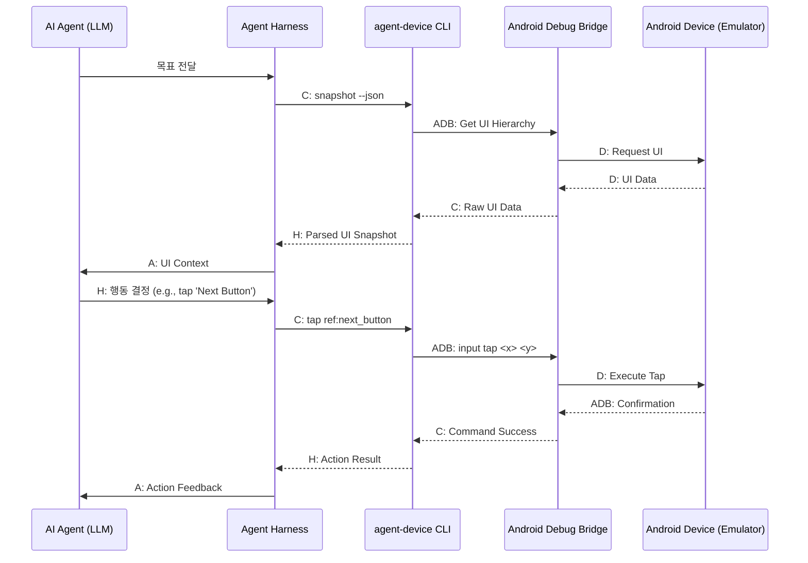

## Android AI 에이전트 제어: agent-device CLI 통합 전략

AI 에이전트가 Android 애플리케이션과 자율적으로 상호작용하기 위한 핵심 도구로 `agent-device` CLI가 활용됩니다. 이 CLI는 AI 에이전트가 iOS/Android 기기에서 실행 중인 앱의 UI를 직접 검사, 조작, 검증할 수 있도록 지원하며, 토큰 효율적인 접근성 스냅샷을 통해 LLM 기반 에이전트가 모바일 UI 상태를 파악하고 동적으로 기기를 제어할 수 있게 합니다.

### agent-device CLI 핵심 기능

`agent-device`는 AI 에이전트에게 실제 사용자의 눈과 손 역할을 부여하며, 2026년 모바일 AI 에이전트 활용 트렌드를 주도합니다.

1.  **UI 상태 파악**: 앱 화면 스냅샷 캡처 및 UI 트리 구조, 접근성 정보를 제공하여 에이전트가 UI 상태를 정확히 이해하도록 돕습니다.
2.  **동적 UI 조작**: 텍스트 입력, 탭, 스크롤 등 기본 상호작용을 `ref`나 `selector`로 정밀하게 제어합니다.
3.  **피드백 루프**: 에이전트 작업 결과를 UI 상태 변화로 검증하고 다음 행동 결정의 피드백으로 활용, 자율 학습 루프를 구축합니다.
4.  **다중 플랫폼 지원**: Android 외 iOS, web 등 다양한 플랫폼을 지원하여 에이전트 범용성을 높입니다.

### 에이전트 하네스 통합 워크플로 PoC

`agent-device` CLI를 에이전트 하네스에 통합하는 PoC 워크플로는 Android 기기(에뮬레이터) 제어 및 앱 검사/조작 자동화의 기반을 마련합니다.

#### 1. Python 통합 예제

`agent-device` CLI는 `subprocess` 호출을 통해 쉽게 통합되며, ADB(Android Debug Bridge)가 필수입니다.

```python
import subprocess
import json
import time

class AndroidAgentController:
    def __init__(self, device_id=None):
        self.device_id = device_id
        self._ensure_adb_connection()

    def _execute_command(self, command_parts):
        try:
            full_command = ["agent-device"] + command_parts
            if self.device_id:
                full_command = ["-d", self.device_id] + full_command
            result = subprocess.run(full_command, capture_output=True, text=True, check=True)
            return result.stdout.strip()
        except (subprocess.CalledProcessError, FileNotFoundError) as e:
            print(f"Error executing command or CLI not found: {e}")
            if isinstance(e, subprocess.CalledProcessError):
                print(f"Stdout: {e.stdout}, Stderr: {e.stderr}")
            raise

    def _ensure_adb_connection(self):
        try:
            subprocess.run(["adb", "devices"], capture_output=True, text=True, check=True)
            if self.device_id:
                subprocess.run(["adb", "connect", self.device_id], capture_output=True, text=True, check=False)
            time.sleep(1)
        except (subprocess.CalledProcessError, FileNotFoundError) as e:
            print(f"ADB error: {e}. Ensure ADB is installed and in PATH.")
            raise

    def install_app(self, apk_path): return self._execute_command(["install", apk_path])
    def start_app(self, package_name): return self._execute_command(["start", package_name])
    def get_ui_snapshot(self): return self._execute_command(["snapshot", "--json"])
    def tap_element(self, selector): return self._execute_command(["tap", selector])
    def enter_text(self, selector, text): return self._execute_command(["text", selector, text])
    def take_screenshot(self, output_path): return self._execute_command(["screenshot", output_path])

# Example usage (within Agent Harness logic):
# controller = AndroidAgentController("emulator-5554")
# snapshot_json = controller.get_ui_snapshot()
# controller.tap_element("ref:login_button")
```

#### 2. 에이전트 워크플로 다이어그램

AI 에이전트는 `agent-device` CLI를 통해 UI 스냅샷을 분석하고 상호작용 명령을 생성/실행합니다.



이 워크플로를 통해 에이전트는 앱 탐색, 데이터 입력, 결과 검증 등 복잡한 작업을 자율적으로 수행합니다. 2026년에는 `agent-device`로 수집된 고품질 상호작용 데이터가 온디바이스 AI 모델 훈련 및 검증에 직접 활용되어 모바일 앱 테스트 및 사용자 행동 시뮬레이션 분야에 혁신을 가져올 것입니다.

## 트레이드오프

`agent-device` CLI 활용 시 주요 트레이드오프는 다음과 같습니다.

*   **개발 용이성 vs. 실시간 성능**:
    *   **언제 좋은가**: 범용적인 UI 제어 및 `ref`/`selector` 기반 제어로 에이전트 개발 용이성을 높입니다.
    *   **언제 나쁜가**: CLI 호출 오버헤드로 고빈도 실시간 상호작용이나 낮은 지연 시간을 요구하는 작업에는 적합하지 않을 수 있습니다.

*   **범용성 vs. 특정 시스템 제어 깊이**:
    *   **언제 좋은가**: Android, iOS 등 여러 플랫폼을 아우르는 일관된 접근 방식으로 다중 플랫폼 에이전트 설계에 유리합니다.
    *   **언제 나쁜가**: 특정 Android 프레임워크나 시스템 API의 심층 기능 제어에는 한계가 있습니다.

*   **유연한 통합 vs. 초기 설정 복잡성**:
    *   **언제 좋은가**: 스크립트 언어로 쉽게 통합되며 CI/CD 파이프라인 포함에 용이합니다.
    *   **언제 나쁜가**: ADB 설치, 환경 변수 설정 등 초기 환경 설정이 복잡하고, 여러 기기 관리 시 설정 오류 가능성이 있습니다.

*   **보안 vs. 기능 범위 확장**:
    *   **언제 좋은가**: 접근성 서비스를 활용, Root 권한 없이 기기 제어가 가능하여 보안 위험을 낮춥니다.
    *   **언제 나쁜가**: 민감 정보 접근이나 시스템 설정 변경 등 고수준 작업에는 제한이 따를 수 있습니다.

## 실전 체크리스트

`agent-device` CLI 기반 Android AI 에이전트 제어 기능 적용 시 검증 항목입니다.

*   - [ ] `agent-device` CLI 최신 버전이 개발/CI/CD 환경에 설치 및 `PATH`에 등록되었는지 확인.
*   - [ ] 대상 Android 에뮬레이터/기기가 ADB로 연결되고 `adb devices` 명령으로 인식되는지 검증.
*   - [ ] 제어 대상 Android 앱 내 `agent-device` 요구 접근성 서비스 활성화 여부 확인.
*   - [ ] `agent-device snapshot --json` 명령으로 UI 상태 획득 및 JSON 파싱 성공 여부 테스트.
*   - [ ] 복잡한 UI 시나리오가 `agent-device tap/text` 명령으로 성공적으로 자동화되는지 PoC 검증.
*   - [ ] CLI 호출 관련 네트워크 지연, ADB 끊김, 프로세스 오류 등을 처리하는 견고한 에러 핸들링 및 재시도 로직 구현 여부 확인.
*   - [ ] 에이전트가 UI 스냅샷 정보를 바탕으로 올바른 의사결정을 내리고 불필요한 상호작용을 최소화하는 토큰 효율적인 프롬프트 엔지니어링 전략이 적용되었는지 평가.