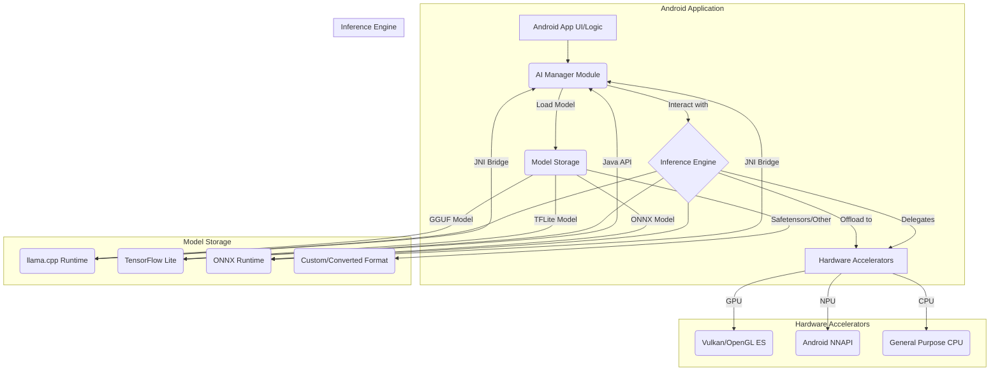

## Android 로컬 AI 모델 통합: 온디바이스 런타임 기술 스택 분석

Android 기기에서 AI 모델을 로컬로 통합하는 것은 사용자 데이터 프라이버시 보호, 네트워크 의존성 감소, 실시간 응답성 향상이라는 핵심 이점을 제공한다. 특히 클라우드 기반 AI 서비스가 갖는 비용, 지연 시간, 오프라인 환경 제약 등의 한계를 극복하기 위해 온디바이스 AI의 중요성이 부각되고 있다. 최근 Unsloth Desktop과 같은 통합 플랫폼이 GGUF, MLX, Safetensors와 같은 다양한 모델 포맷을 지원하며 로컬 환경에서의 모델 실행, 학습, 에이전트 통합 가능성을 제시함에 따라, Android 환경에서의 유사한 기술 스택 구축 전략을 탐색하는 것이 필수적이다.

### 온디바이스 AI의 중요성 및 기존 생태계

모바일 환경에서 AI를 활용할 때 온디바이스 추론은 다음과 같은 점에서 큰 가치를 가진다.
*   **프라이버시**: 민감한 사용자 데이터가 기기 밖으로 전송되지 않아 데이터 유출 및 오용 위험을 줄인다.
*   **응답성**: 네트워크 지연 없이 즉각적인 추론이 가능하여 사용자 경험을 크게 향상시킨다.
*   **오프라인 작동**: 인터넷 연결 없이도 AI 기능을 사용할 수 있어 접근성을 높인다.
*   **비용 효율성**: 클라우드 API 호출에 따른 비용을 절감한다.

Android 생태계에는 이미 온디바이스 AI를 위한 다양한 프레임워크와 도구가 존재한다.
*   **ML Kit**: Google이 제공하는 SDK로, 텍스트 인식, 얼굴 감지, 바코드 스캔 등 미리 학습된 모델과 커스텀 모델 추론을 지원한다.
*   **MediaPipe**: 다양한 플랫폼에서 동작하는 오픈소스 프레임워크로, 얼굴 메시, 손 추적, 홀리스틱 추적 등 복잡한 비전 및 오디오 AI 파이프라인을 구축하는 데 강점이 있다.
*   **TensorFlow Lite**: 모바일 및 엣지 기기에 최적화된 TensorFlow 버전으로, 경량화된 모델을 배포하고 효율적으로 추론하는 데 사용된다.
*   **Android Neural Networks API (NNAPI)**: Android 기기의 전용 하드웨어 가속기(NPU)를 활용하여 AI 추론 성능을 높이는 시스템 API이다.
*   **Gemini Nano / AICore**: Google의 최신 온디바이스 LLM인 Gemini Nano를 통합하고 관리하는 Android 시스템 서비스로, LLM 워크로드를 효율적으로 처리한다.

그러나 이러한 기존 솔루션들은 특정 프레임워크(TensorFlow, PyTorch 등)에 의존하거나, LLM과 같은 대규모 모델의 통합 및 관리에 최적화되지 않은 경우가 많다. Unsloth Desktop의 사례는 다양한 모델 포맷(LLM, Diffusion, Vision 등)을 아우르며, 학습 및 에이전트 통합까지 염두에 둔 로컬 AI 환경의 가능성을 보여준다.

### 로컬 모델 통합을 위한 핵심 기술 스택

Unsloth Desktop의 접근 방식에서 영감을 받아 Android AI 환경 구축을 위한 기반 기술 스택을 분석한다. 핵심은 다양한 AI 모델 포맷을 효율적으로 처리하고, 온디바이스 환경에 최적화된 추론을 제공하는 것이다.

#### 1. 모델 포맷 및 경량화 전략
*   **GGUF (GPT-Generated Unified Format)**: `llama.cpp` 프로젝트에서 주로 사용되는 파일 포맷으로, 다양한 양자화(quantization) 수준을 지원하여 CPU 기반 환경에서 LLM 추론에 매우 효율적이다. Android 환경에서 `llama.cpp` 라이브러리를 JNI(Java Native Interface)를 통해 통합하여 GGUF 모델을 실행하는 것이 일반적이다.
*   **MLX**: Apple Silicon에 최적화된 프레임워크로, 맥OS 및 iOS 기기에서 고성능 온디바이스 추론을 가능하게 한다. Android에는 직접 적용하기 어렵지만, 이식 계획의 개념적 이해(플랫폼별 최적화)에 중요하다.
*   **Safetensors**: PyTorch 모델 가중치(weights)를 저장하는 새로운 포맷으로, 임의의 코드 실행 위험 없이 안전하게 모델을 로드할 수 있다. 모델 교환 및 배포의 보안성을 높인다. TensorFlow Lite와 같은 런타임으로 변환하여 Android에서 사용할 수 있다.
*   **Quantization (양자화)**: 모델의 크기를 줄이고 추론 속도를 높이기 위해 가중치와 활성화 값을 낮은 비트 정밀도(예: float32 -> int8)로 변환하는 기법이다. 모바일 기기에서의 성능과 전력 효율성에 필수적이다. GGUF의 다양한 양자화 레벨(Q4_0, Q5_K 등)은 이 점을 잘 활용한다.

#### 2. 온디바이스 추론 엔진 (Inference Engines)
다양한 모델 포맷과 하드웨어 환경을 지원하기 위해 여러 추론 엔진을 고려해야 한다.
*   **llama.cpp (for GGUF)**: GGUF 포맷 LLM을 위한 사실상의 표준 CPU 추론 라이브러리이다. C++로 작성되어 있으며, JNI 바인딩을 통해 Android 애플리케이션에 통합될 수 있다.
*   **TensorFlow Lite**: 다양한 ML 모델(비전, NLP 등)을 모바일 기기에서 효율적으로 실행하는 데 최적화되어 있다. 특정 모델 아키텍처나 연산에 특화된 커스텀 연산자(Custom Operators)를 추가하여 유연성을 확보할 수 있다.
*   **ONNX Runtime**: Open Neural Network Exchange (ONNX) 포맷의 모델을 다양한 하드웨어에서 실행할 수 있도록 지원하는 크로스 플랫폼 추론 엔진이다. 양자화된 ONNX 모델을 Android에서 실행하는 데 활용될 수 있다.
*   **MLC-LLM (Machine Learning Compilation for LLMs)**: Apache TVM을 기반으로 LLM을 다양한 하드웨어 플랫폼(GPU, CPU, NPU)에 최적화하여 배포할 수 있는 솔루션이다. Android 기기에서도 효율적인 LLM 추론을 가능하게 한다.

#### 3. 하드웨어 가속
*   **GPU (OpenGL ES / Vulkan)**: 모바일 GPU는 병렬 연산에 강점이 있어, 모델 추론 속도를 크게 향상시킬 수 있다. TensorFlow Lite GPU delegate, MediaPipe GPU backend 등이 이를 활용한다.
*   **NPU (Neural Processing Unit) / NNAPI**: AI 연산에 특화된 하드웨어 가속기로, 전력 효율성을 유지하면서 고성능 AI 추론을 제공한다. Android NNAPI를 통해 NPU를 활용하며, 모델이 NNAPI 지원 연산만 사용하는 경우 최적의 성능을 기대할 수 있다.

### Android AI 로컬 모델 통합 아키텍처
효율적인 온디바이스 AI 환경을 구축하기 위한 아키텍처는 다음과 같다.



위 다이어그램은 Android 애플리케이션 내에서 AI Manager 모듈이 다양한 모델 포맷과 추론 엔진을 관리하고, 최종적으로 GPU, NPU, CPU와 같은 하드웨어 가속기를 활용하여 추론을 수행하는 흐름을 보여준다. `Model Storage`는 앱 내부에 번들되거나 동적으로 다운로드될 수 있는 모델 파일을 의미하며, `Inference Engine`은 각 모델 포맷에 맞는 런타임을 나타낸다.

### 코드 예제: 간단한 TensorFlow Lite 모델 추론 (Kotlin)

다음은 Android에서 TensorFlow Lite를 사용하여 간단한 이미지 분류 모델을 로드하고 추론하는 예시 코드이다. GGUF 모델의 경우 `llama.cpp`의 JNI 바인딩을 통해 유사한 패턴으로 통합될 수 있다.

```kotlin
import android.content.Context
import android.graphics.Bitmap
import org.tensorflow.lite.DataType
import org.tensorflow.lite.Interpreter
import org.tensorflow.lite.support.common.FileUtil
import org.tensorflow.lite.support.image.ImageProcessor
import org.tensorflow.lite.support.image.TensorImage
import org.tensorflow.lite.support.image.ops.ResizeOp
import org.tensorflow.lite.support.tensorbuffer.TensorBuffer
import java.nio.ByteBuffer
import java.nio.ByteOrder

class TFLiteImageClassifier(private val context: Context, private val modelPath: String) {

    private var interpreter: Interpreter? = null
    private var labels: List<String>? = null

    init {
        try {
            val modelBuffer = FileUtil.loadMappedFile(context, modelPath)
            val options = Interpreter.Options()
            options.setNumThreads(4) // CPU 스레드 수 설정
            interpreter = Interpreter(modelBuffer, options)
            labels = FileUtil.loadLabels(context, "labels.txt") // 레이블 파일 로드
        } catch (e: Exception) {
            e.printStackTrace()
            // 에러 처리 로직
        }
    }

    fun classifyImage(bitmap: Bitmap): String {
        if (interpreter == null || labels == null) return "Error: Interpreter not initialized."

        // 모델 입력 크기 (예: 224x224) 및 데이터 타입 가져오기
        val inputShape = interpreter!!.getInputTensor(0).shape()
        val imageHeight = inputShape[1]
        val imageWidth = inputShape[2]
        val imageDataType = interpreter!!.getInputTensor(0).dataType()

        // 이미지 전처리
        val imageProcessor = ImageProcessor.Builder()
            .add(ResizeOp(imageHeight, imageWidth, ResizeOp.ResizeMethod.BILINEAR))
            .build()

        var tensorImage = TensorImage(imageDataType)
        tensorImage.load(bitmap)
        tensorImage = imageProcessor.process(tensorImage)

        // 출력 버퍼 생성
        val outputShape = interpreter!!.getOutputTensor(0).shape()
        val outputDataType = interpreter!!.getOutputTensor(0).dataType()
        val outputBuffer = TensorBuffer.createFixedSize(outputShape, outputDataType)

        // 추론 실행
        interpreter!!.run(tensorImage.buffer, outputBuffer.buffer.rewind())

        // 결과 후처리 (Softmax, Top-K 등)
        val probabilities = outputBuffer.floatArray
        val maxProbabilityIndex = probabilities.indices.maxByOrNull { probabilities[it] } ?: -1

        return if (maxProbabilityIndex != -1 && labels!!.size > maxProbabilityIndex) {
            labels!![maxProbabilityIndex]
        } else {
            "Unknown"
        }
    }

    fun close() {
        interpreter?.close()
        interpreter = null
    }
}
```

이 코드는 `modelPath`에 지정된 TensorFlow Lite 모델을 로드하고, 입력 이미지를 전처리한 후 추론을 수행한다. `Interpreter.Options()`를 통해 CPU 스레드 수를 설정하거나, `GpuDelegate` 또는 `NnApiDelegate`를 추가하여 하드웨어 가속을 활용할 수 있다.

### ## 트레이드오프

Android AI용 로컬 모델 통합 환경 구축 시 고려해야 할 주요 트레이드오프는 다음과 같다.

*   **성능 vs. 모델 크기**:
    *   **언제 좋음**: 경량화된 모델(양자화, 가지치기 등)은 앱 설치 공간을 줄이고 다운로드 시간을 단축하며, 추론 속도와 전력 효율성을 높여 모바일 환경에 적합하다.
    *   **언제 나쁨**: 모델 크기 감소는 종종 모델의 정확도와 복잡성 감소로 이어진다. 대규모 언어 모델(LLM)과 같이 높은 정확도와 복잡한 추론이 필요한 경우, 모델 크기를 지나치게 줄이면 성능 저하가 발생할 수 있다.

*   **개발 복잡성 vs. 유연성**:
    *   **언제 좋음**: JNI를 통한 C++ 라이브러리(예: `llama.cpp`) 통합이나 커스텀 추론 엔진 개발은 하드웨어에 대한 세밀한 제어와 최적화, 다양한 모델 포맷 지원 등 높은 유연성을 제공한다.
    *   **언제 나쁨**: 이러한 접근 방식은 개발 및 유지보수 비용을 증가시킨다. 네이티브 코드 관리, 크로스 플랫폼 호환성 문제, 디버깅의 어려움 등 복잡성이 커진다.

*   **하드웨어 호환성 vs. 최적화**:
    *   **언제 좋음**: NNAPI와 같은 시스템 API를 통해 NPU를 활용하거나, 특정 GPU 벤더 SDK를 사용하면 해당 하드웨어에서 최적의 성능을 얻을 수 있다.
    *   **언제 나쁨**: 모든 Android 기기가 동일한 NPU나 GPU 아키텍처를 가지는 것은 아니다. 특정 하드웨어에 대한 과도한 최적화는 다른 기기에서의 호환성 문제나 성능 저하를 야기할 수 있으며, 지원해야 할 기기 종류가 많아질수록 개발 및 테스트 부담이 커진다.

*   **데이터 프라이버시 vs. 클라우드 기능**:
    *   **언제 좋음**: 온디바이스 AI는 사용자 데이터가 기기를 벗어나지 않아 프라이버시를 극대화한다. 민감한 정보를 처리하는 애플리케이션에 필수적이다.
    *   **언제 나쁨**: 온디바이스 모델은 학습 데이터 업데이트, 대규모 모델의 실시간 Fine-tuning, 방대한 지식 기반 접근 등 클라우드 기반 AI가 제공하는 유연성과 확장성을 갖기 어렵다. 지속적인 모델 개선이나 최신 정보 반영이 중요한 서비스에는 클라우드 연동이 필요할 수 있다.

### ## 실전 체크리스트

Android AI 로컬 모델 통합 프로젝트를 진행할 때 다음 항목들을 검증해야 한다.

*   - [ ] **모델 양자화 전략 최적화**: 대상 기기의 메모리 및 연산 제약사항을 고려하여, 모델의 정확도 손실을 최소화하면서 최적의 양자화(예: INT8, INT4) 수준을 결정하고 적용했는가?
*   - [ ] **추론 엔진 선정 및 통합**: 선택된 모델 포맷(GGUF, TFLite, ONNX 등)에 가장 적합하고, 대상 기기 하드웨어 가속(GPU/NPU)을 최대한 활용할 수 있는 추론 엔진(llama.cpp, TFLite, ONNX Runtime, MLC-LLM 등)을 선정하고 안정적으로 통합했는가?
*   - [ ] **하드웨어 가속 활성화 및 검증**: NNAPI Delegate, GPU Delegate 등의 설정을 통해 하드웨어 가속이 올바르게 활성화되었는지 확인하고, 다양한 기기에서 실제 성능 향상 효과를 측정했는가?
*   - [ ] **메모리 및 배터리 사용량 모니터링**: 모델 추론 시 메모리 사용량과 배터리 소모량을 실시간으로 모니터링하고, 과도한 자원 소모가 발생하지 않도록 최적화 조치를 취했는가?
*   - [ ] **모델 업데이트 및 배포 전략**: 모델의 보안 업데이트, 성능 개선, 새로운 버전 배포를 위한 안전하고 효율적인 온디바이스 모델 업데이트 메커니즘(예: 앱 업데이트, 동적 다운로드, A/B 테스트)을 수립하고 구현했는가?
*   - [ ] **오류 처리 및 복구 메커니즘**: 모델 로딩 실패, 추론 중 하드웨어 가속기 오류, 메모리 부족 등 예외 상황에 대한 견고한 오류 처리 및 복구 로직을 구현하여 사용자 경험에 미치는 영향을 최소화했는가?
*   - [ ] **프라이버시 및 보안 감사**: 사용자 데이터 처리 과정에서 민감 정보 유출 위험이 없는지, 모델 파일의 무결성이 보장되는지 등 프라이버시 및 보안 측면의 감사를 수행하고 관련 규정을 준수했는가?